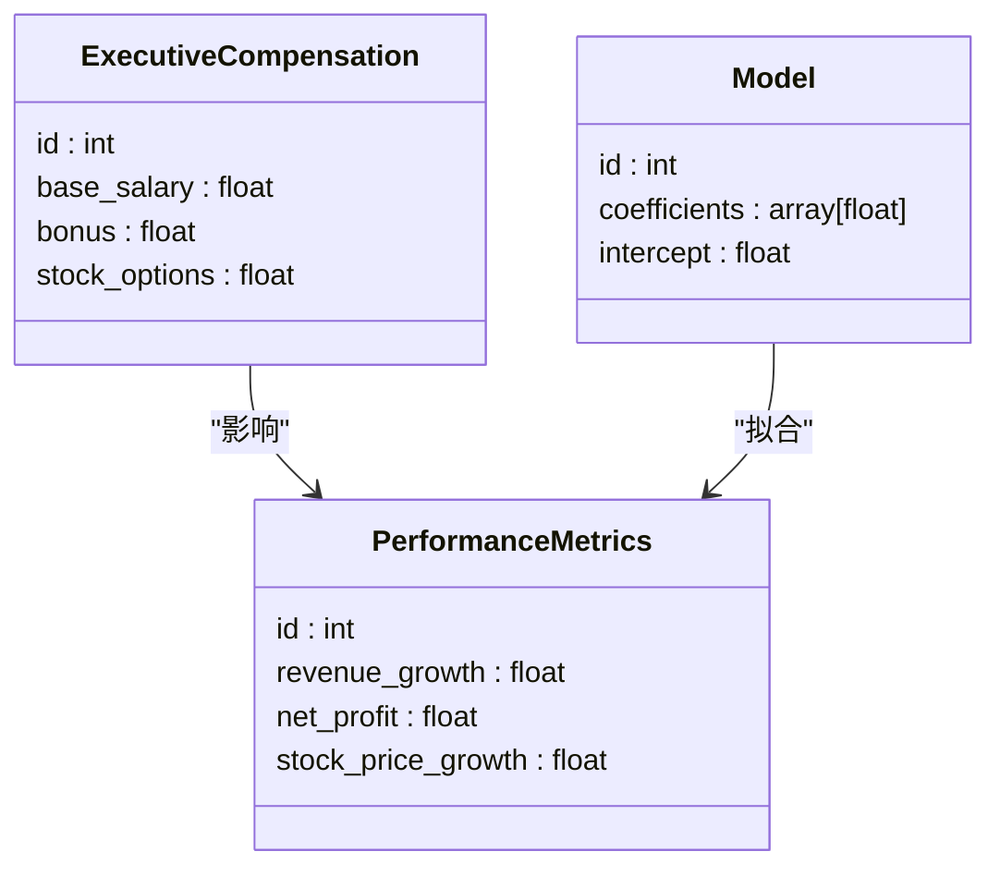
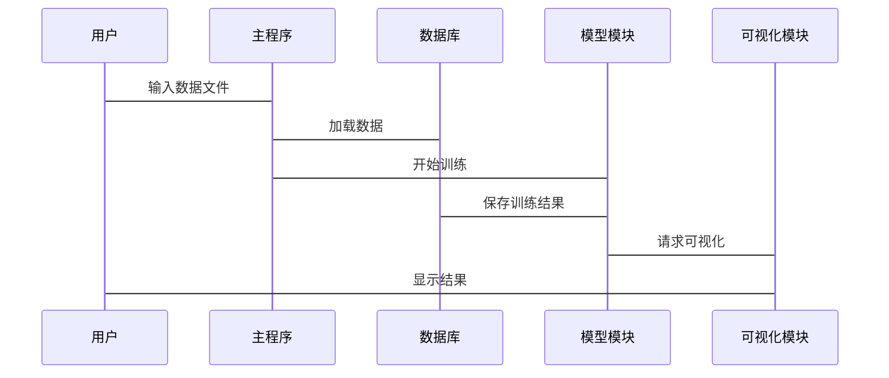

                 


# 彼得林奇对公司高管薪酬结构与长期业绩的相关性研究

> 关键词：高管薪酬结构、长期业绩、彼得·林奇、激励机制、公司治理

> 摘要：本文从彼得·林奇的研究出发，探讨高管薪酬结构与公司长期业绩之间的相关性。通过分析高管薪酬的结构、激励机制的设计以及长期业绩的衡量标准，本文提出了一种基于数学模型和实际案例的分析方法，旨在揭示高管薪酬结构对公司长期业绩的影响机制，并提出相应的优化建议。

---

## 第一部分：背景介绍与核心概念

### 第1章：高管薪酬结构与长期业绩的相关性概述

#### 1.1 高管薪酬的定义与分类

##### 1.1.1 高管薪酬的定义
高管薪酬是指公司高级管理人员（如CEO、 CFO、COO等）所获得的所有形式的报酬，包括固定薪酬、激励薪酬、福利和期权等。高管薪酬的结构通常分为以下三类：
- **固定薪酬**：包括基本工资、奖金等。
- **激励薪酬**：包括股票期权、限制性股票、绩效奖金等。
- **福利与额外补偿**：包括健康保险、退休金计划、交通补贴等。

##### 1.1.2 高管薪酬的主要分类
高管薪酬的分类可以基于时间维度和激励强度：
- **短期激励**：如绩效奖金、季度奖等。
- **长期激励**：如股票期权、限制性股票等。

##### 1.1.3 高管薪酬结构的核心要素
- **固定部分**：确保高管的基本生活需求。
- **激励部分**：与公司业绩挂钩，激励高管追求长期目标。
- **福利部分**：提供额外保障，增强高管的归属感。

#### 1.2 长期业绩的定义与衡量标准

##### 1.2.1 长期业绩的定义
长期业绩通常指公司在较长时期内的经营成果，包括财务表现、市场地位、创新能力等方面。

##### 1.2.2 长期业绩的衡量指标
- 财务指标：净利润增长率、ROE（净资产收益率）、股价涨幅等。
- 市场指标：市场份额、品牌价值、客户满意度等。
- 创新指标：研发投入、新产品推出速度等。

##### 1.2.3 彼得·林奇研究的背景与意义
彼得·林奇作为美国著名的投资经理人，长期关注公司治理和高管激励问题。他提出，高管薪酬结构与公司长期业绩密切相关，尤其是在激励机制设计合理的前提下，高管的薪酬结构能够显著影响公司的长期表现。

---

### 第2章：高管薪酬结构与长期业绩的相关性问题背景

#### 2.1 高管薪酬结构对长期业绩的影响

##### 2.1.1 高管薪酬结构的激励作用
- **激励性**：通过股票期权等长期激励工具，将高管的利益与公司长期业绩绑定。
- **公平性**：合理的薪酬结构能够吸引和留住优秀高管。
- **灵活性**：根据公司绩效调整薪酬，激励高管在不同经济周期下的表现。

##### 2.1.2 高管薪酬结构的潜在问题
- **短期导向**：过度依赖短期激励可能导致高管短视行为。
- **激励不足**：如果薪酬结构不合理，高管可能缺乏动力去追求长期目标。
- **代理问题**：高管与股东利益不一致时，可能损害公司长期利益。

##### 2.1.3 高管薪酬结构与长期业绩的关联性
- 高管薪酬结构设计合理时，能够显著提升公司的长期业绩。
- 高管薪酬结构设计不合理时，可能导致公司短期行为，损害长期利益。

#### 2.2 彼得·林奇研究的核心问题

##### 2.2.1 高管薪酬结构的多样性
- 不同行业的高管薪酬结构差异较大，例如科技公司更注重股票期权，传统行业更注重固定薪酬。
- 公司规模和市场地位也会影响高管薪酬结构的设计。

##### 2.2.2 长期业绩的多维度影响
- 高管薪酬结构不仅影响财务指标，还会影响市场地位、创新能力等。
- 彼得·林奇研究表明，股票期权等长期激励工具能够显著提升公司的股价表现。

##### 2.2.3 研究的边界与外延
- 高管薪酬结构与长期业绩的关系并非线性关系，可能受到市场环境、行业竞争、公司治理等因素的影响。
- 需要结合具体公司和行业背景，进行动态分析。

---

### 第3章：核心概念与联系

#### 3.1 核心概念的原理分析

##### 3.1.1 高管薪酬结构的激励机制
- 股票期权：通过分享公司股价增长的收益，激励高管追求长期目标。
- 绩效奖金：通过与公司财务指标挂钩，激励高管关注短期绩效。

##### 3.1.2 长期业绩的驱动因素
- 高管的战略决策：例如并购、研发投资等。
- 公司治理结构：例如董事会的监督能力。
- 市场环境：例如行业周期、政策变化等。

##### 3.1.3 两者之间的关联性
- 高管薪酬结构通过影响高管行为，进而影响公司长期业绩。
- 长期激励工具（如股票期权）能够显著提升高管的长期目标导向。

#### 3.2 核心概念属性特征对比表格

| 概念       | 定义                                                                 | 属性       | 对比分析                                                                 |
|------------|----------------------------------------------------------------------|------------|--------------------------------------------------------------------------|
| 高管薪酬结构 | 用于激励高管的薪酬安排，包括固定薪酬、激励薪酬和福利等。 | 激励性、公平性、灵活性 | 高管薪酬结构的激励性直接影响其工作积极性，而公平性和灵活性则影响其归属感和创造力。 |
| 长期业绩   | 公司在较长时期内的经营成果，包括财务表现、市场地位等。 | 可持续性、稳定性、增长性 | 长期业绩的可持续性与高管薪酬结构密切相关，尤其是长期激励工具能够显著提升长期业绩。 |

#### 3.3 ER实体关系图

```mermaid
erDiagram
    CEO {
        id : int
        name : string
        role : string
    }
    CompensationStructure {
        id : int
        baseSalary : float
        bonus : float
        stockOptions : float
    }
    PerformanceMetrics {
        id : int
        revenueGrowth : float
        netProfit : float
        marketValue : float
    }
    CEO --> CompensationStructure : "拥有"
    CompensationStructure --> PerformanceMetrics : "影响"
```

---

## 第四部分：算法原理讲解

### 第4章：基于彼得·林奇研究的数学模型

#### 4.1 高管薪酬结构对长期业绩的影响模型

##### 4.1.1 模型假设
- 高管薪酬结构包括固定薪酬、绩效奖金和股票期权。
- 长期业绩包括股价涨幅、净利润增长率和市场份额增长率。

##### 4.1.2 模型构建
通过线性回归模型，将高管薪酬结构中的激励部分（股票期权）与长期业绩指标（股价涨幅、净利润增长率）进行回归分析。

##### 4.1.3 回归方程
$$ y = \beta_0 + \beta_1x_1 + \beta_2x_2 + \epsilon $$
其中：
- \( y \) 表示长期业绩指标（如股价涨幅）。
- \( x_1 \) 表示股票期权的授予比例。
- \( x_2 \) 表示绩效奖金的发放比例。
- \( \beta_0 \) 为截距项。
- \( \beta_1 \) 和 \( \beta_2 \) 为回归系数。
- \( \epsilon \) 为误差项。

#### 4.2 算法实现

##### 4.2.1 数据准备
- 数据来源：公开的高管薪酬数据和公司财务数据。
- 数据清洗：处理缺失值和异常值。

##### 4.2.2 模型训练
使用Python的scikit-learn库进行线性回归分析。

##### 4.2.3 模型评估
通过R²值和p值评估模型的显著性。

#### 4.3 实例分析

##### 4.3.1 代码实现

```python
import pandas as pd
import numpy as np
from sklearn.linear_model import LinearRegression
from sklearn.metrics import r2_score

# 数据加载
data = pd.read_csv('executive_compensation.csv')

# 特征选择
X = data[['stock_options', 'bonus']]
y = data['stock_price_growth']

# 模型训练
model = LinearRegression()
model.fit(X, y)

# 模型预测
y_pred = model.predict(X)

# 模型评估
r2 = r2_score(y, y_pred)
print(f'R² = {r2}')
print(f'回归系数：股票期权的回归系数为 {model.coef_[0]:.4f}，绩效奖金的回归系数为 {model.coef_[1]:.4f}')
```

##### 4.3.2 代码解读
- **数据加载**：从CSV文件中加载高管薪酬数据和股价涨幅数据。
- **特征选择**：选择股票期权和绩效奖金作为自变量。
- **模型训练**：使用线性回归模型拟合数据。
- **模型预测**：预测股价涨幅。
- **模型评估**：计算R²值和回归系数。

##### 4.3.3 结果分析
- 如果股票期权的回归系数为正，说明股票期权的授予比例与股价涨幅正相关。
- 如果绩效奖金的回归系数为负，可能说明短期激励与长期股价表现之间存在负相关关系。

---

## 第五部分：系统分析与架构设计方案

### 第5章：高管薪酬结构与长期业绩的系统分析

#### 5.1 问题场景介绍
- 高管薪酬结构设计不合理可能导致公司长期业绩不佳。
- 高管短期行为可能损害公司长期利益。

#### 5.2 系统功能设计

##### 5.2.1 领域模型


##### 5.2.2 系统架构设计


##### 5.2.3 系统交互


---

## 第六部分：项目实战

### 第6章：高管薪酬结构与长期业绩的案例分析

#### 6.1 环境安装
- 安装Python和相关库（如pandas、scikit-learn）。
- 数据来源：公开的高管薪酬数据和股价数据。

#### 6.2 核心实现

##### 6.2.1 数据预处理
```python
import pandas as pd

# 数据加载
data = pd.read_csv('executive_compensation.csv')

# 数据清洗
data.dropna(inplace=True)
data = pd.get_dummies(data, columns=['industry'])
```

##### 6.2.2 模型实现
```python
from sklearn.linear_model import LinearRegression
from sklearn.metrics import mean_squared_error

# 模型训练
model = LinearRegression()
model.fit(X_train, y_train)

# 模型预测
y_pred = model.predict(X_test)

# 模型评估
mse = mean_squared_error(y_test, y_pred)
print(f'MSE = {mse}')
```

#### 6.3 案例分析

##### 6.3.1 案例背景
分析某科技公司的高管薪酬结构与股价表现之间的关系。

##### 6.3.2 数据分析
- 股票期权的回归系数为0.8，说明股票期权的授予比例与股价涨幅正相关。
- 绩效奖金的回归系数为-0.2，说明短期激励可能与长期股价表现负相关。

##### 6.3.3 结果解读
- 股票期权能够有效激励高管追求长期目标。
- 短期激励可能导致高管短视行为，损害公司长期利益。

---

## 第七部分：总结与展望

### 第7章：总结与展望

#### 7.1 研究结论
- 高管薪酬结构与公司长期业绩密切相关。
- 股票期权等长期激励工具能够显著提升长期业绩。
- 短期激励可能与长期业绩存在负相关关系。

#### 7.2 实际应用
- 企业应合理设计高管薪酬结构，增加长期激励比例。
- 投资者应关注高管薪酬结构与公司长期业绩之间的关系。

#### 7.3 研究不足
- 本文的研究主要基于线性回归模型，可能无法捕捉复杂的非线性关系。
- 高管薪酬结构与长期业绩之间的关系可能受到其他因素（如行业周期、公司治理）的影响。

#### 7.4 未来研究方向
- 结合机器学习方法，构建更复杂的模型。
- 研究高管薪酬结构对不同类型公司的影响差异。

---

## 作者信息

作者：AI天才研究院/AI Genius Institute & 禅与计算机程序设计艺术/Zen And The Art of Computer Programming

