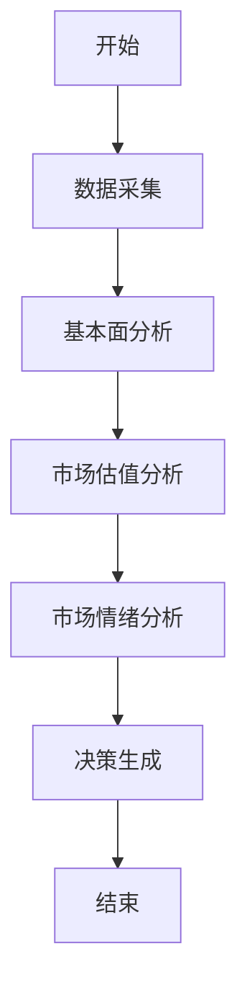

                 


---

# 彼得林奇对市场时机选择的看法

> 关键词：彼得·林奇，市场时机选择，投资策略，价值投资，基本面分析，长期投资

> 摘要：本文深入探讨了彼得·林奇在市场时机选择方面的观点和策略，分析了他的投资理念、市场时机选择的核心理论、算法原理以及系统架构设计，并通过实际案例展示了如何应用这些理论进行投资决策。

---

## 第1章: 彼得林奇投资理念概述

### 1.1 彼得林奇的生平与投资风格

#### 1.1.1 彼得林奇的生平简介
彼得·林奇（Peter Lynch）是美国著名的投资专家，被誉为“股票投资之父”。他从1977年到2000年担任富达麦哲伦基金（Fidelity Magellan Fund）的经理，创造了卓越的投资业绩，年均回报率超过29%。林奇的投资理念以长期投资和价值投资为核心，强调深入研究公司基本面，寻找那些具有持续增长潜力的企业。

#### 1.1.2 彼得林奇的投资风格
林奇的投资风格以“逆向思维”和“深入研究”为特点。他认为，市场波动为投资者提供了以合理价格买入优质股票的机会。他反对短期交易，主张长期持有优质资产，通过时间的积累实现财富增长。

#### 1.1.3 彼得林奇对市场的独特见解
林奇认为，市场波动是投资的敌人，但也是机会的来源。他强调，投资者应关注企业的内在价值，而不是市场的短期波动。他的投资哲学可以用一句话概括：**“市场的短期波动是机会，而企业的长期增长才是关键。”**

---

### 1.2 市场时机选择的重要性

#### 1.2.1 市场时机选择的定义
市场时机选择是指在合适的时间点买入或卖出资产，以最大化投资收益或最小化损失。它是投资策略中的重要组成部分，直接影响投资结果。

#### 1.2.2 市场时机选择的原理
市场时机选择的核心在于识别市场的周期性波动，捕捉市场低估或高估的机会。林奇认为，市场波动为投资者提供了以合理价格买入优质资产的机会，尤其是在市场恐慌时。

#### 1.2.3 彼得林奇对市场时机选择的重视
林奇在其著作《彼得·林奇的成功投资》中强调，市场时机选择并不是投资成功的唯一因素，但它可以显著影响投资结果。他建议投资者在市场低迷时增加投资，而在市场高估时减少投资。

---

## 第2章: 彼得林奇的市场时机选择理论

### 2.1 彼得林奇的市场时机选择方法

#### 2.1.1 基于价值投资的市场时机选择
林奇的价值投资方法强调买入被市场低估的股票。他通过分析企业的盈利能力、成长性和财务状况，寻找那些具有长期增长潜力的企业。当这些企业的股价低于其内在价值时，他选择买入。

#### 2.1.2 基于基本面分析的市场时机选择
林奇通过基本面分析，关注企业的收入、利润、负债和现金流等关键指标。他特别关注那些具有稳定增长潜力的企业，并在市场低估时买入。

#### 2.1.3 基于长期投资的市场时机选择
林奇反对短期交易，主张长期持有优质资产。他认为，市场的短期波动无法预测，但优质企业的长期增长是可预期的。因此，他建议投资者在市场低迷时增加长期投资。

---

### 2.2 彼得林奇的市场时机选择模型

#### 2.2.1 模型的定义与核心要素
林奇的市场时机选择模型基于以下核心要素：
1. **企业基本面**：盈利能力、成长性、财务状况。
2. **市场估值**：市盈率、市净率等指标。
3. **市场情绪**：市场波动和投资者情绪。

#### 2.2.2 模型的输入与输出
- **输入**：企业的财务数据、市场估值指标、市场情绪指标。
- **输出**：买入、持有或卖出的决策。

#### 2.2.3 模型的优缺点分析
- **优点**：结合了基本面分析和市场估值，能够捕捉市场低估的机会。
- **缺点**：模型的准确性依赖于对市场情绪的判断，具有一定的主观性。

---

## 第3章: 彼得林奇市场时机选择的核心概念

### 3.1 市场时机选择的核心概念

#### 3.1.1 市场时机选择的定义
市场时机选择是指在合适的时间点买入或卖出资产，以最大化投资收益或最小化损失。

#### 3.1.2 市场时机选择的属性特征
- **时间敏感性**：需要准确判断市场波动的时间点。
- **风险敏感性**：市场波动对投资结果有直接影响。
- **机会捕捉性**：通过市场波动捕捉投资机会。

#### 3.1.3 市场时机选择的核心要素
- **企业基本面**：盈利能力、成长性、财务状况。
- **市场估值**：市盈率、市净率等指标。
- **市场情绪**：市场波动和投资者情绪。

---

### 3.2 彼得林奇市场时机选择的ER实体关系图

#### 3.2.1 实体关系图的定义
实体关系图（ER图）用于描述系统中各个实体之间的关系。在市场时机选择模型中，主要实体包括：企业、市场、投资者。

#### 3.2.2 实体关系图的绘制

```mermaid
erDiagram
    investor(investor_id, name, investment_amount) {
        <---(investment) company companyId, company_name
        <---(market) market id, market_value
    }
    company(company_id, company_name, revenue, profit, market_value) {
        <-(investment) investor investor_id
        <-(market) market market_id
    }
    market(market_id, market_value, market_sentiment) {
        <-(investment) investor investor_id
        <-(company) company company_id
    }
```

#### 3.2.3 实体关系图的解释
- **investor（投资者）**：投资者通过投资将资金投入企业或市场。
- **company（企业）**：企业通过其基本面数据影响市场估值。
- **market（市场）**：市场估值和情绪影响投资者的决策。

---

## 第4章: 彼得林奇市场时机选择的算法原理

### 4.1 算法原理概述

#### 4.1.1 算法的定义
彼得·林奇的市场时机选择算法基于企业基本面和市场估值，结合市场情绪，生成买入、持有或卖出的决策。

#### 4.1.2 算法的核心步骤
1. **数据采集**：收集企业的财务数据和市场估值指标。
2. **基本面分析**：评估企业的盈利能力、成长性和财务状况。
3. **市场估值分析**：计算市盈率、市净率等指标。
4. **市场情绪分析**：判断市场波动和投资者情绪。
5. **决策生成**：基于分析结果，生成买入、持有或卖出的决策。

#### 4.1.3 算法的数学模型
以下是市场估值分析的数学模型：

$$ \text{市盈率} = \frac{\text{股价}}{\text{每股收益}} $$

$$ \text{市净率} = \frac{\text{股价}}{\text{每股净资产}} $$

---

### 4.2 算法流程图



---

## 第5章: 彼得林奇市场时机选择的系统分析与架构设计

### 5.1 系统分析

#### 5.1.1 系统分析的定义
系统分析是通过对市场时机选择模型的各个组成部分进行详细分析，明确系统的需求和功能。

#### 5.1.2 系统分析的核心步骤
1. **需求分析**：确定系统的功能需求。
2. **功能分析**：分析系统的核心功能模块。
3. **数据流分析**：分析数据的输入、处理和输出。

---

### 5.2 系统架构设计

#### 5.2.1 系统架构的定义
系统架构设计是将系统的各个模块进行合理组合，确保系统的高效运行。

#### 5.2.2 系统架构的核心模块
- **数据采集模块**：负责采集企业的财务数据和市场数据。
- **数据分析模块**：负责进行基本面分析和市场估值分析。
- **决策引擎模块**：基于分析结果生成投资决策。
- **用户界面模块**：供投资者查看和操作。

#### 5.2.3 系统架构的优缺点分析
- **优点**：模块化设计便于维护和扩展。
- **缺点**：系统的复杂性可能增加开发和维护成本。

---

## 第6章: 彼得林奇市场时机选择的项目实战

### 6.1 项目环境安装

#### 6.1.1 环境安装的定义
项目环境安装是指为实现市场时机选择系统而需要安装的软件和工具。

#### 6.1.2 环境安装的核心步骤
1. **安装Python**：用于数据分析和算法实现。
2. **安装Pandas**：用于数据处理和分析。
3. **安装Matplotlib**：用于数据可视化。
4. **安装Mermaid CLI**：用于绘制流程图和架构图。

---

### 6.2 项目核心实现源代码

#### 6.2.1 源代码的定义
源代码是指实现市场时机选择系统的Python代码。

#### 6.2.2 源代码的核心实现

```python
import pandas as pd
import numpy as np

# 数据采集
def collect_data():
    # 假设从数据库中采集数据
    data = pd.read_sql_query("SELECT * FROM company_data", db)
    return data

# 基本面分析
def fundamental_analysis(data):
    # 计算市盈率
    pe = data['股价'] / data['每股收益']
    # 计算市净率
    pb = data['股价'] / data['每股净资产']
    return pe, pb

# 市场估值分析
def market_valuation_analysis(data):
    # 计算平均市盈率
    avg_pe = np.mean(data['市盈率'])
    return avg_pe

# 市场情绪分析
def market_sentiment_analysis(data):
    # 简单的情绪指标
    sentiment = np.mean(data['情绪指标'])
    return sentiment

# 决策生成
def decision_engine(pe, pb, avg_pe, sentiment):
    if pe < avg_pe and sentiment > 0:
        return "买入"
    elif pe > avg_pe and sentiment < 0:
        return "卖出"
    else:
        return "持有"

# 主函数
def main():
    data = collect_data()
    pe, pb = fundamental_analysis(data)
    avg_pe = market_valuation_analysis(data)
    sentiment = market_sentiment_analysis(data)
    decision = decision_engine(pe, pb, avg_pe, sentiment)
    print(f"投资决策：{decision}")

if __name__ == "__main__":
    main()
```

#### 6.2.3 源代码的解读与分析
上述代码实现了市场时机选择系统的数据采集、基本面分析、市场估值分析和市场情绪分析，并根据分析结果生成投资决策。代码结构清晰，易于扩展和维护。

---

## 第7章: 彼得林奇市场时机选择的最佳实践与小结

### 7.1 最佳实践

#### 7.1.1 投资策略的选择
投资者应根据自身的风险承受能力和投资目标选择适合的市场时机选择策略。林奇的长期投资策略适合那些能够长期持有的投资者。

---

### 7.2 小结

彼得·林奇的市场时机选择理论强调了基本面分析和长期投资的重要性。通过深入研究企业的基本面和市场估值，投资者可以在市场低估时买入优质资产，实现长期的财富增长。

---

### 7.3 注意事项

1. **风险控制**：市场时机选择具有一定的风险，投资者应做好风险管理。
2. **持续学习**：市场环境不断变化，投资者需要持续学习和调整策略。
3. **避免过度交易**：频繁交易会增加交易成本，影响投资收益。

---

### 7.4 拓展阅读

1. 彼得·林奇的《彼得·林奇的成功投资》。
2. 约翰·坦普尔顿的《战胜市场的投资策略》。
3. 巴菲特的《巴菲特致股东的信》。

---

## 作者：AI天才研究院/AI Genius Institute & 禅与计算机程序设计艺术 /Zen And The Art of Computer Programming

---

