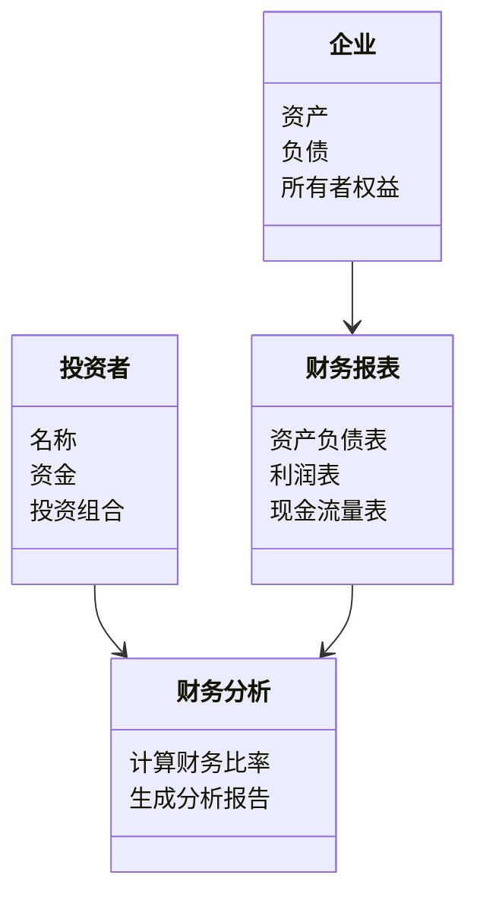

                 


# 彼得林奇对财务报表分析的重视

## 关键词：彼得林奇，财务报表分析，投资策略，财务比率，投资决策

## 摘要：本文深入探讨彼得林奇对财务报表分析的重视，从财务报表分析的背景、核心概念、算法原理、数学模型、系统架构到项目实战，详细阐述了如何通过财务报表分析做出明智的投资决策。文章结构清晰，内容丰富，适合对投资和财务分析感兴趣的读者。

---

## 第1章：财务报表分析的背景与重要性

### 1.1 财务报表分析的核心概念

#### 1.1.1 财务报表分析的定义
财务报表分析是通过对企业的财务报表（包括资产负债表、利润表和现金流量表）进行详细分析，评估企业的财务状况、经营成果和现金流量，从而为投资决策提供依据。

#### 1.1.2 财务报表分析的边界与外延
- **边界**：主要关注企业的财务数据，不涉及非财务信息（如市场趋势、管理团队等）。
- **外延**：通过财务数据推测企业的经营状况和未来前景。

#### 1.1.3 财务报表分析的核心要素组成
1. 资产负债表：反映企业的资产、负债和所有者权益。
2. 利润表：反映企业在一定期间内的收入和支出，计算净利润。
3. 现金流量表：反映企业在一定期间内的现金流入和流出情况。

### 1.2 彼得林奇的投资理念

#### 1.2.1 彼得林奇的投资者画像
- 长期投资者，注重价值投资。
- 强调对企业基本面的深入分析。

#### 1.2.2 彼得林奇对财务报表分析的重视
彼得林奇认为，财务报表分析是投资决策的核心，通过分析财务报表可以评估企业的盈利能力、财务健康状况和成长潜力。

#### 1.2.3 彼得林奇投资策略的核心要素
- **价值投资**：寻找被市场低估的企业。
- **基本面分析**：通过财务报表分析企业的盈利能力、成长性和财务稳定性。
- **长期持有**：避免短期波动，关注长期价值。

### 1.3 财务报表分析的现状与趋势

#### 1.3.1 传统财务报表分析的局限性
- 仅关注财务数据，忽略市场和行业趋势。
- 无法预测企业未来业绩。

#### 1.3.2 数据驱动的财务分析新趋势
- 结合大数据和人工智能技术，进行更精准的财务预测。
- 多维度分析，包括行业趋势、竞争对手分析等。

#### 1.3.3 投资者如何利用财务报表分析做出决策
1. 通过财务报表分析评估企业的财务健康状况。
2. 结合行业趋势和市场环境，判断企业的成长潜力。
3. 利用财务比率分析企业的盈利能力、偿债能力和运营效率。

---

## 第2章：财务报表分析的核心概念与联系

### 2.1 财务报表分析的核心概念原理

#### 2.1.1 财务报表的三张表

- **资产负债表**：反映企业在某一特定时点的财务状况。
  - 资产：企业拥有的资源。
  - 负债：企业欠款。
  - 所有者权益：企业净资产。

- **利润表**：反映企业在一定期间内的经营成果。
  - 收入：企业营业收入。
  - 支出：企业营业成本和费用。
  - 净利润：企业最终利润。

- **现金流量表**：反映企业在一定期间内的现金流入和流出情况。
  - 经营活动现金流：企业日常经营产生的现金流。
  - 投资活动现金流：企业投资活动产生的现金流。
  - 筹资活动现金流：企业筹资活动产生的现金流。

#### 2.1.2 财务比率分析的基本原理
财务比率是通过财务报表中的数据计算出的指标，用于评估企业的财务状况和经营能力。

#### 2.1.3 财务报表分析的逻辑框架
1. 分析企业的盈利能力。
2. 分析企业的财务健康状况。
3. 分析企业的成长潜力。

### 2.2 财务报表分析的核心概念对比表

| 财务报表 | 主要内容 | 目的 |
|----------|----------|------|
| 资产负债表 | 资产、负债、所有者权益 | 评估企业的财务状况 |
| 利润表 | 收入、成本、利润 | 评估企业的盈利能力 |
| 现金流量表 | 经营、投资、筹资现金流 | 评估企业的现金流情况 |

### 2.3 财务报表分析的ER实体关系图


---

## 第3章：财务报表分析的算法原理

### 3.1 财务指标计算的步骤与流程

#### 3.1.1 算法流程图


#### 3.1.2 财务比率计算的Python代码实现

```python
import pandas as pd

# 假设我们有一个包含财务数据的DataFrame df
# 计算ROE（净资产收益率）
df['ROE'] = df['净利润'] / df['股东权益']

# 计算ROA（资产净利率）
df['ROA'] = df['净利润'] / df['总资产']

# 计算毛利率
df['毛利率'] = (df['营业收入'] - df['营业成本']) / df['营业收入']
```

### 3.2 财务比率分析的数学模型

#### 3.2.1 净资产收益率（ROE）公式
$$ \text{ROE} = \frac{\text{净利润}}{\text{股东权益}} $$

#### 3.2.2 资产净利率（ROA）公式
$$ \text{ROA} = \frac{\text{净利润}}{\text{总资产}} $$

#### 3.2.3 毛利率公式
$$ \text{毛利率} = \frac{\text{营业收入} - \text{营业成本}}{\text{营业收入}} $$

---

## 第4章：财务报表分析的系统架构设计

### 4.1 投资决策支持系统场景介绍

#### 4.1.1 系统功能模块

- 数据采集模块：从财务报表中提取数据。
- 数据分析模块：计算财务比率，生成分析报告。
- 数据可视化模块：以图表形式展示分析结果。

#### 4.1.2 系统架构设计


### 4.2 系统功能设计

#### 4.2.1 领域模型类图



#### 4.2.2 系统架构图


---

## 第5章：项目实战

### 5.1 环境安装与配置

#### 5.1.1 安装Python和相关库
```bash
pip install pandas matplotlib
```

### 5.2 系统核心实现源代码

#### 5.2.1 数据采集模块

```python
import pandas as pd

# 读取财务报表数据
df = pd.read_csv('financial_data.csv')
```

#### 5.2.2 数据分析模块

```python
# 计算财务比率
df['ROE'] = df['净利润'] / df['股东权益']
df['ROA'] = df['净利润'] / df['总资产']
```

#### 5.2.3 数据可视化模块

```python
import matplotlib.pyplot as plt

# 绘制ROE趋势图
plt.plot(df['年份'], df['ROE'])
plt.title('ROE趋势图')
plt.xlabel('年份')
plt.ylabel('ROE')
plt.show()
```

### 5.3 实际案例分析

#### 5.3.1 案例分析

- 以某企业为例，分析其ROE和ROA的趋势。
- 结合行业趋势和市场环境，评估企业的财务状况。

---

## 第6章：总结与最佳实践

### 6.1 总结

彼得林奇通过深入分析财务报表，评估企业的财务状况和成长潜力，从而做出明智的投资决策。财务报表分析是投资决策的核心，投资者应重视财务报表分析，结合行业趋势和市场环境，制定合理的投资策略。

### 6.2 最佳实践 tips

- **持续学习**：不断学习财务分析的新方法和工具。
- **数据驱动**：利用大数据和人工智能技术，进行更精准的财务分析。
- **长期投资**：避免短期波动，关注企业的长期价值。

### 6.3 拓展阅读

- 《彼得林奇的投资哲学》
- 《财务报表分析实务》
- 《投资学基础》

---

## 作者：AI天才研究院/AI Genius Institute & 禅与计算机程序设计艺术 /Zen And The Art of Computer Programming

---

以上是《彼得林奇对财务报表分析的重视》的详细目录大纲和内容概述，希望对您有所帮助。

