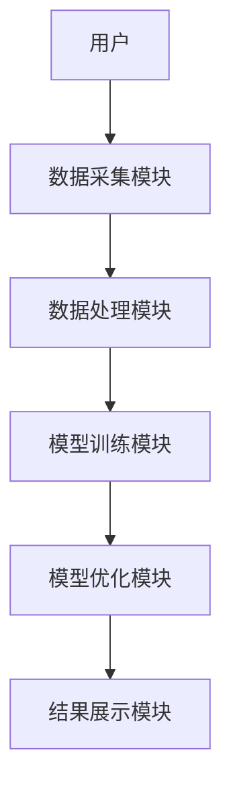
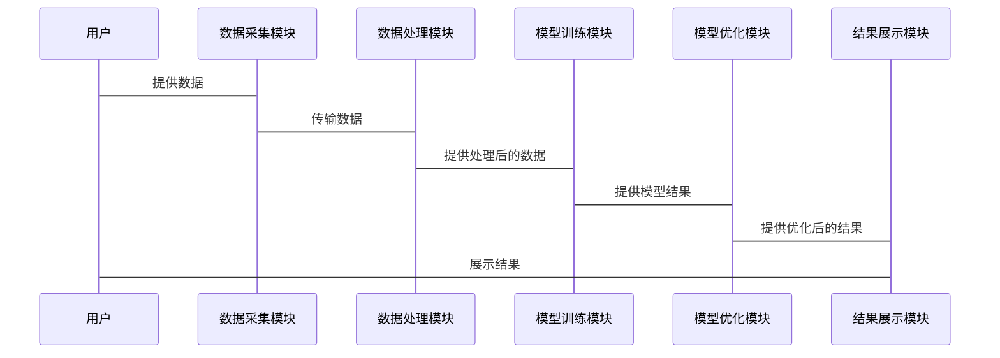

                 


# 彼得林奇的"价值创造"在平台经济中的新衡量维度

> 关键词：价值创造，平台经济，衡量维度，用户价值，平台价值，网络效应

> 摘要：本文探讨了彼得林奇的价值创造理论在平台经济中的应用，并提出了新的衡量维度。通过分析平台经济的特征，提出了用户价值、平台价值和社会价值三个维度，并结合实际案例和算法模型，展示了如何在平台经济中实现价值创造的最大化。

---

# 第一部分: 背景介绍

## 第1章: 价值创造与平台经济的背景

### 1.1 价值创造的定义与内涵

#### 1.1.1 价值创造的基本概念
价值创造是指通过提供产品或服务，满足用户需求，从而为用户创造超出预期的价值。在经济活动中，价值创造是企业生存和发展的核心。

#### 1.1.2 价值创造的核心要素
价值创造的核心要素包括：用户需求、资源投入、创新能力和效率提升。这些要素共同作用，才能实现真正的价值创造。

#### 1.1.3 价值创造的实现方式
价值创造的实现方式包括：提供高质量的产品、优化用户体验、降低成本、创新商业模式等。

### 1.2 平台经济的定义与特征

#### 1.2.1 平台经济的基本概念
平台经济是以互联网为基础，通过构建多方参与的平台，实现资源优化配置和价值创造的经济模式。

#### 1.2.2 平台经济的核心特征
平台经济具有双边或多边市场结构、网络效应强、数据驱动、生态系统复杂等特点。

#### 1.2.3 平台经济的生态系统
平台经济的生态系统包括用户、供应商、平台和技术支持等多个组成部分，各部分相互依存，共同推动价值创造。

### 1.3 价值创造在平台经济中的重要性

#### 1.3.1 平台经济中的价值来源
平台经济中的价值来源包括用户需求的满足、资源的优化配置、数据的利用和生态系统的协同。

#### 1.3.2 价值创造对平台发展的意义
价值创造是平台经济发展的核心动力，能够吸引用户、优化资源分配、提升平台竞争力。

#### 1.3.3 价值创造与平台用户的关系
平台通过创造价值吸引用户，用户通过使用平台获得价值，双方相互依存，共同推动平台的发展。

## 第2章: 价值创造的传统衡量维度

### 2.1 传统价值衡量维度概述

#### 2.1.1 经济价值的衡量
经济价值通常通过利润、收入和成本等指标来衡量。

#### 2.1.2 社会价值的衡量
社会价值关注的是经济活动对社会的整体贡献，包括就业、环保和社会福利等方面。

#### 2.1.3 企业价值的衡量
企业价值通常通过市场价值、股东价值和企业绩效等指标来衡量。

### 2.2 传统衡量维度的局限性

#### 2.2.1 经济价值衡量的局限性
传统的经济价值衡量方法忽视了用户体验和社会价值，无法全面反映平台经济中的价值创造。

#### 2.2.2 社会价值衡量的局限性
社会价值的衡量缺乏具体的标准和方法，难以量化。

#### 2.2.3 企业价值衡量的局限性
传统的企业价值衡量方法难以适应平台经济中的多边市场结构和网络效应。

### 2.3 传统衡量维度在平台经济中的挑战

#### 2.3.1 平台经济中的多边市场
平台经济中的多边市场结构使得传统的双边市场衡量方法难以适用。

#### 2.3.2 平台经济中的网络效应
平台经济中的网络效应使得传统的线性衡量方法难以捕捉其价值创造的复杂性。

#### 2.3.3 平台经济中的数据驱动
平台经济中的数据驱动使得传统的价值衡量方法难以适应数据的动态变化。

---

# 第二部分: 核心概念与联系

## 第3章: 价值创造的核心概念与联系

### 3.1 价值创造的核心概念

#### 3.1.1 用户价值
用户价值是指平台为用户提供的产品或服务所创造的价值，是平台经济中的核心价值来源。

#### 3.1.2 平台价值
平台价值是指平台通过优化资源配置、降低成本和提升效率所创造的价值，是平台经济的核心竞争力。

#### 3.1.3 社会价值
社会价值是指平台经济对社会整体的贡献，包括就业、环保和社会福利等方面。

### 3.2 平台经济中的价值创造关系

#### 3.2.1 用户与平台的关系
用户通过使用平台获得价值，平台通过用户的行为数据优化服务，进一步创造价值。

#### 3.2.2 平台与生态的关系
平台通过构建生态系统，吸引更多的用户和供应商，实现价值的协同创造。

#### 3.2.3 价值创造的网络效应
平台经济中的网络效应使得价值创造具有指数级增长的潜力，用户越多，平台价值越大。

---

### 3.3 价值创造的核心要素与关系

#### 3.3.1 核心要素
- 用户需求
- 资源配置
- 数据驱动
- 网络效应

#### 3.3.2 核心要素之间的关系
用户需求驱动资源配置，资源配置决定数据的生成和利用，数据驱动优化网络效应，最终实现价值创造的最大化。

---

# 第四部分: 算法原理

## 第4章: 价值创造的算法原理

### 4.1 价值创造的算法概述

#### 4.1.1 算法的基本概念
价值创造的算法通过分析用户行为、资源分配和数据驱动，优化平台的价值创造过程。

#### 4.1.2 算法的核心步骤
1. 数据采集：收集用户行为数据和资源分配数据。
2. 数据处理：清洗数据，提取特征。
3. 数据分析：使用机器学习模型预测价值创造的关键因素。
4. 优化策略：根据分析结果优化资源配置和用户体验。

### 4.2 算法的核心数学模型

#### 4.2.1 用户价值模型
$$ V_u = \alpha \cdot U + \beta \cdot S + \gamma \cdot T $$
其中，$V_u$ 表示用户价值，$U$ 表示用户满意度，$S$ 表示用户参与度，$T$ 表示用户留存率，$\alpha$、$\beta$、$\gamma$ 为权重系数。

#### 4.2.2 平台价值模型
$$ V_p = \alpha \cdot R + \beta \cdot C + \gamma \cdot E $$
其中，$V_p$ 表示平台价值，$R$ 表示资源利用率，$C$ 表示成本节约，$E$ 表示效率提升，$\alpha$、$\beta$、$\gamma$ 为权重系数。

#### 4.2.3 网络效应模型
$$ N = \alpha \cdot U + \beta \cdot S + \gamma \cdot T $$
其中，$N$ 表示网络效应，$U$ 表示用户数量，$S$ 表示用户满意度，$T$ 表示用户留存率，$\alpha$、$\beta$、$\gamma$ 为权重系数。

### 4.3 算法实现

#### 4.3.1 数据采集与预处理
1. 数据采集：通过API接口获取用户行为数据和资源分配数据。
2. 数据清洗：去除无效数据，填充缺失值。
3. 数据转换：将数据转换为模型所需的格式。

#### 4.3.2 算法实现
1. 训练模型：使用线性回归模型训练用户价值模型、平台价值模型和网络效应模型。
2. 模型评估：通过交叉验证评估模型的准确性和稳定性。
3. 模型优化：根据评估结果调整模型参数，优化模型性能。

#### 4.3.3 代码实现
```python
import pandas as pd
from sklearn.linear_model import LinearRegression
from sklearn.metrics import mean_squared_error
from sklearn.model_selection import train_test_split

# 数据加载
data = pd.read_csv('value创造数据.csv')

# 数据预处理
X = data[['U', 'S', 'T']]
y = data['V_u']

# 数据分割
X_train, X_test, y_train, y_test = train_test_split(X, y, test_size=0.2, random_state=42)

# 模型训练
model = LinearRegression()
model.fit(X_train, y_train)

# 模型预测
y_pred = model.predict(X_test)

# 模型评估
mse = mean_squared_error(y_test, y_pred)
print(f"均方误差: {mse}")
print(f"系数: {model.coef_}")
print(f"截距: {model.intercept_}")
```

---

# 第五部分: 系统分析与架构设计

## 第5章: 价值创造的系统分析与架构设计

### 5.1 系统问题场景

#### 5.1.1 问题描述
平台经济中的价值创造涉及用户、平台和生态系统三个部分，传统的衡量方法难以全面反映其价值。

#### 5.1.2 问题解决
通过构建新的衡量维度，优化平台的价值创造过程。

#### 5.1.3 边界与外延
系统边界包括用户、平台和生态系统，外延包括数据采集、分析和优化。

### 5.2 系统功能设计

#### 5.2.1 系统功能模块
1. 数据采集模块：负责采集用户行为数据和资源分配数据。
2. 数据处理模块：对数据进行清洗和转换。
3. 模型训练模块：使用机器学习模型训练价值创造模型。
4. 模型优化模块：根据模型评估结果优化模型性能。
5. 结果展示模块：将模型结果可视化，供用户查看。

#### 5.2.2 系统功能设计图



### 5.3 系统架构设计

#### 5.3.1 系统架构图


#### 5.3.2 系统接口设计
1. 数据接口：提供API接口供其他模块调用。
2. 模型接口：提供模型训练和优化的接口。
3. 展示接口：提供结果展示的接口。

### 5.4 系统交互设计

#### 5.4.1 系统交互流程图



---

# 第六部分: 项目实战

## 第6章: 价值创造的项目实战

### 6.1 项目环境安装

#### 6.1.1 环境要求
- Python 3.6+
- NumPy
- Pandas
- Scikit-learn

#### 6.1.2 安装依赖
```bash
pip install numpy pandas scikit-learn
```

### 6.2 系统核心实现

#### 6.2.1 核心代码实现

```python
import numpy as np
import pandas as pd
from sklearn.linear_model import LinearRegression
from sklearn.metrics import mean_squared_error
from sklearn.model_selection import train_test_split

# 数据加载
data = pd.read_csv('value创造数据.csv')

# 数据预处理
X = data[['U', 'S', 'T']]
y = data['V_u']

# 数据分割
X_train, X_test, y_train, y_test = train_test_split(X, y, test_size=0.2, random_state=42)

# 模型训练
model = LinearRegression()
model.fit(X_train, y_train)

# 模型预测
y_pred = model.predict(X_test)

# 模型评估
mse = mean_squared_error(y_test, y_pred)
print(f"均方误差: {mse}")
print(f"系数: {model.coef_}")
print(f"截距: {model.intercept_}")
```

#### 6.2.2 代码实现解读
- 数据加载：从CSV文件中加载数据。
- 数据预处理：提取特征变量和目标变量。
- 数据分割：将数据分为训练集和测试集。
- 模型训练：使用线性回归模型训练价值创造模型。
- 模型预测：使用训练好的模型预测测试集的结果。
- 模型评估：评估模型的准确性和稳定性。

### 6.3 实际案例分析

#### 6.3.1 实际案例
某平台希望通过优化资源配置和提升用户体验，实现价值创造的最大化。通过上述算法，平台可以预测用户价值、平台价值和网络效应，优化资源配置和用户体验。

#### 6.3.2 案例分析
1. 数据采集：采集用户行为数据和资源分配数据。
2. 数据处理：清洗数据，提取特征。
3. 模型训练：训练价值创造模型。
4. 模型优化：根据评估结果优化模型性能。
5. 结果展示：将模型结果可视化，供平台决策者参考。

### 6.4 项目小结

通过实际案例分析，我们可以看到，价值创造的算法在平台经济中的应用能够显著提升平台的价值创造能力，优化资源配置和用户体验，实现平台的可持续发展。

---

# 第七部分: 最佳实践

## 第7章: 价值创造的最佳实践

### 7.1 小结

通过本文的分析，我们可以看到，彼得林奇的价值创造理论在平台经济中的应用具有重要的现实意义。通过构建新的衡量维度，平台可以更好地优化资源配置、提升用户体验和实现可持续发展。

### 7.2 注意事项

在实际应用中，需要注意以下几点：
1. 数据的质量和准确性是价值创造的关键。
2. 模型的准确性和稳定性需要不断优化。
3. 平台的生态系统需要协同优化，才能实现价值的最大化。

### 7.3 拓展阅读

1. 《平台经济：价值创造与创新》
2. 《数据驱动的平台优化》
3. 《网络效应与平台发展》

---

# 作者信息

作者：AI天才研究院/AI Genius Institute & 禅与计算机程序设计艺术 /Zen And The Art of Computer Programming

---

希望这篇博客文章能够为您提供有价值的信息和启发！

