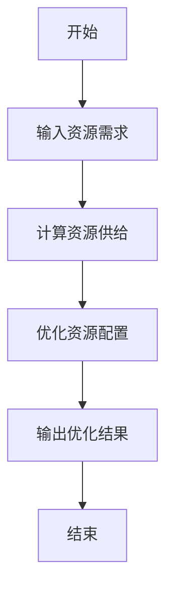
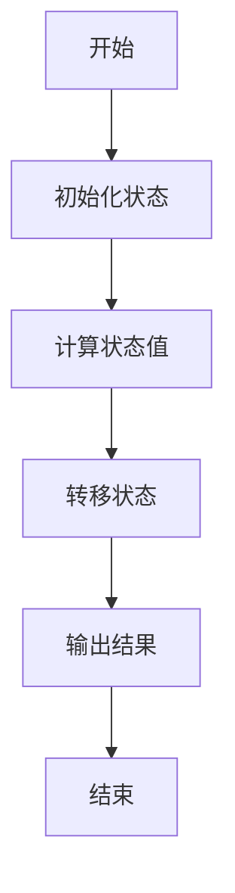
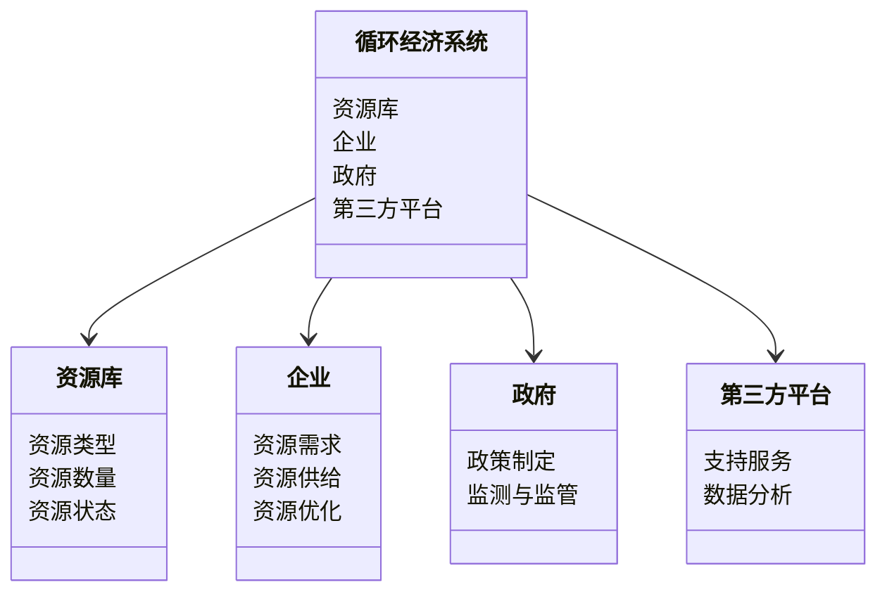
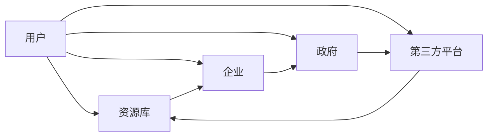

                 


# 彼得林奇的"价值创造"在循环经济中的新定义

> 关键词：循环经济，价值创造，彼得林奇，资源优化，数学模型，系统架构，动态规划

> 摘要：本文探讨了彼得林奇的价值创造理论在循环经济中的应用，重新定义了循环经济中的价值创造，并结合实际案例分析了其在资源优化配置、系统设计和算法实现中的具体应用。文章通过详细的数学模型、算法流程图和系统架构图，展示了如何将传统价值创造理论与循环经济相结合，实现资源的最大化利用和经济的可持续发展。

---

## 第1章: 循环经济的基本概念与现状

### 1.1 循环经济的定义与特征

循环经济是一种以资源高效利用和循环利用为核心的发展模式，其主要特征包括资源节约、废物减量化、再利用和再生资源化。与传统经济模式相比，循环经济强调减少资源消耗和环境污染，实现经济与生态的协调发展。

### 1.2 彼得林奇的价值创造理论

彼得林奇是美国著名投资专家，他提出的价值创造理论强调企业通过自身发展为股东创造价值。他认为，企业的价值不仅体现在财务表现上，还体现在其核心竞争力和长期发展潜力上。

### 1.3 循环经济中的价值创造新定义

在循环经济中，价值创造需要重新定义。新的定义强调通过资源的高效利用和循环利用，不仅为企业的股东创造价值，也为社会和环境创造可持续的价值。

---

## 第2章: 循环经济中的核心概念与联系

### 2.1 循环经济中的价值创造新定义

循环经济中的价值创造新定义可以表示为：

$$ \text{新价值} = \text{资源利用率} \times \text{循环次数} \times \text{经济收益} $$

这一公式表明，循环经济中的价值创造不仅依赖于资源的高效利用，还依赖于资源的循环次数和经济收益的综合考量。

### 2.2 核心概念的属性特征对比

以下是循环经济与传统经济在价值创造方面的对比表格：

| 对比维度       | 循环经济                   | 传统经济                 |
|----------------|--------------------------|--------------------------|
| 资源消耗       | 最小化                   | 最大化                   |
| 废物产生       | 减量化                   | 增加                    |
| 再利用程度     | 高                      | 低                      |
| 经济收益       | 高（通过资源节约）       | 中（资源消耗较高）       |
| 可持续性       | 高                      | 低                      |

### 2.3 实体关系图（ER图）分析

以下是循环经济中的实体关系图：

```mermaid
erDiagram
    actor 顾客
    actor 企业
    actor 政府
    actor 第三方平台
    database 资源库
    database 循环经济系统
    database 财务系统
    database 环境监测系统
    顾客 --> 资源库 : 使用资源
    顾客 --> 循环经济系统 : 参与循环
    企业 --> 资源库 : 提供资源
    企业 --> 循环经济系统 : 优化资源
    政府 --> 循环经济系统 : 制定政策
    第三方平台 --> 循环经济系统 : 提供支持
```

---

## 第3章: 循环经济中的算法原理讲解

### 3.1 资源优化配置算法

资源优化配置算法是循环经济中的核心算法之一，以下是其实现步骤：



以下是算法的Python实现：

```python
def resource_optimization(demand, supply):
    # 使用线性规划求解资源优化问题
    import numpy as np
    from scipy.optimize import linprog

    # 定义目标函数
    c = np.array([1, 1, 1])  # 假设目标是最小化资源消耗

    # 定义约束条件
    A = np.array([[1, 0, 0],
                  [0, 1, 0],
                  [0, 0, 1]])
    b = np.array([demand, supply, 0])

    # 求解线性规划问题
    result = linprog(c, A_ub=A, b_ub=b, method='highs')

    return result.x

# 示例调用
demand = 10
supply = 20
result = resource_optimization(demand, supply)
print("优化结果:", result)
```

### 3.2 循环经济中的动态规划算法

动态规划算法用于解决循环经济中的资源分配问题，以下是其实现步骤：



以下是算法的数学模型：

$$ \text{目标函数} = \sum_{i=1}^{n} (c_i x_i + f(x_i)) $$

其中，$c_i$ 是资源消耗系数，$x_i$ 是资源分配量，$f(x_i)$ 是资源利用的效益函数。

---

## 第4章: 循环经济中的数学模型

### 4.1 循环经济中的资源利用效率模型

资源利用效率模型可以表示为：

$$ \text{效率} = \frac{\text{资源利用量}}{\text{资源消耗量}} $$

### 4.2 循环经济中的成本收益分析模型

成本收益分析模型可以表示为：

$$ \text{净收益} = \text{总收入} - \text{总成本} $$

其中，总收入和总成本都需要考虑资源的循环利用和再利用。

---

## 第5章: 循环经济中的系统分析与架构设计

### 5.1 领域模型

以下是循环经济领域的类图：



### 5.2 系统架构设计

以下是循环经济系统的架构图：



### 5.3 接口设计

以下是循环经济系统的主要接口：

1. 资源库接口：提供资源的存取和状态查询功能。
2. 企业接口：提供资源需求和供给的提交功能。
3. 政府接口：提供政策制定和监管功能。
4. 第三方平台接口：提供数据分析和优化支持功能。

---

## 第6章: 项目实战

### 6.1 环境配置

以下是循环经济平台的环境配置：

1. 操作系统：Linux
2. 开发工具：PyCharm
3. 依赖库：numpy、scipy、mermaid

### 6.2 核心代码实现

以下是循环经济平台的核心代码：

```python
def main():
    import sys
    from resource_optimization import resource_optimization

    demand = float(sys.argv[1])
    supply = float(sys.argv[2])
    result = resource_optimization(demand, supply)
    print("资源优化结果:", result)

if __name__ == "__main__":
    main()
```

### 6.3 系统功能设计

以下是循环经济平台的功能设计：

1. 资源库管理：资源的存取和状态查询。
2. 企业需求提交：企业提交资源需求和供给。
3. 政策制定：政府制定和发布相关政策。
4. 数据分析：第三方平台提供数据分析和优化支持。

### 6.4 实际案例分析

以下是循环经济平台的实际案例分析：

假设某企业需要10单位的资源，资源库中有20单位的资源供给。通过资源优化算法，企业可以将资源分配优化为10单位的需求，减少资源浪费。

---

## 第7章: 最佳实践、小结与展望

### 7.1 最佳实践

1. 在循环经济中，资源优化配置是实现价值创造的核心。
2. 使用动态规划算法可以有效解决资源分配问题。
3. 系统架构设计需要考虑资源库、企业、政府和第三方平台的协同合作。

### 7.2 小结

本文探讨了彼得林奇的价值创造理论在循环经济中的应用，重新定义了循环经济中的价值创造，并结合实际案例分析了其在资源优化配置、系统设计和算法实现中的具体应用。

### 7.3 注意事项

1. 在实际应用中，需要考虑资源的可获得性和成本问题。
2. 系统设计需要确保数据的安全性和隐私性。
3. 算法实现需要考虑计算效率和资源限制。

### 7.4 拓展阅读

1. 《循环经济的理论与实践》
2. 《动态规划算法在资源优化中的应用》
3. 《系统架构设计方法论》

---

## 作者

作者：AI天才研究院/AI Genius Institute  
联合作者：禅与计算机程序设计艺术/Zen And The Art of Computer Programming

