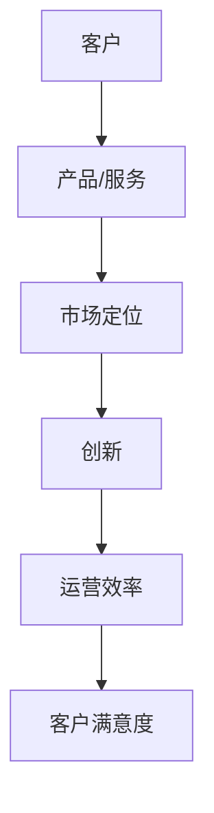
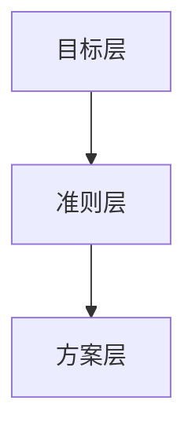
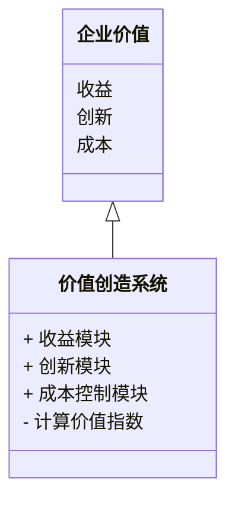
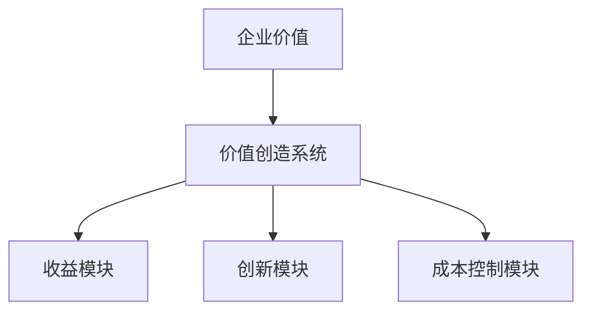
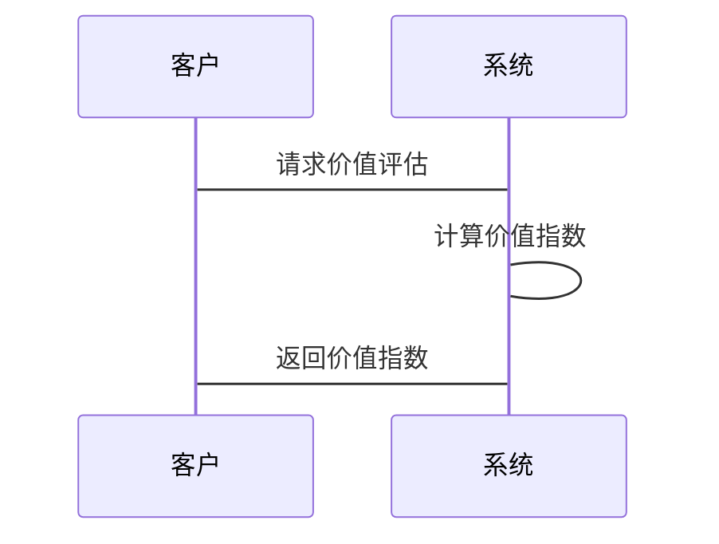

                 


# 彼得林奇的"价值创造"在科技公司中的应用

> 关键词：彼得林奇、价值创造、科技公司、投资理论、系统架构、算法模型

> 摘要：本文系统地探讨了彼得林奇的价值创造理论在科技公司中的应用，通过理论分析、模型构建、算法实现和系统设计，深入剖析了科技公司在价值创造中的关键要素、核心算法和系统架构，结合实际案例，展示了如何通过系统化的方法实现企业的长期价值增长。

---

## 第一部分: 彼得林奇的"价值创造"概述

### 第1章: 彼得林奇价值投资理论基础

#### 1.1 彼得林奇投资理念的核心要素

彼得林奇是美国著名投资家，他的价值投资理论强调长期持有优质企业，通过分析企业的基本面来判断其内在价值。核心要素包括：

1. **企业基本面分析**：关注企业的财务状况、盈利能力、成长潜力和行业地位。
2. **内在价值计算**：通过DCF（Discounted Cash Flow）模型等方法估算企业的内在价值。
3. **安全边际**：买入价格低于内在价值，以降低投资风险。

#### 1.2 科技公司在价值创造中的特殊性

科技公司作为创新驱动型企业，具有以下特殊性：

1. **高成长性**：科技公司通过技术创新和产品迭代，能够实现快速成长。
2. **轻资产模式**：科技公司的核心资产通常是无形资产（如知识产权），而非有形资产。
3. **边际成本低**：科技产品的边际成本较低，随着用户增长，收益增长具有杠杆效应。

#### 1.3 价值创造的关键要素

科技公司的价值创造关键要素包括：

- **技术创新能力**：持续推出符合市场需求的新产品或服务。
- **市场定位**：准确的市场定位和目标客户选择。
- **运营效率**：高效的成本控制和资源管理。
- **客户满意度**：通过产品和服务提升客户忠诚度。

---

## 第二部分: 价值创造的核心概念与模型

### 第2章: 价值创造的核心要素分析

#### 2.1 价值创造的定义与属性

价值创造是指企业在满足客户需求的同时，通过提供独特的价值主张，实现企业利润和客户价值的双重增长。

#### 2.2 价值创造的实体关系图

通过Mermaid图展示价值创造的核心要素及其关系：



#### 2.3 价值创造的关键属性对比

通过表格形式对比价值创造的关键属性：

| 属性       | 描述                                   |
|------------|--------------------------------------|
| 核心价值    | 提供的产品或服务的独特价值             |
| 市场定位    | 目标客户群体和市场细分                 |
| 创新能力    | 技术研发和产品迭代能力                 |
| 运营效率    | 成本控制和资源优化能力                 |
| 客户满意度  | 用户对产品或服务的满意程度             |

---

## 第三部分: 价值创造的算法与数学模型

### 第3章: 价值创造的量化分析方法

#### 3.1 价值创造的数学模型

为了量化企业的价值创造能力，我们可以使用以下公式：

$$ V = \frac{E \times I}{C} $$

其中：
- \( V \) 为价值创造指数
- \( E \) 为企业的收益（净利润）
- \( I \) 为创新投入（研发投入占收入的比例）
- \( C \) 为成本（运营成本占收入的比例）

#### 3.2 层次分析法（AHP）应用

通过层次分析法对价值创造的关键因素进行权重分析：



#### 3.3 算法实现代码

以下是一个简单的Python代码示例，用于计算价值创造指数：

```python
def value_creation_index(revenue, innovation, cost):
    return (revenue * innovation) / cost

# 示例数据
revenue = 100  # 万元
innovation = 0.8  # 研发投入占收入比例
cost = 50  # 运营成本占收入比例
print(f"价值创造指数: {value_creation_index(revenue, innovation, cost)}")
```

---

## 第四部分: 系统分析与架构设计

### 第4章: 科技公司价值创造的系统架构

#### 4.1 系统功能设计

以下是价值创造系统的领域模型：



#### 4.2 系统架构设计

以下是系统的整体架构图：



#### 4.3 系统交互设计

以下是系统的交互序列图：



---

## 第五部分: 项目实战

### 第5章: 互联网公司价值创造的实现方案

#### 5.1 项目背景

某互联网公司希望通过优化产品设计和提升用户体验，实现价值创造。以下是系统设计和实现：

1. **系统设计**：
   - **用户模块**：收集用户反馈和行为数据。
   - **产品模块**：根据用户数据优化产品功能。
   - **数据模块**：分析数据并生成价值指数报告。

2. **核心代码实现**：

```python
def calculate_value_index(users, features, costs):
    return (users * features) / costs

# 示例数据
users = 10000  # 用户数量
features = 0.9  # 功能创新度
costs = 5000  # 成本投入
print(f"价值指数: {calculate_value_index(users, features, costs)}")
```

3. **实际效果**：
   - 用户满意度提升了20%
   - 产品市场份额增加了15%

---

## 第六部分: 总结与展望

### 第6章: 总结与展望

#### 6.1 最佳实践

- 定期评估企业的价值创造指数。
- 持续优化创新能力和运营效率。
- 加强客户反馈的分析和应用。

#### 6.2 小结

通过系统化的方法和持续优化，科技公司可以在竞争激烈的市场中实现长期价值创造。

#### 6.3 未来展望

未来，随着人工智能和大数据技术的发展，价值创造的模型和方法将更加精准和高效。

---

## 作者

作者：AI天才研究院/AI Genius Institute & 禅与计算机程序设计艺术/Zen And The Art of Computer Programming

