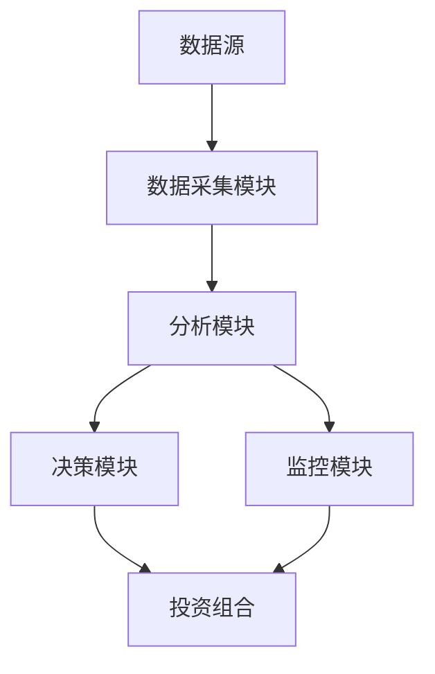

                 


# 彼得林奇的"价值创造"投资理念

## 关键词
- 彼得·林奇
- 价值创造
- 投资理念
- 价值投资
- 企业成长

## 摘要
彼得·林奇是全球著名的价值投资者，他的“价值创造”投资理念强调通过基本面分析和长期持有来寻找具有持续成长性和合理估值的企业。本文深入分析了这一理念的核心要素，包括企业筛选标准、估值方法、投资策略以及系统架构设计，并通过实际案例和数学模型详细阐述了其在投资实践中的应用。

---

## 第1章：彼得·林奇与“价值创造”投资理念

### 1.1 彼得·林奇的背景与投资风格
彼得·林奇是美国著名的基金经理，以其在富达投资管理公司的卓越表现闻名。他的投资哲学强调深入分析企业的基本面，寻找那些能够持续创造价值的公司。林奇的投资风格以耐心持有和长期增值为目标，不同于短期交易的高频操作。

### 1.2 价值创造投资理念的核心概念
价值创造投资理念认为，企业的内在价值是其未来现金流的现值。林奇注重企业的成长潜力和竞争优势，同时确保其估值处于合理区间。这种方法结合了成长投资和价值投资的优点，注重企业的可持续发展能力。

### 1.3 价值创造投资理念与传统投资理念的区别
传统投资理念往往侧重于短期价格波动或技术分析，而林奇的理念则更关注企业的内在价值和长期成长性。这种区别使得价值创造投资更加注重企业的基本面和长期潜力，而非市场的短期情绪。

---

## 第2章：价值创造投资理念的核心要素

### 2.1 企业基本面分析
基本面分析是价值创造理念的基础，包括对企业财务报表的详细审查。通过分析收入、利润、现金流等指标，评估企业的盈利能力和成长潜力。

### 2.2 估值与安全边际
林奇强调估值的重要性，使用市盈率、市净率等指标来判断企业的价值。安全边际则是指买入价格低于内在价值的程度，以降低投资风险。

### 2.3 成长与价值的结合
林奇的投资策略不仅关注企业的成长性，还要求其估值合理。这种结合使得投资者能够在企业成长的同时，以合理的价格介入，最大化投资收益。

---

## 第3章：价值创造投资理念的实施步骤

### 3.1 确定投资目标与策略
明确投资目标和策略是成功的前提。投资者需要设定收益目标，并制定相应的投资策略，如集中投资于少数优质企业。

### 3.2 企业筛选与评估
通过筛选具有强大竞争优势、良好财务状况和合理估值的企业，构建投资组合。林奇常用的标准包括ROE（净资产收益率）和ROA（资产回报率）等。

### 3.3 投资组合的构建与管理
投资组合应集中于少数优质企业，定期进行再评估和调整。林奇强调长期持有，避免频繁交易以降低成本。

---

## 第4章：价值创造投资理念的数学模型与分析

### 4.1 企业估值的数学模型
- **市盈率模型**：$$ P/E = \frac{P}{E} $$
- **市净率模型**：$$ P/B = \frac{P}{B} $$
- **内在价值计算模型**：$$ V = \sum \frac{CF_t}{(1+r)^t} $$

### 4.2 成长性评估的数学模型
- **营收增长率**：$$ GR = \frac{R_{t} - R_{t-1}}{R_{t-1}} $$
- **净利润增长率**：$$ NGR = \frac{N_{t} - N_{t-1}}{N_{t-1}} $$
- **复合年增长率**：$$ CAGR = \left( \frac{V_{end}}{V_{start}} \right)^{\frac{1}{n}} - 1 $$

### 4.3 安全边际计算
- **安全边际比率**：$$ SM = \frac{M}{P} $$
- **市场价格与内在价值差距**：$$ GAP = V - P $$

---

## 第5章：系统分析与架构设计

### 5.1 投资决策系统架构
- **数据采集模块**：收集企业财务数据和市场数据。
- **分析模块**：包括基本面分析、估值分析和成长性分析。
- **决策模块**：基于分析结果制定投资策略。
- **监控模块**：实时跟踪投资标的动态。

### 5.2 系统架构图


---

## 第6章：项目实战

### 6.1 实战环境安装
- 安装Python和相关库（pandas, numpy, matplotlib）。
- 数据源：获取目标企业的财务数据和市场数据。

### 6.2 核心实现源代码
```python
import pandas as pd

def calculate_pe_ratio(df):
    pe_ratio = df['Price'] / df['Earnings']
    return pe_ratio

def calculate_growth_rate(df, column):
    growth_rate = (df[column].pct_change() * 100).round(2)
    return growth_rate

data = {
    'Price': [50, 60, 70],
    'Earnings': [10, 15, 20],
    'Revenue': [100, 120, 130]
}
df = pd.DataFrame(data)

pe = calculate_pe_ratio(df)
growth_revenue = calculate_growth_rate(df, 'Revenue')
growth_earnings = calculate_growth_rate(df, 'Earnings')

print("市盈率:", pe)
print("收入增长率:", growth_revenue)
print("每股收益增长率:", growth_earnings)
```

### 6.3 代码应用解读
上述代码展示了如何计算市盈率和增长率。通过这些指标，投资者可以评估企业的估值和成长潜力，从而做出更明智的投资决策。

---

## 第7章：总结与最佳实践

### 7.1 小结
彼得·林奇的价值创造投资理念强调深入分析企业的基本面和长期成长潜力，同时注重合理估值和安全边际。这种理念帮助投资者在长期投资中实现稳定收益。

### 7.2 注意事项
- 避免情绪化投资，坚持基本面分析。
- 保持适度分散，降低投资风险。
- 定期复盘，及时调整投资组合。

### 7.3 拓展阅读
推荐阅读彼得·林奇的《投资最重要的事情》和《击败市场的人》，深入理解其投资理念。

---

## 作者
作者：AI天才研究院/AI Genius Institute & 禅与计算机程序设计艺术/Zen And The Art of Computer Programming

