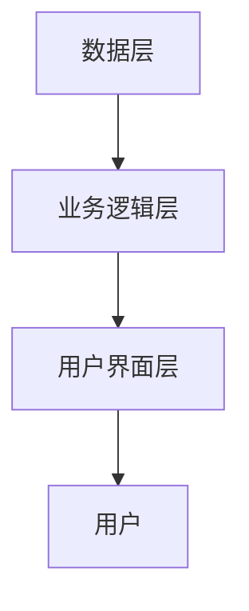
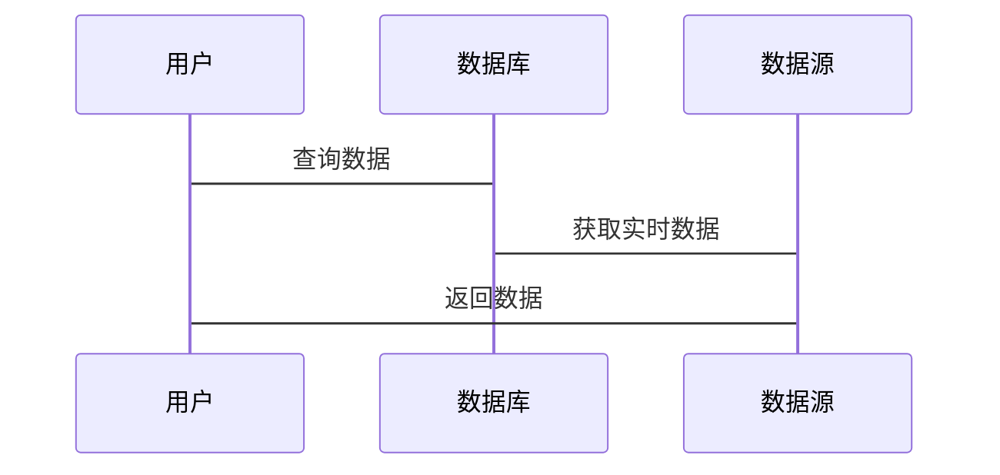

                 


# 彼得林奇的"价值创造"评估体系

> 关键词：价值创造，彼得林奇，投资评估，财务分析，竞争优势，系统架构

> 摘要：本文详细介绍了彼得·林奇的价值创造评估体系，探讨了其核心概念、评估方法、系统架构及实际应用。通过对财务指标、竞争优势、行业分析和管理层评估的系统化分析，结合具体案例，展示了如何将价值创造的理念应用于实际投资决策中。

---

# 第一部分: 价值创造评估体系概述

## 第1章: 价值创造的定义与意义

### 1.1 价值创造的定义

价值创造是指通过分析企业的财务状况、竞争优势、行业地位和管理层等因素，评估企业内在价值的过程。其核心在于识别那些能够持续创造价值的企业，并将其作为投资标的。

### 1.2 价值创造的意义

1. **投资决策的核心依据**：价值创造帮助企业投资者识别具有长期增长潜力的企业。
2. **风险控制**：通过评估企业的财务健康状况和竞争优势，降低投资风险。
3. **长期收益**：价值创造注重企业的基本面，而非短期市场波动，从而实现长期收益。

### 1.3 价值创造的边界与外延

1. **边界**：价值创造主要关注企业的内在价值，不考虑短期市场波动。
2. **外延**：价值创造不仅适用于企业评估，还可应用于其他领域，如项目评估和资产配置。

---

# 第二部分: 价值评估的核心要素

## 第2章: 财务指标分析

### 2.1 营业收入与利润分析

营业收入是企业核心业务收入的总和，而利润则反映了企业的盈利能力。以下是常用的财务指标：

- **净利率（Net Profit Margin）**：净利润 / 营业收入。
- **毛利率（Gross Profit Margin）**：毛利 / 营业收入。

### 2.2 资产负债表分析

资产负债表反映了企业的资产、负债和所有者权益。以下是关键指标：

- **资产负债率**：负债总额 / 资产总额。
- **流动比率**：流动资产 / 流动负债。

### 2.3 现金流分析

现金流是企业财务健康的重要指标。以下是关键指标：

- **经营活动现金流**：反映企业日常运营的现金流情况。
- **自由现金流**：经营活动现金流 - 资本支出。

---

## 第3章: 竞争优势分析

### 3.1 企业竞争优势的分类

竞争优势可分为成本优势、质量优势和品牌优势。例如，苹果凭借其品牌优势和产品差异化，占据了高端市场。

### 3.2 企业竞争优势的评估指标

- **市场占有率**：企业市场份额的占比。
- **客户忠诚度**：客户对品牌的忠诚程度。
- **产品差异化程度**：产品与竞争对手的差异性。

---

# 第三部分: 价值评估的系统化方法

## 第4章: 系统架构设计

### 4.1 系统功能模块设计

1. **数据采集模块**：收集企业的财务数据和市场数据。
2. **数据处理模块**：对数据进行清洗和转换。
3. **数据分析模块**：应用算法进行评估和预测。

### 4.2 系统架构设计

使用分层架构，将系统划分为数据层、业务逻辑层和用户界面层。以下是Mermaid架构图：



### 4.3 系统接口设计

系统需要与数据库、数据源和用户进行交互。以下是序列图：



---

## 第5章: 项目实战

### 5.1 环境安装

安装Python和必要的库（如Pandas、NumPy）。

```bash
pip install pandas numpy
```

### 5.2 核心代码实现

以下是财务分析的核心代码：

```python
import pandas as pd

def calculate_profit_margin(revenue, net_profit):
    return net_profit / revenue * 100

data = {
    '公司': ['A', 'B', 'C'],
    '收入': [1000, 1500, 2000],
    '净利润': [100, 150, 200]
}

df = pd.DataFrame(data)
df['利润率'] = df.apply(lambda x: calculate_profit_margin(x['收入'], x['净利润']), axis=1)
print(df)
```

### 5.3 案例分析

以苹果公司为例，分析其财务状况和竞争优势。

---

# 第四部分: 竞争优势的评估与分析

## 第6章: 企业竞争优势的案例分析

### 6.1 竞争优势的典型案例

以亚马逊为例，分析其竞争优势：

1. **成本优势**：通过规模效应降低采购成本。
2. **质量优势**：提供优质的在线购物体验。
3. **品牌优势**：强大的品牌影响力。

### 6.2 竞争优势的评估与分析

使用SWOT分析法评估企业的竞争优势。

---

# 第五部分: 价值评估的系统架构与实现

## 第7章: 系统分析与架构设计

### 7.1 系统功能设计

1. **数据采集**：从公开数据源获取企业数据。
2. **数据处理**：清洗和转换数据。
3. **数据分析**：应用算法进行评估。

### 7.2 系统架构设计

使用微服务架构，确保系统的可扩展性和灵活性。

---

# 结语

彼得林奇的价值创造评估体系为企业投资者提供了科学的评估方法。通过系统的财务分析、竞争优势评估和行业分析，投资者可以更好地识别具有长期增长潜力的企业。未来，随着技术的进步，价值评估体系将更加智能化和数据驱动。

---

作者：AI天才研究院 & 禅与计算机程序设计艺术

