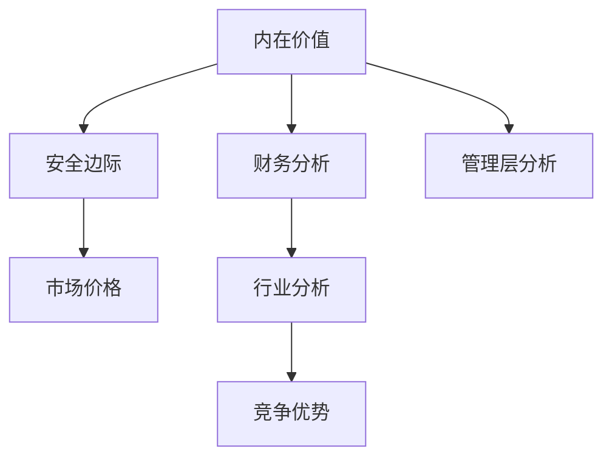
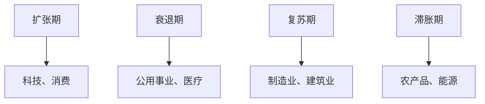
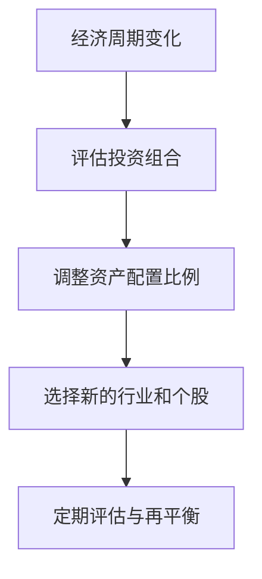
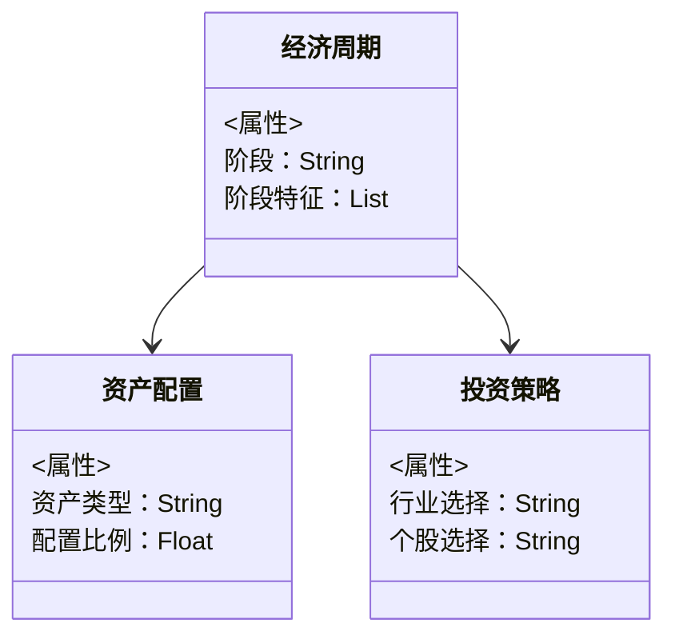
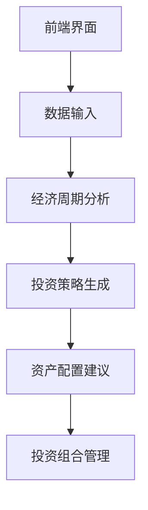
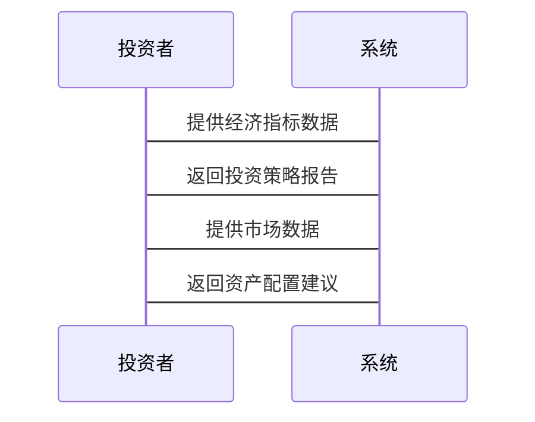
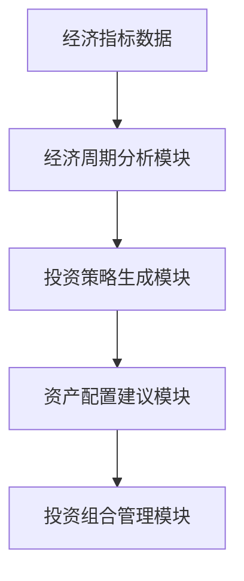
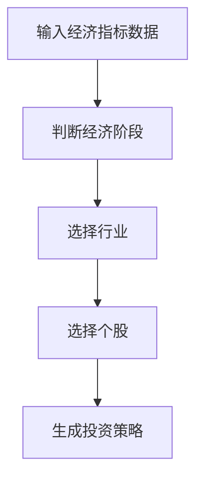
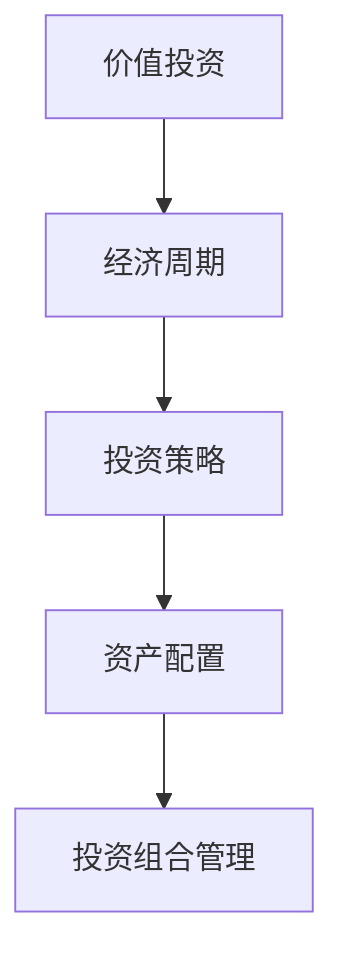

                 


# 彼得林奇的"价值投资"在不同经济周期的应用

## 关键词：价值投资，彼得林奇，经济周期，投资策略，风险管理，资产配置，内在价值

## 摘要：  
彼得·林奇是价值投资领域的传奇人物，他的投资理念强调长期基本面分析和寻找被低估的资产。在不同的经济周期中，价值投资的应用需要根据市场环境和经济趋势进行调整。本文通过分析价值投资的核心理念、经济周期的特点，以及在不同经济阶段的具体投资策略，帮助投资者在复杂的市场环境中制定有效的投资计划。文章还结合数学模型和系统架构，探讨了如何通过系统化的方法实现价值投资的目标，并通过实际案例展示了其在实践中的应用。

---

# 第一部分: 价值投资与经济周期概述

## 第1章: 价值投资的核心理念

### 1.1 价值投资的定义与起源

#### 1.1.1 价值投资的起源与发展  
价值投资是一种以基本面分析为核心的长期投资策略，起源于20世纪初。它强调购买那些市场价格低于其内在价值的资产，以期在长期实现资本增值。彼得·林奇是该理念的杰出代表，他在《彼得·林奇的投资心理书》等著作中详细阐述了这一方法。

#### 1.1.2 彼得·林奇的投资理念  
彼得·林奇认为，成功的投资依赖于对企业的深入了解，包括财务状况、行业地位和管理层能力。他主张避免短期市场波动的干扰，专注于寻找具有持续竞争优势的企业。

#### 1.1.3 价值投资的核心原则  
- **内在价值**：资产的真实价值由其未来现金流的现值决定。  
- **安全边际**：购买价格应低于内在价值，以降低风险。  
- **长期持有**：避免频繁交易，以减少成本并捕捉长期增长。

### 1.2 经济周期的基本概念

#### 1.2.1 经济周期的定义与分类  
经济周期分为四个阶段：  
1. **扩张期**：经济增长迅速，企业盈利上升。  
2. **衰退期**：经济活动放缓，企业盈利下降。  
3. **复苏期**：经济从衰退中逐步恢复。  
4. **滞胀期**：经济增长停滞，通胀率高企。

#### 1.2.2 不同经济周期的特点  
- **扩张期**：市场情绪乐观，资产价格上升。  
- **衰退期**：市场情绪恐慌，资产价格下跌。  
- **复苏期**：市场情绪逐渐恢复，资产价格反弹。  
- **滞胀期**：市场情绪复杂，资产价格波动剧烈。

#### 1.2.3 经济周期对投资的影响  
经济周期的变化直接影响企业盈利和资产价格。投资者需要根据经济周期调整投资策略，以规避风险并抓住机会。

### 1.3 价值投资与经济周期的关系

#### 1.3.1 价值投资在不同经济周期的应用  
- **扩张期**：寻找估值合理、具有持续增长潜力的企业。  
- **衰退期**：关注被市场低估的优质资产。  
- **复苏期**：逐步增加投资，布局复苏行业的龙头企业。  
- **滞胀期**：精选防御性行业，如公用事业和消费品。

#### 1.3.2 经济周期对价值投资策略的影响  
经济周期的变化要求投资者灵活调整资产配置和投资标的。例如，在衰退期，低估值的防御性股票更具吸引力；而在扩张期，高增长的科技股可能表现更佳。

#### 1.3.3 价值投资在经济周期中的优势  
价值投资通过长期持有优质资产，能够在不同经济周期中实现稳健的回报。其核心在于识别周期性波动中的非周期性资产，减少短期波动的影响。

---

# 第二部分: 价值投资的核心概念与分析框架

## 第2章: 价值投资的核心概念

### 2.1 价值投资的关键要素

#### 2.1.1 内在价值的定义与计算  
**内在价值**是指企业在正常经营条件下未来能够产生的现金流的现值。计算方法包括：  
- 现金流折现法（DCF）：通过预测未来现金流并折现至当前价值。  
- 市盈率（P/E）和市净率（P/B）：通过相对估值指标判断企业价值。

#### 2.1.2 市场情绪与市场价值  
市场情绪的波动会导致资产价格偏离内在价值。价值投资者通过分析市场情绪，寻找价格与价值的偏离点。

#### 2.1.3 安全边际的定义与作用  
**安全边际**是指购买价格与内在价值之间的差距，用于缓冲短期市场波动和计算误差。例如，如果内在价值为100，安全边际为20，则购买价格为80。

### 2.2 价值投资的分析框架

#### 2.2.1 财务报表分析方法  
- **收入与利润**：关注企业的收入增长和盈利能力。  
- **资产负债表**：评估企业的财务健康状况，包括资产负债率和现金流状况。  
- **现金流**：现金流是企业健康的重要指标，优先选择现金流充裕的企业。

#### 2.2.2 行业分析与竞争优势  
- **行业分析**：选择具有长期增长潜力的行业，如科技和医疗。  
- **竞争优势**：关注具有独特竞争优势的企业，如成本优势和品牌优势。

#### 2.2.3 管理层分析与企业治理  
管理层的素质和企业治理结构直接影响企业的长期发展。优秀的企业治理和高效的管理层是企业长期成功的关键。

### 2.3 彼得·林奇的投资策略

#### 2.3.1 避免跟风投资  
彼得·林奇强调避免跟随市场热点，而是专注于基本面分析。

#### 2.3.2 寻找被低估的股票  
通过对比市盈率、市净率等指标，寻找市场价格低于内在价值的股票。

#### 2.3.3 长期持有优质资产  
价值投资的核心在于长期持有优质资产，避免频繁交易。

---

## 图2-1: 价值投资的核心要素分析框架  


---

## 第3章: 价值投资的数学模型与算法原理

### 3.1 内在价值的计算模型

#### 3.1.1 现金流折现模型（DCF）  
DCF模型通过预测未来现金流并折现至当前价值，计算企业的内在价值。公式如下：  
$$ \text{内在价值} = \sum_{t=1}^{n} \frac{\text{现金流}_t}{(1 + r)^t} $$  
其中，\( r \) 是折现率，\( n \) 是预测期数。

#### 3.1.2 市盈率与市净率分析  
市盈率（P/E）和市净率（P/B）是常用的相对估值指标。  
$$ \text{市盈率} = \frac{\text{股价}}{\text{每股收益}} $$  
$$ \text{市净率} = \frac{\text{股价}}{\text{每股净资产}} $$

#### 3.1.3 股息率与股息增长模型  
股息率是衡量股票收益能力的重要指标：  
$$ \text{股息率} = \frac{\text{股息支付率}}{\text{股价}} $$

### 3.2 经济周期中的资产定价模型

#### 3.2.1 CAPM模型在价值投资中的应用  
CAPM模型用于评估资产的预期收益：  
$$ \text{预期收益} = r_f + \beta (r_m - r_f) $$  
其中，\( r_f \) 是无风险利率，\( \beta \) 是贝塔系数，\( r_m \) 是市场预期收益。

#### 3.2.2 Fama-French三因子模型  
该模型扩展了CAPM，考虑了规模溢价和价值溢价：  
$$ \text{预期收益} = r_f + \beta_1 \times \text{规模溢价} + \beta_2 \times \text{价值溢价} $$

#### 3.2.3 行业轮动模型  
行业轮动模型通过分析行业周期，选择在不同经济周期中表现较好的行业。例如，在衰退期，防御性行业如公用事业表现较好；在复苏期，周期性行业如制造业可能表现较好。

### 3.3 价值投资中的风险管理

#### 3.3.1 风险评估与管理  
使用VaR模型评估投资组合的风险：  
$$ \text{VaR} = \text{置信水平} \times \text{标准差} $$

#### 3.3.2 资产配置的动态调整  
根据经济周期的变化，动态调整资产配置比例。例如，在衰退期增加防御性资产的比例。

#### 3.3.3 安全边际的数学表达  
$$ \text{安全边际} = \text{内在价值} - \text{市场价格} $$

---

## 图3-1: 投资组合的资产配置比例  


---

# 第三部分: 不同经济周期下的价值投资策略

## 第4章: 经济周期对投资策略的影响

### 4.1 不同经济周期的投资策略

#### 4.1.1 扩张期的投资策略  
- **行业选择**：重点配置科技、消费等高增长行业。  
- **资产配置**：增加股票配置，减少债券配置。  
- **投资策略**：寻找高增长、高盈利的企业，避免高估值股票。

#### 4.1.2 衰退期的投资策略  
- **行业选择**：转向防御性行业，如公用事业和医疗。  
- **资产配置**：增加债券配置，减少股票配置。  
- **投资策略**：寻找低估值、高分红的股票，避免高杠杆企业。

#### 4.1.3 复苏期的投资策略  
- **行业选择**：逐步增加周期性行业，如制造业和建筑业。  
- **资产配置**：增加股票配置，减少债券配置。  
- **投资策略**：寻找基本面改善的企业，逐步增加仓位。

#### 4.1.4 滞胀期的投资策略  
- **行业选择**：防御性行业和抗通胀行业，如农产品和能源。  
- **资产配置**：增加黄金和房地产信托基金配置。  
- **投资策略**：寻找低估值、高分红的股票，同时关注货币贬值风险。

### 4.2 经济周期中的行业轮动策略

#### 4.2.1 行业轮动的基本原理  
行业轮动策略通过分析行业周期，选择在不同经济阶段表现较好的行业。例如，在衰退期，防御性行业表现较好；在复苏期，周期性行业表现较好。

#### 4.2.2 行业轮动的实施步骤  
1. 确定当前经济周期所处的阶段。  
2. 根据经济周期选择表现较好的行业。  
3. 调整投资组合的行业配置比例。  
4. 定期监控和调整行业配置。

### 4.3 经济周期中的风险控制

#### 4.3.1 风险评估与管理  
- 使用VaR模型评估投资组合的风险。  
- 设置止损点，避免重大损失。

#### 4.3.2 资产配置的动态调整  
- 根据经济周期变化动态调整资产配置比例。  
- 在衰退期增加防御性资产比例，在复苏期增加周期性资产比例。

#### 4.3.3 安全边际的应用  
- 在衰退期，增加安全边际，寻找低估值股票。  
- 在扩张期，适当降低安全边际，寻找高增长股票。

---

## 图4-1: 不同经济周期的行业轮动策略  


---

## 第5章: 经济周期中的投资组合管理

### 5.1 投资组合的构建

#### 5.1.1 资产配置策略  
根据经济周期选择合适的资产配置比例。例如，在衰退期增加债券和防御性股票比例。

#### 5.1.2 个股选择策略  
选择具有持续竞争优势和良好财务状况的企业。

#### 5.1.3 风险控制策略  
设置止损点，定期评估投资组合的风险。

### 5.2 投资组合的动态调整

#### 5.2.1 经济周期变化的应对措施  
- 在经济周期变化时，及时调整投资组合的资产配置比例。  
- 根据新的经济周期选择新的行业和个股。

#### 5.2.2 定期评估与再平衡  
- 每季度或每年评估投资组合的表现和风险。  
- 根据评估结果调整投资组合的配置比例。

#### 5.2.3 风险提示与注意事项  
- 避免过度集中投资，分散风险。  
- 定期跟踪企业的基本面变化，及时调整投资决策。

---

## 图5-1: 投资组合的动态调整流程图  


---

# 第四部分: 系统分析与架构设计方案

## 第6章: 价值投资的系统分析

### 6.1 问题场景介绍

#### 6.1.1 问题背景  
投资者需要根据经济周期变化调整投资策略，实现稳健的资本增值。

#### 6.1.2 问题描述  
如何通过系统化的方法，实现价值投资在不同经济周期中的自动化应用。

### 6.2 系统功能设计

#### 6.2.1 领域模型类图  


#### 6.2.2 系统架构设计  


#### 6.2.3 系统接口设计  
- **输入接口**：经济指标数据、市场数据。  
- **输出接口**：投资策略报告、资产配置建议。

#### 6.2.4 系统交互序列图  


---

## 图6-1: 系统架构图  


---

## 第7章: 项目实战

### 7.1 环境安装

#### 7.1.1 技术环境  
- 操作系统：Windows/Mac/Linux  
- 编程语言：Python  
- 库：pandas, numpy, matplotlib, yfinance

#### 7.1.2 安装步骤  
```bash
pip install pandas numpy matplotlib yfinance
```

### 7.2 核心实现

#### 7.2.1 经济周期判断  
根据GDP增长率和失业率判断经济周期所处的阶段。

#### 7.2.2 行业选择  
基于经济周期选择表现较好的行业。

#### 7.2.3 个股选择  
根据财务指标和市场估值指标筛选个股。

### 7.3 代码实现

#### 7.3.1 经济周期判断代码  
```python
import pandas as pd
import numpy as np

def determine_economic_phase(gdp_growth, unemployment_rate):
    if gdp_growth > 3 and unemployment_rate < 5:
        return "Expansion"
    elif gdp_growth < -2 and unemployment_rate > 8:
        return "Recession"
    elif 0 < gdp_growth < 3 and 5 < unemployment_rate < 8:
        return "Recovery"
    else:
        return "Stagflation"

# 示例数据
gdp_growth = 2.5
unemployment_rate = 6.5
phase = determine_economic_phase(gdp_growth, unemployment_rate)
print(f"当前经济阶段：{phase}")
```

#### 7.3.2 行业选择代码  
```python
import yfinance as yf

def select_industry(ticker, phase):
    if phase == "Expansion":
        return "Technology"
    elif phase == "Recession":
        return "Utilities"
    elif phase == "Recovery":
        return "Manufacturing"
    else:
        return "Energy"

# 示例应用
ticker = "AAPL"
phase = "Expansion"
selected_industry = select_industry(ticker, phase)
print(f"推荐行业：{selected_industry}")
```

### 7.4 案例分析

#### 7.4.1 实际案例  
假设当前经济处于衰退期，失业率为9%，GDP增长率为-1%。根据代码，系统会推荐公用事业行业，并选择低估值、高分红的股票，如公用事业公司。

#### 7.4.2 分析解读  
在衰退期，市场情绪悲观，资产价格可能被低估。选择防御性行业和优质企业，能够有效规避风险并实现长期增值。

### 7.5 项目小结

#### 7.5.1 核心实现总结  
- 经济周期判断：通过GDP增长率和失业率指标。  
- 行业选择：根据经济周期选择表现较好的行业。  
- 个股选择：基于财务指标和市场估值指标。

#### 7.5.2 项目成果  
通过系统化的方法实现价值投资在不同经济周期中的应用，帮助投资者制定科学的投资策略。

---

## 图7-1: 项目实战流程图  


---

# 第五部分: 总结与展望

## 第8章: 总结与展望

### 8.1 核心观点总结  
- 价值投资是一种长期、基本面驱动的投资策略。  
- 经济周期的变化要求投资者灵活调整投资策略。  
- 系统化的方法能够帮助投资者更好地应对复杂的市场环境。

### 8.2 展望与建议  
- 进一步研究人工智能在价值投资中的应用。  
- 开发更多自动化投资工具，帮助投资者实现智能化投资。  
- 加强对全球经济趋势的研究，拓展投资视野。

---

## 图8-1: 价值投资在不同经济周期中的应用框架  


---

## 作者：AI天才研究院/AI Genius Institute & 禅与计算机程序设计艺术/Zen And The Art of Computer Programming

