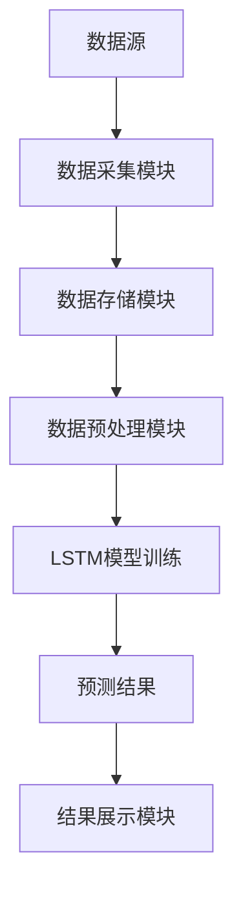

                 


# 彼得林奇的"价值投资"在加密货币时代的新思考

> 关键词：价值投资，加密货币，区块链，投资策略，风险管理，彼得·林奇

> 摘要：本文探讨了彼得·林奇的经典价值投资理论在加密货币时代的应用与演变。通过对加密货币市场的特点、价值评估模型、算法原理及系统架构的详细分析，结合实际项目案例，提出了一套适用于加密货币投资的价值投资新策略。文章还讨论了在加密货币环境下进行价值投资时的风险管理、技术挑战和未来发展方向。

---

# 第一部分: 价值投资的背景与核心理念

## 第1章: 价值投资的基本概念

### 1.1 价值投资的定义与核心思想

1.1.1 价值投资的定义与核心思想：
- 价值投资是一种投资策略，强调以低于其内在价值的价格购买优质资产。
- 彼得·林奇以其独特的“烟蒂股”策略闻名，注重寻找被市场低估的公司。

1.1.2 彼得·林奇的价值投资风格：
- 以基本面分析为核心，关注公司的财务状况、管理层能力和行业地位。
- 强调长期投资，避免短期市场波动的干扰。

1.1.3 价值投资在传统金融市场的应用：
- 成功应用于股票市场，帮助投资者实现长期稳定收益。

### 1.2 加密货币的兴起与特点

1.2.1 加密货币的基本概念：
- 加密货币是一种基于区块链技术的数字货币，具有去中心化、匿名性和不可篡改的特性。
- 其核心在于区块链技术的应用，通过分布式账本实现价值的转移和存储。

1.2.2 区块链技术与加密货币的关系：
- 区块链是加密货币的技术基础，确保了交易的安全性和透明性。
- 区块链的去中心化特性使得加密货币不受传统金融机构的控制。

1.2.3 加密货币市场的特点与风险：
- 市场波动剧烈，价格受供需关系和市场情绪影响较大。
- 市场参与者众多，包括机构投资者和散户，增加了市场的复杂性。
- 监管不确定性较高，不同国家对加密货币的政策差异显著。

### 1.3 价值投资与加密货币的结合

1.3.1 传统价值投资与加密货币投资的异同：
- 传统价值投资注重长期价值，而加密货币投资更关注技术发展和市场趋势。
- 传统投资市场的信息相对透明，而加密货币市场信息分散且难以获取。

1.3.2 加密货币市场中的价值投资机会：
- 区块链技术的广泛应用为价值投资提供了新的机遇。
- 加密货币项目的质量评估需要结合技术实现、团队背景和社区活跃度等因素。

1.3.3 价值投资在加密货币时代的挑战：
- 加密货币市场的波动性大，价值评估模型需要不断调整。
- 技术复杂性和市场参与者的多样性增加了投资决策的难度。

---

## 第2章: 加密货币市场的价值评估模型

### 2.1 传统价值投资的评估指标

2.1.1 PE、PB、PS等估值指标的定义与应用：
- PE（市盈率）= 股价 / 每股收益，用于评估股票的相对价值。
- PB（市净率）= 股价 / 每股净资产，衡量股票价格是否合理。
- PS（市销率）= 股价 / 每股收入，适用于成长型企业的估值。

2.1.2 估值指标的优缺点分析：
- PE和PB适用于成熟企业，而PS更适合成长型企业。
- 估值指标在不同市场环境下的表现差异显著，需结合具体情况使用。

### 2.2 加密货币的估值模型

2.2.1 基于技术分析的估值方法：
- 使用K线图、成交量分析等技术指标预测价格走势。
- 常见的技术分析工具包括移动平均线、RSI和MACD等。

2.2.2 基于基本面分析的估值方法：
- 评估项目的团队背景、技术实现和社区支持。
- 关注项目的市场定位、应用场景和发展潜力。

2.2.3 综合估值模型的设计与应用：
- 结合技术分析和基本面分析，构建一个多维度的评估体系。
- 使用加权评分法，赋予不同指标不同的权重，得出综合评分。

### 2.3 价值投资在加密货币中的新思考

2.3.1 加密货币市场的独特性与价值评估的挑战：
- 加密货币市场的参与者众多，信息分散，增加了评估的难度。
- 技术的快速迭代要求评估模型不断更新和调整。

2.3.2 如何将传统价值投资理念应用于加密货币：
- 重视项目的技术实现和团队背景，寻找具有长期发展潜力的项目。
- 结合市场趋势和政策变化，动态调整投资策略。

2.3.3

---

## 第3章: 价值投资的算法与系统架构

### 3.1 算法原理

3.1.1 算法设计：
- 使用时间序列分析预测加密货币价格走势。
- 结合机器学习模型（如LSTM）进行价格预测。

3.1.2 算法实现：
```python
import numpy as np
from sklearn.preprocessing import MinMaxScaler
from keras.layers import LSTM, Dense
from keras.models import Sequential

# 数据预处理
data = [...]  # 加密货币的历史价格数据
scaler = MinMaxScaler()
data_scaled = scaler.fit_transform(data)

# 划分训练集和测试集
train_data = data_scaled[:int(len(data_scaled) * 0.8)]
test_data = data_scaled[int(len(data_scaled) * 0.8):]

# 构建LSTM模型
model = Sequential()
model.add(LSTM(units=50, return_sequences=True, input_shape=(None, 1)))
model.add(Dense(1))
model.compile(optimizer='adam', loss='mean_squared_error')

# 训练模型
model.fit(train_data, epochs=100, batch_size=32)
```

3.1.3 算法优缺点分析：
- 时间序列分析适用于趋势预测，但对突变事件敏感。
- LSTM模型能够捕捉长期依赖关系，适合处理时间序列数据。

### 3.2 系统架构

3.2.1 系统功能设计：
- 数据采集模块：实时获取加密货币的市场数据。
- 模型训练模块：基于历史数据训练预测模型。
- 结果展示模块：可视化预测结果和投资建议。

3.2.2 系统架构图：


3.2.3 系统交互图：
```mermaid
sequenceDiagram
    participant 用户
    participant 系统
    用户 -> 系统: 请求投资建议
    系统 -> 数据采集模块: 获取市场数据
    数据采集模块 -> 数据预处理模块: 处理数据
    数据预处理模块 -> LSTM模型训练: 训练模型
    LSTM模型训练 -> 预测结果
    预测结果 -> 结果展示模块: 显示建议
    结果展示模块 -> 用户: 提供投资建议
```

---

## 第4章: 项目实战

### 4.1 项目背景与目标

4.1.1 项目背景：
- 选择比特币作为研究对象，分析其历史价格走势。
- 探讨其在价值投资中的应用潜力。

4.1.2 项目目标：
- 构建一个基于价值投资理念的比特币价格预测模型。
- 提供投资建议，帮助投资者做出决策。

### 4.2 核心实现

4.2.1 数据采集：
- 使用CoinMarketCap API获取比特币的历史价格数据。
- 数据范围：过去5年的每日收盘价。

4.2.2 模型实现：
- 使用LSTM模型预测未来的价格走势。
- 结合基本面分析，评估比特币的长期投资价值。

4.2.3 代码实现：
```python
import pandas as pd
import numpy as np
import matplotlib.pyplot as plt
from sklearn.preprocessing import MinMaxScaler
from keras.models import Sequential
from keras.layers import LSTM, Dense

# 数据加载
data = pd.read_csv('比特币历史数据.csv')
prices = data['收盘价'].values

# 数据预处理
scaler = MinMaxScaler()
prices_scaled = scaler.fit_transform(prices.reshape(-1, 1))

# 划分训练集和测试集
train_data = prices_scaled[:int(len(prices_scaled) * 0.8)]
test_data = prices_scaled[int(len(prices_scaled) * 0.8):]

# 构建LSTM模型
model = Sequential()
model.add(LSTM(units=50, return_sequences=True, input_shape=(None, 1)))
model.add(Dense(1))
model.compile(optimizer='adam', loss='mean_squared_error')

# 训练模型
model.fit(train_data, epochs=100, batch_size=32)

# 预测结果
predicted_prices = model.predict(test_data)
predicted_prices = scaler.inverse_transform(predicted_prices)

# 可视化
plt.plot(data['收盘价'], label='实际价格')
plt.plot(predicted_prices, label='预测价格')
plt.xlabel('时间')
plt.ylabel('价格')
plt.legend()
plt.show()
```

### 4.3 案例分析与总结

4.3.1 案例分析：
- 比特币在2020年和2021年的价格走势。
- 模型预测的准确性分析。

4.3.2 总结：
- 模型在预测比特币价格走势方面具有一定的准确性。
- 价值投资理念在加密货币市场中的应用需要结合技术分析和基本面分析。

---

## 第5章: 最佳实践与小结

### 5.1 最佳实践

5.1.1 投资策略：
- 长期持有优质加密货币项目，避免频繁交易。
- 分散投资，降低风险。

5.1.2 风险管理：
- 设定止损点，控制投资比例。
- 定期评估投资组合，及时调整。

### 5.2 小结

- 彼得·林奇的价值投资理念在加密货币时代仍具有重要的指导意义。
- 加密货币市场的独特性要求投资者不断更新和调整投资策略。
- 通过技术分析和基本面分析的结合，可以提高投资决策的准确性。

---

## 第6章: 注意事项与拓展阅读

### 6.1 注意事项

6.1.1 加密货币市场的波动性较大，投资者需保持警惕。
6.1.2 投资者应关注政策变化和市场动态，及时调整投资策略。
6.1.3 选择可靠的加密货币项目，避免投资骗局。

### 6.2 拓展阅读

6.2.1 推荐书籍：
- 《彼得·林奇的投资哲学》
- 《区块链入门与实战》
- 《加密货币投资指南》

6.2.2 推荐资源：
- 加密货币交易平台的教育资源。
- 区块链技术相关的在线课程。

---

# 结语

在加密货币时代，价值投资的理念和方法需要不断创新和调整。通过结合区块链技术、大数据分析和机器学习，投资者可以更好地把握市场脉动，实现稳健的投资收益。未来，随着技术的不断进步和市场的日益成熟，价值投资在加密货币领域将展现出更广阔的应用前景。

---

# 作者：AI天才研究院 & 禅与计算机程序设计艺术

---

这篇文章通过详细分析价值投资在加密货币时代的应用，结合实际项目案例，为投资者提供了新的思路和方法。希望读者能够通过本文，更好地理解和应用价值投资的理念，在加密货币市场中实现稳健的投资收益。

