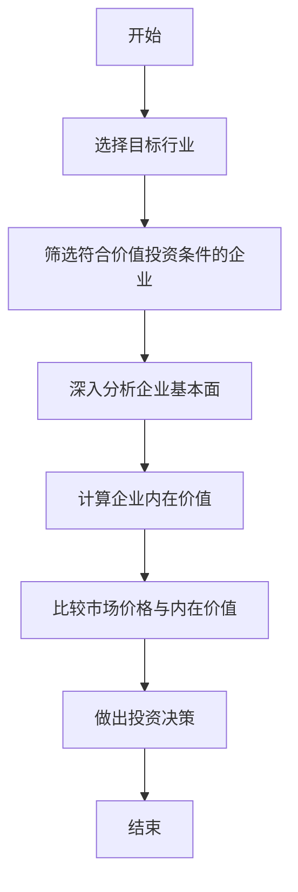
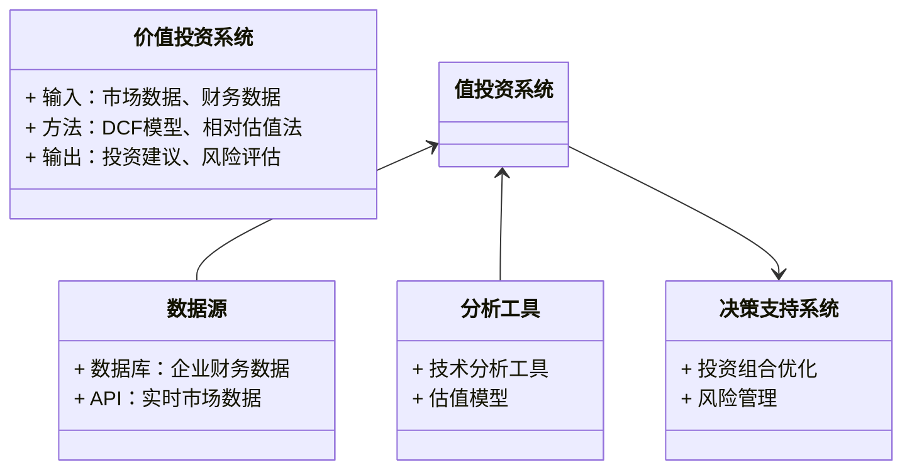
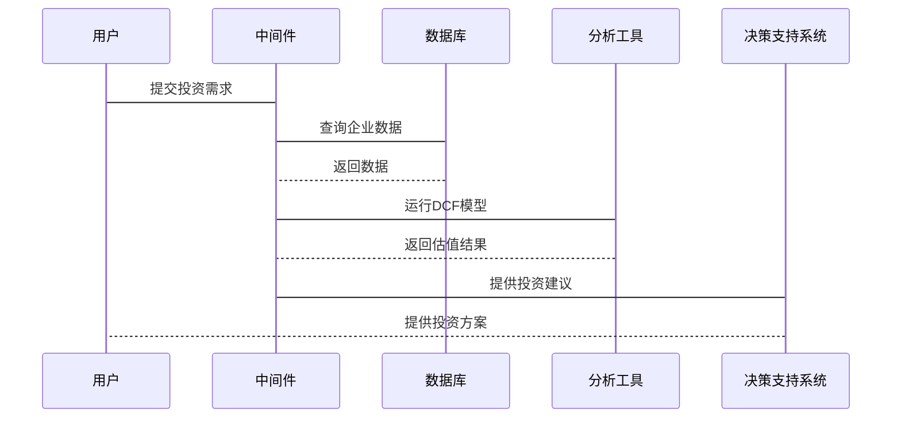

                 


# 彼得林奇的"价值投资"在数字经济时代的重新定义

> 关键词：价值投资，数字经济，彼得·林奇，投资策略，科技创新

> 摘要：本文探讨了彼得·林奇的价值投资理念在数字经济时代的新变化。通过分析数字经济的特点，重新定义了价值投资的核心要素，提出了在数字经济环境下进行价值投资的策略调整，包括企业评估模型的优化、新兴行业的投资机会识别，以及科技驱动的商业模式创新分析。文章结合实际案例，详细阐述了如何在数字经济中应用价值投资策略，为投资者提供了新的视角和方法。

---

## 第1章: 价值投资的背景与核心理念

### 1.1 价值投资的基本概念

#### 1.1.1 价值投资的定义
价值投资是一种以企业内在价值为核心的投资策略，强调通过分析企业的财务状况、行业地位和未来发展前景，寻找市场价格低于其内在价值的股票进行投资。其核心理念是“买入并持有”，追求长期稳定的收益。

#### 1.1.2 价值投资的核心原则
1. **安全边际原则**：以低于企业内在价值的价格买入股票。
2. **长期视角**：关注企业的长期发展，而非短期价格波动。
3. **基本面分析**：重点分析企业的财务报表、盈利能力、行业地位等因素。

#### 1.1.3 价值投资与数字经济的关联
随着数字经济的快速发展，企业的价值不再仅仅依赖于传统指标，如固定资产和有形资产，而是更多地受到无形资产（如技术、数据、品牌）和商业模式创新的影响。这要求价值投资者重新审视其评估方法，将这些新的因素纳入考量。

---

### 1.2 彼得·林奇的价值投资体系

#### 1.2.1 彼得·林奇的投资理念
彼得·林奇是价值投资的代表人物，他强调：
- **分散投资**：通过投资不同类型的企业分散风险。
- **深入研究**：对企业的商业模式、财务状况和竞争优势进行深入研究。
- **长期持有**：避免频繁交易，减少成本，获得复利效应。

#### 1.2.2 彼得·林奇的投资策略
- **行业分散**：投资于不同行业，避免过度集中。
- **价值挖掘**：寻找市场低估的企业，尤其是那些具有强大竞争优势的公司。
- **风险管理**：通过分散投资和严格的风险评估控制风险。

#### 1.2.3 彼得·林奇的成功案例分析
彼得·林奇在管理麦哲伦基金期间，通过深入研究企业基本面，成功投资于多家具有成长潜力的企业，如莲花软件和强生公司。这些案例展示了价值投资策略的有效性。

---

### 1.3 数字经济时代的投资新机遇

#### 1.3.1 数字经济的定义与特征
数字经济是以数据为关键生产要素，以数字技术为核心驱动力的经济形态。其主要特征包括：
- **数据驱动**：数据成为最重要的资产。
- **技术创新**：人工智能、大数据、区块链等技术广泛应用。
- **模式创新**：共享经济、平台经济等新兴商业模式崛起。

#### 1.3.2 数字经济时代的价值投资新特点
- **无形资产的重要性**：数据、品牌和技术成为企业价值的重要组成部分。
- **技术驱动的行业变化**：传统行业被数字化改造，新兴行业迅速崛起。
- **估值模型的调整**：传统的DCF模型需要结合科技企业的特性进行优化。

#### 1.3.3 数字经济对传统价值投资的挑战与机遇
挑战：
- 传统估值指标（如市盈率、市净率）在科技企业中可能失效。
- 数字经济中的企业具有高成长性和高波动性。

机遇：
- 新兴行业（如人工智能、云计算）提供了丰富的投资机会。
- 数字化转型的企业具备较高的增长潜力。

---

## 第2章: 价值投资的核心概念与数字经济的关系

### 2.1 价值投资的核心概念

#### 2.1.1 企业内在价值的定义
企业内在价值是基于其未来现金流的现值，反映了企业在未来创造收益的能力。公式如下：
$$ V = \sum_{t=1}^{\infty} \frac{CF_t}{(1 + r)^t} $$
其中，\( CF_t \) 是第t年的现金流，\( r \) 是折现率。

#### 2.1.2 股价与内在价值的关系
股价围绕内在价值波动，长期来看，股价会回归其内在价值。因此，价值投资者关注的是市场价格与内在价值的偏离。

#### 2.1.3 财务报表分析的核心指标
- 利润表：净利润、毛利率、研发投入。
- 资产负债表：资产结构、负债水平。
- 现金流量表：经营活动现金流、投资活动现金流。

---

### 2.2 数字经济时代的核心概念

#### 2.2.1 数字经济的主要驱动力
- **数据**：数据成为生产要素，驱动企业价值增长。
- **技术**：人工智能、大数据、区块链等技术的应用改变了商业模式。
- **网络效应**：平台经济的崛起，用户越多，价值越大。

#### 2.2.2 数字经济中的新兴行业
- **人工智能**：AI技术的应用为企业创造新价值。
- **云计算**：提供弹性计算资源，支持企业数字化转型。
- **物联网**：连接设备和数据，推动智能化发展。

#### 2.2.3 数字经济中的技术与商业模式创新
- 技术创新：如5G、AI等技术的应用。
- 商业模式创新：如订阅制、共享经济等。

---

### 2.3 价值投资与数字经济的联系

#### 2.3.1 数字经济如何影响企业价值评估
- 数据资产的评估：数据成为企业的重要资产，需要建立新的估值方法。
- 技术创新的影响：技术创新改变了企业的竞争优势和市场地位。

#### 2.3.2 数字经济中的投资机会分析
- 新兴行业：人工智能、大数据等领域具有高增长潜力。
- 数字化转型：传统产业通过数字化改造提升效率。

#### 2.3.3 数字经济时代的价值投资策略调整
- **关注技术创新**：投资于具有核心技术优势的企业。
- **数据驱动的估值**：利用大数据分析技术优化估值模型。
- **动态调整**：根据数字经济环境的变化及时调整投资策略。

---

## 第3章: 价值投资的算法原理与数学模型

### 3.1 价值投资的算法原理

#### 3.1.1 企业内在价值的计算方法
- **现金流折现法（DCF）**：通过预测未来现金流并进行折现，计算企业内在价值。
- **相对估值法**：通过比较企业与可比公司的估值指标（如PE、PB等）进行估值。

#### 3.1.2 股价与价值的偏离分析
- 计算股价与内在价值的偏离程度，判断投资机会。
- 使用技术分析工具辅助判断短期价格波动。

#### 3.1.3 投资决策的算法流程（Mermaid流程图）



---

### 3.2 数学模型与公式

#### 3.2.1 内在价值的计算公式
$$ V = \frac{CF}{(r - g)} $$
其中，\( CF \) 是现金流，\( r \) 是折现率，\( g \) 是增长率。

#### 3.2.2 股价与价值的关系公式
$$ P = \frac{V}{n} $$
其中，\( P \) 是股价，\( V \) 是内在价值，\( n \) 是市场参与度或流动性因素。

---

## 第4章: 系统分析与架构设计方案

### 4.1 问题场景介绍
在数字经济时代，价值投资者需要面对更多的数据源和复杂的技术环境，传统的估值模型和投资策略需要进行调整。

### 4.2 系统功能设计（领域模型Mermaid类图）



---

### 4.3 系统架构设计（Mermaid架构图）


---

### 4.4 系统交互设计（Mermaid序列图）



---

## 第5章: 项目实战

### 5.1 环境安装
- 安装Python编程环境。
- 安装相关库：Pandas、NumPy、Matplotlib。

### 5.2 核心实现源代码

```python
import pandas as pd
import numpy as np

def calculate_intrinsic_value(cash_flow, discount_rate, growth_rate):
    return cash_flow / (discount_rate - growth_rate)

def main():
    cash_flow = 1000000
    discount_rate = 0.1
    growth_rate = 0.05
    intrinsic_value = calculate_intrinsic_value(cash_flow, discount_rate, growth_rate)
    print(f"企业内在价值: {intrinsic_value:.2f}")

if __name__ == "__main__":
    main()
```

### 5.3 案例分析
以一家科技公司为例，分析其内在价值和投资机会。

---

## 第6章: 最佳实践与小结

### 6.1 最佳实践 tips
- **持续学习**：关注数字经济的新技术和新模式。
- **数据驱动**：利用大数据分析优化投资决策。
- **风险管理**：建立完善的风险控制体系。

### 6.2 小结
数字经济时代，价值投资的核心理念仍然适用，但需要结合新的经济环境和技术创新进行调整。投资者需要深入理解数字经济的特点，优化估值模型，抓住新兴行业的投资机会。

### 6.3 注意事项
- 避免盲目跟风，保持独立思考。
- 确保数据来源可靠，避免错误分析。
- 定期评估投资组合，及时调整策略。

### 6.4 拓展阅读
- 彼得·林奇的《价值投资入门》。
- 数字经济相关的书籍和报告。

---

## 作者：AI天才研究院/AI Genius Institute & 禅与计算机程序设计艺术 /Zen And The Art of Computer Programming

---

以上是《彼得林奇的"价值投资"在数字经济时代的重新定义》的技术博客文章，希望对您有所帮助！

