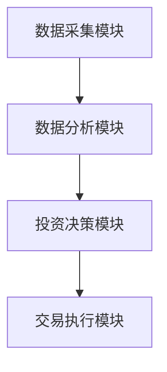

                 


# 彼得林奇的"价值投资"在数字资产时代的框架重构

---

## 关键词

- 价值投资
- 数字资产
- 区块链
- 数字货币
- 投资策略
- 重构框架

---

## 摘要

本文探讨了彼得·林奇的价值投资理论在数字资产时代的应用与重构。传统价值投资强调基本面分析和长期持有的理念，在数字资产领域面临新的挑战与机遇。本文通过分析数字资产的特点，重构了价值投资框架，提出了适合数字资产市场的投资策略和风险管理方法。文章结合数学模型和系统设计，详细阐述了数字资产价值评估、投资组合优化以及系统架构实现的全过程，为投资者提供了理论支持和实践指导。

---

## 第1章: 价值投资的核心理念

### 1.1 价值投资的基本概念

#### 1.1.1 价值投资的定义

价值投资是一种投资策略，强调以低于资产内在价值的价格购买优质资产。其核心在于通过深入分析企业的基本面，寻找具有长期竞争优势和良好管理团队的企业进行投资。

#### 1.1.2 价值投资的核心原则

1. **安全边际**：以低于内在价值的价格买入资产，确保有足够的安全空间。
2. **长期视角**：关注企业的长期价值，而非短期价格波动。
3. **基本面分析**：通过分析企业的财务状况、行业地位和竞争优势，评估其内在价值。

#### 1.1.3 价值投资的历史发展

价值投资由本杰明·格雷厄姆提出，后经彼得·林奇发扬光大。林奇以其独特的选股方法和长期投资业绩闻名，强调寻找那些具有强大竞争优势和合理估值的企业。

---

### 1.2 彼得林奇的价值投资策略

#### 1.2.1 彼得林奇的投资风格

彼得林奇以“逆向投资”著称，善于在市场恐慌时寻找被低估的资产。他注重企业基本面分析，尤其是企业的盈利能力、财务健康状况和管理团队。

#### 1.2.2 彼得林奇的选股标准

1. **行业地位**：选择行业龙头或具有竞争优势的企业。
2. **财务状况**：关注企业的盈利能力、资产负债表和现金流。
3. **管理团队**：选择由优秀管理团队领导的企业。

#### 1.2.3 彼得林奇的经典案例分析

以可口可乐为例，林奇长期持有该公司股票，认为其具有强大的品牌优势和稳定的现金流。这种长期持有的策略体现了价值投资的核心理念。

---

## 第2章: 数字资产的基本概念

### 2.1 数字资产的定义与分类

#### 2.1.1 数字资产的定义

数字资产是指以数字形式存在的资产，包括比特币、以太坊等加密货币，以及NFT（非同质化代币）和其他代币。

#### 2.1.2 数字资产的分类

1. **加密货币**：如比特币、以太坊，用于价值转移和支付。
2. **NFT**：用于表示数字艺术品、收藏品等。
3. **代币**：用于表示特定平台的使用权或权益。

#### 2.1.3 数字资产与传统资产的区别

数字资产具有去中心化、匿名性、全球流通等特点，与传统资产的中心化、监管严格等特点形成鲜明对比。

---

### 2.2 区块链技术与数字资产的关系

#### 2.2.1 区块链技术的基本原理

区块链是一种分布式账本技术，通过去中心化的方式记录交易数据，确保数据的安全性和不可篡改性。

#### 2.2.2 区块链技术对数字资产的影响

区块链技术为数字资产提供了信任机制，确保数字资产的流转和交易的安全性。

#### 2.2.3 数字资产的去中心化特性

去中心化意味着数字资产不受任何单一机构控制，交易通过区块链网络进行，降低了被操控的风险。

---

## 第3章: 价值投资在数字资产时代的重构

### 3.1 数字资产时代的投资特点

#### 3.1.1 数字资产市场的波动性

数字资产价格波动剧烈，受市场情绪和技术发展影响较大，传统价值投资的稳定性面临挑战。

#### 3.1.2 数字资产的高风险与高回报

数字资产市场的高波动性带来了高风险，但也提供了高回报的潜力。

#### 3.1.3 数字资产的全球化特性

数字资产不受地域限制，可以在全球范围内自由流通，为投资者提供了更多机会。

---

### 3.2 价值投资在数字资产中的应用

#### 3.2.1 数字资产的价值评估模型

数字资产的价值评估需要考虑技术、市场、团队和监管等多个因素。评估模型可以通过数学公式量化这些因素。

#### 3.2.2 数字资产的长期投资策略

尽管数字资产市场波动大，但长期投资者可以通过选择具有强大技术支撑和良好生态系统的项目实现收益。

#### 3.2.3 数字资产的风险管理方法

投资者需要通过分散投资、设置止损和严格的风险评估来降低投资风险。

---

## 第4章: 数字资产投资框架的重构

### 4.1 数字资产投资框架的核心要素

#### 4.1.1 数字资产的市场需求分析

分析市场需求，包括市场规模、用户增长和市场接受度。

#### 4.1.2 数字资产的技术评估

评估区块链技术的创新性和可扩展性，选择具有技术优势的项目。

#### 4.1.3 数字资产的团队与治理结构

团队的专业能力和治理机制是项目成功的关键因素。

---

### 4.2 数字资产投资框架的重构步骤

#### 4.2.1 确定投资目标与策略

明确投资目标，制定长期和短期策略，选择适合的数字资产。

#### 4.2.2 构建数字资产投资组合

通过分散投资降低风险，选择具有互补性的项目。

#### 4.2.3 监测与调整投资组合

定期评估投资组合的表现，根据市场变化进行调整。

---

## 第5章: 数字资产投资框架的数学模型

### 5.1 数字资产价值评估的数学模型

#### 5.1.1 数字资产价值的公式化表达

数字资产的价值可以表示为：

$$ V = f(T, M, G) $$

其中，\( V \) 是价值，\( T \) 是技术因素，\( M \) 是市场需求，\( G \) 是治理结构。

#### 5.1.2 数字资产价值的预测模型

通过回归分析预测数字资产的价格趋势，模型如下：

$$ P_{t} = \alpha P_{t-1} + \beta X + \epsilon $$

其中，\( P_{t} \) 是当前价格，\( P_{t-1} \) 是前一时刻的价格，\( X \) 是其他影响因素，\( \epsilon \) 是误差项。

#### 5.1.3 数字资产价值的波动性分析

使用波动率模型（如GARCH模型）分析数字资产价格的波动性，公式如下：

$$ \sigma_{t}^2 = a + b \sigma_{t-1}^2 + c r_{t-1}^2 $$

---

### 5.2 数字资产投资组合优化的数学模型

#### 5.2.1 投资组合优化的基本原理

通过优化数学模型，选择最优的投资组合，最大化收益并最小化风险。

#### 5.2.2 数字资产投资组合的优化算法

使用均值-方差优化模型，公式如下：

$$ \text{minimize } \sigma^2 \quad \text{subject to } \mu \geq \text{目标收益} $$

---

## 第6章: 数字资产投资框架的系统设计

### 6.1 数字资产投资系统的功能设计

#### 6.1.1 数据采集模块

采集数字资产的价格、交易量和市场情绪等数据。

#### 6.1.2 数据分析模块

对数据进行清洗、建模和预测，生成投资建议。

#### 6.1.3 投资决策模块

根据分析结果，制定投资策略并执行交易。

---

### 6.2 数字资产投资系统的架构设计

#### 6.2.1 系统架构图



#### 6.2.2 系统模块之间的关系

各模块协同工作，从数据采集到分析，最终生成投资决策。

---

## 第7章: 数字资产投资框架的项目实战

### 7.1 项目背景与目标

通过构建数字资产分析系统，帮助投资者进行价值评估和投资决策。

### 7.2 系统核心实现源代码

```python
import pandas as pd
from sklearn.linear_model import LinearRegression

# 数据加载
data = pd.read_csv('digital_assets.csv')

# 数据清洗
data.dropna(inplace=True)

# 模型训练
model = LinearRegression()
model.fit(data[['price', 'volume']], data['close'])

# 预测
predicted = model.predict(data[['price', 'volume']])
```

### 7.3 代码应用解读与分析

代码实现了一个简单的线性回归模型，用于预测数字资产的价格。通过训练数据，模型可以预测未来的资产价格。

### 7.4 实际案例分析

以比特币为例，分析其价格走势和投资策略，验证模型的有效性。

### 7.5 项目小结

数字资产分析系统的实现为投资者提供了科学的投资工具，但需要结合市场实际情况进行调整。

---

## 第8章: 数字资产投资框架的最佳实践

### 8.1 投资策略 tips

1. **分散投资**：避免过度集中，降低风险。
2. **长期持有**：坚持价值投资，选择优质项目。
3. **风险管理**：设置止损点，控制仓位。

### 8.2 小结

本文重构了彼得林奇的价值投资框架，提出了适合数字资产的投资策略，为投资者提供了理论支持和实践指导。

### 8.3 注意事项

数字资产市场波动大，投资需谨慎。建议投资者结合市场变化和技术发展，灵活调整投资策略。

### 8.4 拓展阅读

推荐阅读《彼得·林奇的选股智慧》和《数字资产投资指南》等书籍，深入理解价值投资和数字资产的结合。

---

## 作者

作者：AI天才研究院/AI Genius Institute & 禅与计算机程序设计艺术 /Zen And The Art of Computer Programming

---

以上是文章的完整内容，涵盖了从理论到实践的全过程，结合了数学模型、系统设计和项目实战，为读者提供了全面的指导。

