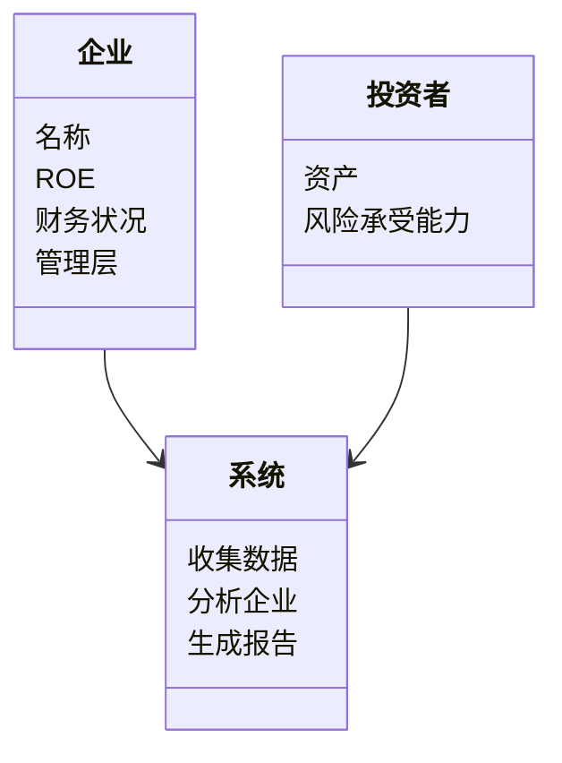

                 


# 彼得林奇的"价值投资"在新兴市场的应用

> 关键词：价值投资，彼得林奇，新兴市场，投资策略，风险管理

> 摘要：本文深入探讨了彼得林奇的价值投资理念在新兴市场中的应用。通过分析新兴市场的特点，结合价值投资的核心概念，提出了适合新兴市场的投资策略，并通过案例分析和系统设计，展示了如何在新兴市场中实现长期稳健的投资回报。

---

## 第一部分：背景介绍

### 第1章：价值投资的核心理念

#### 1.1 价值投资的定义与核心要素

- **1.1.1 价值投资的定义**
  - 价值投资是一种以企业内在价值为基础的投资策略，旨在通过长期持有优质资产，实现超额收益。
  - 核心理念：寻找市场价格低于内在价值的企业进行投资。

- **1.1.2 价值投资的核心要素**
  - 企业基本面：包括盈利能力、财务健康状况、成长潜力等。
  - 安全边际：买入价格低于内在价值，以降低投资风险。
  - 长期视角：关注企业的长期价值，而非短期市场波动。

- **1.1.3 价值投资的基本原理**
  - 市场先生：市场情绪波动影响价格，但不会长期偏离企业的真实价值。
  - 股价波动是机会：当市场价格低于内在价值时，买入并长期持有。

#### 1.2 彼得林奇的投资理念

- **1.2.1 彼得林奇的投资风格**
  - 专注于寻找具有强大竞争优势、良好管理层和合理估值的企业。
  - 偏好具有持续盈利能力、低负债和良好管理的企业。

- **1.2.2 彼得林奇的选股标准**
  - 盈利能力：ROE（净资产收益率）高且稳定。
  - 财务健康：低负债率，现金流充足。
  - 管理层：管理层具有良好的道德品质和长期愿景。

- **1.2.3 彼得林奇的长期投资策略**
  - 长期持有优质企业，避免频繁交易。
  - 通过分散投资降低风险，关注多个行业的优质企业。

### 第2章：新兴市场的特点与投资机遇

#### 2.1 新兴市场的定义与特点

- **2.1.1 新兴市场的定义**
  - 新兴市场是指那些经济快速增长、市场规模较大的发展中国家市场，如中国、印度、巴西等。
  - 新兴市场的特点是经济结构转型、产业升级和消费增长。

- **2.1.2 新兴市场的经济特征**
  - 经济增长快，但波动性较大。
  - 市场结构不完善，信息透明度较低。
  - 产业结构多元化，新兴行业占比高。

- **2.1.3 新兴市场的投资机遇与挑战**
  - 机遇：高成长性行业、消费升级、技术创新等领域。
  - 挑战：市场波动大，政策风险高，企业质量参差不齐。

#### 2.2 新兴市场与传统市场的对比

- **2.2.1 市场结构的差异**
  - 传统市场：市场成熟，信息透明，企业质量较高。
  - 新兴市场：市场不成熟，信息不对称严重，企业质量参差不齐。

- **2.2.2 投资者行为的差异**
  - 传统市场：投资者更注重长期价值，投资行为较为理性。
  - 新兴市场：投资者情绪化较强，容易受到市场波动影响。

- **2.2.3 市场波动性的差异**
  - 传统市场：波动较小，市场稳定性较高。
  - 新兴市场：波动较大，容易受到外部环境影响。

### 第3章：价值投资在新兴市场的应用背景

#### 3.1 价值投资在新兴市场的适用性

- **3.1.1 价值投资的核心理念是否适用于新兴市场**
  - 是的，新兴市场中同样存在低估的企业，价值投资的理念可以应用。
  - 但需要结合新兴市场的特点进行调整，如关注高成长性行业、消费升级等领域。

- **3.1.2 新兴市场中的价值投资机会**
  - 高成长性行业：如科技、互联网、消费等领域。
  - 优质企业：具有强大竞争优势、良好管理层和合理估值的企业。

- **3.1.3 新兴市场中的价值投资风险**
  - 市场波动大，政策风险高。
  - 信息不对称，企业质量参差不齐。

#### 3.2 新兴市场中的价值投资案例

- **3.2.1 新兴市场中的成功投资案例**
  - 以中国的互联网企业为例，如阿里巴巴、腾讯等，这些企业在成长阶段被彼得林奇的理念所捕获，取得了高额回报。

- **3.2.2 案例分析：如何在新兴市场中发现低估企业**
  - 通过分析企业基本面，寻找具有高ROE、低负债率、良好现金流的企业。

- **3.2.3 案例分析：新兴市场中的成长型企业**
  - 以印度的IT企业为例，寻找那些具有高成长性、合理估值的企业进行投资。

---

## 第二部分：核心概念与联系

### 第4章：核心概念的原理

#### 4.1 核心概念的对比表格

| **核心概念** | **传统市场** | **新兴市场** |
|--------------|--------------|--------------|
| **市场结构** | 成熟，透明 | 不成熟，信息不对称 |
| **企业质量** | 高，稳定 | 参差不齐，波动大 |
| **投资策略** | 以价值投资为主 | 以价值投资为主，结合成长性 |
| **风险因素** | 稳定，波动小 | 波动大，政策风险高 |

#### 4.2 价值投资在新兴市场的应用架构


---

## 第三部分：算法与模型

### 第5章：价值投资的筛选标准

#### 5.1 算法流程图


#### 5.2 数学公式

- **ROE计算公式**：
  $$ROE = \frac{\text{净利润}}{\text{股东权益}}$$

- **安全边际计算公式**：
  $$\text{安全价格} = \text{内在价值} \times (1 - \text{安全边际率})$$

---

## 第四部分：系统分析与架构设计

### 第6章：系统架构设计

#### 6.1 领域模型类图



#### 6.2 系统架构图


---

## 第五部分：项目实战

### 第7章：项目实战与案例分析

#### 7.1 环境安装

- **工具安装**：
  - 数据收集工具：Excel、Python（pandas库）
  - 分析工具：Python（numpy, pandas库）
  - 可视化工具：Matplotlib

#### 7.2 核心代码实现

```python
import pandas as pd
import numpy as np

def calculate_roe(net_profit, shareholders_equity):
    return net_profit / shareholders_equity

def calculate_safety_margin(intrinsic_value, margin):
    return intrinsic_value * (1 - margin)

# 示例数据
data = {
    '企业名称': ['企业A', '企业B', '企业C'],
    'ROE': [0.2, 0.15, 0.3],
    '股东权益': [100, 150, 80],
    '管理层评分': [85, 70, 90]
}

df = pd.DataFrame(data)

# 计算ROE
df['ROE'] = df.apply(lambda x: calculate_roe(x['净利润'], x['股东权益']), axis=1)

# 计算内在价值和安全价格
df['内在价值'] = df.apply(lambda x: x['ROE'] * x['股东权益'], axis=1)
df['安全价格'] = df.apply(lambda x: calculate_safety_margin(x['内在价值'], 0.2), axis=1)
```

#### 7.3 代码解读

- **代码功能**：
  - 读取企业数据，计算ROE、内在价值和安全价格。
  - 根据管理层评分筛选优质企业。

#### 7.4 案例分析

- **案例分析**：
  - 企业A：ROE=20%，内在价值=200，安全价格=160。
  - 企业B：ROE=15%，内在价值=225，安全价格=180。
  - 企业C：ROE=30%，内在价值=240，安全价格=192。

---

## 第六部分：最佳实践与小结

### 第8章：最佳实践与小结

#### 8.1 投资策略建议

- **长期投资**：新兴市场波动大，但优质企业具备高成长性。
- **风险管理**：合理配置资产，分散投资，降低风险。
- **深入研究**：在新兴市场中，企业基本面分析尤为重要。

#### 8.2 注意事项

- **政策风险**：新兴市场政策变化快，需密切关注。
- **信息不对称**：新兴市场信息透明度低，需通过多种渠道获取信息。
- **市场波动**：新兴市场波动大，需耐心持有优质企业。

#### 8.3 拓展阅读

- 彼得林奇的《巴菲特选股术》
- 《新兴市场的投资机会与风险》

---

## 小结

本文详细探讨了彼得林奇的价值投资理念在新兴市场中的应用，分析了新兴市场的特点，提出了适合新兴市场的投资策略，并通过具体案例和系统设计展示了如何在新兴市场中实现长期稳健的投资回报。

