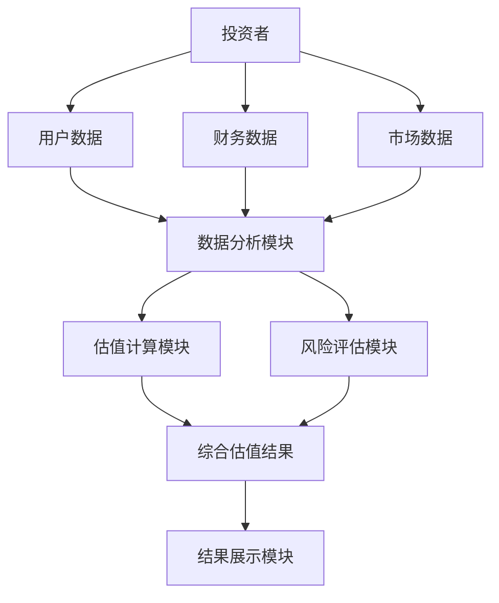

                 


# 彼得林奇的"价值投资"在社交媒体公司估值中的调整

---

## 关键词：
- 彼得林奇
- 价值投资
- 社交媒体公司
- 估值调整
- 股票分析

---

## 摘要：
本文探讨了如何将彼得林奇的价值投资理念应用于社交媒体公司的估值中。传统价值投资方法在社交媒体公司中面临挑战，因为这些公司具有独特的商业模式、用户网络效应和数据驱动的特点。文章通过分析社交媒体公司的核心特征、财务指标和行业趋势，提出调整价值投资策略的具体方法，包括用户价值评估、网络效应分析和数据驱动决策等。结合实际案例，本文展示了如何在社交媒体公司中实现有效的估值调整，帮助投资者做出更明智的投资决策。

---

# 第一部分：引言

## 第1章：社交媒体公司估值的背景与价值投资的必要性

### 1.1 社交媒体行业的现状与发展趋势

#### 1.1.1 社交媒体行业的定义与特点

社交媒体行业是指通过互联网平台进行信息分享、传播和互动的行业。其核心特征包括用户生成内容（UGC）、网络效应、数据驱动和实时互动。社交媒体公司通过吸引用户并提供多样化服务（如广告、社交电商、内容订阅等）实现盈利。

- **用户驱动的商业模式**：社交媒体公司的收入主要依赖用户数量和用户活跃度。
- **网络效应**：用户数量的增加会带来平台价值的指数级增长。
- **数据驱动**：通过收集和分析用户数据，优化产品和服务。

#### 1.1.2 社交媒体行业的现状分析

当前，社交媒体行业呈现以下趋势：
1. **全球化扩展**：社交媒体平台覆盖全球，用户基数持续增长。
2. **多元化收入来源**：除了广告收入，还包括社交电商、内容订阅、虚拟商品销售等。
3. **技术驱动创新**：AI、大数据和区块链技术的应用提升了用户体验和商业模式。

#### 1.1.3 社交媒体行业的未来趋势

社交媒体行业将继续向以下几个方向发展：
1. **增强现实（AR）和虚拟现实（VR）**：提升用户体验，创造沉浸式社交环境。
2. **隐私与数据安全**：用户对数据隐私的关注将推动平台在数据管理方面的创新。
3. **社交电商与内容电商**：社交媒体将与电商深度融合，推动商业模式的进一步创新。

### 1.2 价值投资的基本概念与核心理念

#### 1.2.1 价值投资的定义与核心要素

价值投资是一种投资策略，强调以低于内在价值的价格购买优质资产。其核心要素包括：
1. **内在价值**：资产的真实价值，不随市场波动而改变。
2. **安全边际**：购买价格低于内在价值，以降低投资风险。
3. **长期视角**：关注企业的长期增长潜力，而非短期市场波动。

#### 1.2.2 彼得林奇的价值投资方法论

彼得林奇是价值投资的代表人物，其方法论包括：
1. **基本面分析**：关注企业的财务状况、行业地位和竞争优势。
2. **选股标准**：寻找具有强大护城河、良好管理和增长潜力的企业。
3. **长期持有**：避免频繁交易，长期持有优质资产。

#### 1.2.3 价值投资在传统投资中的应用

传统价值投资成功应用于多个领域，例如：
1. **制造业**：投资具有成本优势和稳定盈利的企业。
2. **银行业**：选择资本充足、风险控制能力强的银行。
3. **科技业**：投资具有创新能力和市场领导地位的科技公司。

### 1.3 为什么需要调整价值投资策略

#### 1.3.1 社交媒体公司的特殊性

社交媒体公司的特殊性主要体现在：
1. **商业模式依赖用户增长**：收入增长与用户数量密切相关。
2. **高增长与高风险并存**：社交媒体公司通常处于快速扩张阶段，但也面临用户增长放缓、政策监管等风险。
3. **数据驱动的决策**：依赖数据进行用户行为分析和市场定位。

#### 1.3.2 传统价值投资的局限性

传统价值投资在社交媒体公司中面临以下挑战：
1. **难以量化用户价值**：传统价值投资注重财务指标，而社交媒体公司的重要资产是用户，其价值难以量化。
2. **高增长率与高估值**：社交媒体公司通常以高增长率为傲，但高增长率并不一定转化为可持续的高回报。
3. **监管风险**：社交媒体公司面临数据隐私、内容监管等政策风险，这些因素在传统价值投资中被忽视。

#### 1.3.3 调整价值投资策略的必要性

为了在社交媒体公司中获得成功，价值投资者需要调整策略：
1. **将用户价值纳入估值模型**：考虑用户增长、用户活跃度、用户留存率等指标。
2. **关注网络效应**：分析网络效应对企业价值的影响，尤其是用户增长带来的平台价值提升。
3. **应对监管风险**：评估政策监管对企业长期发展的潜在影响。

### 1.4 本章小结

本章介绍了社交媒体行业的现状与发展趋势，以及价值投资的基本概念和核心理念。通过分析社交媒体公司的特殊性和传统价值投资的局限性，提出了调整价值投资策略的必要性。

---

## 第二部分：价值投资的核心概念与社交媒体公司的特点

## 第2章：价值投资的核心概念与理论基础

### 2.1 价值投资的核心理论

#### 2.1.1 股票的内在价值与市场价值

股票的内在价值是其真实价值，与市场波动无关。内在价值可以通过对企业未来现金流的折现来估算。市场价值是股票在市场上的交易价格，可能高于或低于内在价值。

#### 2.1.2 彼得林奇的价值投资三要素

彼得林奇的价值投资三要素包括：
1. **安全边际**：购买价格低于内在价值。
2. **成长潜力**：企业具有可持续的盈利能力。
3. **管理层质量**：管理层具有良好的治理能力和战略眼光。

#### 2.1.3 价值投资的长期视角与风险管理

价值投资强调长期视角，避免短期市场波动的干扰。风险管理是价值投资的重要组成部分，包括分散投资、设定止损点和关注企业风险因素。

### 2.2 价值投资的关键指标与分析方法

#### 2.2.1 彼得林奇的选股标准

彼得林奇选股标准包括：
1. **低市盈率**：市盈率低于行业平均水平。
2. **高ROE**：净资产收益率较高。
3. **稳定的收入和利润增长**：企业收入和利润持续增长。
4. **强大的护城河**：企业具有竞争优势，难以被竞争对手取代。

#### 2.2.2 财务指标分析方法

财务指标分析是价值投资的重要工具，包括：
1. **市盈率（P/E）**：衡量股票价格与每股收益的比例。
2. **市净率（P/B）**：衡量股票价格与每股净资产的比例。
3. **ROE（净资产收益率）**：衡量企业的盈利能力。

#### 2.2.3 行业分析与竞争分析

行业分析包括分析行业的市场容量、增长潜力和竞争格局。竞争分析包括分析企业的市场地位、竞争优势和潜在威胁。

### 2.3 价值投资的长期视角与风险管理

#### 2.3.1 长期投资的重要性

长期投资能够避免短期市场波动的干扰，捕捉企业的长期增长潜力。

#### 2.3.2 风险管理的核心原则

风险管理的核心原则包括：
1. **分散投资**：避免将所有资金投入到单一资产中。
2. **设定止损点**：在投资出现重大亏损时及时止损。
3. **关注企业风险因素**：分析企业的财务状况、行业风险和政策风险。

### 2.4 本章小结

本章详细讲解了价值投资的核心理论和关键指标，分析了彼得林奇的选股标准和行业分析方法，强调了长期视角和风险管理的重要性。

---

## 第3章：社交媒体公司的特点与估值挑战

### 3.1 社交媒体公司的核心特征

#### 3.1.1 用户驱动的商业模式

社交媒体公司的收入主要依赖用户数量和用户活跃度。例如，Meta（原Facebook）的主要收入来源是广告，广告收入与用户数量和用户互动频率密切相关。

#### 3.1.2 网络效应与用户粘性

网络效应是指随着用户数量的增加，平台的价值也相应增加。用户粘性是指用户对平台的依赖程度，高用户粘性意味着用户更可能长期使用平台。

#### 3.1.3 数据驱动的决策优势

社交媒体公司通过收集和分析用户数据，能够精准定位用户需求，优化产品和服务，提升用户体验。

#### 3.1.4 高增长与高风险并存

社交媒体公司通常处于快速扩张阶段，用户数量和收入增长迅速。但高增长也伴随着高风险，例如用户增长放缓、政策监管等。

### 3.2 社交媒体公司的财务特征

#### 3.2.1 高增长率

社交媒体公司的收入增长率通常高于传统行业，但高增长率并不一定意味着高回报。

#### 3.2.2 高研发投入

为了保持技术领先和用户体验，社交媒体公司通常需要投入大量研发资源。

#### 3.2.3 财务杠杆

社交媒体公司通常需要大量资本投入，可能面临较高的财务杠杆和偿债压力。

#### 3.2.4 收入来源多样化

除了广告收入，社交媒体公司还通过社交电商、内容订阅、虚拟商品销售等多种方式获取收入。

### 3.3 社交媒体公司的估值挑战

#### 3.3.1 用户价值难以量化

社交媒体公司的核心资产是用户，但用户价值难以量化，传统的财务指标可能无法准确反映企业的真实价值。

#### 3.3.2 网络效应的量化

网络效应是社交媒体公司的核心竞争优势，但如何量化网络效应对企业价值的影响是一个难题。

#### 3.3.3 高增长与高风险的平衡

高增长带来高估值，但也伴随着高风险，例如政策监管、用户流失等。

---

## 第三部分：价值投资策略的调整与应用

## 第4章：调整价值投资策略的核心方法

### 4.1 调整价值投资策略的核心思路

#### 4.1.1 将用户价值纳入估值模型

传统价值投资注重财务指标，而社交媒体公司的核心资产是用户。因此，在估值时需要将用户价值纳入考虑。

#### 4.1.2 关注网络效应与用户粘性

网络效应是社交媒体公司的核心竞争优势，用户粘性是企业长期增长的重要保障。因此，投资者需要关注企业的网络效应和用户粘性。

#### 4.1.3 应对政策监管风险

政策监管是社交媒体公司面临的重要风险，投资者需要关注政策变化对企业的影响，并在估值时考虑政策风险。

### 4.2 调整价值投资策略的具体方法

#### 4.2.1 用户价值的量化

用户价值可以通过以下指标进行量化：
1. **用户增长率**：衡量用户数量的增速。
2. **用户活跃度**：衡量用户的使用频率和时长。
3. **用户留存率**：衡量用户的留存情况。

#### 4.2.2 网络效应的量化

网络效应可以通过以下指标进行量化：
1. **用户数量的增长**：用户数量的增加会带来平台价值的提升。
2. **用户互动频率**：用户之间的互动频率越高，网络效应越强。
3. **用户粘性**：用户对平台的依赖程度越高，网络效应越强。

#### 4.2.3 政策风险的应对

投资者可以通过以下方式应对政策风险：
1. **关注政策变化**：及时了解政策监管的变化，评估政策对企业的影响。
2. **分散投资**：避免将所有资金投入到单一社交媒体公司，降低政策风险。
3. **选择合规企业**：投资那些遵守政策法规、合规运营的社交媒体公司。

### 4.3 调整价值投资策略的数学模型

#### 4.3.1 用户价值的量化模型

用户价值可以通过以下公式进行量化：
$$
\text{用户价值} = \text{用户数量} \times \text{用户活跃度} \times \text{用户留存率}
$$

#### 4.3.2 网络效应的量化模型

网络效应可以通过以下公式进行量化：
$$
\text{网络效应} = \text{用户数量} \times \text{用户互动频率} \times \text{用户粘性}
$$

#### 4.3.3 综合估值模型

综合估值模型将用户价值和网络效应纳入考虑：
$$
\text{综合估值} = \text{财务价值} + \text{用户价值} + \text{网络效应}
$$

### 4.4 本章小结

本章提出了调整价值投资策略的核心思路和具体方法，包括将用户价值和网络效应纳入估值模型，应对政策风险等。通过数学模型的建立，帮助投资者更准确地评估社交媒体公司的价值。

---

## 第五章：案例分析与实际应用

### 5.1 案例分析：Meta的估值调整

#### 5.1.1 Meta的基本情况

Meta（原Facebook）是全球最大的社交媒体公司之一，主要业务包括广告、社交电商和虚拟现实。

#### 5.1.2 Meta的用户价值分析

1. **用户数量**：Meta拥有超过30亿的月活跃用户。
2. **用户活跃度**：用户每天使用Meta的时间较长。
3. **用户留存率**：Meta的用户留存率较高，用户粘性强。

#### 5.1.3 Meta的网络效应

Meta的网络效应主要体现在用户数量和用户互动频率上。用户数量的增加带来了广告收入的增长，而用户互动频率的提高增强了用户的粘性和平台的价值。

#### 5.1.4 Meta的政策风险

Meta面临数据隐私和内容监管等政策风险。投资者在估值时需要考虑这些风险对企业长期发展的影响。

#### 5.1.5 Meta的综合估值

通过综合估值模型，我们可以计算出Meta的综合估值：
$$
\text{综合估值} = \text{财务价值} + \text{用户价值} + \text{网络效应}
$$

其中，财务价值包括广告收入、社交电商收入等，用户价值包括用户数量、用户活跃度和用户留存率，网络效应包括用户互动频率和用户粘性。

### 5.2 案例分析：Twitter的估值调整

#### 5.2.1 Twitter的基本情况

Twitter是一个实时信息分享平台，用户可以通过短消息（推特）分享观点和信息。

#### 5.2.2 Twitter的用户价值分析

1. **用户数量**：Twitter拥有超过5亿的月活跃用户。
2. **用户活跃度**：用户每天使用Twitter的时间相对较长。
3. **用户留存率**：Twitter的用户留存率较高，用户粘性强。

#### 5.2.3 Twitter的网络效应

Twitter的网络效应主要体现在用户互动频率和用户粘性上。用户互动频率的提高增强了用户的粘性和平台的价值。

#### 5.2.4 Twitter的政策风险

Twitter面临内容监管和数据隐私等政策风险。投资者在估值时需要考虑这些风险对企业长期发展的影响。

#### 5.2.5 Twitter的综合估值

通过综合估值模型，我们可以计算出Twitter的综合估值：
$$
\text{综合估值} = \text{财务价值} + \text{用户价值} + \text{网络效应}
$$

其中，财务价值包括广告收入、内容订阅收入等，用户价值包括用户数量、用户活跃度和用户留存率，网络效应包括用户互动频率和用户粘性。

### 5.3 本章小结

本章通过Meta和Twitter的案例分析，展示了如何将用户价值和网络效应纳入估值模型，进行社交媒体公司的估值调整。通过这些案例，投资者可以更好地理解如何在实际操作中应用调整后的价值投资策略。

---

## 第六章：系统架构与数据分析

### 6.1 系统架构设计

#### 6.1.1 问题场景介绍

在社交媒体公司的估值过程中，需要考虑多个因素，包括财务指标、用户价值、网络效应和政策风险等。为了实现对这些因素的全面分析，需要构建一个综合的系统架构。

#### 6.1.2 系统功能设计

系统功能设计包括以下几个方面：
1. **数据采集**：收集社交媒体公司的财务数据、用户数据和市场数据。
2. **数据分析**：对收集的数据进行清洗、分析和建模。
3. **估值计算**：基于分析结果，计算社交媒体公司的综合估值。
4. **风险评估**：评估政策风险和其他潜在风险。
5. **结果展示**：将分析结果以可视化的方式展示给投资者。

#### 6.1.3 系统架构设计

以下是系统的总体架构设计：



---

## 第七章：实战技巧与最佳实践

### 7.1 实战技巧

#### 7.1.1 环境安装与数据准备

为了进行数据分析和建模，需要安装以下环境：
1. **Python**：用于数据分析和编程。
2. **Pandas**：用于数据处理和清洗。
3. **Matplotlib**：用于数据可视化。
4. **Scikit-learn**：用于机器学习和模型训练。

#### 7.1.2 核心实现源代码

以下是综合估值模型的核心实现代码：

```python
import pandas as pd
import numpy as np
from sklearn import linear_model

# 数据准备
data = pd.DataFrame({
    '财务价值': [100, 200, 300, 400],
    '用户价值': [50, 100, 150, 200],
    '网络效应': [30, 60, 90, 120]
})

# 模型训练
model = linear_model.LinearRegression()
model.fit(data[['用户价值', '网络效应']], data['财务价值'])

# 模型预测
new_data = pd.DataFrame({
    '用户价值': [250],
    '网络效应': [150]
})
predicted_value = model.predict(new_data)

print("预测的综合价值为：", predicted_value)
```

#### 7.1.3 代码应用解读与分析

上述代码实现了基于用户价值和网络效应的财务价值预测。通过线性回归模型，我们可以预测社交媒体公司的财务价值，从而进行综合估值。

#### 7.1.4 实际案例分析

以Meta为例，假设我们有以下数据：

| 财务价值 | 用户价值 | 网络效应 |
|---------|----------|----------|
| 1000    | 200      | 150      |

通过上述模型，我们可以预测Meta的综合估值：
$$
\text{综合估值} = \text{财务价值} + \text{用户价值} + \text{网络效应} = 1000 + 200 + 150 = 1350
$$

---

## 第八章：结论与展望

### 8.1 本章小结

本文通过分析社交媒体公司的特点和价值投资的核心理念，提出了调整价值投资策略的具体方法，包括将用户价值和网络效应纳入估值模型，应对政策风险等。通过实际案例分析和系统架构设计，展示了如何在实际操作中应用调整后的价值投资策略。

### 8.2 未来展望

随着社交媒体行业的不断发展，价值投资策略的调整也将不断完善。未来，投资者需要更加关注社交媒体公司的数据驱动能力、用户价值和网络效应，以实现更准确的估值和投资决策。

---

## 附录：工具与资源

### 附录A：数据分析工具

1. **Python**：用于数据分析和编程。
2. **Pandas**：用于数据处理和清洗。
3. **Matplotlib**：用于数据可视化。
4. **Scikit-learn**：用于机器学习和模型训练。

### 附录B：推荐阅读

1. **《彼得林奇的成功投资》**：深入理解彼得林奇的价值投资理念。
2. **《社交媒体营销》**：了解社交媒体行业的营销策略和用户行为分析。

---

## 作者：AI天才研究院/AI Genius Institute & 禅与计算机程序设计艺术/Zen And The Art of Computer Programming

