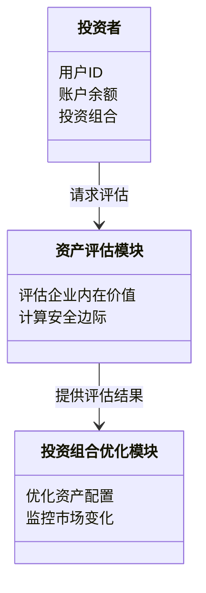
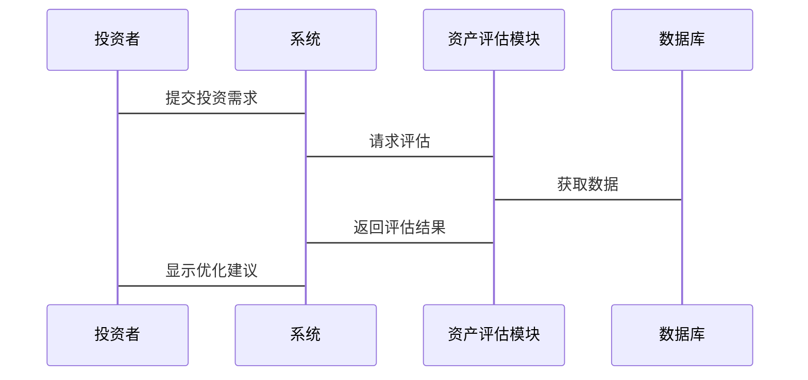

                 


# 彼得林奇的"价值投资"在负利率环境下的调整

> 关键词：价值投资，负利率环境，投资策略，现金流折现模型，投资决策支持系统

> 摘要：本文详细探讨了彼得林奇的价值投资理念在负利率环境下的调整策略，分析了传统价值投资方法在负利率条件下的挑战与机遇，提出了基于现金流折现模型的调整方法，并通过系统架构设计和实际案例分析，为投资者提供了一套在负利率环境下优化投资决策的解决方案。

---

## 第一部分: 背景介绍

### 第1章: 价值投资与负利率环境概述

#### 1.1 价值投资的基本概念

##### 1.1.1 价值投资的定义
价值投资是一种以企业内在价值为核心的投资策略，强调以低于内在价值的价格买入优质资产。彼得林奇作为价值投资的代表人物，认为投资的本质是寻找那些被市场低估的公司，并长期持有。

##### 1.1.2 价值投资的核心理念
- **安全边际**：买入价格低于内在价值，以降低投资风险。
- **长期视角**：关注企业的基本面，寻找具有持续竞争优势的企业。
- **逆向思维**：在市场恐慌时寻找机会，在市场狂热时保持冷静。

##### 1.1.3 价值投资的适用场景
价值投资适用于市场周期性波动、企业基本面稳定、具有长期竞争优势的行业和企业。

#### 1.2 负利率环境的现状

##### 1.2.1 负利率的定义
负利率是指中央银行设定的基准利率为负值，目的是鼓励银行贷款和投资，刺激经济增长。

##### 1.2.2 全球负利率环境的现状
近年来，全球多国央行实施负利率政策，尤其是在欧洲和日本等地区，负利率已成为常态。

##### 1.2.3 负利率对经济的影响
- 刺激借贷和投资。
- 降低储蓄意愿，推动消费。
- 导致债券收益率下降，增加债券投资的风险。

#### 1.3 价值投资在负利率环境下的调整必要性

##### 1.3.1 负利率对传统价值投资策略的影响
负利率环境下，债券收益率为负，传统价值投资中对债券的投资逻辑需要调整。

##### 1.3.2 调整价值投资策略的背景与动机
- 应对负利率对资产估值的影响。
- 寻找新的投资机会，优化投资组合。

##### 1.3.3 负利率环境下的投资机会与风险
- 机会：低利率环境下，优质企业的估值可能上升。
- 风险：高负债企业面临更大的偿债压力，投资风险增加。

---

## 第二部分: 核心概念与联系

### 第2章: 价值投资与负利率环境的核心概念

#### 2.1 核心概念与联系

##### 2.1.1 价值投资的核心要素
- 企业内在价值：现金流折现模型（DCF）评估。
- 安全边际：买入价格低于内在价值。
- 长期视角：关注企业的竞争优势和成长性。

##### 2.1.2 负利率环境的核心特征
- 债券收益率为负，导致债券投资的吸引力下降。
- 刺激借贷和投资，推动经济增长。

##### 2.1.3 两者之间的关联性分析
负利率环境下，价值投资的内在价值评估需要考虑利率变化对现金流折现的影响。

#### 2.2 价值投资与负利率环境的对比分析

##### 2.2.1 价值投资与负利率环境的异同点
| 要素 | 价值投资 | 负利率环境 |
|------|-----------|------------|
| 核心目标 | 寻找被低估的资产 | 刺激经济和投资 |
| 影响因素 | 企业基本面、市场情绪 | 利率政策、经济周期 |

##### 2.2.2 价值投资在负利率环境下的优劣势
- **优势**：长期视角和安全边际策略在寻找优质企业方面仍有效。
- **劣势**：传统债券投资逻辑失效，需要调整资产配置策略。

##### 2.2.3 价值投资与负利率环境的相互作用
负利率环境下，价值投资者需要重新评估资产的内在价值，尤其是债券和股票的相对吸引力。

---

## 第三部分: 算法原理讲解

### 第3章: 价值投资与负利率环境的算法原理

#### 3.1 价值投资的评估方法

##### 3.1.1 现金流折现模型（DCF）
DCF模型是评估企业内在价值的核心工具，公式如下：

$$
\text{内在价值} = \sum_{t=1}^{n} \frac{\text{现金流}_t}{(1 + r)^t} + \frac{\text{终值}}{(1 + r)^n}
$$

其中，$r$是折现率，通常基于市场无风险利率和企业风险溢价。

##### 3.1.2 在负利率环境下的调整
在负利率环境下，折现率$r$可能为负值，导致DCF模型的计算结果出现异常。此时需要调整折现率的计算方式，例如考虑市场实际利率和风险溢价的结合。

#### 3.2 负利率环境下的投资策略调整

##### 3.2.1 现金流折现模型的调整
在负利率环境下，折现率的计算需要考虑以下因素：
- 市场实际利率可能为负。
- 风险溢价的调整。

##### 3.2.2 投资组合优化
在负利率环境下，投资组合需要重新平衡股票和债券的比例，以应对债券收益率下降的风险。

#### 3.3 价值投资算法的实现步骤

##### 3.3.1 数据收集
收集目标企业的财务数据和市场数据。

##### 3.3.2 模型计算
使用DCF模型计算企业的内在价值。

##### 3.3.3 策略调整
根据负利率环境下的市场变化，调整投资策略。

---

## 第四部分: 系统分析与架构设计

### 第4章: 投资决策支持系统架构

#### 4.1 问题场景介绍
在负利率环境下，投资者需要一个能够实时评估企业内在价值和优化投资组合的系统。

#### 4.2 系统功能设计

##### 4.2.1 领域模型
使用Mermaid类图描述系统的领域模型：



#### 4.3 系统架构设计

##### 4.3.1 模块划分
- 用户界面模块
- 资产评估模块
- 投资组合优化模块
- 数据库模块

#### 4.4 接口设计
- 用户输入接口：接收投资者的投资需求。
- 数据接口：获取市场数据和企业财务数据。
- 输出接口：显示评估结果和优化建议。

#### 4.5 交互流程

##### 4.5.1 投资者使用流程


---

## 第五部分: 项目实战

### 第5章: 项目实现与案例分析

#### 5.1 环境安装

##### 5.1.1 安装Python
安装Python 3.8或更高版本。

##### 5.1.2 安装依赖库
安装numpy、pandas、scikit-learn等库。

#### 5.2 核心代码实现

##### 5.2.1 DCF模型实现
```python
import numpy as np

def discounted_cash_flow(cash_flows, discount_rate, terminal_value):
    n = len(cash_flows)
    present_value = 0
    for t in range(n):
        present_value += cash_flows[t] / (1 + discount_rate)**t
    present_value += terminal_value / (1 + discount_rate)**n
    return present_value

# 示例：计算某企业的内在价值
cash_flows = [100, 150, 200, 250]
discount_rate = 0.05
terminal_value = 1000
intrinsic_value = discounted_cash_flow(cash_flows, discount_rate, terminal_value)
print(f"企业内在价值为：{intrinsic_value:.2f}")
```

##### 5.2.2 资产评估模块实现
```python
import pandas as pd

def assess_asset(value, risk_free_rate, market_return):
    beta = 1.2
    risk溢价 = market_return - risk_free_rate
    required_return = risk_free_rate + beta * risk溢价
    return required_return

# 示例：计算折现率
risk_free_rate = 0.0
market_return = 0.05
required_return = assess_asset(1, 0.05, 0.05)
print(f"折现率为：{required_return:.2f}")
```

#### 5.3 案例分析
以某科技公司为例，使用DCF模型计算其内在价值，并根据负利率环境调整投资策略。

---

## 第六部分: 最佳实践与小结

### 第6章: 最佳实践与小结

#### 6.1 最佳实践

##### 6.1.1 投资者注意事项
- 定期评估投资组合，根据市场变化调整策略。
- 保持长期视角，避免短期波动的干扰。

##### 6.1.2 系统使用建议
- 定期更新市场数据，确保评估结果的准确性。
- 根据个人风险承受能力调整投资组合。

#### 6.2 小结
本文详细探讨了彼得林奇的价值投资理念在负利率环境下的调整策略，提出了基于现金流折现模型的优化方法，并通过系统架构设计和实际案例分析，为投资者提供了一套在负利率环境下优化投资决策的解决方案。

---

## 作者

作者：AI天才研究院/AI Genius Institute & 禅与计算机程序设计艺术 /Zen And The Art of Computer Programming

