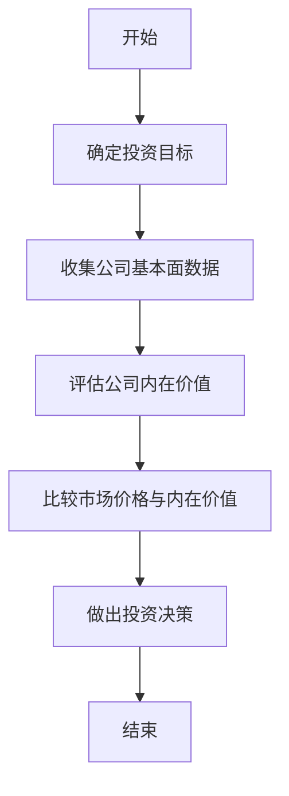
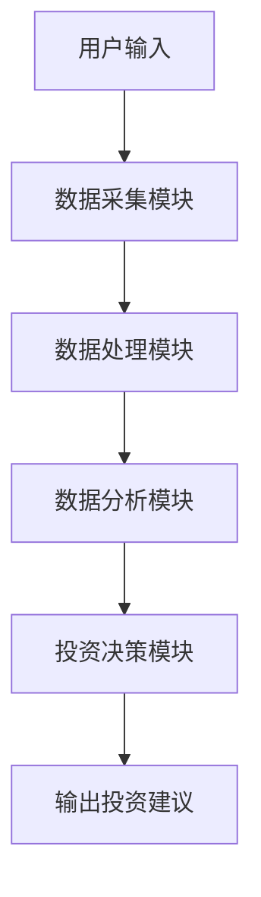

                 


# 彼得林奇的"价值投资"在零利率时代的挑战

## 关键词：
- 彼得林奇
- 价值投资
- 零利率
- 经济挑战
- 投资策略

## 摘要：
在当前全球低利率甚至零利率的经济环境下，彼得·林奇的价值投资理念面临新的挑战。本文将深入分析零利率时代对传统投资策略的影响，探讨价值投资的核心原理，并结合具体案例，提出应对策略。通过系统分析和实战项目，为投资者提供在低利率环境下如何有效实施价值投资的指导。

---

# 第一部分：零利率时代的投资背景

## 第1章：零利率时代的投资挑战

### 1.1 零利率时代的经济背景

#### 1.1.1 零利率的定义与现状
零利率，即中央银行将基准利率降至零或更低，以刺激经济增长。近年来，全球多国央行实施零利率或负利率政策，导致传统投资策略面临挑战。

#### 1.1.2 零利率对传统投资策略的影响
零利率环境下，债券收益率下降，股市估值升高，房地产价格上涨。传统依赖于固定收益的投资策略难以获得稳定收益。

#### 1.1.3 低利率环境下的资产配置挑战
投资者转向高风险资产，导致资产价格泡沫风险增加，通货膨胀压力上升，传统资产配置面临重构。

### 1.2 彼得·林奇与价值投资概述

#### 1.2.1 彼得·林奇的投资哲学
彼得·林奇倡导长期投资，注重基本面分析，寻找被低估的股票。他强调安全边际，即买入价格低于内在价值。

#### 1.2.2 价值投资的核心理念
价值投资强调深入研究公司基本面，寻找市场低估的股票。核心是内在价值计算和安全边际。

#### 1.2.3 价值投资的成功案例
通过彼得·林奇管理的麦哲伦基金，展示价值投资在长期中的优异表现，如投资喜诗糖果、吉列刀具等的成功案例。

### 1.3 价值投资在零利率时代的挑战

#### 1.3.1 低利率环境下的资产价格波动
零利率导致资产价格波动加剧，传统估值模型失效，投资决策难度增加。

#### 1.3.2 通货膨胀压力与投资决策
通胀上升可能侵蚀资产实际回报，影响价值投资的内在价值计算。

#### 1.3.3 投资者心理与行为变化
市场波动加剧，投资者情绪波动大，价值投资需要更强的纪律和耐心。

---

# 第二部分：价值投资的核心概念与联系

## 第2章：价值投资的原理与方法

### 2.1 价值投资的原理

#### 2.1.1 基本面分析的核心要素
分析公司的财务报表，包括收入、利润、现金流和资产负债表，评估公司的财务健康状况。

#### 2.1.2 安全边际的计算方法
安全边际=内在价值-市场价格，确保买入价格低于内在价值，降低投资风险。

#### 2.1.3 投资组合的构建策略
分散投资，避免过度集中，平衡成长型和价值型股票，降低风险。

### 2.2 价值投资与传统投资的对比

#### 2.2.1 投资目标的差异
价值投资追求内在价值，传统投资注重市场趋势和短期收益。

#### 2.2.2 投资策略的对比分析
价值投资长期持有，传统投资短期交易；价值投资注重基本面，传统投资关注技术分析。

#### 2.2.3 风险管理的异同
价值投资通过安全边际和分散投资降低风险，传统投资依赖止损和杠杆工具。

#### 2.2.4 对比分析表格
| 投资策略 | 价值投资 | 传统投资 |
|----------|-----------|-----------|
| 目标     | 内在价值  | 市场趋势  |
| 方法     | 基本面分析| 技术分析  |
| 风险管理 | 安全边际  | 止损策略  |

### 2.3 价值投资的决策流程图



---

# 第三部分：价值投资的算法原理

## 第3章：价值投资的数学模型与公式

### 3.1 现金流折现模型（DCF）

#### 3.1.1 DCF模型的基本原理
DCF模型通过折现未来现金流，计算公司的内在价值。公式：
$$DCF = \sum_{t=1}^{n} \frac{CF_t}{(1 + r)^t}$$

#### 3.1.2 现金流折现的公式
$$DCF = \frac{CF_1}{(1+r)^1} + \frac{CF_2}{(1+r)^2} + \cdots + \frac{CF_n}{(1+r)^n}$$
其中，CF为现金流，r为折现率，t为时间。

#### 3.1.3 折现率的确定方法
折现率基于无风险利率和市场风险溢价，使用CAPM模型计算：
$$r = r_f + β(r_m - r_f)$$

### 3.2 内在价值计算

#### 3.2.1 内在价值公式
$$\text{内在价值} = \frac{\text{净利润} \times (1 + g)}{r - g}$$
其中，g为增长率，r为折现率。

---

# 第四部分：系统分析与架构设计

## 第4章：价值投资系统的架构设计

### 4.1 系统功能设计

#### 4.1.1 数据收集模块
收集公司财务数据、行业信息和市场数据。

#### 4.1.2 数据分析模块
使用Python进行数据清洗、建模和预测。

#### 4.1.3 投资决策模块
基于分析结果，生成投资建议。

### 4.2 系统架构设计



---

# 第五部分：项目实战

## 第5章：价值投资策略的实战应用

### 5.1 环境配置

#### 5.1.1 安装Python和相关库
安装Python 3.x，使用pip安装pandas、numpy、scipy等库。

### 5.2 核心实现代码

#### 5.2.1 现金流折现模型代码
```python
import numpy as np
import pandas as pd

def dcf_valuation(cash_flows, discount_rate):
    return np.npv(discount_rate, cash_flows)
```

### 5.3 案例分析

#### 5.3.1 案例分析
以某公司为例，使用DCF模型计算其内在价值，对比市场价格，得出投资建议。

---

# 第六部分：最佳实践

## 第6章：价值投资在零利率时代的应用

### 6.1 最佳实践 tips
- 保持分散投资，避免集中风险。
- 定期评估投资组合，适应市场变化。
- 关注公司基本面，选择优质企业。

### 6.2 小结
价值投资在零利率时代依然有效，需灵活调整策略，注重安全边际和分散投资。

### 6.3 注意事项
- 风险管理不可忽视。
- 避免追涨杀跌，保持纪律性。
- 定期复盘，及时调整。

### 6.4 拓展阅读
推荐阅读《彼得·林奇的投资之道》和《价值投资实战策略》。

---

# 作者：AI天才研究院/AI Genius Institute & 禅与计算机程序设计艺术/Zen And The Art of Computer Programming

