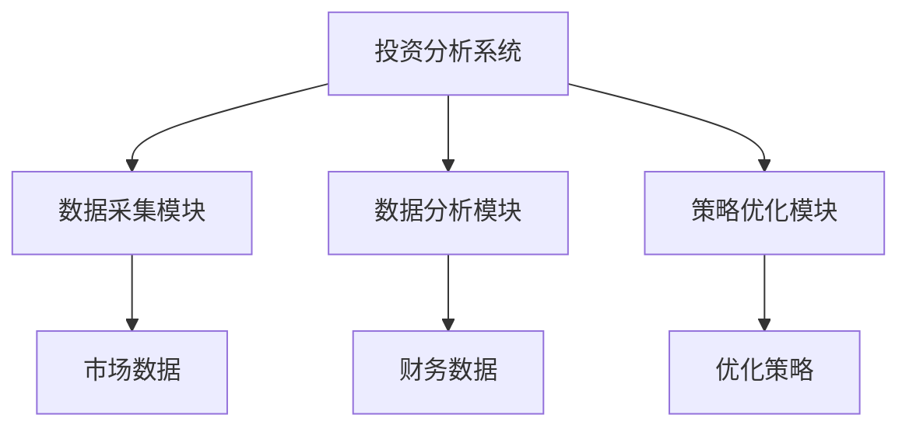
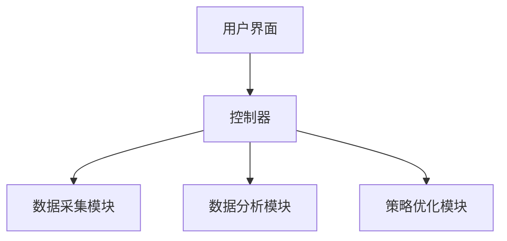
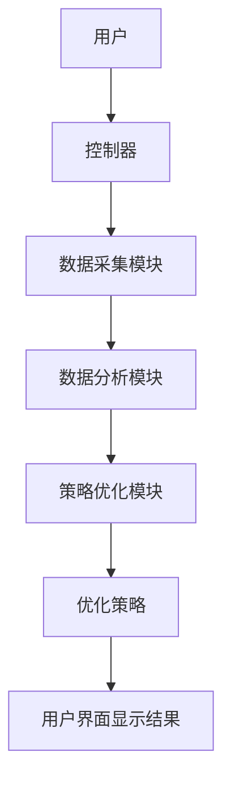

                 


# 彼得林奇的"价值投资"在零利率长期化背景下的策略调整

## 关键词：价值投资，彼得林奇，零利率，投资策略，金融分析

## 摘要：本文探讨了在零利率长期化背景下，彼得林奇的“价值投资”策略需要进行的调整。通过分析零利率环境对传统投资策略的影响，提出了新的投资理念、选股标准和投资组合优化方法，并结合数学模型和系统架构设计，为投资者提供了应对低利率环境的实践指导。

---

# 引言

## 第1章：引言

### 1.1 零利率长期化背景下的投资挑战
#### 1.1.1 零利率长期化的定义与成因
零利率长期化是指中央银行将基准利率降至接近零的水平，并预期这种状态会持续较长时间。这一现象主要是由于全球经济增速放缓、通货紧缩压力和老龄化等因素导致的有效需求不足。

#### 1.1.2 传统价值投资策略的局限性
传统的价值投资策略依赖于企业盈利和股息增长，但在零利率环境下，债券收益率下降，股票估值可能被高估，导致传统指标失效。

#### 1.1.3 彼得林奇策略的调整必要性
彼得林奇的策略需要调整以适应新的市场环境，确保在低利率环境下仍能实现稳健投资回报。

---

# 第二部分：价值投资的基本原理

## 第2章：价值投资的基本原理

### 2.1 价值投资的核心概念
#### 2.1.1 价值投资的定义
价值投资是一种通过分析企业的基本面，寻找市场价格低于其内在价值的证券进行投资的策略。

#### 2.1.2 价值投资的核心要素
- 企业盈利能力
- 财务健康状况
- 竞争优势
- 管理团队

#### 2.1.3 价值投资与成长投资的区别
价值投资关注低估的股票，而成长投资关注高增长的股票。

### 2.2 彼得林奇投资策略的特点
#### 2.2.1 彼得林奇的投资理念
- 长期投资
- 选择具有强大竞争优势的企业
- 重视企业管理层

#### 2.2.2 彼得林奇的选股标准
- 低市盈率
- 高股息率
- 强大的财务状况

#### 2.2.3 彼得林奇的长期投资策略
通过长期持有优质股票，获得企业成长的收益。

---

## 第三部分：零利率长期化对传统投资策略的影响

## 第3章：零利率长期化对传统投资策略的影响

### 3.1 零利率长期化对全球经济的影响
#### 3.1.1 零利率长期化的经济背景
- 经济增长放缓
- 通货紧缩压力
- 老龄化社会

#### 3.1.2 零利率长期化对资本市场的影响
- 股票估值上升
- 债券收益率下降
- 资产泡沫风险增加

#### 3.1.3 零利率长期化对个人投资的影响
- 投资者面临低回报环境
- 需要寻找新的投资机会
- 风险管理更加重要

### 3.2 传统价值投资策略的局限性
#### 3.2.1 传统价值投资在低利率环境下的挑战
- 低利率导致债券收益率下降，影响投资组合收益。
- 低利率可能导致股票估值偏高，传统估值指标失效。

#### 3.2.2 传统价值投资的假设与现实的差异
- 传统策略假设市场有效，但在低利率环境下，市场可能存在结构性低估。
- 传统策略依赖于稳定的股息增长，但在低利率环境下，企业的盈利能力可能下降。

#### 3.2.3 传统价值投资在零利率环境下的失效点
- 高市盈率股票可能不再具有吸引力。
- 低利率环境下，企业的杠杆成本下降，但高负债可能增加财务风险。

---

## 第四部分：彼得林奇策略在零利率环境下的调整

## 第4章：彼得林奇策略在零利率环境下的调整

### 4.1 彼得林奇策略的核心调整思路
#### 4.1.1 投资理念的调整
- 从单纯追求低估转向寻找具有成长性和竞争优势的企业。
- 更加注重企业的创新能力和适应市场变化的能力。

#### 4.1.2 选股标准的优化
- 结合低利率环境下的市场特点，调整估值指标。
- 更加关注企业的成长性和现金流情况。

#### 4.1.3 投资组合的再平衡
- 增加对高成长性股票的配置。
- 适当减少对高负债企业的投资。

### 4.2 零利率环境下的投资机会与风险
#### 4.2.1 零利率环境下的投资机会
- 具有强大创新能力的科技企业。
- 朝阳行业的龙头企业。

#### 4.2.2 零利率环境下的投资风险
- 资产泡沫风险。
- 通货膨胀压力。
- 市场波动风险。

#### 4.2.3 投资者如何应对零利率环境
- 保持灵活性，及时调整投资组合。
- 加强风险管理，避免过度集中投资。

---

## 第五部分：价值投资策略的数学模型与公式

## 第5章：价值投资策略的数学模型与公式

### 5.1 价值投资的核心数学模型
#### 5.1.1 股票内在价值的计算公式
$$ V = \frac{D}{k} $$
其中，V为股票的内在价值，D为预期股息，k为折现率。

#### 5.1.2 股票估值的公式
$$ P = \frac{E}{E/P} $$
其中，P为股票价格，E为企业的净利润，E/P为市盈率。

#### 5.1.3 投资组合的优化公式
$$ \text{夏普比率} = \frac{E[r_p] - r_f}{\sigma_p} $$
其中，E[r_p]为投资组合的预期收益，r_f为无风险利率，σ_p为投资组合的标准差。

### 5.2 零利率环境下的策略调整模型
#### 5.2.1 股票估值模型的调整
$$ V' = V \times (1 + \text{调整因子}) $$
其中，调整因子反映了零利率环境下的市场变化。

#### 5.2.2 投资组合的再平衡模型
$$ w_i = \frac{w_i \times V_i}{\sum w_i \times V_i} $$
其中，w_i为资产i的权重，V_i为资产i的估值。

#### 5.2.3 风险调整后的投资策略模型
$$ \text{最优权重} = \arg \min \sigma_p \text{ subject to } E[r_p] \geq \text{目标收益} $$

---

## 第六部分：系统分析与架构设计

## 第6章：系统分析与架构设计

### 6.1 投资分析系统的功能模块设计
#### 6.1.1 数据采集模块
- 收集市场数据、公司财务数据等。

#### 6.1.2 数据分析模块
- 使用Python进行数据清洗和分析。
- 应用机器学习算法进行预测。

#### 6.1.3 策略优化模块
- 根据零利率环境调整投资策略。
- 优化投资组合。

#### 6.1.4 系统架构图（Mermaid）


### 6.2 系统架构设计
#### 6.2.1 系统架构图（Mermaid）


### 6.3 系统接口设计
- 数据接口：与数据源对接。
- 用户接口：提供给用户查询和调整策略的功能。

### 6.4 系统交互流程图（Mermaid）


---

## 第七部分：项目实战

## 第7章：项目实战

### 7.1 环境安装
- 安装Python、Pandas、NumPy、Scikit-learn等工具。

### 7.2 核心代码实现
#### 7.2.1 数据采集代码
```python
import pandas as pd
import requests

url = "https://api.example.com/stock_data"
data = requests.get(url).json()
df = pd.DataFrame(data)
```

#### 7.2.2 数据分析代码
```python
from sklearn.linear_model import LinearRegression

model = LinearRegression()
model.fit(X, y)
```

#### 7.2.3 投资组合优化代码
```python
import numpy as np

# 定义目标函数
def objective(weights):
    return -np.mean(weights * returns)

# 约束条件
constraints = {"sum": weights.sum() == 1}

# 使用优化算法求解
from scipy.optimize import minimize

result = minimize(objective, initial_weights, constraints)
```

### 7.3 案例分析
- 分析某科技公司在零利率环境下的投资价值。
- 计算其内在价值，比较市场价格，制定投资策略。

### 7.4 项目小结
- 总结项目实施过程中的经验和教训。
- 提出进一步优化的方向。

---

## 第八部分：结论与展望

## 第8章：结论与展望

### 8.1 结论
- 彼得林奇的价值投资策略在零利率环境下需要进行调整。
- 新的策略更注重企业的成长性和创新能力。
- 系统化的投资分析方法能够帮助投资者更好地应对低利率环境。

### 8.2 未来研究方向
- 进一步研究低利率环境下的风险管理策略。
- 探讨人工智能在投资策略优化中的应用。
- 开发更多基于机器学习的投资分析工具。

---

## 附录：最佳实践 tips

### 8.1 小结
- 在零利率环境下，投资者应更加注重企业的成长性和创新能力。
- 系统化的投资分析方法能够帮助投资者更好地应对低利率环境。

### 8.2 注意事项
- 避免过度依赖单一指标，应综合考虑多个因素。
- 定期调整投资组合，以适应市场变化。

### 8.3 拓展阅读
- 推荐书籍：《彼得林奇的成功投资》
- 推荐文章：《低利率环境下的投资策略》

---

## 作者信息

作者：AI天才研究院/AI Genius Institute & 禅与计算机程序设计艺术 /Zen And The Art of Computer Programming

---

通过以上详细的内容，读者可以全面了解在零利率长期化背景下，如何调整彼得林奇的价值投资策略，并通过实际案例和系统设计，掌握应对低利率环境的具体方法。

