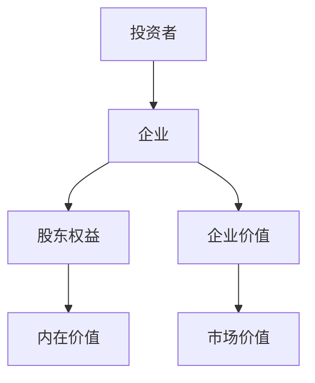
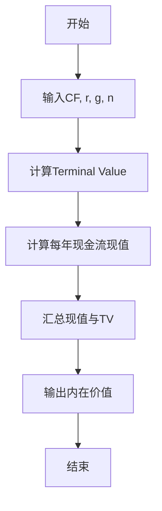
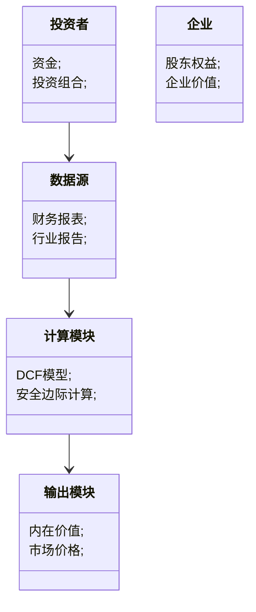
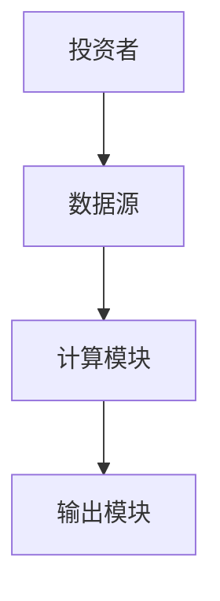

                 


# 彼得林奇的"价值投资"实践指南

> 关键词：价值投资、彼得·林奇、投资策略、基本面分析、安全边际

> 摘要：本文详细探讨了彼得·林奇的价值投资理念，从核心概念到算法原理，再到系统架构设计和项目实战，为读者提供了一个全面的实践指南。通过深入分析价值投资的哲学、策略和方法，结合实际案例和数学模型，帮助读者掌握价值投资的精髓。

---

# 第一部分: 价值投资的背景与核心理念

## 第1章: 价值投资的概述

### 1.1 价值投资的定义与背景

价值投资是一种以基本面分析为基础的投资策略，其核心在于寻找市场价格低于其内在价值的证券。彼得·林奇是该领域的杰出代表，他通过长期关注公司的基本面，寻找具有持续增长潜力的企业进行投资。

#### 1.1.1 投资的基本概念与问题背景

投资的本质是通过配置资金以获得未来收益。然而，市场波动、信息不对称和投资者情绪等因素常常导致投资决策的失误。价值投资旨在通过深入分析企业的财务状况和行业地位，识别被市场低估的机会。

#### 1.1.2 价值投资的核心理念

价值投资强调购买具有稳定增长潜力的企业，而非关注市场的短期波动。彼得·林奇认为，投资者应将注意力集中在企业的盈利能力和成长性上，而非市场的短期情绪。

#### 1.1.3 彼得·林奇的投资风格与成就

彼得·林奇以其长期投资和深入基本面分析著称。他管理的基金曾连续多年跑赢市场指数，证明了价值投资的有效性。

### 1.2 价值投资与基本面分析

#### 1.2.1 基本面分析的定义

基本面分析是通过对企业的财务报表、行业地位和管理团队等进行深入研究，评估其内在价值的过程。

#### 1.2.2 价值投资与基本面分析的关系

价值投资的核心工具是基本面分析，通过分析企业的盈利能力、成长性和财务健康状况，确定其内在价值。

#### 1.2.3 彼得·林奇的基本面分析方法

彼得·林奇注重对企业财务报表的分析，尤其是ROE（净资产收益率）和利润率等关键指标，以识别具有竞争优势的企业。

### 1.3 价值投资的哲学与心理

#### 1.3.1 投资者的心理与行为

投资者常常受情绪影响，导致决策失误。价值投资强调理性分析，避免情绪化决策。

#### 1.3.2 价值投资的长期视角

价值投资注重长期回报，而非短期收益。通过持有优质企业，投资者能够在长期内获得稳定的收益。

#### 1.3.3 避免情绪化投资的策略

彼得·林奇建议投资者建立自己的投资体系，避免受市场情绪影响。通过分散投资和长期持有，降低情绪化决策的风险。

### 1.4 价值投资的适用范围与边界

#### 1.4.1 价值投资的适用领域

价值投资适用于对企业的长期表现有信心的投资者。尤其适合那些愿意投入时间和精力进行深入研究的投资者。

#### 1.4.2 价值投资的局限性

价值投资对研究能力要求较高，且在市场波动剧烈时可能面临短期亏损。此外，内在价值的评估具有主观性，可能导致判断失误。

#### 1.4.3 价值投资与其他投资策略的对比

与趋势投资和技术分析不同，价值投资注重基本面分析。与成长投资相比，价值投资更注重安全边际和合理估值。

---

## 1.5 本章小结

本章介绍了价值投资的基本概念、核心理念和彼得·林奇的投资风格。通过分析价值投资与基本面分析的关系，探讨了其哲学和心理层面的特点，帮助读者理解价值投资的内在逻辑。

---

# 第二部分: 价值投资的核心概念与原理

## 第2章: 价值投资的核心概念

### 2.1 内在价值与市场价值

#### 2.1.1 内在价值的定义与计算

内在价值是企业未来现金流的现值，通过DCF模型计算。公式如下：
$$
\text{内在价值} = \frac{CF}{r - g}
$$
其中，CF为自由现金流，r为贴现率，g为增长率。

#### 2.1.2 市场价值的波动性

市场价值受情绪和市场趋势影响，可能高于或低于内在价值。

#### 2.1.3 内在价值与市场价值的关系

内在价值是长期目标，市场价值是短期表现。投资者应关注内在价值，而非短期波动。

### 2.2 安全边际的概念

#### 2.2.1 安全边际的定义

安全边际是市场价格低于内在价值的部分，提供了一定的缓冲空间，降低投资风险。

#### 2.2.2 安全边际的重要性

通过安全边际，投资者可以降低因估值错误或市场波动带来的损失。

#### 2.2.3 如何确定安全边际

安全边际通常设定为内在价值的20%-30%。公式如下：
$$
\text{安全边际} = \text{内在价值} \times (1 - \text{安全边际比例})
$$

### 2.3 股东权益与企业价值

#### 2.3.1 股东权益的定义

股东权益是企业在清算时分配给股东的部分，包括股本和留存收益。

#### 2.3.2 企业价值的评估方法

企业价值=企业息税前利润×市盈率，或企业自由现金流×市现率。

#### 2.3.3 彼得·林奇的企业价值分析法

彼得·林奇关注企业的ROE和利润率，寻找具有高ROE和稳定利润率的企业。

### 2.4 核心概念对比表

| 概念       | 定义与特点                          |
|------------|------------------------------------|
| 内在价值   | 未来现金流现值，需通过DCF模型计算 |
| 市场价值   | 当前市场价格，受情绪影响波动大    |
| 安全边际   | 价格低于内在价值的部分，提供缓冲  |
| 股东权益   | 企业的净资产，包括股本和留存收益  |
| 企业价值   | 企业整体价值，包括股权和债务     |

### 2.5 价值投资的ER实体关系图



---

## 2.6 本章小结

本章通过对比分析内在价值、市场价值、安全边际和企业价值等核心概念，帮助读者理解价值投资的关键要素及其相互关系。

---

# 第三部分: 价值投资的算法与数学模型

## 第3章: 价值投资的算法原理

### 3.1 内在价值计算的算法

#### 3.1.1 DCF模型的步骤

1. 估计未来现金流。
2. 确定合适的贴现率。
3. 计算未来现金流的现值。
4. 评估内在价值。

#### 3.1.2 DCF模型的数学公式

$$
\text{内在价值} = \sum_{t=1}^{n} \frac{CF_t}{(1 + r)^t} + \frac{TV}{(1 + r)^n}
$$
其中，CF_t为第t年的现金流，r为贴现率，TV为终值。

#### 3.1.3 安全边际的计算

$$
\text{安全边际} = \text{内在价值} \times (1 - \text{安全边际比例})
$$

### 3.2 内在价值计算的Python代码实现

```python
def calculate_intrinsic_value(CF, r, g, n):
    terminal_value = CF * (1 + g) / (r - g)
    present_value = 0
    for t in range(1, n+1):
        present_value += CF * (1 + g)**(t-1) / (1 + r)**t
    return present_value + terminal_value

CF = 100
r = 0.1
g = 0.05
n = 5
intrinsic_value = calculate_intrinsic_value(CF, r, g, n)
print(f"内在价值: {intrinsic_value}")
```

### 3.3 内在价值计算的流程图



---

## 3.4 本章小结

本章通过详细讲解DCF模型的数学公式和Python代码，展示了如何计算内在价值并确定安全边际，帮助读者掌握价值投资的核心算法。

---

# 第四部分: 价值投资的系统架构设计

## 第4章: 价值投资的系统架构设计

### 4.1 价值投资系统的项目介绍

价值投资系统旨在通过自动化分析企业基本面数据，评估其内在价值，辅助投资者做出决策。

### 4.2 系统功能设计

#### 4.2.1 领域模型



#### 4.2.2 系统架构图



#### 4.2.3 接口和交互设计

```mermaid
sequenceDiagram
    投资者 -> 数据源: 获取企业数据
    数据源 -> 计算模块: 提供数据
    计算模块 -> 输出模块: 输出内在价值和市场价格
    投资者 <- 输出模块: 显示结果
```

---

## 4.3 本章小结

本章通过系统架构设计，展示了如何将价值投资的理念转化为实际的应用系统，帮助投资者自动化地进行基本面分析和价值评估。

---

# 第五部分: 价值投资的项目实战

## 第5章: 价值投资的项目实战

### 5.1 环境安装与配置

安装Python和相关库（如pandas、numpy）。

### 5.2 核心代码实现

```python
import pandas as pd

def calculate_intrinsic_value(data, r, g):
    CF = data['CF']
    TV = CF * (1 + g) / (r - g)
    PV = 0
    for t in range(len(CF)):
        PV += CF[t] / (1 + r)**(t+1)
    return PV + TV

data = pd.DataFrame({
    'CF': [100, 120, 140, 160, 180],
    'r': 0.1,
    'g': 0.05
})

intrinsic_value = calculate_intrinsic_value(data, 0.1, 0.05)
print(f"内在价值: {intrinsic_value}")
```

### 5.3 实际案例分析

以苹果公司为例，计算其内在价值，并与市场价格进行对比。

### 5.4 项目小结

通过实际案例分析，验证了价值投资算法的有效性，并展示了如何将理论应用于实际投资决策。

---

## 5.5 本章小结

本章通过项目实战，展示了如何使用Python代码实现价值投资算法，并通过实际案例分析验证了其可行性。

---

# 第六部分: 最佳实践与总结

## 第6章: 最佳实践与总结

### 6.1 投资者的最佳实践

1. 持续学习，提升基本面分析能力。
2. 保持分散投资，降低风险。
3. 长期持有优质企业，避免频繁交易。

### 6.2 小结

价值投资是一种长期有效的投资策略，通过深入分析企业的内在价值，识别被市场低估的机会。彼得·林奇的成功证明了这一策略的有效性。

### 6.3 注意事项

1. 避免情绪化决策。
2. 定期评估投资组合。
3. 保持对市场的敏感性。

### 6.4 拓展阅读

推荐阅读彼得·林奇的《聪明的投资者》和《彼得·林奇的投资笔记》。

---

# 作者：AI天才研究院 & 禅与计算机程序设计艺术

---

这篇文章详细探讨了彼得·林奇的价值投资理念，从核心概念到算法原理，再到系统架构设计和项目实战，为读者提供了一个全面的实践指南。通过深入分析价值投资的哲学、策略和方法，结合实际案例和数学模型，帮助读者掌握价值投资的精髓。

