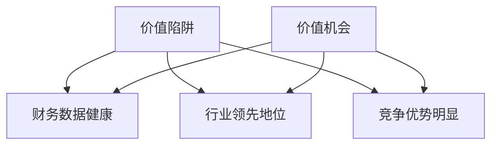
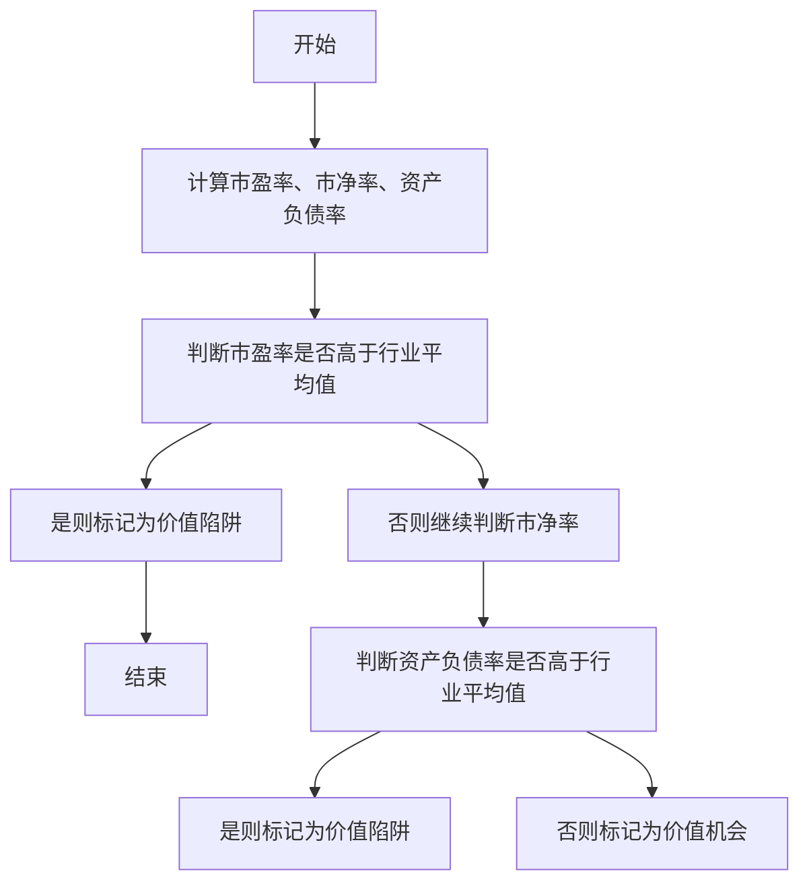
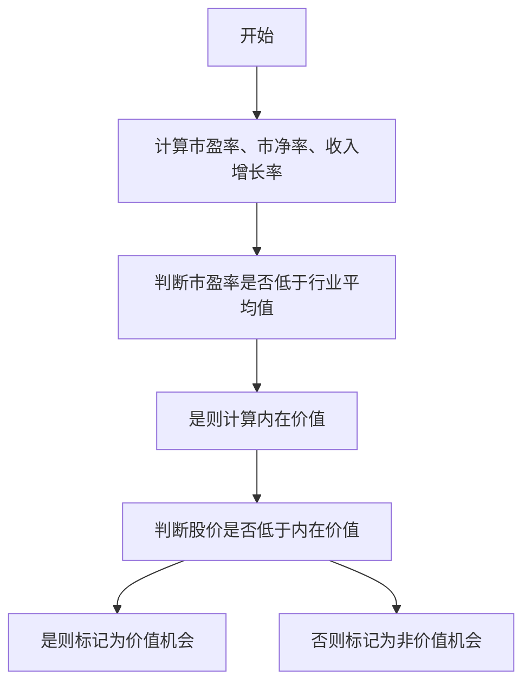
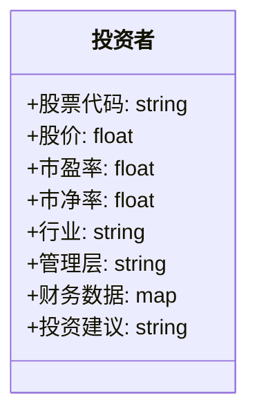
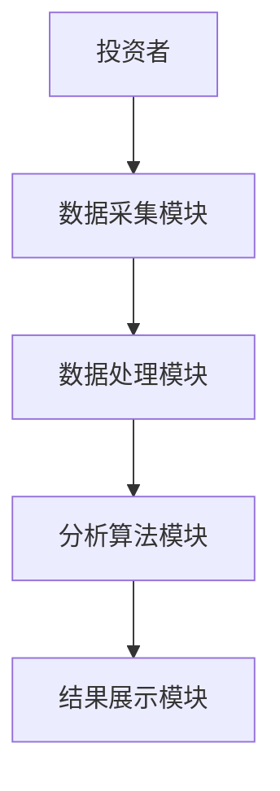

                 


# 彼得林奇的"价值陷阱"vs"价值机会"

## 关键词：彼得林奇，价值陷阱，价值机会，投资分析，财务指标，投资策略

## 摘要：彼得·林奇是世界著名的价值投资者，他提出了“价值陷阱”和“价值机会”两个概念。本文将详细分析这两个概念的区别与联系，并通过算法和数学模型帮助投资者识别价值陷阱和价值机会。我们还将提供一个完整的投资分析系统架构，并通过实际案例演示如何在实际投资中应用这些方法。

---

## 第一部分: 彼得林奇的"价值陷阱"与"价值机会"概述

### 第1章: 价值投资的基本概念

#### 1.1 价值投资的起源与发展
##### 1.1.1 价值投资的定义
价值投资是一种以公司基本面分析为基础的投资策略，强调以低于公司内在价值的价格购买优质股票。其核心思想是寻找市场先生犯错的机会，买入被市场低估的优秀企业。

##### 1.1.2 彼得林奇的背景与投资理念
彼得·林奇是美国著名投资家，曾管理富达麦哲伦基金，创造了辉煌的投资业绩。他认为，投资者应关注企业的基本面，寻找那些具有持续竞争优势、财务健康且估值合理的公司。

##### 1.1.3 价值投资的核心原则
价值投资的核心原则包括：关注企业的内在价值、长期投资、分散投资、避免跟风等。

#### 1.2 价值陷阱与价值机会的定义
##### 1.2.1 价值陷阱的概念
价值陷阱是指那些表面上看似便宜，但实际上存在严重问题（如财务造假、行业衰退、管理混乱等）的股票。投资者误以为这些股票价格低廉，实际上它们可能进一步下跌。

##### 1.2.2 价值机会的概念
价值机会是指那些市场价格低于公司内在价值，同时公司具有强大竞争优势、良好财务状况和优秀管理团队的股票。这些股票最终会被市场重新发现，股价回升，为投资者带来超额收益。

##### 1.2.3 价值陷阱与价值机会的区别与联系
两者都属于价值投资的范畴，但价值陷阱是需要避免的“假便宜”股票，而价值机会是值得长期持有的优质股票。

---

### 第2章: 价值陷阱的特征与识别

#### 2.1 价值陷阱的主要特征
##### 2.1.1 财务数据的虚假性
虚假的财务报表，如虚增收入、隐瞒债务等，是价值陷阱的重要特征。

##### 2.1.2 行业环境的恶化
行业整体低迷、政策变化或技术革新导致竞争优势丧失，也是价值陷阱的表现。

##### 2.1.3 管理层的问题
管理层腐败、管理混乱或战略失误，往往会导致公司陷入困境，股价被低估。

#### 2.2 价值陷阱的识别方法
##### 2.2.1 财务指标分析
通过分析市盈率（P/E）、市净率（P/B）、资产负债率等财务指标，识别财务数据的异常。

##### 2.2.2 行业趋势分析
研究行业周期、政策变化和竞争格局，判断行业环境是否恶化。

##### 2.2.3 竞争对手比较
将公司与行业内的优秀企业进行比较，分析其竞争优势是否明显。

---

### 第3章: 价值机会的特征与挖掘

#### 3.1 价值机会的主要特征
##### 3.1.1 财务健康与成长性
公司财务报表健康，收入和利润持续增长，现金流充裕。

##### 3.1.2 行业领先地位
公司在行业中具有领先地位，市场份额高，竞争优势明显。

##### 3.1.3 管理层优秀
管理层经验丰富，团队稳定，战略清晰。

#### 3.2 价值机会的挖掘方法
##### 3.2.1 财务数据筛选
通过筛选低市盈率、低市净率的股票，寻找潜在的价值机会。

##### 3.2.2 行业趋势分析
关注行业增长潜力大的行业，寻找具有竞争优势的公司。

##### 3.2.3 竞争优势分析
分析公司的核心竞争力，如品牌优势、成本优势等。

---

### 第4章: 价值陷阱与价值机会的对比分析

#### 4.1 价值陷阱与价值机会的对比表格
表4.1-1 价值陷阱与价值机会的主要区别

| 特征            | 价值陷阱                          | 价值机会                          |
|-----------------|-----------------------------------|-----------------------------------|
| 财务状况         | 虚假或恶化                       | 健康且成长性好                    |
| 行业环境         | 恶化或衰退                       | 增长潜力大                        |
| 管理层           | 问题或混乱                       | 优秀且稳定                        |
| 投资建议         | 避免投资                          | 买入并持有                      |

#### 4.2 价值陷阱与价值机会的ER实体关系图


---

### 第5章: 价值陷阱与价值机会的数学模型与算法

#### 5.1 价值陷阱识别的数学模型
##### 5.1.1 财务指标加权评分模型
$$ \text{综合评分} = 0.4 \times \text{市盈率} + 0.3 \times \text{市净率} + 0.3 \times \text{资产负债率} $$

##### 5.1.2 价值陷阱识别算法


#### 5.2 价值机会识别的数学模型
##### 5.2.1 价值机会识别公式
$$ \text{内在价值} = \text{净利润} \times \text{合理市盈率} $$

##### 5.2.2 价值机会识别算法


---

## 第二部分: 投资分析系统架构与实战

### 第6章: 系统分析与架构设计

#### 6.1 问题场景介绍
我们希望通过构建一个投资分析系统，帮助投资者自动识别价值陷阱和价值机会，提升投资效率。

#### 6.2 系统功能设计
##### 6.2.1 领域模型


##### 6.2.2 系统架构


---

### 第7章: 项目实战

#### 7.1 环境安装
安装Python、Pandas、Matplotlib等工具。

#### 7.2 核心实现代码
```python
import pandas as pd

def calculate_value_trap(stock_data):
    # 假设stock_data是一个DataFrame，包含股票代码、市盈率、市净率、资产负债率
    stock_data['综合评分'] = 0.4 * stock_data['市盈率'] + 0.3 * stock_data['市净率'] + 0.3 * stock_data['资产负债率']
    value_trap = stock_data[stock_data['综合评分'] > stock_data['行业平均评分']]
    return value_trap

def calculate_value_opportunity(stock_data):
    # 假设stock_data是一个DataFrame，包含股票代码、净利润、合理市盈率
    stock_data['内在价值'] = stock_data['净利润'] * stock_data['合理市盈率']
    value_opportunity = stock_data[stock_data['股价'] < stock_data['内在价值']]
    return value_opportunity
```

#### 7.3 代码应用与分析
通过代码分析实际股票数据，识别价值陷阱和价值机会。

#### 7.4 实际案例分析
以某公司为例，分析其财务数据，判断其是否为价值陷阱或价值机会。

---

### 第8章: 最佳实践与小结

#### 8.1 投资建议
##### 8.1.1 长期持有优质股票
##### 8.1.2 分散投资以降低风险
##### 8.1.3 持续学习与更新知识

#### 8.2 注意事项
##### 8.2.1 避免情绪化投资
##### 8.2.2 定期复盘与调整策略
##### 8.2.3 注意市场波动对投资的影响

#### 8.3 拓展阅读
推荐相关书籍和文章，帮助读者深入学习价值投资。

---

## 结语

通过本文的分析，读者可以清晰理解彼得林奇的价值陷阱与价值机会的概念，并通过数学模型和投资系统的方法，提升自己的投资能力。希望本文能为投资者提供有价值的参考和指导。

---

## 作者：AI天才研究院/AI Genius Institute & 禅与计算机程序设计艺术 /Zen And The Art of Computer Programming

