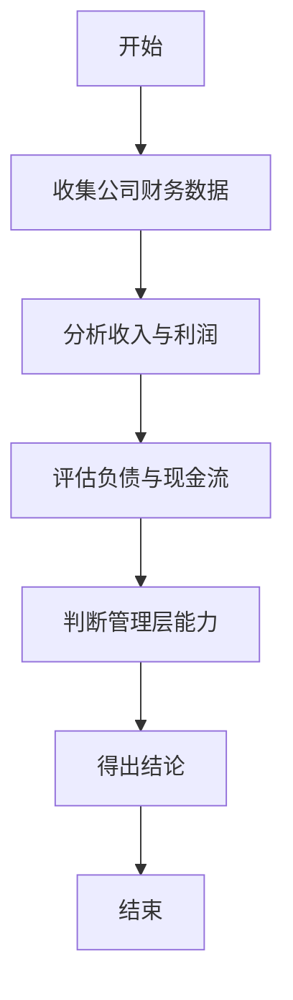

                 


# 彼得林奇的"价值陷阱"修正方法

## 关键词

- 价值陷阱
- 投资策略
- 彼得林奇
- 股票分析
- 财务指标

## 摘要

彼得林奇是著名的投资专家，他提出的“价值陷阱”概念帮助投资者识别看似便宜但实际存在风险的股票。本文详细讲解了价值陷阱的修正方法，包括背景分析、核心概念、算法原理、数学模型、系统架构、项目实战和最佳实践。通过分析财务指标、构建检测系统和实际案例，本文为投资者提供了有效的策略和工具，帮助他们避免价值陷阱，实现稳健投资。

---

## 第一部分：价值陷阱的背景与概念

### 第1章：价值陷阱的基本概念

#### 1.1 价值陷阱的定义与问题背景

**1.1.1 价值陷阱的定义**  
价值陷阱是指那些表面上看起来估值较低，但实际存在严重问题的股票。这些股票可能因为行业衰退、公司管理不善或财务造假等原因，导致其实际价值远低于表面估值。

**1.1.2 价值陷阱的常见问题背景**  
价值陷阱通常出现在以下情况下：  
- 行业周期性低谷：如经济衰退期间，某些行业的股票可能价格低廉，但行业可能长期低迷。  
- 财务造假：公司通过虚增收入或隐藏债务等方式制造虚假的高增长。  
- 管理层问题：公司管理层内耗或腐败，导致公司运营效率低下。  
- 重大诉讼或法律风险：公司面临巨额诉讼或行政处罚，影响其持续经营能力。  

**1.1.3 价值陷阱的解决方法**  
投资者需要通过深入分析公司的基本面，包括财务数据、行业地位和管理层能力，来识别和避免价值陷阱。

---

#### 1.2 价值陷阱与价值投资的关系

**1.2.1 价值投资的基本原则**  
价值投资的核心理念是寻找市场价格低于其内在价值的股票。投资者通过长期持有优质资产，获得超额收益。  
关键原则包括：  
- 长期投资：避免短期市场波动的干扰。  
- 质优价廉：选择具有强大竞争优势和良好财务状况的公司。  
- 安全边际：在价格显著低于内在价值时买入。  

**1.2.2 价值陷阱对价值投资的影响**  
价值陷阱可能导致投资者误判股票价值，买入后股价持续下跌，造成损失。因此，识别和避免价值陷阱是价值投资的重要环节。

**1.2.3 如何在价值投资中避免价值陷阱**  
- 仔细分析公司的财务报表，识别潜在风险。  
- 关注公司的行业地位和竞争优势。  
- 调查公司管理层的背景和声誉。  
- 保持对市场的持续关注和研究。  

---

## 第二部分：价值陷阱的核心概念与联系

### 第2章：价值陷阱的核心原理

#### 2.1 价值陷阱的原理分析

**2.1.1 价值陷阱的形成机制**  
价值陷阱通常形成于市场低迷或公司基本面恶化时期。投资者可能因为市场恐慌或错误的信息，低估了公司的风险，导致股价低于实际价值，形成陷阱。

**2.1.2 价值陷阱的关键特征**  
- 公司财务状况急剧恶化。  
- 行业环境严重恶化。  
- 管理层存在问题。  
- 公司面临重大法律或财务风险。  

---

#### 2.2 核心概念的属性对比

| 属性       | 价值陷阱股票       | 正常股票           |
|------------|--------------------|-------------------|
| 市盈率     | 过低或异常低        | 合理或正常         |
| 财务状况   | 亏损严重或隐藏问题  | 盈利稳定           |
| 行业环境   | 低迷或衰退          | 健康或增长         |
| 管理层     | 问题或不透明        | 透明且高效         |

---

#### 2.3 实体关系图（ER图）

```mermaid
erDiagram
    company {
        key id : integer
        string name
        float market_value
        date founded
    }
    industry {
        key id : integer
        string name
        string description
    }
    financial_report {
        key id : integer
        date report_date
        float revenue
        float profit
    }
    company --> industry : 属于
    company --> financial_report : 发布
```

---

## 第三部分：价值陷阱的算法原理

### 第3章：价值陷阱的分析方法

#### 3.1 基于基本面的分析方法

**3.1.1 基本面分析的步骤**



**3.1.2 代码实现示例**

```python
def analyze_financials(revenue, profit, debt, cash_flow):
    # 判断收入和利润是否持续增长
    if revenue > 0 and profit > 0:
        # 分析负债和现金流情况
        if debt / revenue < 0.5 and cash_flow > 0:
            return "健康"
        else:
            return "潜在风险"
    else:
        return "严重问题"

# 示例数据
revenue = 100000000
profit = 10000000
debt = 50000000
cash_flow = 2000000

result = analyze_financials(revenue, profit, debt, cash_flow)
print(f"分析结果：{result}")
```

---

## 第四部分：数学模型与公式

### 第4章：价值陷阱的数学模型

#### 4.1 财务指标分析

**市盈率（P/E）公式**：  
$$市盈率 = \frac{股价}{每股收益}$$  
如果市盈率远低于行业平均水平，可能意味着股票存在价值陷阱。

**市净率（P/B）公式**：  
$$市净率 = \frac{股价}{每股净资产}$$  
市净率过低可能表明公司资产被低估，但需结合行业特点分析。

---

## 第五部分：系统分析与架构设计

### 第5章：价值陷阱检测系统的架构设计

#### 5.1 系统架构设计

```mermaid
graph LR
    Client --> API Gateway
    API Gateway --> Web Service
    Web Service --> DB
    Web Service --> File Storage
```

---

## 第六部分：项目实战

### 第6章：价值陷阱修正方法的实战应用

#### 6.1 环境安装

- 安装Python和必要的库：`pandas`, `numpy`, `matplotlib`

#### 6.2 核心代码实现

```python
import pandas as pd

def identify_value_traps(df):
    # 计算市盈率和市净率
    df['PE'] = df['股价'] / df['每股收益']
    df['PB'] = df['股价'] / df['每股净资产']
    # 标识潜在的价值陷阱
    df['价值陷阱'] = df.apply(lambda row: 
        '是' if (row['PE'] < 10 and row['PB'] < 1) else '否', axis=1)
    return df

# 示例数据
data = {
    '公司': ['A', 'B', 'C'],
    '股价': [10, 20, 15],
    '每股收益': [0.5, 1.5, 1],
    '每股净资产': [5, 10, 6]
}
df = pd.DataFrame(data)

result = identify_value_traps(df)
print(result)
```

---

## 第七部分：最佳实践

### 第7章：总结与建议

#### 7.1 关键点总结

- 深入分析公司基本面，避免仅看表面估值。  
- 关注行业环境和公司管理层。  
- 使用财务指标（如市盈率、市净率）辅助判断。  

#### 7.2 小结

通过系统的分析和修正方法，投资者可以有效识别和避免价值陷阱，提升投资决策的准确性。

#### 7.3 注意事项

- 定期更新财务数据，避免信息过时。  
- 结合市场整体情况，避免单一指标误判。  
- 多角度分析，综合判断股票价值。  

#### 7.4 拓展阅读

- 彼得·林奇的《选股的艺术》  
- 巴菲特的《巴菲特致股东的信》  
- �摩根·海格斯的《价值投资实战指南》  

---

## 作者

作者：AI天才研究院 & 禅与计算机程序设计艺术

---

通过以上步骤，我们可以系统地理解和应用彼得林奇的“价值陷阱”修正方法，帮助投资者在复杂的市场环境中做出明智的投资决策。

