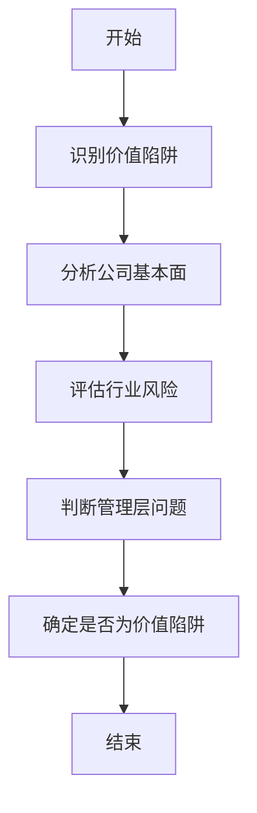
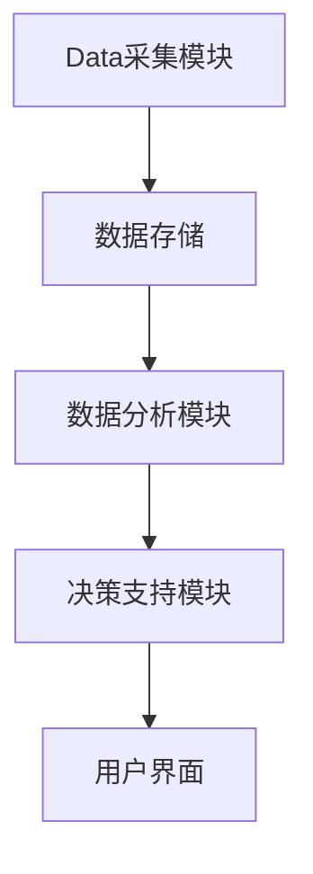

                 


# 彼得林奇的"价值陷阱"在不同市场周期的表现

**关键词：** 价值陷阱，彼得·林奇，市场周期，投资策略，价值投资

**摘要：** 彼得·林奇的“价值陷阱”理论是投资领域的重要概念，本文将深入探讨该理论在不同市场周期中的表现，结合具体案例和数学模型，分析其识别方法和应对策略。

---

## 第一章：价值投资与价值陷阱的基本概念

### 1.1 价值投资的定义与核心理念

#### 1.1.1 价值投资的起源与发展

价值投资是一种投资策略，起源于20世纪初，由本杰明·格雷厄姆和戴维·多德提出。该理论强调以低于内在价值的价格购买优质股票，长期持有，等待其价值回归。彼得·林奇继承并发展了这一理念，特别提出了“价值陷阱”概念。

#### 1.1.2 彼得·林奇的投资理念与风格

彼得·林奇以其在富达投资管理公司的成功投资业绩闻名。他强调基本面分析，注重公司财务状况、管理层能力和行业地位。林奇的投资风格以稳健著称，善于在市场波动中寻找被低估的股票。

#### 1.1.3 价值陷阱的定义与特点

价值陷阱是指那些看似估值低廉，但实际存在严重问题的股票。这些股票可能因为行业衰退、管理不善或财务困境等原因，导致其价值无法回升，甚至进一步下跌。

### 1.2 彼得·林奇的“价值陷阱”理论

#### 1.2.1 价值陷阱的形成原因

价值陷阱通常形成于市场波动时期，投资者可能因为恐慌或过度乐观而忽视公司基本面。例如，在牛市中，投资者可能追逐高估值股票，忽视潜在风险；在熊市中，恐慌性抛售可能导致优质股被错杀。

#### 1.2.2 价值陷阱的主要类型

1. **行业困境型**：所在行业面临衰退，市场需求下降，公司难以转型。
2. **管理问题型**：公司管理层决策失误，导致业绩持续下滑。
3. **财务危机型**：公司财务状况恶化，面临债务危机或破产风险。

#### 1.2.3 价值陷阱与市场周期的关系

价值陷阱在不同市场周期中的表现各异。牛市中，投资者可能忽视基本面，导致高估值股票成为陷阱；熊市中，恐慌性抛售可能导致优质股被错杀；而在理性市场中，价值陷阱可能表现为低估值但基本面不佳的股票。

---

## 第二章：不同市场周期中的价值陷阱表现

### 2.1 牛市中的价值陷阱

#### 2.1.1 牛市的特点与投资者心理

牛市期间，市场情绪高涨，投资者倾向于高估股票价值。此时，价值陷阱可能表现为高市盈率、高市净率但业绩不佳的股票。投资者可能因为盲目追逐市场热点而陷入价值陷阱。

#### 2.1.2 牛市中价值陷阱的典型表现

1. **高估值但业绩不佳的股票**：市盈率远高于行业平均水平，但利润增长放缓。
2. **概念炒作型股票**：市场炒作概念，缺乏实质性业绩支撑。
3. **行业周期性风险**：行业处于峰值期，未来可能出现衰退。

#### 2.1.3 牛市中识别价值陷阱的关键指标

- 市盈率（P/E）：关注市盈率是否远高于行业平均水平。
- 市净率（P/B）：评估股价是否远高于账面价值。
- 净利润增长率：检查公司利润是否持续增长。

### 2.2 熊市中的价值陷阱

#### 2.2.1 熊市的特点与投资者心理

熊市期间，市场情绪低落，投资者倾向于恐慌性抛售。此时，价值陷阱可能表现为优质股被错杀，股价远低于其内在价值。投资者可能因恐慌而忽视公司基本面，导致优质股成为价值陷阱。

#### 2.2.2 熊市中价值陷阱的典型表现

1. **优质股被错杀**：公司基本面良好，但由于市场恐慌，股价大幅下跌。
2. **行业衰退型股票**：行业面临长期衰退，公司难以转型。
3. **管理层问题型股票**：管理层决策失误，导致公司业绩持续下滑。

#### 2.2.3 熊市中识别价值陷阱的关键指标

- 市净率（P/B）：检查股价是否远低于账面价值。
- 股息率：评估公司是否具有稳定的股息支付能力。
- 净利润增长率：关注公司利润是否持续增长。

### 2.3 理性市场中的价值陷阱

#### 2.3.1 理性市场的特点与投资者心理

理性市场中，投资者情绪较为平稳，注重基本面分析。此时，价值陷阱可能表现为低估值但基本面不佳的股票。投资者可能因过于关注估值而忽视公司财务状况。

#### 2.3.2 理性市场中价值陷阱的典型表现

1. **低估值但财务状况不佳的股票**：公司资产负债表恶化，面临债务危机。
2. **行业转型期股票**：行业处于转型期，公司难以适应变化。
3. **管理层问题型股票**：管理层决策失误，导致公司战略失误。

#### 2.3.3 理性市场中识别价值陷阱的关键指标

- 资产负债率：评估公司财务状况是否健康。
- 净利润增长率：检查公司利润是否持续增长。
- 现金流状况：关注公司现金流是否健康。

---

## 第三章：价值陷阱的核心概念与联系

### 3.1 价值陷阱的核心原理

#### 3.1.1 价值陷阱的核心要素

价值陷阱的核心要素包括：高估值、低成长性、财务状况恶化、行业衰退风险、管理层问题等。

#### 3.1.2 价值陷阱的内在逻辑

价值陷阱的内在逻辑在于，公司基本面问题导致其内在价值无法支撑当前股价。投资者可能因为忽视这些基本面问题而买入，导致亏损。

#### 3.1.3 价值陷阱与其他投资陷阱的对比

| 陷阱类型 | 核心特征 | 表现形式 | 风险程度 |
|----------|----------|----------|----------|
| 价值陷阱 | 高估值、低成长性 | 低估值但基本面差 | 中高 |
| 质量陷阱 | 低质量产品 | 销量下降 | 高 |
| 管理陷阱 | 管理层问题 | 业绩持续下滑 | 高 |

### 3.2 价值陷阱的属性特征对比

#### 3.2.1 价值陷阱的属性特征表格

| 属性 | 特征 | 描述 |
|------|------|------|
| 估值 | 高估值 | 市盈率、市净率远高于行业平均水平 |
| 成长性 | 低 | 净利润增长率持续下降 |
| 财务状况 | 恶化 | 资产负债率高，现金流不佳 |
| 行业风险 | 高 | 行业衰退或转型期 |
| 管理问题 | 存在 | 管理层决策失误 |

#### 3.2.2 价值陷阱的ER实体关系图

```mermaid
erDiagram
    company {
        key id : int
        name : string
        industry : string
        revenue : float
        net_profit : float
        market_value : float
    }
    value_trap {
        id : int
        company_id : int
        reason : string
        risk_level : int
    }
    company --> value_trap : "is a"
```

#### 3.2.3 价值陷阱的Mermaid流程图



---

## 第四章：价值陷阱的数学模型与算法原理

### 4.1 价值陷阱的数学模型

#### 4.1.1 价值陷阱的数学公式

1. 市盈率（P/E）：
   \[
   P/E = \frac{\text{股价}}{\text{每股收益}}
   \]
2. 市净率（P/B）：
   \[
   P/B = \frac{\text{股价}}{\text{每股净资产}}
   \]
3. 净利润增长率：
   \[
   \text{净利润增长率} = \frac{\text{当前净利润} - \text{上期净利润}}{\text{上期净利润}} \times 100\%
   \]

#### 4.1.2 价值陷阱的数学模型分析

通过分析市盈率、市净率和净利润增长率，可以识别价值陷阱。例如，如果某股票的P/E和P/B远高于行业平均水平，但净利润增长率持续下降，可能是价值陷阱。

#### 4.1.3 价值陷阱的数学模型应用

以某科技公司为例，假设其P/E为50，远高于行业平均水平，但净利润增长率仅为5%，可能表明其股价高估，存在价值陷阱风险。

---

## 第五章：系统分析与架构设计

### 5.1 问题场景介绍

识别价值陷阱需要分析公司基本面、行业风险和管理层问题。系统需要支持数据采集、分析和决策。

### 5.2 系统功能设计

#### 5.2.1 数据采集模块

- 采集公司财务数据、行业信息和市场数据。
- 数据来源包括上市公司财报、行业报告和市场新闻。

#### 5.2.2 数据分析模块

- 计算市盈率、市净率和净利润增长率。
- 评估行业风险和管理层问题。

#### 5.2.3 决策支持模块

- 生成价值陷阱评估报告。
- 提供投资建议。

### 5.3 系统架构设计



---

## 第六章：项目实战

### 6.1 环境安装

- 安装Python和相关数据分析库（如Pandas、NumPy）。
- 安装数据分析工具（如Excel、SQL）。

### 6.2 系统核心实现源代码

```python
import pandas as pd

def identify_value_trap(ticker):
    # 获取数据
    df = get_company_data(ticker)
    # 计算市盈率和市净率
    pe = df['股价'] / df['每股收益']
    pb = df['股价'] / df['每股净资产']
    # 判断是否为价值陷阱
    if pe > industry_pe和pb > industry_pb and df['净利润增长率'] < 0:
        return True
    else:
        return False
```

### 6.3 实际案例分析

分析某公司股票，判断其是否为价值陷阱。通过计算市盈率、市净率和净利润增长率，结合行业风险和管理层问题，得出结论。

---

## 第七章：小结与注意事项

### 7.1 小结

彼得·林奇的价值陷阱理论在不同市场周期中表现各异。投资者需结合市场环境和公司基本面，谨慎识别价值陷阱。

### 7.2 注意事项

- 避免仅依赖估值指标，需综合考虑公司基本面。
- 定期复盘，及时调整投资策略。

### 7.3 未来展望

未来研究可结合大数据和机器学习，开发更精准的价值陷阱识别模型。

---

## 作者：AI天才研究院 & 禅与计算机程序设计艺术

---

这篇文章系统地分析了彼得·林奇的“价值陷阱”在不同市场周期中的表现，结合理论、案例和数学模型，为投资者提供了实用的识别方法和应对策略。

