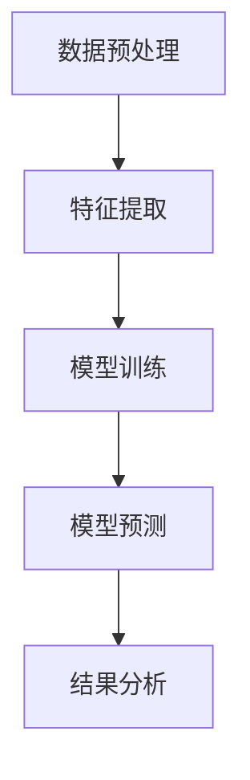
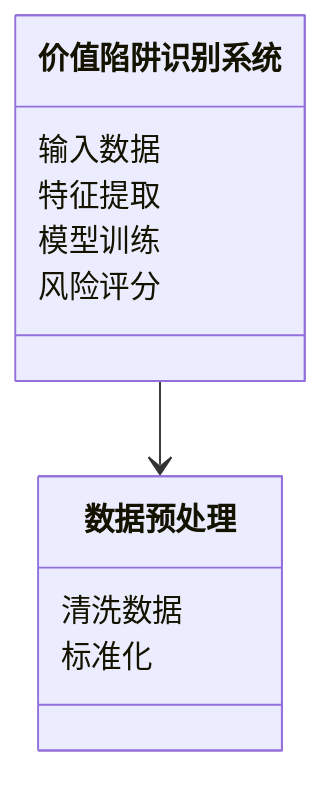
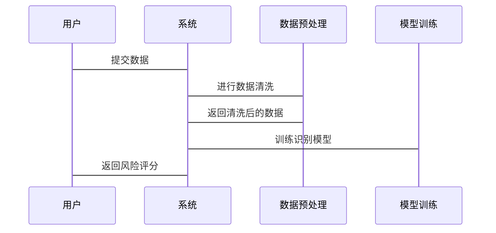

                 


# 彼得林奇的"价值陷阱"在新兴市场中的识别技巧

> 关键词：价值陷阱、彼得林奇、新兴市场、投资策略、风险管理、算法识别、系统架构

> 摘要：本文系统地探讨了彼得林奇提出的“价值陷阱”这一投资概念在新兴市场中的识别技巧。通过分析价值陷阱的核心要素、识别算法、系统架构设计以及实际案例分析，本文为投资者提供了一套在新兴市场中识别和规避价值陷阱的完整方法论。文章内容涵盖价值陷阱的定义、识别指标、数学模型、系统设计和实际应用，旨在帮助投资者在复杂的新兴市场中做出明智的投资决策。

---

## 第1章: 价值陷阱的定义与背景

### 1.1 价值陷阱的核心概念

#### 1.1.1 价值陷阱的定义
价值陷阱是指那些看似具有吸引力，实则存在严重问题或风险的投资标的。彼得林奇在其投资理论中指出，价值陷阱通常表现为低估值的表象下隐藏着高风险或不可逆的负面因素，如财务造假、管理层腐败、行业衰退等。这些陷阱看似便宜，实则会带来重大损失。

#### 1.1.2 价值陷阱的形成机制
价值陷阱的形成通常与市场信息不对称、投资者情绪波动以及标的本身的结构性问题有关。在新兴市场中，由于市场流动性较低、信息透明度不足，价值陷阱更容易出现。

#### 1.1.3 价值陷阱与投资风险的关系
价值陷阱是投资风险的重要来源之一。投资者如果误将价值陷阱视为低估的投资机会，可能会遭受重大损失。因此，识别和规避价值陷阱是投资决策中的关键环节。

### 1.2 新兴市场的特点与挑战

#### 1.2.1 新兴市场的定义与特征
新兴市场是指那些经济增长迅速、市场机制逐步完善但尚未成熟的国家或地区的金融市场。其特点包括市场规模较小、流动性较低、信息不透明、政策变化频繁等。

#### 1.2.2 新兴市场中的投资机会
新兴市场通常具有较高的增长潜力，尤其是在科技、消费、金融等领域存在大量投资机会。但由于市场波动较大，投资者需要具备较高的风险识别能力。

#### 1.2.3 新兴市场的独特风险
新兴市场中的风险主要体现在政策风险、市场流动性风险、企业治理风险等方面。这些风险在价值陷阱的识别中显得尤为重要。

---

## 第2章: 价值陷阱的识别原理

### 2.1 价值陷阱的核心要素

#### 2.1.1 价值陷阱的关键属性
价值陷阱的关键属性包括：
- **低估值**：市盈率、市净率等指标远低于行业平均水平。
- **负面基本面**：收入下降、利润亏损、债务激增等。
- **管理层问题**：管理层腐败、内部治理混乱等。
- **行业风险**：所在行业衰退或政策打压。

#### 2.1.2 价值陷阱的识别指标
以下是常用的识别指标：

| 指标名称   | 定义与作用                     |
|------------|----------------------------|
| 市盈率     | 价格与每股收益的比值，衡量估值水平。 |
| 市净率     | 价格与每股净资产的比值，反映资产价值。 |
| 负债率     | 负债与资产的比值，评估财务健康状况。 |
| 净利润增长率 | 净利润同比增长率，衡量盈利能力。  |
| 现金流      | 经营活动现金流，评估企业造血能力。  |

#### 2.1.3 价值陷阱的量化模型
价值陷阱的量化模型可以表示为：

$$ \text{价值陷阱风险} = \text{低估值} \times \text{负面基本面} \times \text{管理层问题} \times \text{行业风险} $$

---

### 2.2 价值陷阱与企业基本面分析

#### 2.2.1 企业基本面分析的定义
企业基本面分析是指通过对企业的财务报表、行业地位、管理层素质等多方面进行分析，评估企业的内在价值和风险。

#### 2.2.2 价值陷阱在基本面分析中的表现
在基本面分析中，价值陷阱通常表现为：
- 财务报表数据异常，如收入与利润不匹配。
- 现金流持续为负，但估值指标显示低估值。
- 管理层频繁变动或存在重大诉讼。

#### 2.2.3 市盈率、市净率等指标在识别中的作用
市盈率和市净率是基本面分析中常用的估值指标。然而，在价值陷阱识别中，需要结合其他指标进行综合判断。

---

## 第3章: 价值陷阱的识别算法与数学模型

### 3.1 价值陷阱识别的算法原理

#### 3.1.1 基于机器学习的价值陷阱识别算法
以下是基于机器学习的识别算法流程：



该算法通过对企业财务数据、市场数据等多维特征进行训练，识别潜在的价值陷阱。

#### 3.1.2 算法的输入特征与输出结果
- **输入特征**：市盈率、市净率、负债率、净利润增长率等。
- **输出结果**：价值陷阱风险评分（0-10分）。

#### 3.1.3 算法的优缺点分析
优点：能够处理多维数据，发现非线性关系。缺点：需要大量数据支持，且模型易受数据偏差影响。

### 3.2 数学模型与公式

#### 3.2.1 价值陷阱识别的数学模型
以下是一个简化的数学模型：

$$ \text{风险评分} = \alpha \times \text{市盈率} + \beta \times \text{市净率} + \gamma \times \text{负债率} + \delta \times \text{净利润增长率} $$

其中，$\alpha, \beta, \gamma, \delta$为权重系数，通常通过回归分析确定。

#### 3.2.2 关键公式解释
市盈率公式：

$$ \text{市盈率} = \frac{\text{股价}}{\text{每股收益}} $$

市净率公式：

$$ \text{市净率} = \frac{\text{股价}}{\text{每股净资产}} $$

#### 3.2.3 公式推导与应用示例
以某公司为例，假设其市盈率为20，市净率为3，负债率为50%，净利润增长率为-10%。代入模型：

$$ \text{风险评分} = 0.3 \times 20 + 0.2 \times 3 + 0.4 \times 50 + 0.1 \times (-10) = 6 + 0.6 + 20 - 1 = 25.6 $$

风险评分为25.6，属于高风险区域，应避免投资。

---

## 第4章: 系统分析与架构设计

### 4.1 问题场景介绍

#### 4.1.1 新兴市场中的价值陷阱识别需求
在新兴市场中，投资者需要快速识别价值陷阱，避免重大损失。

#### 4.1.2 系统的目标与范围
系统目标：开发一个基于机器学习的识别系统，帮助投资者识别新兴市场中的价值陷阱。

#### 4.1.3 系统的约束条件
- 数据来源：上市公司财务报表、市场数据。
- 算法选择：基于机器学习的分类算法。

### 4.2 系统功能设计

#### 4.2.1 领域模型（Mermaid 类图）


#### 4.2.2 系统架构设计（Mermaid 架构图）
```mermaid
archi
    计算机
    中间件
    数据库
    价值陷阱识别系统
    用户界面
    网络
```

#### 4.2.3 系统接口设计
- 输入接口：接受财务数据和市场数据。
- 输出接口：输出风险评分和分析报告。

#### 4.2.4 系统交互设计（Mermaid 序列图）


---

## 第5章: 项目实战与案例分析

### 5.1 环境安装与配置

#### 5.1.1 开发环境的选择
推荐使用Python + TensorFlow进行开发。

#### 5.1.2 工具安装与配置
安装Python、Pandas、Scikit-learn、TensorFlow等工具。

#### 5.1.3 数据源获取与处理
从新兴市场的上市公司中获取财务数据，进行清洗和标准化。

### 5.2 核心算法实现

#### 5.2.1 价值陷阱识别算法的实现代码
```python
import pandas as pd
from sklearn.model_selection import train_test_split
from sklearn.linear_model import LogisticRegression

# 数据加载与预处理
data = pd.read_csv('emerging_markets.csv')
X = data[['市盈率', '市净率', '负债率', '净利润增长率']]
y = data['是否价值陷阱']  # 1表示是，0表示否

# 数据划分
X_train, X_test, y_train, y_test = train_test_split(X, y, test_size=0.2)

# 模型训练
model = LogisticRegression()
model.fit(X_train, y_train)

# 模型预测
predictions = model.predict(X_test)
print("预测结果:", predictions)
```

#### 5.2.2 代码的功能解读与分析
上述代码实现了基于逻辑回归的分类模型，用于预测新兴市场中的价值陷阱。

#### 5.2.3 代码优化与改进
可以通过引入更多特征或使用更复杂的模型（如随机森林）来优化性能。

### 5.3 案例分析与结果解读

#### 5.3.1 实际案例的选择与分析
以某新兴市场中的科技公司为例，分析其是否为价值陷阱。

#### 5.3.2 算法在案例中的应用结果
通过模型预测，该公司的风险评分为7分，属于中高风险，建议投资者谨慎考虑。

#### 5.3.3 结果的解释与总结
该案例表明，算法能够有效识别新兴市场中的价值陷阱，帮助投资者避免潜在风险。

---

## 第6章: 总结与最佳实践

### 6.1 小结
本文系统地探讨了彼得林奇的“价值陷阱”在新兴市场中的识别技巧，通过理论分析、算法实现和案例研究，为投资者提供了实用的识别方法。

### 6.2 注意事项
- 价值陷阱识别需要结合多维数据和多模型验证。
- 在新兴市场中，政策和行业风险尤为重要。

### 6.3 拓展阅读
建议读者阅读彼得林奇的《选股之道》以及相关机器学习在金融领域的应用书籍。

---

作者：AI天才研究院/AI Genius Institute & 禅与计算机程序设计艺术/Zen And The Art of Computer Programming

