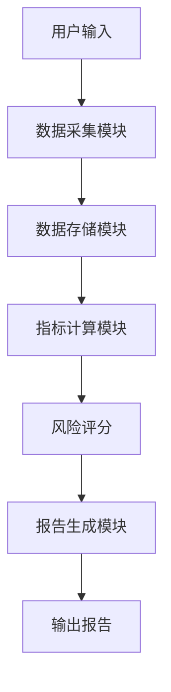

                 


# 彼得林奇的"价值陷阱"在新兴科技股中的识别指标体系

> **关键词**：彼得林奇，价值陷阱，新兴科技股，财务指标，技术指标，市场指标，投资分析  
> **摘要**：本文系统地探讨了彼得林奇的价值陷阱理论在新兴科技股投资中的应用，通过构建一套综合的指标体系，帮助投资者识别和规避价值陷阱。文章从理论基础出发，详细分析了新兴科技股的特点和风险，设计了涵盖财务、技术和市场三方面的核心指标，并通过实际案例和系统开发的实战分析，展示了如何将这些指标应用于投资决策中。最后，本文总结了投资策略和注意事项，为投资者提供了实用的指导。

---

## 第1章: 彼得林奇的价值陷阱理论概述

### 1.1 价值陷阱的核心概念

#### 1.1.1 价值陷阱的定义与背景
彼得·林奇在《彼得·林奇的成功投资》中提出，“价值陷阱”是指那些看似估值低廉，但实际上存在严重问题（如财务状况恶化、管理层问题或行业衰退）的公司。这些公司表面上看像“便宜货”，但长期持有会导致投资损失。

#### 1.1.2 价值陷阱的核心特征
1. **财务恶化**：收入下降、利润减少、负债增加。
2. **管理层问题**：管理层决策失误、内部腐败或战略不清。
3. **行业衰退**：所在行业面临结构性衰退或技术替代。

#### 1.1.3 价值陷阱与传统价值投资的区别
- **传统价值投资**：寻找被市场低估的优质公司，长期持有。
- **价值陷阱**：看似低估，但公司本身存在问题，导致估值不可持续。

### 1.2 新兴科技股的特点与风险

#### 1.2.1 新兴科技股的高成长性
科技股通常具有较高的成长性，尤其在人工智能、云计算、5G等领域，公司收入和利润可能快速增长。

#### 1.2.2 新兴科技股的高波动性
科技股受市场情绪和技术进步的影响较大，股价波动剧烈，短期内可能大幅波动。

#### 1.2.3 新兴科技股的主要风险类型
1. **技术风险**：技术落后或创新不足。
2. **市场风险**：市场需求变化或竞争加剧。
3. **财务风险**：高负债率或现金流不稳定。

---

## 第2章: 价值陷阱在科技股中的表现形式

### 2.1 价值陷阱的常见表现

#### 2.1.1 财务指标异常的表现
- **营收增速放缓**：收入增长乏力，可能暗示市场需求下降。
- **利润率下滑**：毛利率和净利率双双下降，表明成本控制能力减弱。
- **现金流为负**：经营活动现金流为负，公司可能难以维持运营。

#### 2.1.2 市场表现异常的表现
- **股价远低于行业平均水平**：股价严重低估，但公司基本面差。
- **成交量持续低迷**：交投不活跃，投资者信心不足。
- **市盈率显著低于行业**：市盈率远低于行业平均水平，但公司盈利增长乏力。

#### 2.1.3 管理层问题的表现
- **频繁更换高管**：管理层不稳定，可能影响公司战略。
- **大股东减持**：大股东或高管大量减持，可能暗示公司前景不佳。

### 2.2 科技股中的典型价值陷阱案例

#### 2.2.1 过度依赖单一产品的公司
- **案例分析**：某科技公司依赖单一产品，市场替代品出现后，收入骤降。
- **风险特征**：收入集中度高，抗风险能力弱。

#### 2.2.2 财务造假的公司
- **案例分析**：某公司虚增收入和利润，掩盖财务窟窿。
- **风险特征**：财务数据不透明，现金流与收入不匹配。

#### 2.2.3 技术落后但估值过高的公司
- **案例分析**：某公司技术落后于行业，但估值远高于竞争对手。
- **风险特征**：研发投入不足，技术更新缓慢。

---

## 第3章: 新兴科技股价值陷阱识别的核心指标体系

### 3.1 财务指标体系

#### 3.1.1 营收与利润增长指标
- **营收增长率**：（本期营收 - 上期营收）/上期营收 × 100%。
- **净利润率**：净利润 / 营收 × 100%。
- **现金流健康度**：经营活动现金流是否为正，自由现金流是否增长。

#### 3.1.2 净利润率与毛利率
- **毛利率**：（营收 - COGS）/营收 × 100%。
- **净利润率**：净利润 / 营收 × 100%。
- **毛利率下降预警**：毛利率连续两年下降，可能暗示成本控制能力减弱。

#### 3.1.3 负债率与现金流状况
- **负债率**：总负债 / 总资产 × 100%。
- **现金流与收入匹配度**：经营活动现金流是否与营收增长同步。

### 3.2 技术指标体系

#### 3.2.1 市盈率与市净率
- **市盈率（P/E）**：股价 / 每股收益。
- **市净率（P/B）**：股价 / 每股净资产。
- **P/E与行业对比**：P/E显著低于行业，但营收增长乏力。

#### 3.2.2 市销率与市销率相对比率
- **市销率（P/S）**：股价 / 每股营收。
- **市销率相对比率**：P/S比行业平均低，但公司营收增长缓慢。

#### 3.2.3 股价波动率与成交量
- **波动率**：股价波动幅度是否远高于行业平均水平。
- **成交量变化**：股价下跌时成交量放大，可能暗示抛售压力。

### 3.3 市场指标体系

#### 3.3.1 行业竞争格局分析
- **市场集中度**：行业前五名的市场份额是否集中。
- **竞争态势**：是否存在激烈的价格战或技术替代。

#### 3.3.2 市场占有率与品牌价值
- **市场占有率**：公司市场份额是否稳定或增长。
- **品牌价值**：品牌是否在行业内具有领先地位。

#### 3.3.3 管理层稳定性与战略规划
- **高管团队稳定性**：高管是否频繁变动。
- **战略清晰度**：公司是否具有明确的中长期战略目标。

---

## 第4章: 指标体系的构建与权重分配

### 4.1 指标体系的构建逻辑

#### 4.1.1 指标筛选的原则
1. **相关性**：指标应与公司价值密切相关。
2. **可量化**：指标应可以通过财务报表或公开数据获取。
3. **可比较**：指标应能够在行业内进行横向比较。

#### 4.1.2 指标之间的关联性分析
- **财务指标与技术指标的关联**：高负债率可能反映公司财务风险，而低市盈率可能掩盖技术落后的问题。
- **技术指标与市场指标的关联**：高波动率可能反映市场对公司前景的不确定性。

### 4.2 指标权重分配

#### 4.2.1 财务指标权重
- 营收增长率：30%
- 净利润率：25%
- 现金流健康度：20%

#### 4.2.2 技术指标权重
- 市盈率：20%
- 市销率：15%
- 股价波动率：10%

#### 4.2.3 市场指标权重
- 市场占有率：15%
- 竞争格局：10%
- 管理层稳定性：5%

---

## 第5章: 实战案例分析

### 5.1 案例一：某新兴科技公司

#### 5.1.1 公司概况
- 主营人工智能技术。
- 营收连续两年增长，但净利润率逐年下降。
- 负债率高达70%，现金流为负。

#### 5.1.2 指标分析
- 营收增长率：20%（行业平均：25%）。
- 净利润率：5%（行业平均：15%）。
- 市盈率：10（行业平均：20）。
- 现金流：-500万。

#### 5.1.3 结论
- 净利润率和现金流表现不佳，负债率过高，存在明显的财务风险，属于价值陷阱。

### 5.2 案例二：某云计算公司

#### 5.2.1 公司概况
- 主营云计算服务。
- 营收增长迅速，但毛利率下降。
- 管理层近期频繁变动。

#### 5.2.2 指标分析
- 营收增长率：30%（行业平均：20%）。
- 毛利率：40%（行业平均：50%）。
- 市盈率：30（行业平均：25）。
- 管理层变动：CEO和CTO在一年内更换。

#### 5.2.3 结论
- 营收增长强劲，但毛利率下降，管理层不稳定，存在潜在的价值陷阱风险。

---

## 第6章: 系统开发与实现

### 6.1 系统需求分析

#### 6.1.1 功能需求
- 数据采集：获取公司财务数据、股价数据、行业数据。
- 指标计算：根据指标体系计算各项指标。
- 风险评估：根据指标权重生成风险评分。
- 报告生成：生成分析报告，提示价值陷阱风险。

#### 6.1.2 数据来源
- 财务数据：公司财报。
- 股价数据：股票交易所数据。
- 行业数据：行业研究报告。

### 6.2 系统架构设计

#### 6.2.1 系统功能模块
- 数据采集模块：爬取和存储数据。
- 指标计算模块：计算各项指标并生成风险评分。
- 报告生成模块：输出分析报告。

#### 6.2.2 系统架构图


### 6.3 系统实现

#### 6.3.1 数据采集代码
```python
import requests
from bs4 import BeautifulSoup

def fetch_data(company):
    url = f"https://finance.yahoo.com/{company}"
    response = requests.get(url)
    soup = BeautifulSoup(response.text, 'html.parser')
    # 提取数据
    return data
```

#### 6.3.2 指标计算代码
```python
def calculate_metrics(data):
    metrics = {}
    metrics['revenue_growth'] = (data['revenue'] - data['revenue_prev']) / data['revenue_prev'] * 100
    metrics['net_profit_margin'] = data['net_profit'] / data['revenue'] * 100
    metrics['pe_ratio'] = data['price'] / data['eps']
    return metrics
```

#### 6.3.3 风险评分算法
```python
def calculate_risk_score(metrics):
    score = 0
    score += max(0, 30 - metrics['revenue_growth'])  # 营收增长率低扣分
    score += max(0, 20 - metrics['net_profit_margin'])  # 净利润率低扣分
    score += max(0, 20 - (data['pe_ratio'] / data['pe_ratio_industry'] * 100))  # 市盈率低于行业基准
    return score
```

---

## 第7章: 投资策略与注意事项

### 7.1 投资策略

#### 7.1.1 避免价值陷阱的策略
1. **分散投资**：避免将所有资金投入单一科技股。
2. **定期评估**：定期重新评估投资组合，及时调整。
3. **关注行业趋势**：选择成长性好、行业前景广阔的公司。

#### 7.1.2 价值陷阱的防范措施
1. **深入研究公司基本面**：分析财务报表和管理层背景。
2. **关注行业动态**：了解行业竞争格局和技术发展趋势。
3. **设置止损点**：在股价跌破某一阈值时及时止损。

### 7.2 投资注意事项

#### 7.2.1 风险提示
- **技术风险**：科技股受技术进步影响较大，技术落后可能导致公司被淘汰。
- **市场风险**：行业波动大，市场需求变化可能影响公司业绩。
- **政策风险**：政策变化可能对行业产生重大影响。

#### 7.2.2 投资心态
- **避免情绪化投资**：科技股波动大，投资者应保持冷静，避免被市场情绪左右。
- **长期视角**：投资科技股需要耐心，关注公司长期成长潜力。

---

## 第8章: 总结与展望

### 8.1 总结
本文通过彼得林奇的价值陷阱理论，构建了一套适用于新兴科技股的识别指标体系，帮助投资者识别和规避价值陷阱。文章从理论分析、指标设计、系统开发到实战案例，全面探讨了如何在科技股投资中应用这一理论。

### 8.2 展望
未来，随着科技行业的快速发展，价值陷阱的识别将更加复杂。建议投资者持续关注行业动态，结合新兴技术（如大数据分析和人工智能）来优化指标体系，提高投资决策的准确性。

---

## 作者：AI天才研究院 & 禅与计算机程序设计艺术

---

以上是《彼得林奇的"价值陷阱"在新兴科技股中的识别指标体系》的技术博客文章的完整内容，希望对您有所帮助！

