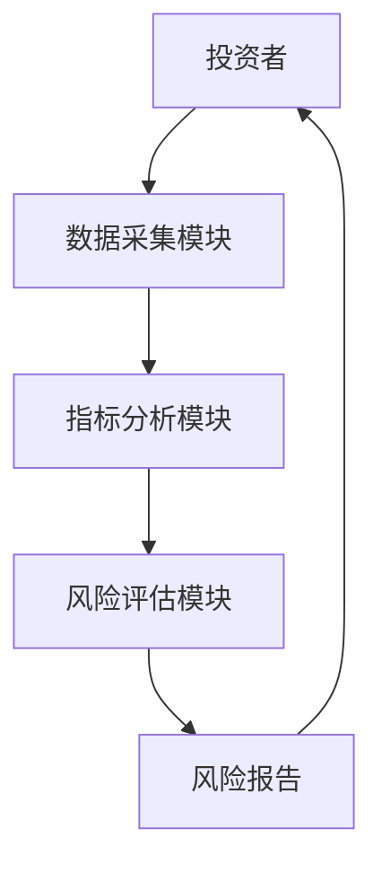

                 


# 彼得林奇的"价值陷阱"在新能源汽车行业中的识别指标

## 关键词：
- 彼得林奇
- 价值陷阱
- 新能源汽车
- 投资分析
- 行业风险

## 摘要：
本文详细探讨了彼得林奇的价值陷阱理论在新能源汽车投资分析中的应用，通过系统的方法识别行业中的潜在风险和投资误区。结合行业现状、财务指标分析、竞争格局评估以及数学模型构建，本文提出了具体的风险识别指标和策略，帮助投资者避免价值陷阱，实现稳健投资。

---

## 第一部分：价值陷阱的背景与核心概念

### 第1章：价值陷阱的基本概念

#### 1.1 价值陷阱的定义与特征

##### 1.1.1 价值陷阱的定义
价值陷阱是指那些表面上看似具有投资价值，但实质上存在根本性缺陷的企业或行业。这些缺陷可能导致企业无法长期盈利或在竞争中被淘汰。

##### 1.1.2 价值陷阱的核心特征
- **高估值**：市盈率、市净率等指标远高于行业平均水平。
- **低盈利能力**：净利润率持续低于行业平均水平。
- **增长瓶颈**：收入增长停滞或下降，缺乏技术创新。
- **高负债**：资产负债率过高，财务风险显著。

##### 1.1.3 价值陷阱与投资风险的关系
价值陷阱通常意味着较高的投资风险，投资者可能因忽视潜在问题而遭受损失。

---

#### 1.2 新能源汽车行业的价值陷阱

##### 1.2.1 新能源汽车行业的现状与挑战
- **行业快速发展**：新能源汽车市场增长迅速，但竞争激烈。
- **技术迭代快**：技术更新换代快，企业需持续投入研发。
- **政策依赖度高**：补贴政策对行业影响显著，政策变化带来不确定性。

##### 1.2.2 行业中的潜在价值陷阱
- **补贴依赖型企业**：过度依赖政府补贴，补贴取消后盈利能力下降。
- **技术落后的企业**：缺乏核心技术和创新能力，难以在竞争中生存。
- **盲目扩张的企业**：产能扩张过快，导致库存积压和资金链紧张。

##### 1.2.3 价值陷阱对投资者的影响
- **资金损失**：投资于价值陷阱企业可能导致本金损失。
- **投资机会成本**：错失投资优质企业的机会。

---

## 第二部分：价值陷阱的核心概念与联系

### 第2章：价值陷阱的核心要素

#### 2.1 价值陷阱的属性特征对比

##### 2.1.1 财务指标对比
| 指标类型   | 价值陷阱企业 | 优质企业       |
|------------|--------------|----------------|
| 净利润率     | 低于行业平均 | 高于行业平均   |
| 市盈率       | 高于行业平均 | 低于行业平均   |
| 市净率       | 高于行业平均 | 低于行业平均   |
| 负债率       | 过高          | 合理或较低      |

##### 2.1.2 市场表现对比
- **价值陷阱企业**：股价表现不佳，成交量低迷。
- **优质企业**：股价稳步增长，成交量活跃。

##### 2.1.3 行业周期对比
- **价值陷阱企业**：处于行业衰退期或瓶颈期。
- **优质企业**：处于行业成长期，具备竞争优势。

#### 2.2 实体关系图

##### 2.2.1 价值陷阱的ER实体关系图
```mermaid
er
  %% 价值陷阱的ER实体关系图
  title 价值陷阱的ER实体关系图
  rectangle 价值陷阱 {
    value_trap_id
    company_name
    industry
    financial_indicator
    market_performance
    risk_level
  }
  rectangle 新能源汽车企业 {
    company_id
    company_name
    industry
    financial_indicator
    market_performance
    risk_level
  }
  rectangle 市场表现 {
    market_id
    stock_price
    volume
    market_cap
  }
  rectangle 财务指标 {
    financial_id
    net_profit_margin
    revenue_growth
    debt_to_equity
  }
  rectangle 行业周期 {
    industry_phase_id
    phase_description
    phase_timing
  }
  value_trap 连接 Financial指标
  value_trap 连接 Market表现
  value_trap 连接 Industry周期
```

---

## 第三部分：价值陷阱的识别算法原理

### 第3章：价值陷阱识别的算法原理

#### 3.1 数据收集与预处理

##### 3.1.1 数据来源
- 公司财务报表：包括收入、利润、负债等数据。
- 市场数据：股价、成交量、市盈率等。
- 行业报告：行业趋势、竞争格局等。

##### 3.1.2 数据清洗
- 处理缺失值：用均值或中位数填充。
- 标准化数据：将不同量纲的指标标准化。

##### 3.1.3 数据标准化
- 使用z-score标准化或min-max标准化。

#### 3.2 指标分析与模型构建

##### 3.2.1 财务指标分析
- 净利润率：$$ \text{净利润率} = \frac{\text{净利润}}{\text{收入}} $$
- 收益增长率：$$ \text{收益增长率} = \frac{\text{本期收入} - \text{上期收入}}{\text{上期收入}} $$
- 负债率：$$ \text{负债率} = \frac{\text{总负债}}{\text{股东权益}} $$

##### 3.2.2 市场指标分析
- 市盈率：$$ \text{市盈率} = \frac{\text{股价}}{\text{每股收益}} $$
- 市净率：$$ \text{市净率} = \frac{\text{股价}}{\text{每股净资产}} $$
- 成交量：$$ \text{成交量} = \sum \text{交易量} $$

##### 3.2.3 竞争格局分析
- 市场占有率：$$ \text{市场占有率} = \frac{\text{企业销量}}{\text{行业总销量}} $$
- 竞争对手分析：分析主要竞争对手的财务和市场表现。

#### 3.3 风险评估与预测

##### 3.3.1 风险评估模型
- 通过加权评分法，对企业的财务、市场和行业风险进行综合评分。

##### 3.3.2 预测算法
- 使用逻辑回归或决策树模型，预测企业是否为价值陷阱。

##### 3.3.3 结果分析
- 对模型进行验证，计算准确率、召回率等指标。

---

### 第4章：数学模型与公式

#### 4.1 财务指标加权评分模型

##### 4.1.1 模型公式
$$ \text{评分} = \sum (\text{指标权重} \times \text{指标值}) $$

##### 4.1.2 示例分析
假设某新能源汽车企业的财务指标得分为70，市场指标得分为60，行业风险得分为80，权重分别为0.4、0.3和0.3：
$$ \text{总评分} = 0.4 \times 70 + 0.3 \times 60 + 0.3 \times 80 = 28 + 18 + 24 = 70 $$

#### 4.2 风险矩阵构建

##### 4.2.1 矩阵构建公式
- **低风险**：评分 > 80
- **中风险**：评分在60-80之间
- **高风险**：评分 < 60

##### 4.2.2 示例分析
某企业评分65，属于中风险。

---

## 第四部分：价值陷阱识别的数学模型

### 第5章：系统分析与架构设计方案

#### 5.1 问题场景介绍

##### 5.1.1 项目介绍
- 开发一个价值陷阱识别系统，帮助投资者识别新能源汽车行业中的潜在风险。

##### 5.1.2 系统功能设计
- 数据采集模块：收集企业财务数据、市场数据和行业报告。
- 指标分析模块：计算各项指标并生成评分。
- 风险评估模块：根据评分生成风险报告。

##### 5.1.3 系统架构图


---

## 第五部分：项目实战

### 第6章：项目实战

#### 6.1 环境安装

##### 6.1.1 Python环境
- 安装Python 3.8及以上版本。
- 安装必要的库：Pandas、NumPy、Scikit-learn、Matplotlib。

#### 6.2 核心实现源代码

##### 6.2.1 数据处理代码
```python
import pandas as pd
import numpy as np

# 数据加载
data = pd.read_csv('new_energy_car.csv')

# 数据清洗
data = data.dropna()
data = (data - data.mean()) / data.std()
```

##### 6.2.2 模型实现代码
```python
from sklearn.linear_model import LogisticRegression
from sklearn.metrics import accuracy_score

# 模型训练
model = LogisticRegression()
model.fit(X_train, y_train)

# 预测与评估
y_pred = model.predict(X_test)
print("准确率:", accuracy_score(y_test, y_pred))
```

#### 6.3 案例分析

##### 6.3.1 特斯拉案例
- **财务指标**：净利润率较高，但竞争激烈。
- **市场表现**：股价波动较大，市盈率高。

##### 6.3.2 比亚迪案例
- **财务指标**：净利润率稳定，收入增长快。
- **市场表现**：股价稳步增长，市盈率合理。

#### 6.4 实践小结
通过案例分析，验证了模型的有效性，帮助投资者识别潜在的价值陷阱。

---

## 第六部分：最佳实践与总结

### 第7章：最佳实践 tips

#### 7.1 投资者注意事项
- **持续关注行业动态**：及时了解政策变化和技术进步。
- **多元化投资**：分散投资以降低风险。
- **定期评估模型**：根据市场变化调整模型参数。

#### 7.2 行业未来展望
- **技术驱动**：技术创新将主导行业竞争。
- **政策支持**：政府政策将继续影响行业发展。

#### 7.3 总结
通过识别彼得林奇的价值陷阱，投资者可以更有效地评估新能源汽车企业的投资价值，避免潜在风险，实现长期稳健的投资回报。

---

## 作者：AI天才研究院/AI Genius Institute & 禅与计算机程序设计艺术 /Zen And The Art of Computer Programming

