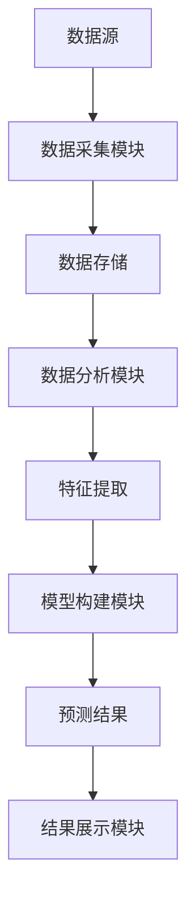

                 


# 彼得林奇的"价值陷阱"在新能源行业中的识别方法

> 关键词：价值陷阱，彼得林奇，新能源行业，投资分析，风险管理，算法识别，系统设计

> 摘要：本文探讨了彼得·林奇提出的“价值陷阱”理论在新能源行业的应用。通过分析新能源行业的特点和投资机会，结合数学模型和系统设计，详细讲解了如何识别和规避价值陷阱，为投资者提供实用的分析方法和工具。

---

# 第一部分: 彼得林奇的"价值陷阱"概述

## 第1章: 价值陷阱的基本概念

### 1.1 彼得林奇投资理论简介

彼得·林奇是全球著名的职业基金经理，以其独特的投资理念闻名。他提出的“价值陷阱”概念，提醒投资者避免投资于看似便宜但实际存在严重问题的公司。价值陷阱的核心在于识别那些表面上看有吸引力，但内在存在重大缺陷的股票。

#### 1.1.1 彼得林奇的投资者背景

彼得·林奇是富达投资集团的传奇经理人，管理过麦哲伦基金，创造了长期稳定的超额收益。他的投资理念强调深入分析公司基本面，寻找那些具有持续竞争优势和良好管理团队的企业。

#### 1.1.2 价值投资的核心理念

价值投资的核心在于寻找市场低估的股票，关注公司的内在价值。彼得·林奇强调，投资者应避免仅看表面的低估值，而忽视了公司的实际经营状况。

#### 1.1.3 价值陷阱的定义与特征

价值陷阱是指那些表面上看市盈率或市净率较低，但实际存在管理不善、行业竞争激烈或财务状况不佳等问题的公司。识别价值陷阱需要综合分析公司的财务数据、行业地位和管理层能力。

### 1.2 新能源行业的特点与投资机会

#### 1.2.1 新能源行业的现状与发展

新能源行业包括太阳能、风能、电动汽车等，是全球能源转型的核心领域。随着技术进步和政策支持，新能源行业呈现快速增长态势，吸引了大量投资。

#### 1.2.2 新能源行业的投资价值分析

新能源行业具有较高的成长性和投资潜力，尤其是在全球碳中和目标推动下，行业前景广阔。但同时也面临技术风险、政策风险和市场竞争加剧的挑战。

#### 1.2.3 新能源行业的风险与挑战

新能源行业存在技术更新快、政策变化大、市场竞争激烈等问题。投资者需要特别注意行业的周期性波动和政策依赖性，避免盲目投资。

---

## 第二部分: 价值陷阱的识别方法

## 第2章: 价值陷阱的核心概念与联系

### 2.1 价值陷阱的核心原理

价值陷阱的核心在于识别那些表面上看似便宜，但实际存在严重问题的公司。在新能源行业，这些公司可能面临技术落后、管理不善或市场需求不足的问题。

#### 2.1.1 价值陷阱的形成机制

价值陷阱通常形成于市场低迷时期，一些公司由于行业不景气或自身管理问题，导致股价被低估，但公司基本面并未改善。

#### 2.1.2 价值陷阱的关键特征

- **低估值**：市盈率、市净率等指标远低于行业平均水平。
- **高负债**：公司财务杠杆过高，偿债能力差。
- **盈利能力下降**：连续多个季度净利润率下滑。
- **管理层问题**：存在重大内控问题或管理层动荡。
- **市场需求萎缩**：产品或服务的市场需求持续下降。

#### 2.1.3 价值陷阱与新能源行业的关联

新能源行业的周期性波动较大，技术迭代快，政策变化频繁，这些都增加了价值陷阱出现的可能性。例如，某些技术落后的企业可能因为行业技术升级而被淘汰。

### 2.2 核心概念对比分析

#### 2.2.1 价值陷阱与其它投资陷阱的对比

| 比较维度 | 价值陷阱 | 其他投资陷阱 |
|----------|-----------|-------------|
| 表现形式 | 低估值但基本面差 | 高估值但基本面差 |
| 成因     | 公司自身问题 | 市场情绪过度乐观 |
| 解决方法 | 避免投资 | 分散投资风险 |

#### 2.2.2 新能源行业的特殊性分析

新能源行业具有技术驱动型和政策依赖型的特点，这些特点使得行业内的公司更容易成为价值陷阱。例如，某些公司可能因为技术落后或政策变化而迅速失去竞争优势。

#### 2.2.3 价值陷阱识别的关键指标

在新能源行业，识别价值陷阱的关键指标包括：

- **市盈率（P/E）**：用于评估公司的盈利能力。
- **市净率（P/B）**：用于评估公司的资产质量。
- **债务率**：评估公司的财务健康状况。
- **研发投入占比**：评估公司的技术创新能力。
- **管理层稳定性**：评估公司的管理风险。

---

## 第3章: 价值陷阱识别的算法原理

### 3.1 价值陷阱识别的算法流程

#### 3.1.1 数据收集与预处理

数据收集是识别价值陷阱的第一步，需要收集新能源行业的相关数据，包括财务数据、市场数据、行业数据等。预处理步骤包括数据清洗、标准化和特征选择。

#### 3.1.2 关键指标筛选

基于价值陷阱的特征，筛选出关键的财务指标，例如市盈率、市净率、债务率等。

#### 3.1.3 数据分析与建模

使用机器学习算法，如逻辑回归、随机森林等，建立分类模型，识别价值陷阱。

#### 3.1.4 模型验证与优化

通过交叉验证、ROC曲线等方法评估模型性能，并进行参数调优。

### 3.2 算法实现的Python代码示例

```python
import pandas as pd
from sklearn.ensemble import RandomForestClassifier
from sklearn.model_selection import train_test_split
from sklearn.metrics import classification_report

# 假设我们有一个包含新能源公司数据的DataFrame df
# 包含特征：市盈率、市净率、债务率、研发投入占比、管理层稳定性
# 标签：是否为价值陷阱（1表示是，0表示否）

# 数据预处理
df = pd.read_csv('new_energy_data.csv')
features = ['PE', 'PB', 'DEBT_RATIO', 'R&D', 'MANAGEMENT']
target = 'is_value_trap'

# 划分训练集和测试集
X = df[features]
y = df[target]
X_train, X_test, y_train, y_test = train_test_split(X, y, test_size=0.2, random_state=42)

# 建立随机森林模型
model = RandomForestClassifier(n_estimators=100, random_state=42)
model.fit(X_train, y_train)

# 预测
y_pred = model.predict(X_test)

# 评估
print(classification_report(y_test, y_pred))
```

---

## 第4章: 价值陷阱识别的系统架构设计

### 4.1 系统功能设计

#### 4.1.1 数据采集模块

负责从数据库或外部数据源获取新能源行业的相关数据。

#### 4.1.2 数据分析模块

对数据进行清洗、特征提取和建模分析，识别价值陷阱。

#### 4.1.3 模型构建模块

使用机器学习算法建立分类模型，预测公司是否为价值陷阱。

#### 4.1.4 结果展示模块

将分析结果以可视化的方式呈现，帮助投资者做出决策。

### 4.2 系统架构图



---

## 第5章: 项目实战与案例分析

### 5.1 环境安装与数据准备

#### 5.1.1 安装必要的Python库

安装`pandas`、`scikit-learn`、`mermaid`等库：

```bash
pip install pandas scikit-learn mermaid
```

#### 5.1.2 数据获取与预处理

从公开数据源获取新能源行业公司数据，清洗数据并提取关键特征。

### 5.2 核心代码实现

#### 5.2.1 数据分析与建模

```python
import pandas as pd
from sklearn.ensemble import RandomForestClassifier
from sklearn.model_selection import train_test_split
from sklearn.metrics import classification_report

# 加载数据
df = pd.read_csv('new_energy_data.csv')

# 特征选择
features = ['PE', 'PB', 'DEBT_RATIO', 'R&D', 'MANAGEMENT']
target = 'is_value_trap'

# 划分数据集
X = df[features]
y = df[target]
X_train, X_test, y_train, y_test = train_test_split(X, y, test_size=0.2, random_state=42)

# 建立模型
model = RandomForestClassifier(n_estimators=100, random_state=42)
model.fit(X_train, y_train)

# 预测
y_pred = model.predict(X_test)

# 评估
print(classification_report(y_test, y_pred))
```

---

## 第6章: 小结与最佳实践

### 6.1 最佳实践

- **深入研究公司基本面**：关注财务数据和管理层能力。
- **关注行业趋势**：新能源行业技术迭代快，需及时了解行业动态。
- **分散投资**：避免将所有资金投入单一行业或公司。

### 6.2 小结

本文详细探讨了彼得·林奇的“价值陷阱”理论在新能源行业的应用，通过数学模型和系统设计，为投资者提供了识别和规避价值陷阱的实用方法。希望本文能为新能源行业的投资分析提供有价值的参考。

---

作者：AI天才研究院/AI Genius Institute & 禅与计算机程序设计艺术/Zen And The Art of Computer Programming

