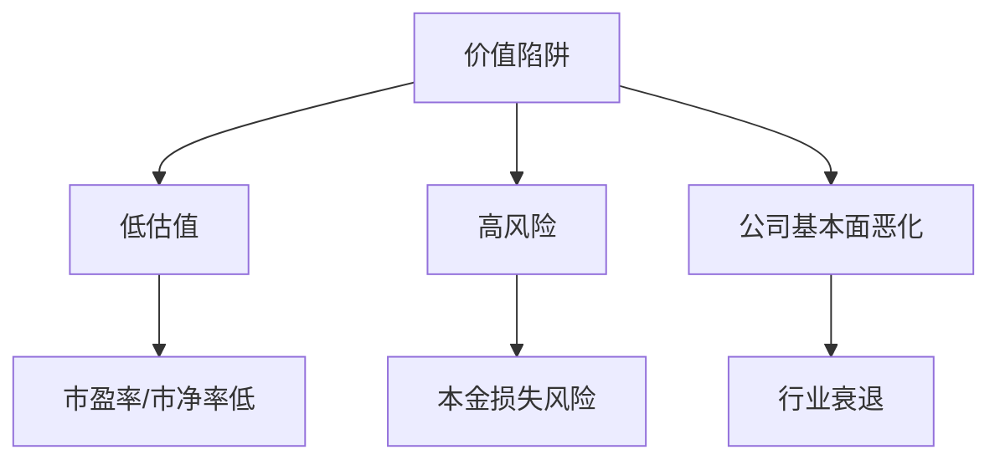

                 


# 彼得林奇的"价值陷阱"避免方法

## 关键词
- 彼得林奇
- 价值陷阱
- 投资策略
- 风险管理
- 价值评估

## 摘要
彼得林奇是全球著名的价值投资者，他提出的“价值陷阱”概念提醒投资者注意那些看似便宜实则存在问题的股票。本文系统地分析了价值陷阱的定义、特征、成因，并提供了识别和避免这些陷阱的方法。通过详细的投资策略、数学模型和实际案例分析，本文为投资者提供了实用的指导，帮助他们在投资中避免价值陷阱，实现长期稳健的收益。

---

## 正文

### 第一部分：彼得林奇投资理念概述

#### 第1章：彼得林奇的投资哲学

##### 1.1 彼得林奇的投资理念
- **价值投资的核心思想**：彼得林奇认为，投资的核心在于寻找那些被市场低估的优质公司，长期持有，伴随公司成长而获得收益。
- **长期投资的重要性**：他强调避免短期市场波动的干扰，专注于公司的长期价值。
- **避免短期波动的策略**：通过分散投资和深入研究，降低短期市场波动对投资组合的影响。

##### 1.2 价值陷阱的定义与特征
- **价值陷阱的定义**：价值陷阱是指那些表面上看市盈率、市净率等估值指标较低，但实际上存在严重问题（如行业衰退、管理不善、财务恶化等）的股票，投资者容易误判其价值。
- **价值陷阱的特征**：
  - 市场估值低，但公司基本面持续恶化。
  - 行业处于下行周期，公司缺乏竞争优势。
  - 公司管理层存在问题，如腐败或战略失误。
- **价值陷阱与成长型投资的区别**：成长型投资关注未来增长潜力，而价值陷阱看似有吸引力，实则风险极高。

##### 1.3 价值陷阱的常见类型
- **低估值陷阱**：公司估值指标看似合理，但实际业务盈利能力下降。
- **行业周期陷阱**：行业处于衰退期，公司难以扭亏为盈。
- **公司基本面变化陷阱**：公司财务状况恶化，管理团队不稳定。

---

### 第二部分：价值陷阱的核心概念与联系

#### 第2章：价值陷阱的核心概念分析

##### 2.1 核心概念原理
- **价值陷阱的本质**：价值陷阱反映了市场信息不对称和投资者情绪波动，投资者可能因为忽视潜在风险而误判股票价值。
- **价值陷阱与市场情绪的关系**：市场恐慌或过度乐观可能导致价值陷阱的出现，投资者在情绪驱动下容易忽视基本面问题。
- **价值陷阱与公司基本面的关联**：公司基本面恶化是价值陷阱的核心，包括盈利能力下降、债务增加、现金流减少等。

##### 2.2 价值陷阱与其他投资陷阱的对比
以下表格对比了价值陷阱与其他常见投资陷阱的特征、成因和风险：

| 投资陷阱类型 | 特征 | 成因 | 风险 |
|--------------|------|------|------|
| 价值陷阱    | 低估值，高风险 | 公司基本面恶化，行业衰退 | 本金损失风险高 |
| 市场波动陷阱 | 短期价格波动 | 市场情绪影响 | 短期收益波动大 |
| 管理层欺诈陷阱 | 财务造假 | 公司管理层欺诈 | 长期信任危机 |

##### 2.3 价值陷阱的ER实体关系图
以下是一个展示价值陷阱与其他概念关系的Mermaid图：



---

### 第三部分：价值陷阱的识别与分析方法

#### 第3章：价值陷阱的识别方法

##### 3.1 基本面分析法
- **公司财务指标分析**：通过分析收入、利润、现金流等财务数据，识别公司盈利能力是否持续下降。
- **行业地位评估**：评估公司是否在行业内处于领先地位，是否有竞争优势。
- **管理层稳定性分析**：研究公司管理层的稳定性，是否存在重大变动或问题。

##### 3.2 市场情绪分析法
- **市场波动与投资者情绪的关系**：通过分析市场波动和投资者情绪，识别是否存在过度乐观或恐慌的情况。
- **市场情绪指标的应用**：利用市场情绪指标（如恐慌指数VIX）来辅助判断是否存在价值陷阱。
- **如何通过市场情绪识别价值陷阱**：在市场恐慌时，可能存在价值陷阱；在市场过度乐观时，需警惕高估值陷阱。

##### 3.3 财务指标预警法
- **常见财务指标的预警信号**：如ROE（净资产收益率）持续下降、现金流净额为负、债务负担加重等。
- **财务指标与公司估值的关系**：低估值可能掩盖公司基本面问题，需结合财务指标综合分析。
- **财务指标的动态分析**：通过时间序列分析，观察公司财务指标的变化趋势，识别潜在风险。

---

### 第四部分：价值陷阱的避免策略

#### 第4章：避免价值陷阱的策略

##### 4.1 投资者的心态调整
- **避免贪婪与恐惧的策略**：投资者需保持冷静，避免因贪婪或恐惧做出非理性决策。
- **长期投资心态的培养**：专注于公司长期价值，避免被短期市场波动干扰。
- **理性决策的重要性**：在投资决策前，充分研究和分析，避免盲目跟风。

##### 4.2 投资组合的优化
- **分散投资的重要性**：通过分散投资不同行业和公司的股票，降低单一股票风险。
- **行业分散与个股分散的策略**：避免过度集中于单一行业或个股，降低行业周期性风险。
- **如何构建防御性投资组合**：选择那些具有稳定收益和良好防御性的行业和公司，如公用事业、消费品等行业。

##### 4.3 定期复盘与调整
- **定期复盘的重要性**：定期检查投资组合，评估投资表现和潜在风险。
- **如何识别潜在的价值陷阱**：通过定期复盘，识别那些基本面恶化或行业前景黯淡的公司。
- **调整投资组合的时机与方法**：根据市场变化和个人风险承受能力，及时调整投资组合。

---

### 第五部分：价值陷阱的数学模型与算法原理

#### 第5章：价值陷阱的数学模型

##### 5.1 价值评估模型
- **CAPM模型**：资本资产定价模型（CAPM）用于评估股票的合理定价。
  $$ r = r_f + \beta (r_m - r_f) $$
  其中，\( r \) 是预期收益率，\( r_f \) 是无风险利率，\( \beta \) 是股票的贝塔系数，\( r_m \) 是市场预期收益率。
- **多因子模型**：考虑多个因子（如市值、价值、动量等）来评估股票的潜在风险和收益。

##### 5.2 价值陷阱的数学分析
- **贝塔系数（Beta）**：衡量股票收益的波动性，Beta大于1表示股票波动性高于市场。
- **市盈率（P/E）**：市盈率低于行业平均水平可能意味着低估值，但需结合其他指标分析。
- **市净率（P/B）**：市净率过低可能隐藏价值陷阱，需关注公司的资产质量。

---

### 第六部分：系统分析与架构设计

#### 第6章：系统分析与架构设计方案

##### 6.1 问题场景介绍
- **投资决策问题**：如何在复杂的市场环境中识别价值陷阱，避免投资损失。
- **系统目标**：构建一个基于彼得林奇投资理念的系统，帮助投资者识别和避免价值陷阱。

##### 6.2 系统功能设计
- **领域模型（Mermaid类图）**：
  ```mermaid
  classDiagram
      class 投资者 {
          市场数据
          财务数据
          风险评估
      }
      class 系统 {
          价值评估
          风险管理
          投资策略
      }
      投资者 --> 系统: 提供数据
      系统 --> 投资者: 提供评估结果
  ```

##### 6.3 系统架构设计
- **架构图（Mermaid）**：
  ```mermaid
  context diagram
      系统边界
      系统内部
      系统外部
  ```

##### 6.4 系统接口设计
- **投资者与系统接口**：投资者提供市场数据和财务数据，系统返回评估结果和投资建议。
- **系统与市场接口**：系统从市场获取实时数据，更新价值评估结果。

##### 6.5 系统交互设计
- **交互流程（Mermaid序列图）**：
  ```mermaid
  sequenceDiagram
      投资者 -> 系统: 提供市场数据
      系统 -> 系统: 分析数据，生成评估结果
      系统 -> 投资者: 返回评估结果和投资建议
  ```

---

### 第七部分：项目实战

#### 第7章：项目实战

##### 7.1 环境安装
- **工具与环境**：安装Python、Pandas、NumPy等工具，用于数据处理和分析。
- **数据来源**：获取股票数据，如Yahoo Finance或本地数据库。

##### 7.2 核心实现源代码
- **Python代码示例**：
  ```python
  import pandas as pd
  import numpy as np

  def calculate_beta(stock_data, market_data):
      # 计算Beta系数
      cov = np.cov(stock_data, market_data)
      var_market = np.var(market_data)
      beta = cov[0, 1] / var_market
      return beta

  def is_value_trap(stock_data, market_data):
      beta = calculate_beta(stock_data, market_data)
      pe_ratio = stock_data['PE'].mean()
      pb_ratio = stock_data['PB'].mean()
      # 判断是否为价值陷阱
      if beta > 1 and (pe_ratio < industry_pe or pb_ratio < industry_pb):
          return True
      else:
          return False
  ```

##### 7.3 案例分析与解读
- **案例分析**：分析某公司股票，判断其是否为价值陷阱。
- **代码应用解读**：通过代码计算Beta系数和估值指标，评估是否存在价值陷阱。

##### 7.4 项目小结
- **总结经验**：通过项目实战，掌握了如何使用数学模型识别价值陷阱。
- **实际应用中的注意事项**：结合市场环境和公司具体情况，灵活调整分析方法。

---

### 第八部分：最佳实践

#### 第8章：最佳实践

##### 8.1 小结
- **总结全文**：通过本文的学习，读者掌握了彼得林奇的“价值陷阱”概念，学会了识别和避免这些陷阱的方法。

##### 8.2 注意事项
- **持续学习与更新**：投资环境不断变化，需持续学习和更新知识。
- **风险控制**：在实际投资中，合理分散投资，设置止损点。

##### 8.3 拓展阅读
- **推荐书籍**：《彼得林奇的投资哲学》、《价值投资实战》。
- **相关文章**：阅读更多关于价值投资和风险管理的文献。

---

## 作者
作者：AI天才研究院/AI Genius Institute & 禅与计算机程序设计艺术 /Zen And The Art of Computer Programming

---

本文通过系统地分析彼得林奇的“价值陷阱”概念，结合理论与实践，为投资者提供了识别和避免这些陷阱的方法。希望读者能够通过本文的指导，在投资中做出更明智的决策，实现长期稳健的收益。

