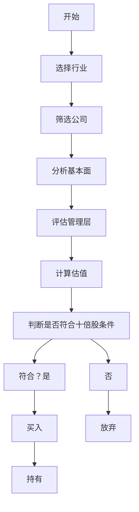

                 


# 彼得林奇的"十倍股"理论

> 关键词：彼得林奇，十倍股，投资策略，股票分析，风险管理，价值投资

> 摘要：本文深入探讨了彼得林奇提出的"十倍股"理论，分析了其核心概念、识别方法、投资策略及风险管理。通过详细的技术分析和实际案例，揭示了如何在股票市场中发现和投资十倍股，帮助投资者实现超额收益。

---

## 第一部分：彼得林奇的"十倍股"理论概述

### 第1章：彼得林奇与十倍股理论的背景介绍

#### 1.1 彼得林奇的背景与投资理念
##### 1.1.1 彼得林奇的生平简介
彼得·林奇（Peter Lynch）是美国著名的职业基金经理，被誉为“最伟大的股票投资人之一”。他在富达投资管理公司（Fidelity Investments）的麦哲伦基金（Magellan Fund）管理期间，创造了年均29%的回报率，成为投资界的传奇人物。林奇的投资哲学强调长期成长和价值发现，主张通过深入研究和分析来寻找那些能够为投资者带来超额收益的股票。

##### 1.1.2 什么是"十倍股"
"十倍股"是指那些能够在较长时间内（通常为3-5年）为投资者带来10倍或更高回报的股票。这类股票通常具有强大的成长潜力和竞争优势，能够在市场中持续增长并最终超越预期。

##### 1.1.3 十倍股的定义与特点
十倍股的定义不仅包括股票的市场价格上涨十倍，还包括公司市值的增长。其核心在于发现那些能够在未来几年内实现高速成长的公司，这些公司往往处于快速增长的行业，拥有独特的竞争优势和优秀的管理层。

---

#### 1.2 十倍股的核心概念与背景
##### 1.2.1 十倍股的形成背景
十倍股的形成通常与市场的周期性变化、行业趋势以及公司的内在增长潜力密切相关。在市场低迷或行业低谷时期，一些优质公司可能会因为估值被低估而成为潜在的十倍股。

##### 1.2.2 十倍股的市场环境
十倍股的出现往往依赖于特定的市场环境，例如技术进步、消费升级、行业整合等。这些因素为公司提供了快速发展的机会，从而推动股价的大幅上涨。

##### 1.2.3 十倍股与其他投资策略的对比
与短期交易策略不同，十倍股投资更注重长期价值和公司基本面。与指数投资相比，十倍股策略更强调个股的选择和深度研究。

---

#### 1.3 十倍股的边界与外延
##### 1.3.1 十倍股的适用范围
十倍股策略适用于那些具有持续成长潜力的公司，尤其是那些在新兴行业或技术驱动型行业中表现突出的企业。

##### 1.3.2 十倍股的局限性
尽管十倍股策略能够在较长周期内带来超额收益，但它也存在一定的局限性。例如，十倍股的识别难度较高，且投资周期较长，需要投资者具备较强的风险承受能力和耐心。

##### 1.3.3 十倍股与其他投资概念的联系
十倍股与价值投资、成长投资等策略密切相关。它强调在合理估值的基础上，选择具有持续成长潜力的公司进行投资。

---

### 第2章：十倍股的核心概念与联系

#### 2.1 十倍股的核心原理
##### 2.1.1 十倍股的内在驱动因素
十倍股的内在驱动因素包括公司的盈利能力、成长潜力、竞争优势以及管理层能力等。这些因素共同推动公司价值的增长，进而带动股价的上涨。

##### 2.1.2 十倍股的外在推动因素
外在推动因素包括市场环境、行业趋势、宏观经济政策等。这些因素为公司的成长提供了外部支持，推动股价上涨。

##### 2.1.3 十倍股的生命周期分析
十倍股的生命周期通常包括以下几个阶段：初创期、成长期、成熟期和衰退期。投资者需要在公司处于成长期时介入，以获得最大的收益。

---

#### 2.2 十倍股的核心属性特征对比
##### 2.2.1 行业分析与公司基本面
十倍股通常出现在高增长行业，如科技、医疗、消费等领域。公司基本面需要具备高ROE（净资产收益率）、稳定的盈利能力和良好的财务状况。

##### 2.2.2 公司管理层与股东结构
优秀的管理层和合理的股东结构是十倍股的重要特征。管理层需要具备战略眼光和执行力，股东结构需要稳定且具有长期投资意愿。

##### 2.2.3 市场地位与竞争优势
十倍股公司通常具有较强的市场地位和竞争优势，能够在行业内占据领先地位，并通过持续创新和成本优势进一步扩大市场份额。

---

#### 2.3 十倍股的ER实体关系图
```mermaid
er
  actor 投资者
  actor 市场
  actor 公司
  actor 管理层
  actor 顾客
  actor 供应商

  company 投资者 --|> 公司: 投资
  company 公司 --|> 管理层: 雇用
  company 管理层 --|> 顾客: 提供产品/服务
  company 公司 --|> 供应商: 采购原材料
  company 市场 --|> 公司: 估值
```

---

### 第3章：十倍股的算法原理讲解

#### 3.1 十倍股的数学模型与公式
##### 3.1.1 十倍股的估值公式
$$ 价值 = \frac{预期现金流}{折现率} $$

##### 3.1.2 十倍股的增长模型
$$ 增长率 = \frac{净利润增长率}{ROE} $$

##### 3.1.3 十倍股的风险评估公式
$$ 风险系数 = 标准差(股票回报率) $$

---

#### 3.2 十倍股的算法流程图


---

#### 3.3 十倍股的Python源代码实现
```python
import pandas as pd
import numpy as np

def calculate_growth_rate(revenue, years):
    growth_rates = []
    for i in range(1, years):
        gr = (revenue[i] / revenue[i-1]) - 1
        growth_rates.append(gr)
    return np.mean(growth_rates)

def calculate_valuation(price, earnings):
    pe_ratio = price / earnings
    return pe_ratio

# 示例数据
revenue = [100, 200, 300, 600, 1200]  # 营收（百万美元）
years = len(revenue)
price = 100  # 当前股价
earnings = 10  # 净利润

growth_rate = calculate_growth_rate(revenue, years)
valuation = calculate_valuation(price, earnings)

print(f"年均增长率：{growth_rate:.2f}%")
print(f"市盈率：{valuation:.2f}")
```

---

### 第4章：十倍股的系统分析与架构设计方案

#### 4.1 十倍股的投资系统介绍
##### 4.1.1 投资目标与范围
系统目标是帮助投资者发现和投资十倍股，范围包括股票筛选、基本面分析、投资决策和风险管理。

##### 4.1.2 投资策略与原则
采用价值投资策略，注重长期成长和公司基本面分析。

##### 4.1.3 投资流程与

---

## 第二部分：十倍股的投资策略与实战

### 第5章：十倍股的投资策略与实战
#### 5.1 十倍股的识别方法
##### 5.1.1 行业分析与公司筛选
通过分析行业趋势，筛选出具有成长潜力的公司。

##### 5.1.2 基本面分析与财务指标
重点关注ROE、净利润增长率、市盈率等指标。

##### 5.1.3 管理层评估
分析公司管理层的背景、经验和战略规划。

---

#### 5.2 十倍股的投资策略
##### 5.2.1 长期持有策略
十倍股投资需要耐心，长期持有优质公司股票，等待其价值的实现。

##### 5.2.2 分批建仓策略
为了避免一次性投入的风险，投资者可以采用分批建仓的方式，逐步增加仓位。

##### 5.2.3 风险管理策略
设置止损点，分散投资，避免过度集中。

---

## 第三部分：结论与展望

### 第6章：结论与展望
#### 6.1 十倍股理论的总结
彼得林奇的十倍股理论为投资者提供了一种寻找高成长股票的方法，但需要结合市场环境和公司基本面进行综合分析。

#### 6.2 投资建议
投资者在实践十倍股策略时，应注重风险管理和长期投资，避免盲目跟风。

#### 6.3 未来展望
随着市场环境的变化，十倍股的识别和投资策略也将不断优化。未来，投资者需要更加注重技术创新和行业趋势，以发现新的十倍股机会。

---

## 附录

### 附录A：扩展阅读
- 彼得林奇的著作《彼得林奇的成功投资》
- 《股票投资的十堂课》

### 附录B：工具与资源
- 常用的股票分析工具：Excel、Python、MATLAB
- 数据来源：Yahoo Finance、Morningstar

---

作者：AI天才研究院/AI Genius Institute & 禅与计算机程序设计艺术 /Zen And The Art of Computer Programming

