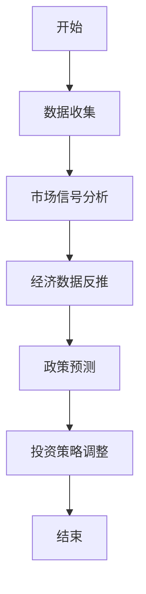
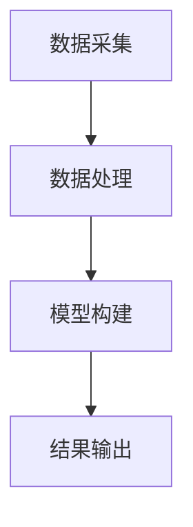
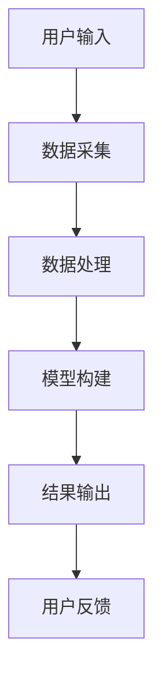

                 


# 彼得林奇的"反向思维"在中央银行政策解读中的应用

## 关键词：
- 彼得·林奇
- 反向思维
- 中央银行政策
- 货币政策
- 经济分析
- 数据挖掘
- 投资策略

## 摘要：
本文探讨了彼得·林奇的反向思维策略在中央银行政策解读中的应用，通过分析货币政策的市场信号、经济数据和政策传导机制，构建了一个基于反向思维的政策分析框架。文章结合数学模型和算法原理，详细讲解了如何利用反向思维预测政策变化，并通过实际案例展示了该方法在投资决策中的优势。本文还提供了系统设计和Python代码实现，帮助读者掌握这一创新的分析方法。

---

# 第一部分：彼得·林奇反向思维的背景与基础

## 第1章：彼得·林奇反向思维概述

### 1.1 反向思维的定义与核心理念
#### 1.1.1 反向思维的定义
反向思维是一种投资策略，强调在市场低迷或不确定性增加时，寻找被市场低估的投资机会。其核心理念是“逆市场而行”，在市场恐慌时买入，在市场乐观时卖出。

#### 1.1.2 反向思维的核心理念
- 市场情绪与实际价值的背离是投资机会的来源。
- 长期价值投资与短期市场波动的对立统一。
- 通过逆向思考发现市场误判的领域。

#### 1.1.3 反向思维在投资分析中的应用
反向思维广泛应用于股票投资、债券投资等领域。例如，在股票市场中，当市场整体估值处于历史低位时，反向投资者会积极介入，寻找被市场错杀的优质标的。

### 1.2 中央银行政策的基本框架
#### 1.2.1 中央银行政策的定义
中央银行政策是指中央银行通过调节货币供应量、利率等工具，实现货币政策目标（如价格稳定、就业最大化、经济增长等）的一系列措施。

#### 1.2.2 中央银行政策的主要工具
- 公开市场操作：通过买卖政府债券调节基础货币供应。
- 存款准备金率：调整商业银行必须持有的准备金比例。
- 再贴现率：调整商业银行向中央银行借款的利率。

#### 1.2.3 中央银行政策的传导机制
- 利率渠道：通过调整利率影响企业和个人的投资与消费行为。
- 信贷渠道：通过影响银行信贷供给，调节市场流动性。
- 汇率渠道：通过影响汇率水平，调节出口和进口。

---

## 第2章：反向思维与中央银行政策的关联

### 2.1 反向思维在货币政策解读中的应用
#### 2.1.1 货币政策的市场信号
中央银行的货币政策往往通过公开市场操作、利率调整等手段向市场传递信号。例如，当央行降息时，市场通常解读为宽松政策的信号，预示未来可能的经济刺激措施。

#### 2.1.2 反向思维在政策解读中的优势
- 通过市场信号的反向分析，预测政策调整的方向和力度。
- 通过经济数据的反向分析，发现政策制定者的潜在动机。

#### 2.1.3 反向思维与货币政策周期的关系
货币政策通常具有周期性，反向思维可以帮助投资者在政策周期的转折点提前布局。例如，在经济过热时，提前布局防御性资产；在经济衰退时，积极寻找被低估的资产。

### 2.2 中央银行政策的分析框架
#### 2.2.1 货币政策目标的设定
中央银行的货币政策目标通常包括价格稳定、充分就业、经济增长和国际收支平衡。不同目标的优先级取决于经济周期所处的阶段。

#### 2.2.2 货币政策工具的选择
中央银行会根据经济形势选择合适的货币政策工具。例如，在通货膨胀压力上升时，倾向于使用加息等紧缩性工具。

#### 2.2.3 货币政策效果的评估
通过分析政策工具的实施效果，评估货币政策是否达到了预期目标。例如，通过观察利率变化对投资和消费的影响，评估货币政策的效果。

---

# 第二部分：反向思维在中央银行政策解读中的核心概念与联系

## 第3章：反向思维的核心概念与原理

### 3.1 反向思维的核心概念
#### 3.1.1 反向思维的逻辑结构
反向思维的逻辑结构包括以下几个步骤：
1. 分析市场信号和经济数据。
2. 识别市场情绪与实际价值的背离。
3. 预测政策调整的方向和力度。
4. 根据政策变化调整投资策略。

#### 3.1.2 反向思维的数学模型
反向思维可以通过数学模型进行量化分析。例如，通过回归分析预测政策调整的概率。

#### 3.1.3 反向思维的决策流程
反向思维的决策流程包括：
1. 数据收集与处理。
2. 市场信号分析。
3. 政策预测。
4. 投资策略调整。

### 3.2 中央银行政策的核心要素
#### 3.2.1 货币政策目标
货币政策目标是中央银行制定政策的核心依据。例如，通胀目标制是许多国家的货币政策框架。

#### 3.2.2 货币政策工具
中央银行常用的货币政策工具包括公开市场操作、存款准备金率和再贴现率。

#### 3.2.3 货币政策传导机制
货币政策通过利率、信贷和汇率等渠道影响经济活动。例如，降低利率会刺激企业和个人的投资与消费。

---

## 第4章：反向思维与中央银行政策的联系

### 4.1 反向思维在货币政策解读中的具体应用
#### 4.1.1 通过市场信号预测政策变化
市场信号包括债券收益率、汇率变动等。例如，债券收益率的突然下降可能预示着中央银行即将放松货币政策。

#### 4.1.2 通过经济数据反推政策意图
经济数据如GDP增长率、通胀率等是分析货币政策的重要依据。例如，当通胀率持续低于目标时，中央银行可能倾向于放松货币政策。

#### 4.1.3 通过政策效果评估调整投资策略
通过分析政策效果，投资者可以调整投资策略。例如，当政策效果不佳时，投资者可能需要调整资产配置。

### 4.2 中央银行政策的反向思维分析框架
#### 4.2.1 市场信号与政策调整的关系
市场信号是政策调整的重要依据。例如，债券市场的收益率变化往往预示着货币政策的变化。

#### 4.2.2 经济周期与政策选择的关联
在经济衰退期，中央银行通常倾向于实施宽松货币政策；在经济过热期，则倾向于实施紧缩货币政策。

#### 4.2.3 政策效果的反向评估方法
通过反向思维评估政策效果，可以帮助投资者更好地理解政策变化的逻辑。

---

# 第三部分：反向思维在中央银行政策解读中的算法与数学模型

## 第5章：反向思维的算法原理

### 5.1 反向思维的数学模型
反向思维可以通过统计学和机器学习方法进行建模。例如，使用时间序列分析预测政策变化的概率。

#### 5.1.1 线性回归模型
线性回归模型可以用于分析政策变量与经济指标之间的关系。例如，建立GDP增长率与利率之间的回归模型。

$$ GDP_{growth} = \beta_0 + \beta_1 \times interest\_rate + \epsilon $$

#### 5.1.2 时间序列分析
时间序列分析可以用于预测未来的政策变化。例如，使用ARIMA模型预测通胀率的变化趋势。

### 5.2 反向思维的流程图
以下是反向思维的流程图：



### 5.3 反向思维的Python代码实现
以下是一个简单的Python代码示例，用于预测政策变化的概率：

```python
import pandas as pd
import numpy as np
from sklearn.linear_model import LinearRegression

# 数据准备
data = pd.DataFrame({
    'Market_signal': [0.1, 0.2, 0.15, 0.25, 0.18],
    'Policy_change': [0.05, 0.1, 0.08, 0.15, 0.12]
})

# 模型训练
model = LinearRegression()
model.fit(data[['Market_signal']], data['Policy_change'])

# 预测政策变化
new_signal = 0.2
predicted_change = model.predict([[new_signal]])[0]
print(f"预测的政策变化为：{predicted_change}")
```

---

## 第6章：反向思维的数学公式与实例分析

### 6.1 反向思维的数学公式
反向思维可以通过回归分析模型进行量化。例如，建立市场信号与政策变化之间的回归模型：

$$ Policy_{change} = \beta_0 + \beta_1 \times Market_{signal} + \epsilon $$

其中，$\beta_0$是截距，$\beta_1$是市场信号的系数，$\epsilon$是误差项。

### 6.2 实例分析
假设我们有以下市场信号数据和政策变化数据：

| 市场信号 | 政策变化 |
|----------|----------|
| 0.1      | 0.05     |
| 0.2      | 0.1      |
| 0.15     | 0.08     |
| 0.25     | 0.15     |
| 0.18     | 0.12     |

通过回归分析，我们可以得到：

$$ Policy_{change} = 0.02 + 0.8 \times Market_{signal} $$

当市场信号为0.2时，预测的政策变化为：

$$ Policy_{change} = 0.02 + 0.8 \times 0.2 = 0.18 $$

---

# 第四部分：反向思维在中央银行政策解读中的系统分析与架构设计

## 第7章：反向思维的系统分析与架构设计

### 7.1 系统功能设计
反向思维的系统功能包括：
1. 数据采集模块：收集市场信号和经济数据。
2. 模型构建模块：建立反向思维的数学模型。
3. 结果输出模块：输出政策变化的预测结果。

### 7.2 系统架构设计
以下是系统的架构图：



### 7.3 系统接口设计
系统接口包括：
1. 数据接口：与数据源对接，获取市场信号和经济数据。
2. 模型接口：与外部数据处理工具对接，如Python的Pandas库。
3. 输出接口：将预测结果输出给用户或下游系统。

### 7.4 系统交互流程图
以下是系统的交互流程图：



---

## 第8章：反向思维的项目实战

### 8.1 环境安装
需要安装的工具包括：
1. Python
2. Pandas
3. Scikit-learn
4. Mermaid

### 8.2 核心实现源代码
以下是核心实现代码：

```python
import pandas as pd
import numpy as np
from sklearn.linear_model import LinearRegression

# 数据准备
data = pd.DataFrame({
    'Market_signal': [0.1, 0.2, 0.15, 0.25, 0.18],
    'Policy_change': [0.05, 0.1, 0.08, 0.15, 0.12]
})

# 模型训练
model = LinearRegression()
model.fit(data[['Market_signal']], data['Policy_change'])

# 预测政策变化
new_signal = 0.2
predicted_change = model.predict([[new_signal]])[0]
print(f"预测的政策变化为：{predicted_change}")
```

### 8.3 代码应用解读与分析
上述代码通过线性回归模型，基于市场信号预测政策变化。通过训练数据，模型可以学习市场信号与政策变化之间的关系，并用于预测未来的政策变化。

### 8.4 实际案例分析
假设当前市场信号为0.2，预测的政策变化为0.18。这意味着未来可能有18%的政策放松。

---

## 第五部分：反向思维在中央银行政策解读中的最佳实践

## 第9章：最佳实践与小结

### 9.1 最佳实践
1. 定期更新模型，以适应市场变化。
2. 结合多种分析方法，提高预测准确性。
3. 风险管理：在实际投资中，合理控制仓位，避免过度依赖单一策略。

### 9.2 小结
反向思维是一种有效的中央银行政策解读方法。通过分析市场信号和经济数据，投资者可以更好地理解政策变化的方向和力度，从而做出更明智的投资决策。

---

## 第10章：注意事项与拓展阅读

### 10.1 注意事项
1. 反向思维仅是一种辅助分析工具，需结合其他方法使用。
2. 数据质量对预测结果影响重大，需确保数据来源的可靠性和完整性。
3. 模型的可解释性需重视，避免过度依赖黑箱模型。

### 10.2 拓展阅读
1. 彼得·林奇的《投资最重要的事》
2. 货币政策的经典文献
3. 数据挖掘与机器学习在金融分析中的应用

---

# 作者：AI天才研究院/AI Genius Institute & 禅与计算机程序设计艺术 /Zen And The Art of Computer Programming

