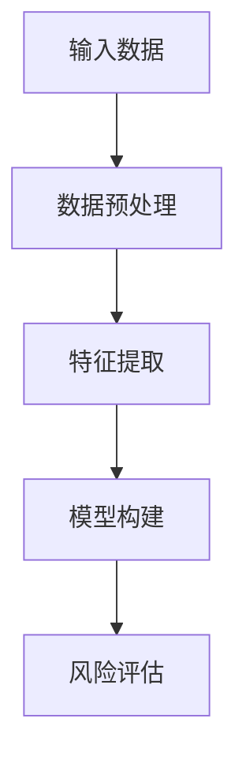
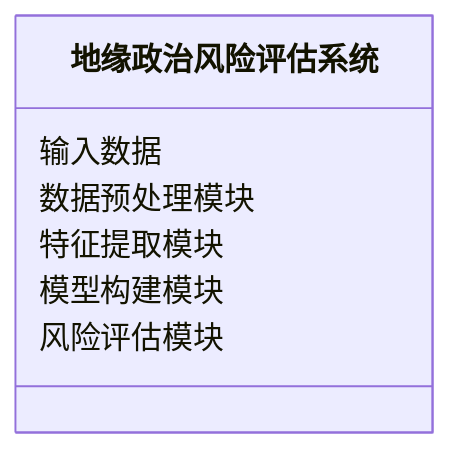
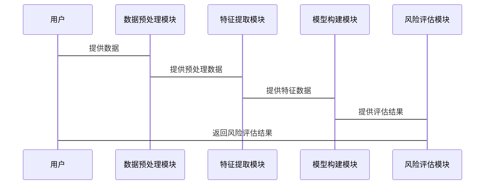

                 


# 彼得林奇的"反向思维"在地缘政治风险评估中的应用

关键词：地缘政治风险评估，反向思维，彼得·林奇，投资策略，系统架构

摘要：本文探讨了如何将彼得·林奇的反向思维策略应用于地缘政治风险评估中，通过系统分析和算法实现，提出了一种创新的风险评估方法。文章从反向思维的定义、地缘政治风险评估的必要性、彼得·林奇反向思维的核心理念等方面展开，结合实际案例和系统架构设计，详细阐述了反向思维在地缘政治风险评估中的应用及其优势。

---

## 第1章: 地缘政治风险评估的背景与重要性

### 1.1 地缘政治风险的定义与特征

#### 1.1.1 地缘政治风险的定义
地缘政治风险是指由于政治、经济、社会等多重因素交织，导致某一地区或国家出现不稳定、冲突或政策变动，从而对企业、组织或国家利益造成潜在威胁的可能性。

#### 1.1.2 地缘政治风险的核心特征
地缘政治风险具有复杂性、不确定性和连锁反应的特点。例如，地区冲突可能引发经济制裁、供应链中断或国际关系紧张。

#### 1.1.3 地缘政治风险的分类与层次
地缘政治风险可以分为国家层面、区域层面和全球层面，具体包括主权风险、战争风险、贸易摩擦等。

### 1.2 地缘政治风险评估的必要性

#### 1.2.1 地缘政治风险对企业的影响
企业可能面临供应链中断、市场萎缩或投资损失等风险。例如，地缘政治冲突可能导致原材料价格上涨或供应中断。

#### 1.2.2 地缘政治风险对国家安全的意义
国家安全受到威胁时，可能导致经济衰退、社会稳定问题甚至军事冲突。例如，地区战争可能引发全球经济震荡。

#### 1.2.3 地缘政治风险评估的现实需求
企业和政府需要提前识别潜在风险，制定应对策略。例如，企业在投资决策中需要评估目标市场的地缘政治风险。

### 1.3 反向思维在风险评估中的独特价值

#### 1.3.1 反向思维的定义与特点
反向思维是指从相反的角度思考问题，寻找潜在机会或解决方案。例如，在市场低迷时寻找投资机会。

#### 1.3.2 反向思维在投资决策中的应用
彼得·林奇的反向思维策略强调在市场低谷时投资，逆市而行。例如，在市场恐慌时寻找被低估的资产。

#### 1.3.3 反向思维与地缘政治风险评估的结合
通过反向思维，可以从潜在风险中发现机会，例如在地缘政治冲突后寻找市场重新开放的机会。

---

## 第2章: 彼得·林奇反向思维的核心理念

### 2.1 彼得·林奇投资哲学概述

#### 2.1.1 彼得·林奇的投资者画像
彼得·林奇是著名的基金经理，以其长期投资和逆市投资策略闻名。他认为，市场恐慌时是投资的最佳时机。

#### 2.1.2 林奇的长期投资理念
林奇强调长期持有优质资产，避免短期波动干扰。例如，他倾向于投资业绩稳定、估值合理的公司。

#### 2.1.3 林奇对市场周期的解读
林奇认为市场有周期性，低谷和高峰交替出现。例如，市场低迷时是买入机会，高峰时是卖出信号。

### 2.2 反向思维在投资中的具体应用

#### 2.2.1 逆市投资的策略选择
林奇建议在市场低迷时投资，因为此时资产价格被低估。例如，在2008年金融危机后，他建议投资优质股票。

#### 2.2.2 价值投资与市场周期的关系
价值投资强调购买被低估的资产，而市场周期为价值投资提供了机会。例如，在市场低谷时，优质资产的价格被低估。

#### 2.2.3 林奇的成功案例分析
林奇在20世纪80年代管理的麦哲伦基金取得了显著成绩，部分得益于他的反向思维策略。

### 2.3 反向思维的核心要素

#### 2.3.1 市场情绪的反向指标
市场情绪可以通过投资者情绪指数、成交量等指标衡量。例如，市场恐慌时是买入机会。

#### 2.3.2 估值与价格的反向关系
资产价格与估值之间存在反向关系。例如，当资产价格低于其真实价值时，是买入机会。

#### 2.3.3 风险与收益的反向匹配
高风险资产在低风险环境下可能表现不佳，而低风险资产在高风险环境下可能表现优异。例如，债券在市场动荡时提供稳定收益。

---

## 第3章: 地缘政治风险评估中的反向思维应用

### 3.1 地缘政治风险的多维度分析

#### 3.1.1 政治环境的评估维度
地缘政治风险的评估维度包括政治稳定性、政策变化、政府债务等。例如，政治不稳定可能导致市场波动。

#### 3.1.2 经济因素对地缘政治的影响
经济因素如贸易平衡、GDP增长率等影响地缘政治风险。例如，经济衰退可能导致政治不稳定。

#### 3.1.3 地缘政治事件的周期性特征
地缘政治事件通常具有周期性，例如战争、制裁等可能反复出现。

### 3.2 反向思维在地缘政治风险评估中的逻辑框架

#### 3.2.1 从结果反推风险源
通过分析事件的结果，推断可能的风险源。例如，市场下跌可能源于地缘政治冲突。

#### 3.2.2 从对立面寻找机会
从潜在风险中寻找机会。例如，地缘政治冲突后可能引发市场重新开放。

#### 3.2.3 逆向分析事件的潜在影响
通过反向分析，评估事件的潜在影响。例如，制裁可能影响企业的供应链。

### 3.3 地缘政治风险评估中的反向思维步骤

#### 3.3.1 确定评估目标
明确评估的目标，例如评估某国的政治风险。

#### 3.3.2 识别关键风险因素
识别可能影响目标的的关键因素，例如政策变化、经济制裁等。

#### 3.3.3 构建反向思维模型
构建模型，分析风险与机会的关系。例如，模型可以显示政策变化对企业的影响。

#### 3.3.4 验证与调整模型
通过实际案例验证模型，并根据反馈调整。例如，验证模型在实际中的准确性。

---

## 第4章: 地缘政治风险评估的系统分析与架构设计

### 4.1 地缘政治风险评估的系统模型

#### 4.1.1 系统模型的构建逻辑
系统模型包括输入数据、数据预处理、特征提取、模型构建和输出结果。例如，输入数据可能包括经济指标、政治事件等。

#### 4.1.2 系统模型的输入与输出
输入包括经济指标、政策变化等，输出包括风险评估结果和机会分析。

#### 4.1.3 系统模型的验证方法
通过历史数据验证模型的准确性，例如验证模型在历史事件中的表现。

### 4.2 反向思维在系统架构中的应用

#### 4.2.1 系统架构的反向设计思路
从输出结果反推系统设计，例如从风险评估结果反推输入数据。

#### 4.2.2 架构模块的反向关联分析
分析系统模块之间的反向关联，例如风险评估结果如何影响数据输入。

#### 4.2.3 系统模块的反向优化策略
通过反向分析优化系统模块，例如优化数据预处理模块以提高准确性。

### 4.3 地缘政治风险评估的算法实现

#### 4.3.1 算法流程图


#### 4.3.2 算法实现
```python
def geopolitical_risk_assessment(data):
    # 数据预处理
    processed_data = preprocess(data)
    # 特征提取
    features = extract_features(processed_data)
    # 模型构建
    model = build_model(features)
    # 风险评估
    risk = assess_risk(model, features)
    return risk
```

#### 4.3.3 数学模型与公式
模型基于多元回归分析，公式为：
$$
\text{风险评估} = \beta_0 + \beta_1x_1 + \beta_2x_2 + \dots + \beta_nx_n
$$
其中，$$x_i$$ 是特征变量，$$\beta_i$$ 是回归系数。

---

## 第5章: 项目实战与案例分析

### 5.1 项目背景介绍
以某地区地缘政治风险评估为例，分析如何应用反向思维策略。

### 5.2 系统功能设计

#### 5.2.1 领域模型（Mermaid 类图）


#### 5.2.2 系统架构设计（Mermaid 架构图）
```mermaid
container 地缘政治风险评估系统 {
    数据源
    数据预处理模块
    特征提取模块
    模型构建模块
    风险评估模块
}
```

#### 5.2.3 系统接口设计
定义接口，例如：
$$
\text{接口：get_risk\_assessment}(\text{data})
$$

#### 5.2.4 系统交互设计（Mermaid 序列图）


### 5.3 项目实现与分析

#### 5.3.1 环境安装
安装所需库，例如Python的scikit-learn、pandas等。

#### 5.3.2 核心实现代码
```python
import pandas as pd
from sklearn.linear_model import LinearRegression

def preprocess(data):
    # 数据预处理
    return data.dropna()

def extract_features(data):
    # 特征提取
    return data[['GDP增长率', '政治稳定性']]

def build_model(features):
    # 模型构建
    model = LinearRegression()
    model.fit(features, target)
    return model

def assess_risk(model, features):
    # 风险评估
    return model.predict(features)
```

### 5.4 实际案例分析

#### 5.4.1 案例背景
以某地区为例，分析其地缘政治风险。

#### 5.4.2 数据收集
收集相关数据，例如GDP增长率、政治稳定性等。

#### 5.4.3 模型训练
训练模型，评估风险。

#### 5.4.4 结果分析
分析模型结果，提出应对策略。

### 5.5 项目小结

---

## 第6章: 最佳实践与注意事项

### 6.1 最佳实践 tips
- 定期更新模型，适应地缘政治环境的变化。
- 结合多种指标，提高评估准确性。
- 在实际应用中，考虑具体情境和复杂性。

### 6.2 小结
本文详细探讨了彼得·林奇的反向思维在地缘政治风险评估中的应用，提出了创新的系统架构和算法实现方法。

### 6.3 注意事项
- 模型的有效性依赖于数据质量和模型准确性。
- 需要考虑地缘政治的复杂性和不确定性。

### 6.4 拓展阅读
建议进一步研究反向思维在其他领域的应用，例如金融风险评估、企业战略规划等。

---

## 作者：AI天才研究院/AI Genius Institute & 禅与计算机程序设计艺术 /Zen And The Art of Computer Programming

