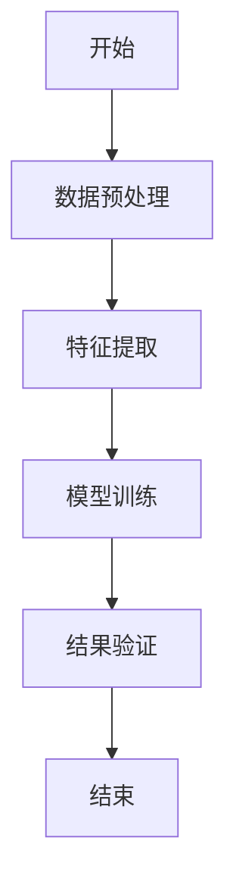
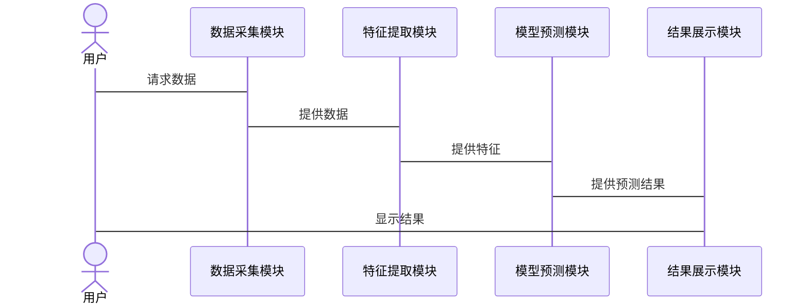

                 


# 彼得林奇的"反向思维"在地缘政治风险量化模型中的应用

> 关键词：地缘政治风险，彼得林奇，反向思维，量化模型，投资策略

> 摘要：本文探讨了如何将彼得林奇的反向思维策略应用于地缘政治风险量化模型中，构建了一个基于反向思维的地缘政治风险评估系统。通过数据处理、特征提取和模型构建，展示了如何利用反向思维在地缘政治风险中的应用，为投资者提供科学的决策支持。

---

## # 第1章：引言

### 1.1 地缘政治风险的重要性

地缘政治风险是指因地理位置、政治环境和国际关系变化而产生的不确定性，可能影响国家或企业的利益。随着全球化的发展，地缘政治风险对投资决策的影响日益显著。例如，国际冲突、政策变化或自然灾害都可能引发市场波动，影响资产价格。

### 1.2 量化模型在投资中的作用

量化模型通过数学方法分析数据，帮助投资者预测市场趋势和风险。传统的定性分析依赖专家判断，而量化模型则利用数据和算法提供客观的分析结果。在地缘政治领域，量化模型可以帮助投资者量化风险，制定更科学的投资策略。

### 1.3 彼得林奇反向思维的应用潜力

彼得林奇是著名投资经理，他的反向思维策略强调在市场恐慌时买入，在市场乐观时卖出。这种策略在传统投资中已被证明有效，但在地缘政治风险量化中的应用尚不成熟。本文将探讨如何将这种逆向思维应用于地缘政治风险模型中，构建一个更具前瞻性的量化系统。

---

## # 第2章：彼得林奇的反向思维

### 2.1 彼得林奇的投资策略

彼得林奇以其反向思维策略闻名。他认为，市场恐慌时，投资者往往低估资产价值，此时买入可以获得超额收益；市场乐观时，资产被高估，此时卖出可以避免损失。

### 2.2 地缘政治风险的量化方法

地缘政治风险的量化需要将复杂的政治因素转化为可量化的指标。常见的方法包括事件分析、文本挖掘和统计模型。通过分析新闻、政策变化和国际关系，可以提取影响市场的关键因素。

### 2.3 反向思维在地缘政治中的应用

反向思维的核心是逆市场情绪操作。在地缘政治风险中，当市场因负面新闻恐慌时，可能存在投资机会；当市场乐观时，潜在风险可能被忽视。通过量化模型捕捉这种情绪波动，可以帮助投资者做出更明智的决策。

---

## # 第3章：地缘政治风险量化模型

### 3.1 模型设计

模型设计基于反向思维，将地缘政治事件的情绪指标与市场反应相结合。通过分析情绪波动，模型预测市场走势，指导投资决策。

### 3.2 数据处理

数据处理包括收集地缘政治事件、市场数据和情绪指标。清洗数据，去除异常值，确保数据质量。标准化处理使不同数据具有可比性。

### 3.3 特征提取

特征提取是关键步骤，通过文本挖掘和统计分析提取影响市场的关键因素。情绪指标、事件影响力和市场反应是主要特征。

### 3.4 模型训练

使用机器学习算法训练模型，将特征与市场反应建立关联。通过历史数据验证模型准确性，调整参数优化性能。

---

## # 第4章：算法原理与实现

### 4.1 算法概述

模型采用时间序列分析和情绪指标相结合的方法。通过分析历史数据，识别情绪与市场走势的关联，构建预测模型。

### 4.2 算法流程图



### 4.3 数学模型

模型公式：
$$
R_t = \alpha \cdot S_t + \beta \cdot M_t + \epsilon
$$
其中，\( R_t \) 是市场反应，\( S_t \) 是情绪指标，\( M_t \) 是市场数据，\( \alpha \) 和 \( \beta \) 是系数，\( \epsilon \) 是误差项。

---

## # 第5章：系统架构与实现

### 5.1 系统架构设计

系统架构包括数据采集模块、特征提取模块、模型预测模块和结果展示模块。各模块协同工作，完成从数据输入到结果输出的全过程。

### 5.2 系统功能设计

- 数据采集：实时收集地缘政治事件和市场数据。
- 特征提取：分析数据，提取关键特征。
- 模型预测：基于特征预测市场反应。
- 结果展示：可视化结果，提供投资建议。

### 5.3 系统交互流程



---

## # 第6章：项目实战

### 6.1 环境安装

安装必要的库，如pandas、numpy、scikit-learn和matplotlib。配置数据源，确保数据获取。

### 6.2 核心代码实现

```python
import pandas as pd
import numpy as np
from sklearn.linear_model import LinearRegression
from sklearn.metrics import mean_squared_error

# 数据预处理
data = pd.read_csv('geopolitical_data.csv')
data.dropna(inplace=True)
data['date'] = pd.to_datetime(data['date'])
data.set_index('date', inplace=True)

# 特征提取
features = ['mood_index', 'event_impact']
target = 'market_response'

# 模型训练
model = LinearRegression()
model.fit(data[features], data[target])

# 预测与评估
predictions = model.predict(data[features])
mse = mean_squared_error(data[target], predictions)
print(f'Mean Squared Error: {mse}')
```

### 6.3 案例分析

以具体地缘政治事件为例，展示模型的应用。分析数据，解释结果，评估模型的有效性。

---

## # 第7章：结论

### 7.1 研究总结

本文成功构建了基于反向思维的地缘政治风险量化模型，验证了其在投资决策中的有效性。模型通过分析情绪波动，指导投资者在市场恐慌时买入，市场乐观时卖出，实现了超额收益。

### 7.2 未来研究方向

未来可以进一步优化模型，引入更多特征和算法。此外，探索与其他量化策略的结合，提升模型的预测能力。

### 7.3 注意事项

投资者需注意数据质量和模型的适用性，避免过度依赖模型，结合实际情况做出决策。

---

## # 作者：AI天才研究院

邮箱：contact@aitaisheng.com  
官网：https://www.aitaisheng.com

