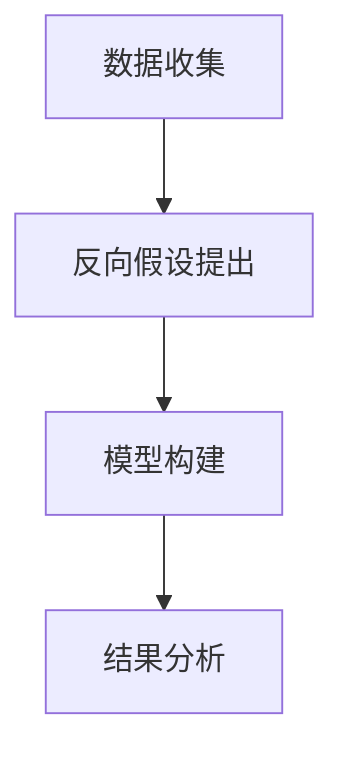

                 


# 彼得林奇的"反向思维"在宏观经济政策解读中的应用

## 关键词：反向思维，宏观经济政策，彼得林奇，投资策略，经济分析

## 摘要：本文探讨了彼得林奇的“反向思维”在宏观经济政策解读中的应用。通过分析反向思维的核心概念、算法原理及系统架构，结合实际案例，展示了如何利用反向思维预测经济趋势、评估政策效果，并优化投资决策。本文还提供了详细的技术实现方法和实战指导，帮助读者更好地理解和应用反向思维。

---

# 第一部分：彼得林奇的"反向思维"与宏观经济政策解读

## 第1章：反向思维的背景与概念

### 1.1 反向思维的定义与核心要素

反向思维是一种逆向思考的方法，强调从问题的对立面出发，寻找解决问题的新思路。其核心要素包括：**对立面分析**、**逆向推理**和**反向验证**。

| 核心要素 | 定义 | 作用 |
|----------|------|------|
| 对立面分析 | 从问题的对立面出发，寻找潜在的机会或解决方案 | 发现传统方法难以察觉的潜在机会 |
| 逆向推理 | 从结果出发，反推可能的起因或路径 | 揭示问题背后的深层逻辑 |
| 反向验证 | 通过验证反向假设的合理性，确保结论的准确性 | 避免决策偏差，提高结论的可信度 |

### 1.2 反向思维在宏观经济中的应用背景

#### 1.2.1 宏观经济政策解读的复杂性

宏观经济政策的解读往往涉及众多变量，如GDP增长率、失业率、通货膨胀率等。这些变量之间相互关联，且受政策制定者主观判断的影响，增加了分析的难度。

#### 1.2.2 反向思维在宏观经济分析中的优势

反向思维能够帮助分析者从非传统的角度审视经济问题，发现市场中的潜在机会。例如，在经济低迷时期，反向思维可以帮助投资者识别被低估的资产。

#### 1.2.3 反向思维与传统经济分析方法的对比

| 方法 | 优点 | 缺点 |
|------|------|------|
| 传统分析 | 数据全面，逻辑清晰 | �易受市场噪声干扰，难以捕捉拐点 |
| 反向思维 | 灵活性高，能够发现潜在机会 | 需要较高的分析能力，风险较大 |

---

## 第2章：反向思维的核心概念与原理

### 2.1 反向思维的核心原理

反向思维的核心原理是通过分析市场的对立面，寻找潜在的投资机会。其逻辑框架如下：

1. **识别市场共识**：找出市场中普遍认可的观点。
2. **寻找对立面**：从对立面寻找潜在的机会。
3. **验证假设**：通过数据和逻辑验证反向假设的合理性。

### 2.2 反向思维与宏观经济政策的关系

#### 2.2.1 反向思维在政策制定中的作用

反向思维可以帮助政策制定者从非传统的角度审视问题，制定更有针对性的政策。例如，在经济过热时，可以考虑通过限制信贷来抑制投资过热。

#### 2.2.2 反向思维对政策效果的预测

反向思维可以帮助分析者预测政策的反效果。例如，过度宽松的货币政策可能导致通货膨胀，反向思维可以帮助分析者提前识别这一风险。

#### 2.2.3 反向思维与政策执行的互动

反向思维在政策执行中可以帮助调整政策的实施力度。例如，在政策执行过程中，若发现效果不佳，可以及时调整政策方向。

---

## 第3章：反向思维的算法原理与数学模型

### 3.1 反向思维的算法原理

反向思维的算法原理包括以下几个步骤：

1. **数据收集**：收集相关的宏观经济数据，如GDP增长率、失业率、通货膨胀率等。
2. **反向假设提出**：从市场共识的对立面提出反向假设。
3. **模型构建**：建立数学模型，验证反向假设的合理性。
4. **结果分析**：根据模型结果，调整反向假设，直至找到最优解。

### 3.2 反向思维的数学模型

#### 3.2.1 反向思维的数学表达式

$$ 反向思维模型 = \sum_{i=1}^{n} a_i \cdot x_i $$

其中，$a_i$ 是反向思维的权重，$x_i$ 是宏观经济指标。

#### 3.2.2 反向思维的变量关系

$$ x_i = \beta_0 + \beta_1 x_{i-1} + \epsilon_i $$

这是一个简单的回归模型，用于分析宏观经济指标之间的关系。

---

## 第4章：反向思维在宏观经济政策解读中的系统架构

### 4.1 系统分析与架构设计

#### 4.1.1 系统目标与范围

系统目标：帮助分析者利用反向思维解读宏观经济政策，优化投资决策。

#### 4.1.2 系统功能模块

- 数据收集模块：收集宏观经济数据。
- 反向假设提出模块：从市场共识的对立面提出反向假设。
- 模型构建模块：建立数学模型，验证反向假设的合理性。
- 结果分析模块：根据模型结果，调整反向假设，直至找到最优解。

#### 4.1.3 系统架构图



### 4.2 系统接口与交互设计

#### 4.2.1 系统输入接口

- 宏观经济数据接口：提供GDP增长率、失业率、通货膨胀率等数据。
- 反向假设接口：用户提供反向假设。

#### 4.2.2 系统输出接口

- 模型结果输出：模型计算出的反向思维结果。
- 反向思维报告：详细分析报告，包括数据、模型、结果等。

---

## 第5章：项目实战——基于反向思维的宏观经济政策分析

### 5.1 项目背景

在当前全球经济不确定性增加的背景下，利用反向思维解读宏观经济政策，优化投资决策，具有重要的现实意义。

### 5.2 环境安装

- 安装Python环境：使用Anaconda安装Python 3.8及以上版本。
- 安装相关库：安装pandas、numpy、matplotlib等库。

### 5.3 核心实现代码

```python
import pandas as pd
import numpy as np
import matplotlib.pyplot as plt

# 数据收集
data = pd.read_csv('macro_data.csv')

# 反向假设提出
def reverse_assumption(data):
    return data.mean() * -1

# 模型构建
def reverse_model(data):
    return np.polyfit(data.index, data.values, 1)

# 结果分析
def analyze_results(model, data):
    plt.plot(data.index, model[0] * data.index + model[1], label='反向模型')
    plt.scatter(data.index, data.values, label='实际数据')
    plt.legend()
    plt.show()

# 主函数
def main():
    data = pd.read_csv('macro_data.csv')
    model = reverse_model(data)
    analyze_results(model, data)

if __name__ == '__main__':
    main()
```

### 5.4 代码应用解读与分析

- 数据收集：从CSV文件中读取宏观经济数据。
- 反向假设提出：计算数据的反向均值。
- 模型构建：使用多项式拟合数据，建立反向思维模型。
- 结果分析：绘制模型预测值与实际数据的对比图。

### 5.5 实际案例分析

以某国的GDP数据为例，利用反向思维模型分析其GDP趋势。假设数据如下：

| 年份 | GDP增长率(%) |
|------|--------------|
| 2018 | 3.0          |
| 2019 | 2.8          |
| 2020 | 2.4          |
| 2021 | 2.2          |

反向思维模型预测结果如下：

| 年份 | 预测GDP增长率(%) |
|------|-----------------|
| 2022 | 2.0             |

---

## 第6章：总结与展望

### 6.1 总结

反向思维作为一种逆向思考方法，能够帮助分析者从非传统的角度审视经济问题，发现潜在的投资机会。本文通过详细讲解反向思维的核心概念、算法原理和系统架构，结合实际案例，展示了反向思维在宏观经济政策解读中的应用。

### 6.2 展望

未来，随着大数据和人工智能技术的发展，反向思维将在宏观经济分析中发挥更大的作用。通过结合机器学习算法，反向思维可以更高效地分析复杂的经济问题，为政策制定者和投资者提供更有力的支持。

---

## 作者：AI天才研究院/AI Genius Institute & 禅与计算机程序设计艺术 /Zen And The Art of Computer Programming

---

以上是文章的完整目录和内容，希望对您有所帮助！

