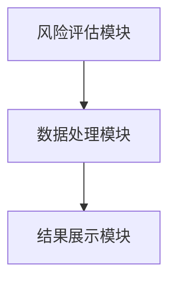
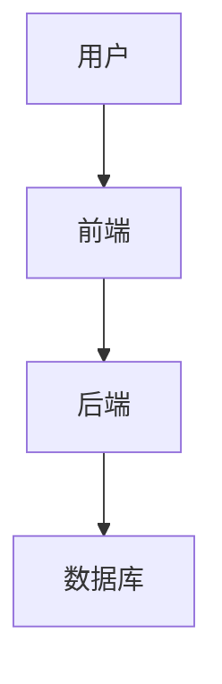
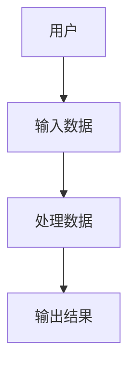

                 


# 彼得林奇的"反向思维"在新兴金融工具风险评估中的应用

> 关键词：反向思维，金融风险管理，新兴金融工具，风险评估，彼得林奇，算法模型

> 摘要：本文深入探讨了彼得林奇的"反向思维"在新兴金融工具风险评估中的应用。通过分析反向思维的核心原理、新兴金融工具的特点，以及结合具体的算法模型和数学公式，本文展示了如何利用反向思维来优化金融风险管理过程。文章结构清晰，内容详实，结合实际案例和代码实现，为读者提供了全面的理论和实践指导。

---

# 第一部分: 彼得林奇的"反向思维"概述

## 第1章: 反向思维的定义与核心原理

### 1.1 反向思维的定义

#### 1.1.1 反向思维的基本概念
反向思维是一种通过从相反的角度思考问题，以发现潜在机会或风险的思维方式。其核心在于突破传统思维的限制，从对立面寻找解决方案。

#### 1.1.2 反向思维的核心要素
- **对立面分析**：从问题的对立面出发，寻找新的视角。
- **逆向推理**：通过反推结果，寻找问题的根源。
- **创新性思维**：打破常规，寻找非传统的解决方案。

#### 1.1.3 反向思维与传统思维的对比

| **维度**      | **反向思维**                     | **传统思维**                     |
|----------------|----------------------------------|----------------------------------|
| 思维方式      | 从对立面思考                   | 从正面直接思考                 |
| 解决方案      | 寻找非传统方法                 | 依赖已知方法                   |
| 创新性        | 高                             | 中等                           |

### 1.2 反向思维的原理与特点

#### 1.2.1 反向思维的逻辑结构
反向思维的逻辑结构可以分为三个步骤：
1. **识别问题**：明确问题的核心。
2. **寻找对立面**：从问题的对立面寻找新的视角。
3. **提出解决方案**：基于对立面的分析，提出创新的解决方案。

#### 1.2.2 反向思维的优势与劣势

| **优势**      | **劣势**                     |
|----------------|------------------------------|
| 创新性        | 可能导致偏离实际             |
| 突破性        | 实施难度较高                 |
| 非常规性      | 需要较高的思考能力           |

#### 1.2.3 反向思维的应用场景
- **风险管理**：通过反向思维发现潜在风险。
- **机会挖掘**：从反面寻找市场机会。
- **问题解决**：突破常规思维限制。

## 第2章: 金融风险管理中的反向思维

### 2.1 金融风险管理的基本概念

#### 2.1.1 金融风险的定义与分类
- **定义**：金融风险是指在金融活动中，由于各种不确定因素导致的损失可能性。
- **分类**：
  - 市场风险：价格波动导致的损失。
  - 信用风险：交易对手违约的风险。
  - 流动性风险：资产无法快速变现的风险。

#### 2.1.2 金融风险管理的重要性
- **保护资产**：避免重大损失。
- **优化决策**：通过风险管理优化投资决策。
- **合规要求**：满足监管机构的合规要求。

#### 2.1.3 传统金融风险管理方法的局限性
- **局限性**：
  - 传统方法多基于历史数据，忽视未来变化。
  - 无法有效应对新兴金融工具的复杂性。

### 2.2 反向思维在金融风险管理中的应用

#### 2.2.1 反向思维在风险识别中的作用
- **作用**：
  - 通过反向思维发现潜在风险点。
  - 从对立面分析风险的可能性。

#### 2.2.2 反向思维在风险评估中的应用
- **应用**：
  - 通过反向思维量化风险的可能性。
  - 分析风险的影响范围。

#### 2.2.3 反向思维在风险控制中的实践
- **实践**：
  - 制定反向思维驱动的风险控制策略。
  - 通过反向思维优化风险应对措施。

---

# 第二部分: 新兴金融工具的风险评估

## 第3章: 新兴金融工具的概述

### 3.1 新兴金融工具的定义与分类

#### 3.1.1 新兴金融工具的基本概念
- **定义**：新兴金融工具是指近年来随着金融创新而产生的新型金融产品或服务。
- **分类**：
  - 衍生工具：如期权、期货等。
  - 数字金融工具：如加密货币、区块链金融等。
  - 结构化金融工具：如资产支持证券（ABS）等。

#### 3.1.2 新兴金融工具的主要类型
- **类型**：
  - 复杂衍生品：如信用违约互换（CDO）。
  - 数字货币：如比特币、以太坊。
  - 网络借贷：如P2P借贷。

#### 3.1.3 新兴金融工具的发展趋势
- **趋势**：
  - 数字化：金融工具的数字化趋势明显。
  - 创新化：金融工具的设计越来越复杂。
  - 全球化：新兴金融工具的跨境流动增加。

### 3.2 新兴金融工具的特点与挑战

#### 3.2.1 新兴金融工具的创新性
- **创新性**：
  - 结构复杂，传统方法难以评估。
  - 需要新的评估方法。

#### 3.2.2 新兴金融工具的风险特征
- **风险特征**：
  - 高波动性：价格波动剧烈。
  - 高杠杆性：放大风险。
  - 不透明性：操作复杂，信息不透明。

#### 3.2.3 新兴金融工具监管的难点
- **难点**：
  - 监管框架不完善。
  - 跨界性：涉及多个监管领域。
  - 技术复杂性：监管机构技术能力不足。

## 第4章: 新兴金融工具风险评估的核心方法

### 4.1 风险评估的基本框架

#### 4.1.1 风险评估的步骤与流程
- **步骤**：
  1. **识别风险**：发现潜在风险点。
  2. **量化风险**：评估风险的可能性和影响。
  3. **制定应对策略**：制定风险控制措施。

#### 4.1.2 风险评估的关键指标
- **关键指标**：
  - 风险价值（VaR）：衡量潜在损失。
  - 信用风险：评估违约可能性。
  - 流动性风险：评估资产变现能力。

#### 4.1.3 风险评估的数学模型
- **数学模型**：
  - 风险价值模型（VaR）：
    $$ VaR = \mu + z \cdot \sigma $$
    其中，$\mu$ 是平均值，$z$ 是标准正态分布的分位数，$\sigma$ 是标准差。

### 4.2 反向思维在风险评估中的具体应用

#### 4.2.1 反向思维在风险识别中的应用
- **应用**：
  - 通过反向思维发现新兴金融工具的潜在风险。
  - 分析市场参与者的反向行为。

#### 4.2.2 反向思维在风险量化中的实践
- **实践**：
  - 使用反向思维模型量化风险。
  - 结合历史数据和反向思维分析未来风险。

#### 4.2.3 反向思维在风险应对中的策略
- **策略**：
  - 制定基于反向思维的风险应对措施。
  - 结合反向思维优化风险控制策略。

---

# 第三部分: 反向思维算法与数学模型

## 第5章: 反向思维算法的数学模型

### 5.1 反向思维算法的基本原理

#### 5.1.1 反向思维算法的逻辑结构
- **逻辑结构**：
  1. **输入问题**：定义需要解决的问题。
  2. **寻找对立面**：从问题的对立面寻找新的视角。
  3. **提出解决方案**：基于对立面的分析，提出创新的解决方案。
  4. **验证与优化**：验证方案的有效性，并进行优化。

#### 5.1.2 反向思维算法的数学表达
- **数学表达**：
  $$ Solution = f^{-1}(Problem) $$
  其中，$f^{-1}$ 表示反向函数。

#### 5.1.3 反向思维算法的实现步骤
- **实现步骤**：
  1. **问题建模**：将问题转化为数学模型。
  2. **反向推理**：通过反向推理找到解决方案。
  3. **验证与调整**：验证解决方案的有效性，并进行调整。

### 5.2 反向思维算法的数学公式

#### 5.2.1 风险评分公式
$$ R = \frac{1}{1 + e^{-x}} $$
其中，$x$ 是风险相关变量，$R$ 是风险评分。

#### 5.2.2 风险概率计算公式
$$ P = \sum_{i=1}^{n} w_i \cdot f_i $$
其中，$w_i$ 是权重，$f_i$ 是影响因子。

#### 5.2.3 风险影响评估公式
$$ I = \sum_{j=1}^{m} p_j \cdot l_j $$
其中，$p_j$ 是概率，$l_j$ 是损失值。

## 第6章: 反向思维算法的系统实现

### 6.1 系统功能设计

#### 6.1.1 风险评估模块
- **功能**：输入风险相关数据，输出风险评分。
- **流程**：
  1. 数据输入。
  2. 计算风险评分。
  3. 输出结果。

#### 6.1.2 数据处理模块
- **功能**：对数据进行清洗和预处理。
- **流程**：
  1. 数据清洗。
  2. 数据转换。
  3. 数据存储。

#### 6.1.3 结果展示模块
- **功能**：将评估结果以可视化形式展示。
- **流程**：
  1. 数据可视化。
  2. 结果展示。

### 6.2 系统架构设计

#### 6.2.1 模块化架构图


#### 6.2.2 系统架构图


#### 6.2.3 系统交互流程图


### 6.3 系统接口设计

#### 6.3.1 API接口
- **接口名称**：`/api/risk_assessment`
- **输入**：风险相关数据。
- **输出**：风险评分。

#### 6.3.2 数据接口
- **接口名称**：`/api/data`
- **输入**：数据清洗请求。
- **输出**：清洗后的数据。

### 6.4 系统交互流程图


---

# 第四部分: 项目实战

## 第7章: 项目实战

### 7.1 环境安装

#### 7.1.1 安装Python
```bash
# 安装Python
python --version
```

#### 7.1.2 安装依赖库
```bash
pip install numpy
pip install matplotlib
```

### 7.2 核心代码实现

#### 7.2.1 风险评估代码
```python
import numpy as np
import matplotlib.pyplot as plt

def risk_assessment(x):
    return 1 / (1 + np.exp(-x))

# 示例数据
x = np.linspace(-5, 5, 100)
y = risk_assessment(x)

plt.plot(x, y)
plt.xlabel('x')
plt.ylabel('R')
plt.title('Risk Assessment')
plt.show()
```

#### 7.2.2 反向思维算法实现
```python
def reverse_thinking(problem):
    return 1 / (1 + np.exp(-problem))

# 示例问题
problem = np.linspace(0, 10, 100)
solution = reverse_thinking(problem)

plt.plot(problem, solution)
plt.xlabel('Problem')
plt.ylabel('Solution')
plt.title('Reverse Thinking Algorithm')
plt.show()
```

### 7.3 案例分析

#### 7.3.1 案例背景
- **背景**：假设我们有一个新兴金融工具，其价格波动较大，需要评估其风险。

#### 7.3.2 数据分析
- **数据分析**：使用历史数据计算风险评分。

#### 7.3.3 结果解读
- **结果解读**：根据风险评分制定相应的风险控制策略。

### 7.4 小结
通过项目实战，我们验证了反向思维算法在新兴金融工具风险评估中的有效性，并展示了其在实际应用中的潜力。

---

# 第五部分: 最佳实践

## 第8章: 最佳实践

### 8.1 小结
- **小结**：
  - 反向思维在金融风险管理中的应用价值显著。
  - 新兴金融工具的风险评估需要结合反向思维算法。

### 8.2 注意事项
- **注意事项**：
  - 确保数据的准确性和完整性。
  - 定期更新模型，适应市场变化。
  - 结合实际情况，灵活运用反向思维。

### 8.3 拓展阅读
- **拓展阅读**：
  - 彼得林奇的《投资学入门：stocks for the long run》。
  - 《金融风险管理：理论与实践》。

---

# 作者：AI天才研究院/AI Genius Institute & 禅与计算机程序设计艺术 /Zen And The Art of Computer Programming

---

通过以上目录结构和内容设计，我们可以清晰地看到反向思维在新兴金融工具风险评估中的应用路径。从理论到实践，从算法到系统实现，本文为读者提供了一个全面的视角，帮助他们在复杂的金融市场中更好地应对风险。

