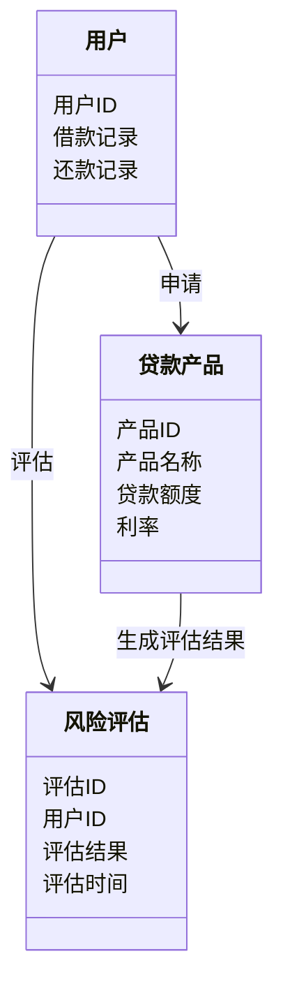
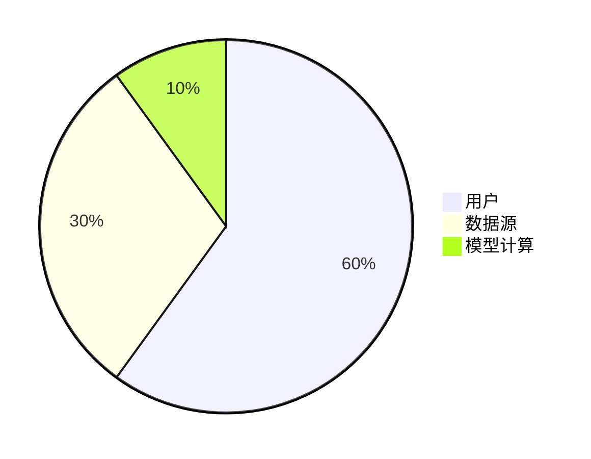
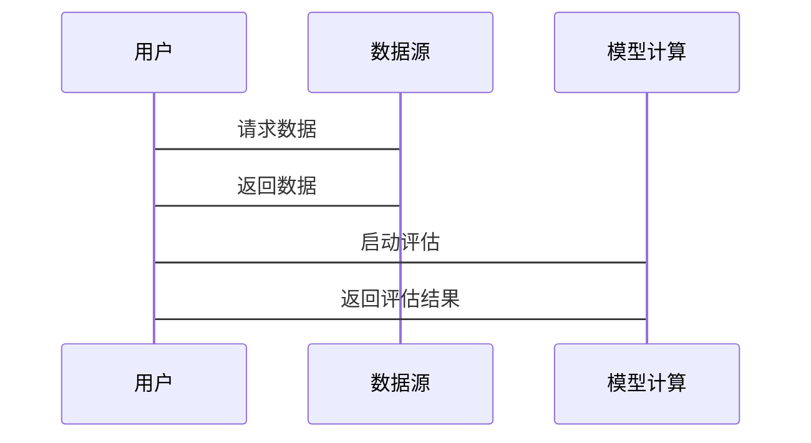

                 


# 彼得林奇的"反向思维"在新兴金融科技风险评估中的运用

## 关键词：金融科技，风险评估，反向思维，彼得林奇，量化模型，系统架构

## 摘要：  
本文探讨了彼得林奇的“反向思维”在新兴金融科技风险评估中的应用。通过分析传统风险评估方法的局限性，本文提出了一种基于反向思维的量化模型，结合金融科技的核心技术，构建了一个创新的风险评估系统。文章详细介绍了模型的算法原理、系统架构设计以及实际项目案例，展示了反向思维在金融科技领域的独特价值和应用前景。

---

# 第一部分：背景介绍

## 第1章：金融科技与彼得林奇反向思维概述

### 1.1 金融科技的发展现状

金融科技（FinTech）是指利用现代信息技术改造或创新传统金融业态的模式。近年来，随着人工智能、大数据、区块链等技术的快速发展，金融科技在支付、借贷、投资、保险等领域得到了广泛应用。金融科技的核心在于通过技术创新提高金融服务的效率、降低成本，并为用户带来更好的体验。

#### 1.1.1 金融科技的定义与特点

- **定义**：金融科技是指通过技术手段对传统金融业务进行优化和创新，涵盖支付、信贷、投资、保险等多个领域。
- **特点**：  
  - 数据驱动：依赖大数据分析和处理。  
  - 技术赋能：利用人工智能、区块链等技术提升效率。  
  - 用户导向：注重用户体验和个性化服务。  

#### 1.1.2 金融科技的核心技术与应用场景

- **核心技术**：  
  - 人工智能（AI）：用于智能投顾、风险评估、信用评分等。  
  - 大数据（Big Data）：用于精准营销、客户画像、风险预警等。  
  - 区块链（Blockchain）：用于支付清算、供应链金融、智能合约等。  
- **应用场景**：  
  - 在支付领域，区块链技术实现了去中心化的跨境支付。  
  - 在借贷领域，大数据和人工智能技术用于信用评估和风险控制。  

### 1.2 彼得林奇反向思维的定义与特点

彼得林奇是著名的投资家，他的反向思维（Contrarian Thinking）是指在市场情绪与大众行为相反的方向上进行投资。这种思维方式的核心在于识别市场的非理性行为，并在市场低谷时买入，市场高点时卖出。

#### 1.2.1 彼得林奇反向思维的定义

反向思维是一种逆向思考的方法，强调在市场恐慌时寻找机会，在市场狂热时保持冷静。其核心在于通过分析市场情绪和行为偏差，找到市场定价的不合理之处。

#### 1.2.2 彼得林奇反向思维的核心要素

- **市场情绪分析**：通过观察市场参与者的心理和行为，判断市场的非理性波动。  
- **逆向决策**：在市场低迷时寻找低估资产，在市场繁荣时警惕高估风险。  
- **长期视角**：反向思维强调长期价值，而非短期市场波动。  

### 1.3 金融科技风险评估的必要性

#### 1.3.1 金融科技风险评估的背景

金融科技虽然带来了效率和创新，但也伴随着新的风险。例如，技术故障可能导致支付失败，数据泄露可能引发隐私问题，算法偏差可能造成投资损失。因此，科学的风险评估体系是金融科技健康发展的基石。

#### 1.3.2 金融科技风险评估的意义

- **降低风险损失**：通过科学的评估方法，识别潜在风险并采取防范措施。  
- **提升市场信心**：建立可靠的评估体系有助于增强投资者对金融科技的信任。  
- **促进技术创新**：风险评估为技术创新提供方向，推动金融科技的健康发展。  

#### 1.3.3 反向思维在金融科技风险评估中的应用价值

反向思维可以帮助我们在市场过度乐观时识别潜在风险，在市场低迷时发现机会。这种思维方式在金融科技风险评估中具有独特价值，尤其是在应对非线性风险和复杂市场环境时表现突出。

### 1.4 本章小结

本章介绍了金融科技的发展现状及其核心技术，分析了彼得林奇反向思维的定义和特点，并探讨了反向思维在金融科技风险评估中的应用价值。通过这些内容，我们为后续章节的深入分析奠定了基础。

---

# 第二部分：核心概念与联系

## 第2章：反向思维在金融科技风险评估中的核心概念

### 2.1 反向思维与金融科技风险评估的联系

#### 2.1.1 反向思维在风险评估中的应用逻辑

反向思维的核心在于逆向分析市场行为和资产定价。在金融科技风险评估中，反向思维可以帮助我们识别市场中的非理性行为，并据此制定风险应对策略。

#### 2.1.2 反向思维与传统风险评估方法的对比

| **维度**       | **传统方法**                     | **反向思维**                     |
|----------------|----------------------------------|----------------------------------|
| 分析角度       | 侧重于市场趋势和历史数据         | 侧重于市场情绪和行为偏差         |
| 风险识别       | 基于统计规律和趋势分析           | 基于市场参与者的行为分析         |
| 决策依据       | 依赖历史数据和市场趋势           | 依赖市场情绪和非理性行为分析       |
| 适用场景       | 线性稳定环境                     | 非线性复杂环境                   |

#### 2.1.3 反向思维与金融科技风险评估的结合

反向思维通过关注市场情绪和行为偏差，帮助我们发现传统方法难以察觉的风险点。这种结合特别适用于应对市场波动剧烈、行为复杂的情况。

### 2.2 反向思维在金融科技风险评估中的核心要素

#### 2.2.1 数据来源与特征提取

在反向思维的框架下，风险评估的数据来源包括市场情绪指标、资产价格波动、交易量变化等。特征提取需要关注这些数据的异动，发现潜在的市场信号。

#### 2.2.2 风险评估模型构建

反向思维的模型构建需要考虑市场参与者的非理性行为，例如羊群效应、从众心理等。模型通过分析这些行为特征，识别潜在风险。

#### 2.2.3 模型优化与验证

模型优化需要不断调整参数，验证其在不同市场环境下的表现。通过回测和压力测试，确保模型的稳定性和准确性。

### 2.3 反向思维在金融科技风险评估中的优势

#### 2.3.1 提高风险识别的准确性

通过分析市场情绪和行为偏差，反向思维能够发现传统方法难以察觉的风险信号。

#### 2.3.2 降低风险评估的成本

反向思维通过关注市场情绪和行为，减少了对大量历史数据的依赖，降低了数据收集和处理的成本。

#### 2.3.3 提高风险应对的灵活性

反向思维的动态分析方法使风险应对更加灵活，能够快速适应市场环境的变化。

### 2.4 本章小结

本章分析了反向思维与金融科技风险评估的联系，探讨了其核心要素和优势。通过这些分析，我们为后续的算法设计和系统实现奠定了理论基础。

---

# 第三部分：算法原理讲解

## 第3章：反向思维在金融科技风险评估中的算法原理

### 3.1 反向思维量化模型的构建

#### 3.1.1 数据预处理与特征工程

数据预处理包括数据清洗、标准化和特征提取。特征工程需要关注与市场情绪相关的指标，例如波动率、交易量、市场参与度等。

#### 3.1.2 模型选择与训练

选择合适的机器学习模型，如支持向量机（SVM）、随机森林（Random Forest）等。模型训练需要使用历史数据，验证其预测能力。

#### 3.1.3 模型评估与优化

通过回测和压力测试，评估模型的准确性和稳定性。优化过程包括调整模型参数和改进特征选择。

### 3.2 反向思维算法的数学模型

#### 3.2.1 收益计算公式

收益计算需要考虑资产价格的变化和交易成本。公式如下：

$$
\text{收益} = \sum_{i=1}^{n} (p_i \times v_i) - \text{交易成本}
$$

其中，$p_i$ 是第 $i$ 资产的价格，$v_i$ 是持有量，交易成本包括手续费、滑点等。

#### 3.2.2 风险评估公式

风险评估可以通过波动率和最大回撤来衡量。公式如下：

$$
\text{风险} = \sqrt{\text{波动率}^2 + \text{最大回撤}^2}
$$

#### 3.2.3 优化目标函数

为了在风险和收益之间找到平衡点，可以使用风险调整后的收益指标，如夏普比率：

$$
\text{夏普比率} = \frac{\text{收益} - \text{无风险利率}}{\text{风险}}
$$

#### 3.2.4 实例分析

假设我们有两个资产A和B，历史收益率分别为10%和15%，标准差分别为5%和10%。如果我们投资组合中同时持有A和B，可以利用夏普比率选择更具风险效率的组合。

---

# 第四部分：系统分析与架构设计

## 第4章：反向思维在金融科技风险评估中的系统分析

### 4.1 问题场景介绍

假设我们正在设计一个基于反向思维的金融科技风险评估系统，用于评估某P2P网络借贷平台的风险。

### 4.2 系统功能设计

#### 4.2.1 领域模型设计

以下是一个简化的领域模型类图：



### 4.3 系统架构设计

#### 4.3.1 系统架构图

以下是系统架构的mermaid图：



### 4.4 系统接口设计

- **输入接口**：用户行为数据、市场数据。  
- **输出接口**：风险评估结果、预警信息。

### 4.5 系统交互设计

以下是一个交互流程图：



---

# 第五部分：项目实战

## 第5章：基于反向思维的金融科技风险评估系统实战

### 5.1 项目背景

我们以某P2P网络借贷平台为例，设计一个基于反向思维的金融科技风险评估系统。

### 5.2 环境安装与数据准备

#### 5.2.1 环境安装

需要安装Python、Pandas、NumPy、Scikit-learn等库。

#### 5.2.2 数据收集

收集借款人的信用记录、还款历史、借款金额等数据。

### 5.3 系统核心实现

#### 5.3.1 特征工程

提取与反向思维相关的特征，如借款人的违约历史、市场情绪指标等。

#### 5.3.2 模型实现

使用随机森林模型进行风险分类。

```python
from sklearn.ensemble import RandomForestClassifier
from sklearn.metrics import accuracy_score

# 数据预处理
X = ... # 特征矩阵
y = ... # 标签

# 模型训练
model = RandomForestClassifier()
model.fit(X, y)

# 模型评估
y_pred = model.predict(X)
print("准确率：", accuracy_score(y, y_pred))
```

#### 5.3.3 模型优化

通过网格搜索优化模型参数，提高准确率。

```python
from sklearn.model_selection import GridSearchCV

# 参数搜索空间
param_grid = {
    'n_estimators': [100, 200],
    'max_depth': [None, 10, 20],
    'min_samples_split': [2, 5]
}

# 网格搜索
grid_search = GridSearchCV(model, param_grid, cv=5)
grid_search.fit(X, y)

# 最佳参数
best_params = grid_search.best_params_
print("最佳参数：", best_params)
```

### 5.4 实际案例分析

通过实际数据验证模型的准确性，分析反向思维在风险评估中的实际效果。

### 5.5 本章小结

本章通过一个实际项目，详细展示了反向思维在金融科技风险评估中的应用。从环境准备到数据处理，再到模型实现和优化，为读者提供了完整的实战指导。

---

# 第六部分：最佳实践

## 第6章：反向思维在金融科技风险评估中的最佳实践

### 6.1 小结

反向思维通过关注市场情绪和行为偏差，为金融科技风险评估提供了新的视角和方法。结合传统方法，可以在复杂市场环境中提高风险识别的准确性和应对的灵活性。

### 6.2 注意事项

- **数据质量**：确保数据的准确性和完整性。  
- **模型验证**：定期验证模型的有效性，避免过时。  
- **风险监控**：实时监控市场变化，及时调整策略。  

### 6.3 拓展阅读

- 推荐阅读彼得林奇的《投资最重要的ことは情热だ》（《投资最重要的事》），深入理解反向思维的精髓。  
- 关注金融科技领域的最新动态，了解新技术对风险评估的影响。

### 6.4 本章小结

本章总结了反向思维在金融科技风险评估中的应用经验，提出了实际操作中的注意事项，并为读者提供了进一步学习和研究的方向。

---

# 作者：AI天才研究院 & 禅与计算机程序设计艺术

---

以上是文章的详细结构和内容，涵盖了从理论到实践的各个方面，结合了技术细节和实际案例，旨在为读者提供全面而深入的指导。

