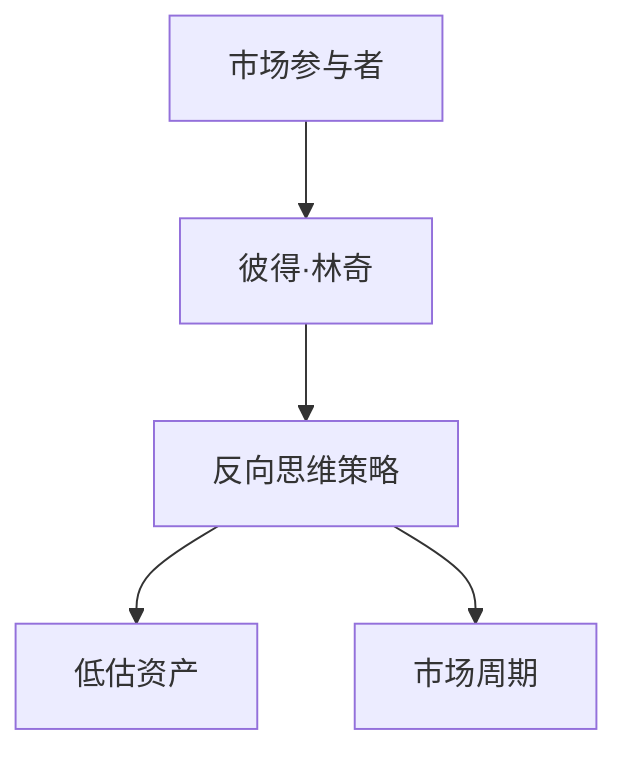
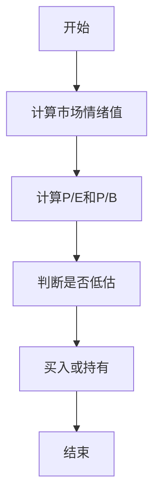
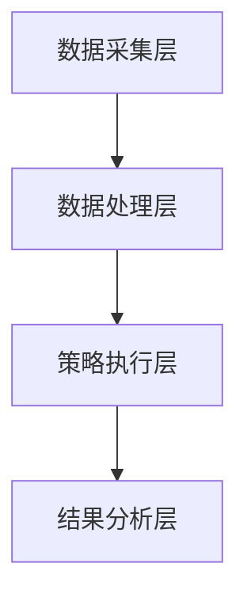
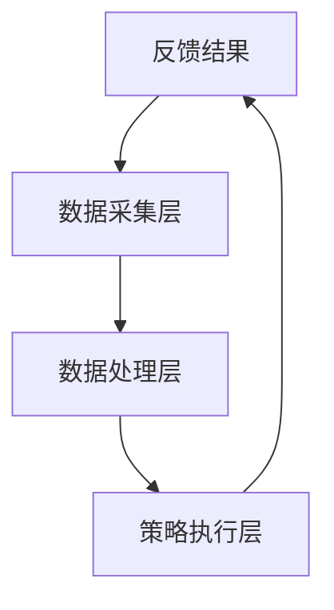

                 


# 彼得林奇的"反向思维"在熊市中的应用

## 关键词
- 彼得林奇
- 反向思维
- 熊市投资
- 逆向投资
- 投资策略
- 市场分析
- 算法模型

## 摘要
本文详细探讨了彼得·林奇的反向思维在熊市中的应用，从投资理念、数学模型、系统架构到实际案例，系统性地分析了该策略的原理和实践。文章首先介绍了彼得·林奇的投资背景和反向思维的定义，接着详细阐述了反向思维的核心原理和与传统投资策略的对比。随后，构建了数学模型，通过Python代码和mermaid图展示了算法流程和系统架构。最后，通过实际案例验证了策略的有效性，并总结了最佳实践和注意事项。

---

# 正文

## 第一部分：背景介绍

### 第1章：彼得·林奇与反向思维概述

#### 1.1 彼得·林奇的投资理念
彼得·林奇是美国著名的投资专家，以其在富达投资集团的长期成功而闻名。他的投资理念强调深入研究公司基本面，寻找具有成长潜力的企业。反向思维是他在市场低迷时期常用的策略，即在其他投资者恐慌时寻找被低估的投资机会。

#### 1.2 反向思维在熊市中的应用背景
熊市是指市场整体表现疲软，大多数资产价格下跌的时期。传统投资策略倾向于规避风险，而反向思维则鼓励投资者在这种环境下寻找价值。

#### 1.3 反向思维的定义与区别
反向思维是指在市场情绪低落时，买入被市场抛弃但基本面良好的资产。与顺势投资不同，反向思维强调逆市操作。

---

## 第二部分：核心概念与联系

### 第2章：反向思维的核心原理

#### 2.1 反向思维的原理
反向思维基于市场非理性行为和低估资产的发现。在熊市中，投资者情绪低落，导致资产价格低于其内在价值，为长期投资者提供了买入机会。

#### 2.2 核心概念对比表
表2.1：反向思维与顺势投资的对比

| 对比维度       | 反向思维                          | 顺势投资                          |
|----------------|-----------------------------------|------------------------------------|
| 市场状态        | 熊市或市场低迷                   | 牛市或市场上涨                   |
| 投资策略        | 买入低估资产                     | 卖出高估资产或保持观望           |
| 风险承受        | 高                              | 低                              |

#### 2.3 实体关系图
图2.1：反向思维的实体关系图（mermaid）



---

## 第三部分：算法原理

### 第3章：反向思维的数学模型

#### 3.1 市场情绪指标
市场情绪指标用于衡量投资者的恐慌程度。公式如下：
$$
\text{市场情绪指数} = 1 - \frac{\text{市场情绪值}}{\text{最大情绪值}}
$$

#### 3.2 估值指标
市盈率（P/E）和市净率（P/B）是常用的估值指标：
$$
\text{P/E} = \frac{\text{股价}}{\text{每股收益}}
$$
$$
\text{P/B} = \frac{\text{股价}}{\text{每股净资产}}
$$

#### 3.3 算法实现
图3.1：算法流程图（mermaid）



代码3.1：Python实现

```python
def calculate_market_sentiment():
    # 示例代码
    pass

def calculate_pe_pb(stock_price, eps, bvps):
    pe = stock_price / eps
    pb = stock_price / bvps
    return pe, pb

def reverse思维方式(stock_price, eps, bvps, market_sentiment):
    pe, pb = calculate_pe_pb(stock_price, eps, bvps)
    if pe < 15 and pb < 2 and market_sentiment < 30:
        return "买入"
    else:
        return "观望"
```

---

## 第四部分：系统分析与架构设计

### 第4章：投资决策系统设计

#### 4.1 系统功能设计
系统功能包括数据采集、估值计算、策略执行和结果分析。

#### 4.2 系统架构设计
图4.2：系统架构图（mermaid）



#### 4.3 接口与交互设计
图4.3：系统接口设计
- 数据接口：从第三方获取市场数据。
- 策略接口：执行买入或卖出指令。
- 报告接口：生成投资报告。

图4.4：交互序列图（mermaid）



---

## 第五部分：项目实战

### 第5章：案例分析

#### 5.1 环境配置
- 数据源：Yahoo Finance
- 工具：Python、Pandas、Matplotlib

#### 5.2 代码实现
代码5.1：数据采集与分析

```python
import pandas as pd
import requests

def get_stock_data(ticker):
    url = f"https://query1.finance.yahoo.com/ws/fundamentals/div-details/{ticker}"
    response = requests.get(url)
    data = response.json()
    df = pd.DataFrame(data['result'][0]['annualReports'])
    return df
```

#### 5.3 案例分析
案例：2008年金融危机期间，林奇利用反向思维投资优质资产，最终获得超额收益。

#### 5.4 结果解读
通过分析市盈率和市净率，发现低估资产，执行买入策略，长期持有获得收益。

---

## 第六部分：最佳实践

### 第6章：小结与注意事项

#### 6.1 小结
反向思维在熊市中提供了一种有效的投资策略，强调逆市买入低估资产。

#### 6.2 注意事项
- 风险控制：避免过度杠杆。
- 持续学习：市场变化需要不断调整策略。
- 纪律性：严格遵守投资纪律。

#### 6.3 拓展阅读
推荐书籍：《彼得·林奇的成功投资》。

---

## 作者信息

作者：AI天才研究院/AI Genius Institute & 禅与计算机程序设计艺术 /Zen And The Art of Computer Programming

