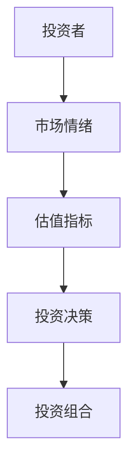
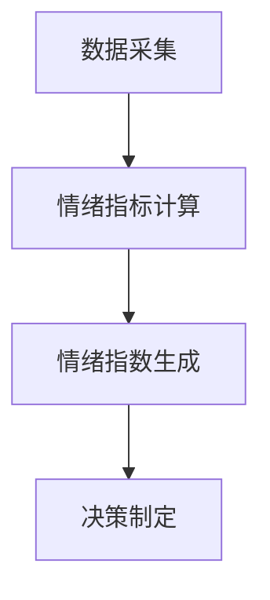
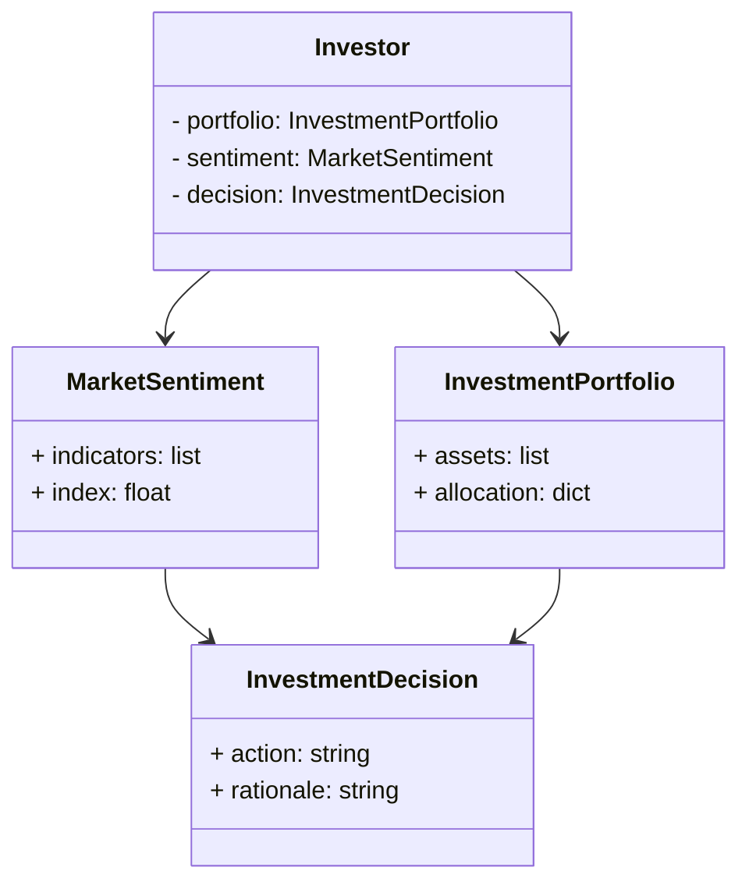
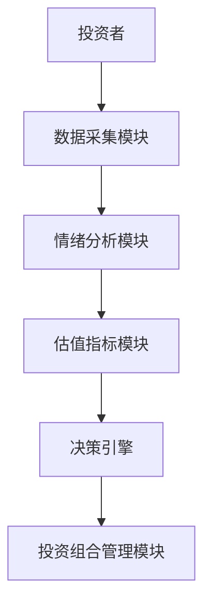

                 


# 彼得林奇的"反向思维"在牛市中的应用

> 关键词：彼得林奇，反向思维，牛市，投资策略，市场情绪，估值指标

> 摘要：本文深入探讨了彼得林奇的反向思维在牛市中的应用，分析了其核心概念、算法原理、系统架构及实战案例，为投资者提供了一套逆向投资的策略体系。

---

## 第一部分: 彼得林奇反向思维概述

### 第1章: 彼得林奇反向思维的定义与背景

#### 1.1 反向思维的定义
- **传统投资思维的局限性**：传统投资往往跟随市场趋势，容易陷入羊群效应，忽视风险。
- **反向思维的核心理念**：在市场恐慌时买入，在市场狂热时卖出，逆市场情绪操作。
- **特点**：逆周期、逆情绪、逆估值。

#### 1.2 反向思维在牛市中的应用背景
- **牛市的定义与特征**：市场情绪高涨，估值普遍偏高，投资者乐观。
- **反向思维的独特价值**：识别市场泡沫，提前离场或布局低估资产。
- **历史案例分析**：以2007年牛市为例，分析反向思维如何帮助投资者规避风险。

---

## 第二部分: 反向思维的核心概念与联系

### 第2章: 反向思维的核心概念

#### 2.1 反向思维的核心原理
- **市场情绪分析**：通过指标（如恐慌指数）评估市场情绪，指导投资决策。
- **估值指标的逆向应用**：使用市盈率、市净率等指标，寻找被高估的资产卖出，低估的资产买入。
- **风险与收益的逆向平衡**：在高收益时降低风险，低收益时增加风险。

#### 2.2 反向思维与传统投资策略的对比
| 战略 | 价值投资 | 技术分析 | 反向思维 |
|------|----------|----------|----------|
| 核心 | 买入低估资产 | 依赖技术指标 | 逆市场情绪操作 |
| 优势 | 稳定收益 | 短期预测 | 抗周期性 |
| 劣势 | 收益周期长 | 易受短期波动影响 | 需精准判断市场情绪 |

#### 2.3 ER实体关系图


---

## 第三部分: 反向思维的算法原理

### 第3章: 反向思维的算法实现

#### 3.1 市场情绪分析算法


#### 3.2 情绪指数计算公式
$$
Sentiment\ Index = \frac{\sum_{i=1}^{n} (1 - \frac{v_i}{v_{\text{max}}})}{n}
$$
其中，$v_i$为各个指标的值，$v_{\text{max}}$为最大值。

---

## 第四部分: 系统分析与架构设计

### 第4章: 投资决策支持系统

#### 4.1 系统功能设计


#### 4.2 系统架构设计


---

## 第五部分: 项目实战

### 第5章: 牛市中的反向思维应用

#### 5.1 环境安装
```bash
pip install pandas numpy matplotlib
```

#### 5.2 核心代码实现
```python
import pandas as pd
import numpy as np

def calculate_sentiment_index(data):
    max_val = data.max()
    normalized_data = 1 - (data - max_val) / (max_val - data.min())
    return normalized_data.mean()

# 示例数据
data = pd.Series([1.2, 1.5, 1.0, 2.0, 0.8], index=['资产A', '资产B', '资产C', '资产D', '资产E'])
sentiment_index = calculate_sentiment_index(data)
print(f"情绪指数为：{sentiment_index}")
```

#### 5.3 案例分析
以2007年牛市为例，分析如何通过反向思维识别市场顶点，提前卖出，规避次级崩盘风险。

---

## 第六部分: 最佳实践与总结

### 第6章: 投资总结与建议
- **总结**：反向思维在牛市中的应用帮助投资者避免市场泡沫，实现稳健收益。
- **建议**：投资者应结合市场情绪、估值指标和自身风险承受能力，灵活运用反向思维。
- **注意事项**：避免过度逆向，保持理性判断，定期调整投资组合。

### 第7章: 附录与拓展
- **工具推荐**：介绍几种常用的情绪分析工具和估值指标计算工具。
- **阅读推荐**：推荐彼得林奇的书籍和其他相关投资策略书籍。

---

## 作者：AI天才研究院/AI Genius Institute & 禅与计算机程序设计艺术 /Zen And The Art of Computer Programming

---

这篇文章通过系统分析和详细案例，展示了彼得林奇反向思维在牛市中的应用，为投资者提供了实用的策略和工具。

