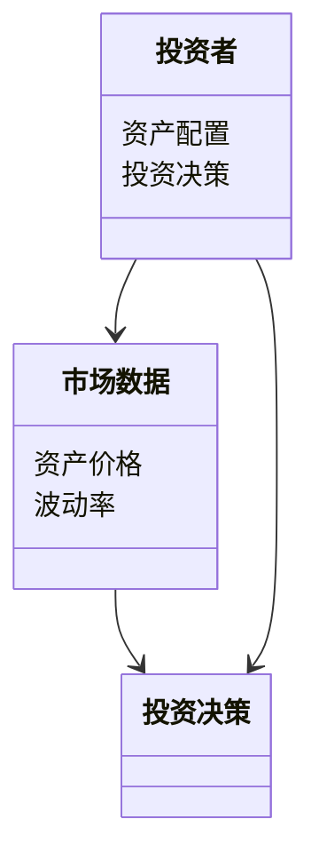
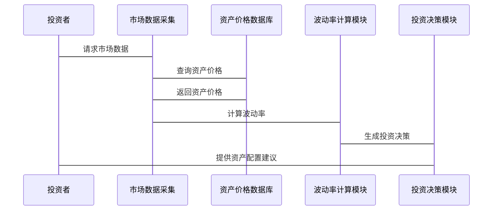

                 


# 彼得林奇的"反向思维"在资产配置中的运用

## 关键词
彼得林奇，反向思维，资产配置，投资策略，风险管理，数学模型

## 摘要
本文深入探讨了彼得林奇的“反向思维”在资产配置中的应用，通过分析其核心理念、数学模型、系统架构以及实际案例，展示了如何利用反向思维策略优化投资组合，降低风险，提高收益。文章结构清晰，内容详实，适合投资专业人士和对资产配置感兴趣读者阅读。

---

# 第一部分: 彼得林奇的“反向思维”概述

## 第1章: 反向思维的定义与背景

### 1.1 反向思维的定义
反向思维是一种与传统投资策略相反的思维方式，强调在市场低迷时买入资产，在市场繁荣时卖出资产。这种策略的核心在于逆市场情绪操作，避免追涨杀跌的误区。

#### 1.1.1 反向思维的起源
反向思维并非彼得林奇首创，但他在实践中将其系统化。其思想源于对市场非理性行为的观察，认为市场的短期波动为理性投资者提供了套利机会。

#### 1.1.2 彼得林奇对反向思维的贡献
彼得林奇通过长期的投资实践，总结出一套以反向思维为核心的资产配置方法，特别是在市场恐慌时寻找优质资产，市场狂热时降低风险敞口。

#### 1.1.3 反向思维在资产配置中的应用框架
反向思维在资产配置中的应用框架包括市场周期分析、资产价格波动预测以及投资组合调整策略。通过逆周期操作，投资者可以在市场底部积累资产，在顶部减少损失。

### 1.2 彼得林奇的投资策略
彼得林奇的投资策略以基本面分析为基础，结合反向思维，强调长期持有优质资产，避免短期市场波动的干扰。

#### 1.2.1 彼得林奇的投资理念
彼得林奇主张投资那些被市场低估但具有良好基本面的企业，尤其是在市场恐慌时买入优质股票，市场狂热时卖出获利。

#### 1.2.2 彼得林奇的选股方法
彼得林奇的选股方法包括对公司基本面的深入分析、行业地位评估、财务数据解读等，结合市场情绪判断，选择具有长期增长潜力的公司。

#### 1.2.3 彼得林奇的反向思维实践
彼得林奇通过实际案例展示了反向思维在投资中的应用，例如在互联网泡沫期间卖出高价股票，避免了随后的大幅下跌。

### 1.3 反向思维在资产配置中的应用框架
反向思维在资产配置中的应用框架包括市场周期分析、资产价格波动预测以及投资组合调整策略。通过逆周期操作，投资者可以在市场底部积累资产，在顶部减少损失。

---

## 第2章: 反向思维的核心概念与联系

### 2.1 反向思维的核心原理
反向思维的核心原理在于识别市场非理性行为，利用市场情绪的极端化进行投资决策。通过分析市场参与者的心理，反向思维能够在市场恐慌时发现低估资产，市场狂热时规避风险。

#### 2.1.1 反向思维的数学模型
反向思维的数学模型可以通过分析市场波动率和资产价格的关系，构建一个基于反向指标的投资决策系统。例如，使用波动率作为反向指标，当市场波动率低于历史平均水平时，增加资产配置；反之，减少配置。

#### 2.1.2 反向思维的逻辑结构
反向思维的逻辑结构包括市场情绪分析、资产价格预测、投资组合调整等步骤。通过分析市场参与者的心理，反向思维能够在市场恐慌时发现低估资产，市场狂热时规避风险。

#### 2.1.3 反向思维与市场周期的关系
反向思维与市场周期密切相关，强调在市场底部增加投资，在市场顶部减少投资。通过分析市场周期，投资者可以更好地应用反向思维策略。

### 2.2 反向思维的核心要素对比
反向思维与其他投资策略（如价值投资、趋势投资）在目标、方法和风险控制上有显著差异。通过对比分析，可以帮助投资者更好地理解反向思维的独特优势。

#### 2.2.1 反向思维与其他投资策略的对比
| 投资策略 | 目标 | 方法 | 风险控制 |
|----------|------|------|----------|
| 价值投资 | 寻找被低估资产 | 基于基本面分析 | 高 |
| 趋势投资 | 追逐市场趋势 | 基于技术分析 | 中 |
| 反向思维 | 逆市场情绪操作 | 基于市场情绪分析 | 高 |

#### 2.2.2 反向思维与价值投资的异同
反向思维与价值投资的共同点在于寻找被低估的资产，但反向思维更强调市场情绪的逆向操作，而价值投资更注重基本面分析。

#### 2.2.3 反向思维与趋势投资的对比
反向思维与趋势投资在方法上相反，前者强调逆市场情绪操作，后者强调跟随市场趋势。但在风险控制上，两者都需要严格的资金管理和仓位调整。

### 2.3 反向思维的ER实体关系图


---

## 第3章: 反向思维的数学模型与算法

### 3.1 反向思维的数学模型
反向思维的数学模型可以通过分析市场波动率和资产价格的关系，构建一个基于反向指标的投资决策系统。例如，使用波动率作为反向指标，当市场波动率低于历史平均水平时，增加资产配置；反之，减少配置。

#### 3.1.1 反向思维的数学模型公式
$$
\text{投资决策} = \begin{cases}
\text{买入} & \text{如果波动率 < 历史波动率平均值} \\
\text{卖出} & \text{如果波动率 > 历史波动率平均值}
\end{cases}
$$

#### 3.1.2 反向思维的算法实现
```python
def reverse_thinking_strategy(fluctuation_rate, historical_average):
    if fluctuation_rate < historical_average:
        return "买入"
    elif fluctuation_rate > historical_average:
        return "卖出"
    else:
        return "观望"
```

#### 3.1.3 反向思维的数学模型解释
通过分析市场波动率，投资者可以判断市场是否处于非理性状态。当波动率低于历史平均水平时，市场可能处于低估状态，适合买入；反之，当波动率高于历史平均水平时，市场可能处于高估状态，适合卖出。

---

## 第4章: 反向思维的系统架构设计

### 4.1 问题场景介绍
在实际投资中，投资者需要实时监控市场波动，分析市场情绪，制定相应的资产配置策略。为了实现这一目标，可以构建一个基于反向思维的资产管理系统。

### 4.2 系统功能设计
系统功能包括市场数据采集、波动率计算、投资决策生成、资产配置调整等模块。

#### 4.2.1 系统功能设计的领域模型


#### 4.2.2 系统架构设计


### 4.3 系统接口设计
系统接口包括数据输入接口（市场数据）、决策输出接口（投资决策）和用户界面接口（资产配置建议）。

### 4.4 系统交互流程


---

## 第5章: 反向思维的项目实战

### 5.1 环境安装
为了实现反向思维的资产管理系统，需要安装必要的工具和库，包括Python编程语言、Pandas数据处理库、Matplotlib可视化库等。

#### 5.1.1 安装Python环境
```bash
python --version
pip install pandas numpy matplotlib
```

### 5.2 核心代码实现
以下是基于反向思维的资产配置系统的核心代码：

```python
import pandas as pd
import numpy as np
import matplotlib.pyplot as plt

def calculate_fluctuation_rate(prices):
    # 计算波动率
    returns = prices.pct_change().dropna()
    fluctuation_rate = returns.std() * 100
    return fluctuation_rate

def reverse_thinking_strategy(fluctuation_rate, historical_average):
    if fluctuation_rate < historical_average:
        return "买入"
    elif fluctuation_rate > historical_average:
        return "卖出"
    else:
        return "观望"

# 示例数据
prices = pd.read_csv("asset_prices.csv")
fluctuation_rate = calculate_fluctuation_rate(prices)
historical_average = prices.rolling(20).mean().std() * 100
decision = reverse_thinking_strategy(fluctuation_rate, historical_average)
print("投资决策:", decision)
```

### 5.3 案例分析
假设我们有一个包含多只股票的资产组合，我们需要根据市场波动率的变化，动态调整资产配置。例如，在市场波动率低于历史平均水平时，增加股票配置；在市场波动率高于历史平均水平时，减少股票配置。

---

## 第6章: 总结与展望

### 6.1 总结
本文详细探讨了彼得林奇的反向思维在资产配置中的应用，从理论到实践，展示了如何利用反向思维优化投资组合，降低风险，提高收益。通过构建数学模型和系统架构，投资者可以更科学地应用反向思维策略。

### 6.2 展望
未来，随着人工智能和大数据技术的发展，反向思维的应用将更加广泛和深入。投资者可以利用先进的技术工具，进一步优化反向思维策略，实现更精准的投资决策。

---

# 作者：AI天才研究院/AI Genius Institute & 禅与计算机程序设计艺术 /Zen And The Art of Computer Programming

