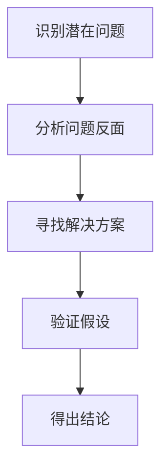
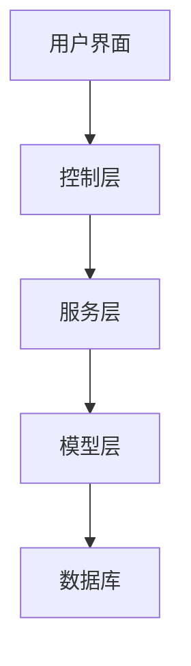

                 


# 彼得林奇的"反向思考"在中央银行数字货币影响评估中的应用

## 关键词：中央银行数字货币，彼得林奇，反向思考，影响评估，金融体系，投资策略

## 摘要：本文探讨如何将彼得林奇的反向思考方法应用于中央银行数字货币（CBDC）的影响评估。通过分析CBDC的经济影响、金融稳定和技术挑战，结合反向思考策略，构建评估框架，提供创新的视角和实践指导。

---

## 第一部分：引言

### 第1章：研究背景与意义

#### 1.1 研究背景
随着全球数字化进程加速，中央银行数字货币（CBDC）成为各国关注焦点。CBDC的引入可能重塑金融体系，影响经济运行。彼得林奇的反向思考是一种逆向投资策略，强调从问题反面入手，寻找投资机会。将此方法应用于CBDC评估，可提供独特的视角。

#### 1.2 研究意义
- CBDC对经济和金融体系的影响深远，需系统评估。
- 反向思考在投资中的成功应用，可为CBDC评估提供新思路。
- 结合两者的研究，为政策制定和投资决策提供参考。

#### 1.3 研究方法
- 文献分析：研究CBDC相关文献，了解其特点和影响。
- 反向思考：从问题反面分析，寻找潜在影响。
- 综合分析：结合定量和定性方法，评估CBDC的多维度影响。

---

## 第二部分：理论基础

### 第2章：彼得林奇的反向思考

#### 2.1 反向思考的定义
- 投资中的逆向思维：在市场低迷时寻找机会，逆市买入。
- 核心原则：寻找市场忽视的领域，分析问题根源。

#### 2.2 反向思考的应用方法
- 从结果推导原因：分析问题的反面，寻找解决方案。
- 寻找市场非共识点：识别未被充分认知的投资机会。

### 第3章：中央银行数字货币概述

#### 3.1 CBDC的定义与特点
- CBDC是中央银行发行的数字货币，具有可编程性、安全性、高效性。
- 与私人数字货币不同，CBDC由国家信用支撑，具备法偿性。

#### 3.2 CBDC的分类与模式
- 账户式：与银行账户挂钩，实时结算。
- 代币式：独立于账户，可转让。
- 中心化与去中心化：CBDC可采用不同技术架构。

---

## 第三部分：核心概念与联系

### 第4章：反向思考与CBDC影响评估的结合

#### 4.1 影响评估的主要维度
| 维度 | 描述 |
|------|------|
| 经济影响 | 对GDP、就业的影响 |
| 金融稳定 | 对银行体系的影响 |
| 技术挑战 | 技术实现的难度 |

#### 4.2 反向思考框架的构建


---

## 第四部分：算法与数学模型

### 第5章：影响评估的数学模型

#### 5.1 经济影响模型
$$GDP_{impact} = \alpha \times CBDC_{adoption} + \beta \times政策影响$$

#### 5.2 金融稳定性分析
$$稳定性指数 = \gamma \times CBDC流动性的增加$$

#### 5.3 技术挑战评估
使用线性回归模型分析技术实现难度：
$$技术挑战 = \beta_1 \times 技术复杂度 + \beta_2 \times 安全风险$$

---

## 第五部分：系统分析与架构设计

### 第6章：评估系统的架构设计

#### 6.1 需求分析
- 数据收集：收集CBDC相关数据。
- 功能需求：评估经济、金融和技术影响。

#### 6.2 系统架构设计


#### 6.3 数据流设计
- 数据输入：收集CBDC相关数据。
- 数据处理：清洗和预处理。
- 模型计算：应用反向思考框架。
- 结果输出：生成评估报告。

---

## 第六部分：项目实战

### 第7章：CBDC影响评估的项目实战

#### 7.1 环境搭建
- 安装Python和相关库（pandas、numpy、scikit-learn）。

#### 7.2 数据收集
- 数据来源：央行报告、学术论文、市场数据。

#### 7.3 模型实现
```python
import pandas as pd
from sklearn.linear_model import LinearRegression

# 数据加载
data = pd.read_csv('cbdc_data.csv')

# 模型训练
model = LinearRegression()
model.fit(data[['adoption_rate', 'policy_impact']], data['gdp_impact'])

# 预测结果
predictions = model.predict(data[['adoption_rate', 'policy_impact']])
```

#### 7.4 结果分析
- 模型评估：计算R²值，验证模型准确性。
- 结果解读：分析CBDC对经济的具体影响。

#### 7.5 模型优化
- 调整模型参数。
- 引入更多变量，如技术实现难度。

---

## 第七部分：总结与展望

### 第8章：总结与展望

#### 8.1 研究总结
- 本文将反向思考应用于CBDC评估，构建了创新的分析框架。
- 提供了系统的评估方法和实际案例。

#### 8.2 研究展望
- 进一步研究CBDC的长期影响。
- 探索反向思考在其他金融领域的应用。

---

## 作者：AI天才研究院 & 禅与计算机程序设计艺术

---

本文通过系统地分析和实践，展示了如何将彼得林奇的反向思考应用于中央银行数字货币的影响评估。通过理论与实践结合，为政策制定者和投资者提供了有价值的参考。

