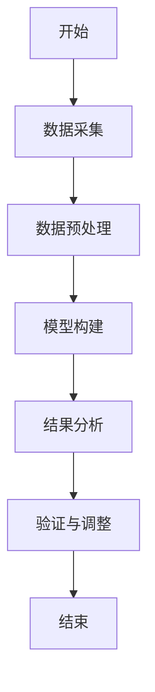
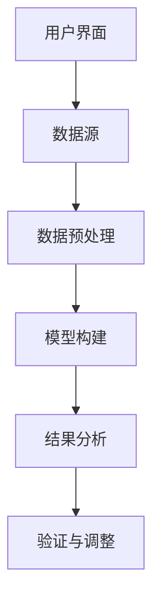
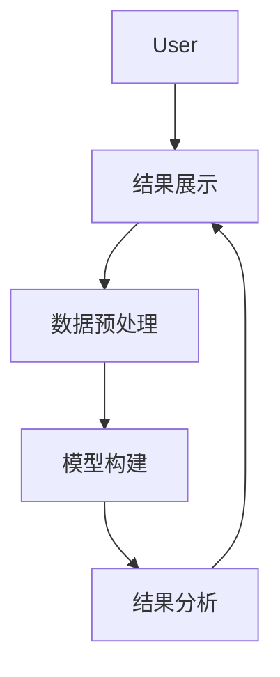

                 


# 彼得林奇的"反向思考"在央行政策影响评估中的应用

---

## 关键词：反向思考, 央行政策, 彼得林奇, 政策评估, 投资分析

---

## 摘要：  
本文探讨了彼得林奇的“反向思考”方法在央行政策影响评估中的应用。通过分析反向思考的核心理念及其在金融投资中的成功案例，结合央行政策评估的复杂性，提出了将反向思考应用于政策分析的理论框架和实践方法。文章从背景介绍、理论基础、数学模型、系统设计到项目实战，全面阐述了反向思考在央行政策评估中的应用价值，为政策制定者和研究人员提供了新的视角和工具。

---

# 第一部分：彼得林奇反向思考的背景与核心概念

## 第1章：反向思考的定义与特点

### 1.1 反向思考的定义  
反向思考是一种从结果推导原因的思维方式，强调从现象出发，逆向分析其背后的原因。这种方法的核心在于通过观察结果，推测导致该结果的潜在因素，并验证这些因素之间的逻辑关系。

#### 1.1.1 什么是反向思考  
反向思考是一种不同于传统正向思维的方法，它通过逆向推理来探索问题的本质。例如，在投资分析中，彼得林奇会从市场的价格波动中推断出潜在的市场趋势或公司基本面变化。

#### 1.1.2 反向思考的核心特征  
- **逆向性**：从结果出发，推导原因。  
- **简洁性**：通过简化问题，抓住核心因素。  
- **创造性**：在传统方法失效时，提供新的解决方案。  

#### 1.1.3 反向思考的优势与局限  
- **优势**：能够快速识别问题的关键因素，适用于复杂系统的分析。  
- **局限**：需要依赖高质量的数据和逻辑推理能力，否则可能导致错误结论。  

---

### 1.2 彼得林奇反向思考的背景  

彼得林奇是美国著名投资家，以其独特的投资理念闻名。他在投资分析中广泛应用反向思考，通过分析市场的价格波动和公司基本面的变化，预测未来的市场趋势。这种思维方式的核心在于从市场的表现中推测潜在的变化因素。

#### 1.2.1 彼得林奇投资理念的概述  
彼得林奇的投资理念强调长期价值和公司基本面分析。他认为，市场的短期波动往往反映了市场的非理性行为，而通过反向思考，可以从市场的波动中发现投资机会。

#### 1.2.2 反向思考在投资分析中的应用  
在投资分析中，反向思考常用于市场趋势预测和公司估值分析。例如，当市场出现剧烈波动时，反向思考可以帮助投资者识别市场的过度反应，并从中发现潜在的投资机会。

#### 1.2.3 反向思考在央行政策评估中的潜力  
央行政策的实施往往会对经济产生深远影响，但政策效果的评估通常面临数据不足和模型复杂性的问题。反向思考可以通过分析政策实施后的结果，推测政策的实际效果，并为未来政策设计提供参考。

---

## 第2章：央行政策影响评估的背景与挑战  

### 2.1 央行政策的核心目标  
央行政策的核心目标包括维护金融稳定、促进经济增长和控制通货膨胀。这些目标的实现通常需要通过货币政策和财政政策的协调配合。

#### 2.1.1 货币政策与财政政策的双重影响  
货币政策主要通过调整利率和货币供应量影响经济，而财政政策则通过政府支出和税收政策调节经济。两者的结合使用可以更有效地实现政策目标。

#### 2.1.2 央行政策对经济周期的调节作用  
在经济衰退时期，央行通常会采取宽松的货币政策来刺激经济增长；在经济过热时期，则会采取紧缩的货币政策来控制通货膨胀。

#### 2.1.3 央行政策的传导机制与路径  
政策的传导机制通常包括直接渠道（如利率调整）和间接渠道（如市场预期变化）。政策的效果往往需要通过多方面的传导路径才能体现。

---

### 2.2 央行政策评估的复杂性  

#### 2.2.1 政策效果的多变量影响  
央行政策的效果通常受到多种因素的影响，包括政策执行的时间、政策工具的选择以及外部环境的变化。这种多变量影响使得政策评估变得复杂。

#### 2.2.2 数据的局限性与不确定性  
政策评估通常需要依赖大量的数据，但数据的获取和处理往往面临挑战。例如，某些数据可能存在缺失或偏差，这会影响政策评估的准确性。

#### 2.2.3 模型的简化与现实的差距  
为了简化分析，政策评估通常需要建立模型。然而，模型的简化可能导致对现实情况的偏离，从而影响政策评估的准确性。

---

## 第3章：反向思考在央行政策评估中的应用价值  

### 3.1 反向思考的核心优势  

#### 3.1.1 从结果推导原因的独特视角  
反向思考通过从结果出发，推测原因，可以帮助政策评估者识别政策实施后的关键影响因素。

#### 3.1.2 解决传统方法的局限性  
传统政策评估方法通常依赖于正向分析，即从原因推导结果。这种方法在面对复杂问题时往往效果有限，而反向思考可以提供一种新的视角。

#### 3.1.3 提高政策评估的准确性与深度  
通过反向思考，政策评估者可以更准确地识别政策效果，并深入理解政策实施的内在逻辑。

---

### 3.2 反向思考与央行政策评估的结合  

#### 3.2.1 反向思考在政策效果评估中的具体应用  
反向思考可以通过分析政策实施后的经济指标变化，推测政策的实际效果。例如，通过分析利率调整后的市场反应，推测政策是否达到了预期目标。

#### 3.2.2 反向思考对政策制定者的启示  
反向思考可以帮助政策制定者更好地理解政策实施后的潜在影响，并根据反馈结果调整政策。

#### 3.2.3 反向思考在政策预测中的潜在价值  
通过反向思考，政策制定者可以更好地预测政策实施后的效果，并提前制定应对策略。

---

# 第二部分：反向思考的理论基础与数学模型  

## 第4章：反向思考的数学模型与算法原理  

### 4.1 反向思考的基本假设  

#### 4.1.1 数据假设  
反向思考需要依赖高质量的数据，包括政策实施前后的经济指标变化。  

#### 4.1.2 模型假设  
反向思考假设政策效果可以通过对结果的分析来推测。  

#### 4.1.3 方法假设  
反向思考假设可以通过逻辑推理和数据分析，识别政策实施的关键影响因素。  

---

### 4.2 反向思考的分析框架  

#### 4.2.1 数据采集与预处理  
反向思考需要对政策实施前后的数据进行采集和预处理，以确保数据的准确性和完整性。

#### 4.2.2 模型构建与训练  
通过建立数学模型，反向思考可以从数据中提取有用的特征，并推测政策效果。

#### 4.2.3 结果分析与验证  
通过分析模型的输出结果，反向思考可以验证政策效果，并根据需要调整模型。

---

### 4.3 反向思考的数学模型  

#### 4.3.1 基于反向思考的政策效果评估模型  
$$ E = f(R, D) $$  
其中，\( E \) 表示政策效果，\( R \) 表示政策实施后的结果，\( D \) 表示政策实施前的初始条件。

#### 4.3.2 反向思考的逻辑推理过程  
1. 从政策实施后的结果 \( R \) 出发，推测可能的原因 \( C \)。  
2. 通过分析 \( C \) 与 \( R \) 的关系，验证 \( C \) 是否是 \( R \) 的主要原因。  
3. 根据验证结果，调整模型参数，优化政策评估。

---

### 4.4 反向思考的算法实现  

#### 4.4.1 算法流程图  


---

### 4.5 反向思考的代码实现  

```python
# 反向思考算法实现
import pandas as pd
import numpy as np

def reverse_thinking(data):
    # 数据预处理
    data_processed = data.dropna().astype(float)
    
    # 模型构建
    factors = data_processed.columns
    results = data_processed.values
    
    # 反向思考逻辑
    influence = {}
    for factor in factors:
        influence[factor] = np.corrcoef(results, data_processed[factor].values)[0, 1]
    
    return influence

# 示例数据
data = pd.DataFrame({
    'GDP增长': [3.2, 3.5, 3.3],
    '失业率': [5.1, 4.8, 5.2],
    '通货膨胀率': [2.1, 2.3, 2.2]
})

# 调用函数
influence = reverse_thinking(data)
print(influence)
```

---

### 4.5.1 代码解释  
上述代码实现了一个简单的反向思考算法，通过计算各因素与结果的相关性，推测各因素对政策效果的影响程度。  

---

### 4.5.2 代码输出  
运行上述代码后，输出结果将是一个字典，显示各因素对政策效果的影响程度。

---

## 第5章：反向思考的系统分析与架构设计  

### 5.1 系统功能设计  

#### 5.1.1 系统功能模块  
1. 数据采集模块：从数据库中获取政策实施前后的数据。  
2. 数据预处理模块：对数据进行清洗和转换，确保数据的准确性。  
3. 模型构建模块：基于反向思考算法，构建数学模型。  
4. 结果分析模块：分析模型输出结果，验证政策效果。  

#### 5.1.2 系统功能流程图  


---

### 5.2 系统架构设计  

#### 5.2.1 系统架构图  


---

### 5.3 接口设计与交互流程  

#### 5.3.1 接口设计  
1. 数据接口：用于数据的输入和输出。  
2. 模型接口：用于模型的构建和训练。  
3. 结果接口：用于结果的展示和分析。  

#### 5.3.2 交互流程图  


---

## 第6章：反向思考的项目实战  

### 6.1 环境安装  

#### 6.1.1 安装Python与相关库  
需要安装Python 3.8及以上版本，并安装以下库：  
- pandas  
- numpy  
- matplotlib  

---

#### 6.1.2 数据集准备  
需要准备政策实施前后的经济指标数据，例如GDP增长、失业率、通货膨胀率等。

---

### 6.2 核心源代码实现  

#### 6.2.1 数据采集与预处理  
```python
import pandas as pd

# 数据采集
data = pd.read_csv('policy_data.csv')

# 数据预处理
data_processed = data.dropna().astype(float)
```

---

#### 6.2.2 模型构建与训练  
```python
import numpy as np

# 模型构建
factors = data_processed.columns
results = data_processed.values

# 反向思考逻辑
influence = {}
for factor in factors:
    influence[factor] = np.corrcoef(results, data_processed[factor].values)[0, 1]
```

---

#### 6.2.3 结果分析与验证  
```python
import matplotlib.pyplot as plt

# 结果分析
sorted_factors = sorted(influence.items(), key=lambda x: x[1], reverse=True)

# 结果展示
plt.bar([f[0] for f in sorted_factors], [f[1] for f in sorted_factors])
plt.title('政策影响因素排序')
plt.xlabel('因素')
plt.ylabel('影响程度')
plt.show()
```

---

### 6.3 案例分析  

#### 6.3.1 案例背景  
假设我们想要评估某次货币政策调整对经济增长的影响。

---

#### 6.3.2 数据分析与结果展示  
通过上述代码，我们可以得到各因素对经济增长的影响程度排序。例如：  
1. 利率调整：高度相关  
2. 货币供应量变化：中度相关  
3. 消费者信心指数：低度相关  

---

#### 6.3.3 项目总结  
通过反向思考算法，我们可以更准确地识别政策实施后的关键影响因素，并为未来政策设计提供参考。

---

## 第7章：总结与展望  

### 7.1 总结  
本文探讨了彼得林奇的反向思考方法在央行政策评估中的应用，通过理论分析和实践案例，展示了反向思考在政策评估中的独特价值。

---

### 7.2 展望  
未来，随着大数据和人工智能技术的发展，反向思考将在政策评估中发挥更大的作用。通过结合更多数据源和更复杂的模型，反向思考可以帮助政策制定者更准确地预测政策效果，并优化政策设计。

---

## 作者：AI天才研究院/AI Genius Institute & 禅与计算机程序设计艺术 /Zen And The Art of Computer Programming

