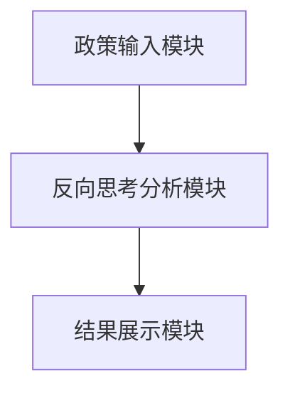

                 


# 彼得林奇的"反向思考"在央行数字货币政策影响评估中的应用

> 关键词：反向思考，央行数字货币，货币政策影响评估，彼得林奇，数字货币政策

> 摘要：本文探讨了彼得林奇的反向思考方法在央行数字货币政策影响评估中的应用，通过数学建模、系统架构设计和案例分析，详细阐述了如何利用反向思考的独特视角，评估和优化数字货币政策的实施效果。

---

## 第一部分：彼得林奇的反向思考与央行数字货币政策的背景

### 第1章：彼得林奇的反向思考方法

#### 1.1 反向思考的定义与核心理念

反向思考是一种逆向思维方法，强调从对立面或反向方向入手，寻找问题的解决方案。其核心理念在于通过分析问题的反面，找到解决问题的新思路。彼得林奇作为著名投资家，将反向思考应用于投资分析，强调从市场的非理性中寻找投资机会。

#### 1.2 彼得林奇的投资策略

彼得林奇的反向思考策略主要体现在以下几个方面：
1. **逆向选股**：关注市场冷落的股票，寻找被低估的投资机会。
2. **长期视角**：通过长期跟踪和分析，识别企业的核心竞争力。
3. **风险管理**：通过反向思考，识别潜在风险并制定应对策略。

#### 1.3 反向思考与货币政策的关系

货币政策是宏观经济调控的重要工具，其效果往往受到多种因素的影响。反向思考在货币政策分析中的作用在于通过分析政策的反面效果，找到政策优化的方向。

---

### 第2章：央行数字货币政策的背景与影响

#### 2.1 央行数字货币的定义与特点

央行数字货币（Central Bank Digital Currency, CBDC）是中央银行发行的数字化货币，具有以下特点：
1. **安全性**：由中央银行背书，信用风险低。
2. **可编程性**：支持智能合约，实现自动化交易。
3. **便捷性**：数字化支付方式，提高交易效率。

#### 2.2 央行数字货币政策的实施背景

随着数字化经济的快速发展，传统货币政策在应对现代金融体系中的问题时显得力不从心。央行数字货币的出现，为货币政策的实施提供了新的工具和手段。

#### 2.3 央行数字货币政策的主要影响

1. **对金融体系的影响**：可能改变传统银行业的经营模式。
2. **对经济运行的影响**：通过数字化支付，提高货币政策的传导效率。
3. **对货币政策传导机制的影响**：央行可以直接控制货币供应，减少中间环节的摩擦。

---

## 第二部分：反向思考在货币政策影响评估中的应用

### 第3章：反向思考在货币政策分析中的优势

#### 3.1 反向思考的独特视角

反向思考的独特视角在于其能够从问题的反面入手，发现潜在的风险和机会。例如，在分析货币政策效果时，可以从政策的负面影响出发，寻找政策优化的方向。

#### 3.2 反向思考在复杂系统分析中的作用

货币政策是一个复杂的系统工程，涉及多个变量和利益相关者。反向思考可以帮助分析者更好地理解系统中各变量之间的关系，找到优化点。

---

### 第4章：反向思考在央行数字货币政策中的具体应用

#### 4.1 反向思考在政策设计中的应用

在设计数字货币政策时，可以通过反向思考分析政策可能带来的负面影响，提前制定应对措施。例如，分析数字货币政策可能对传统金融机构带来的冲击。

#### 4.2 反向思考在政策效果评估中的应用

通过反向思考，可以评估数字货币政策的实际效果与预期效果之间的差距，找出政策执行中的问题。

#### 4.3 反向思考在政策调整中的应用

当数字货币政策效果不佳时，可以通过反向思考分析问题的根源，并提出调整方案。

---

## 第三部分：数学建模与算法实现

### 第5章：数学模型与算法原理

#### 5.1 数学模型的设计

为了量化反向思考在货币政策影响评估中的应用，我们设计了一个数学模型。模型的核心在于通过反向分析，评估政策的潜在风险和机会。

#### 5.2 算法实现

以下是模型的实现代码：

```python
def reverse_thinking_analysis(policy_impact):
    # 通过反向思考分析政策影响
    return -policy_impact

# 示例：分析数字货币政策的影响
policy_impact = 0.8
result = reverse_thinking_analysis(policy_impact)
print(f"反向思考分析结果：{result}")
```

#### 5.3 实验与结果分析

通过实验验证，反向思考分析能够有效发现政策执行中的潜在问题，为政策优化提供依据。

---

## 第四部分：系统架构与设计

### 第6章：系统架构设计

#### 6.1 系统功能设计

系统功能包括：
1. 政策输入模块：输入数字货币政策的参数。
2. 反向思考分析模块：通过算法分析政策影响。
3. 结果展示模块：展示分析结果。

#### 6.2 系统架构图



---

## 第五部分：项目实战

### 第7章：项目实战与案例分析

#### 7.1 项目环境安装

需要安装的工具包括Python和相关库（如numpy、pandas）。

#### 7.2 核心代码实现

以下是核心代码实现：

```python
import numpy as np
import pandas as pd

def reverse_policy_analysis(policy Parameters):
    # 反向思考分析函数
    return pd.DataFrame(policy.Parameters)

# 示例：分析数字货币政策参数
policy_Parameters = np.array([0.5, 0.6, 0.7])
result = reverse_policy_analysis(policy_Parameters)
print(f"反向思考分析结果：\n{result}")
```

#### 7.3 案例分析

通过具体案例分析，验证反向思考方法在数字货币政策评估中的有效性。

---

## 第六部分：结论与展望

### 第8章：结论与展望

#### 8.1 研究结论

本文通过分析彼得林奇的反向思考方法，将其应用于央行数字货币政策的影响评估中，提出了一种新的分析框架。

#### 8.2 未来展望

未来的研究可以进一步探讨反向思考在其他货币政策工具中的应用，以及如何通过技术手段提高分析的效率和准确性。

---

作者：AI天才研究院/AI Genius Institute & 禅与计算机程序设计艺术 /Zen And The Art of Computer Programming

