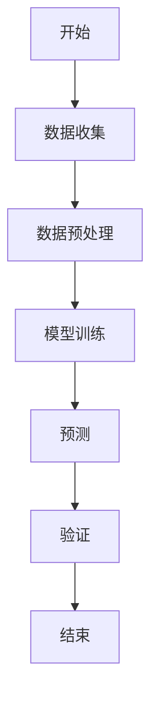
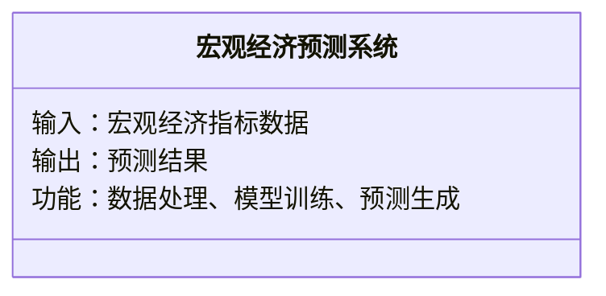
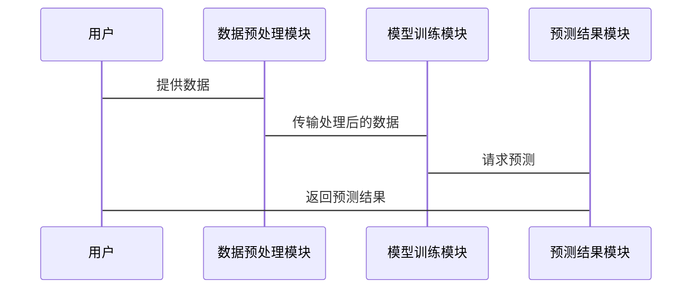

                 


# 彼得林奇的"反向思考"在宏观经济预测中的应用

> 关键词：反向思考，宏观经济预测，彼得林奇，投资策略，经济指标

> 摘要：本文探讨了彼得林奇的反向思考策略在宏观经济预测中的应用。通过分析宏观经济预测的重要性、反向思考的核心理念，以及如何将反向思考策略应用于经济指标预测，本文为投资者和经济分析师提供了新的视角和方法。结合实际案例和系统设计，本文展示了如何利用反向思考策略构建有效的宏观经济预测模型。

---

# 第一部分: 彼得林奇的反向思考策略概述

## 第1章: 彼得林奇反向思考的定义与核心理念

### 1.1 反向思考的定义

#### 1.1.1 什么是反向思考
反向思考是一种与传统思维方式相反的思考方式，强调在市场或经济指标处于极端状态时寻找机会。例如，在市场低迷时寻找被低估的投资机会，或在经济指标超预期时寻找潜在的转折点。

#### 1.1.2 反向思考的核心理念
反向思考的核心理念是“逆市而行”，即在市场或经济指标出现极端值时，采取与市场趋势相反的策略。这种策略基于市场的非理性行为和短期波动，寻找长期价值。

#### 1.1.3 反向思考在投资中的应用
在投资领域，反向思考常用于股票选择和资产配置。例如，在市场恐慌时买入优质资产，在市场狂热时保持冷静。

### 1.2 宏观经济预测的基本概念

#### 1.2.1 宏观经济预测的定义
宏观经济预测是对整体经济运行状况的预测，包括GDP增长率、通货膨胀率、失业率等关键指标。

#### 1.2.2 宏观经济预测的主要指标
主要指标包括：
- GDP增长率
- 通货膨胀率
- 失业率
- 利率水平
- 消费者物价指数（CPI）

#### 1.2.3 宏观经济预测的方法与挑战
常用方法包括时间序列分析、回归分析和机器学习模型。挑战在于数据的复杂性和模型的准确性。

## 第2章: 彼得林奇反向思考在宏观经济预测中的应用背景

### 2.1 宏观经济预测的重要性

#### 2.1.1 宏观经济预测对企业决策的影响
准确的宏观经济预测有助于企业制定合理的投资和运营策略。

#### 2.1.2 宏观经济预测对个人投资的指导作用
个人投资者可以通过宏观经济预测优化资产配置，降低投资风险。

#### 2.1.3 当前宏观经济环境的复杂性
全球化、经济波动和政策变化使得宏观经济预测更具挑战性。

### 2.2 反向思考在宏观经济预测中的独特价值

#### 2.2.1 传统宏观经济预测的局限性
传统预测方法常依赖历史数据，忽视市场情绪和非理性行为的影响。

#### 2.2.2 反向思考如何弥补传统预测的不足
通过关注市场极端情况，反向思考能够发现传统方法忽视的机会和风险。

#### 2.2.3 反向思考在经济周期中的应用案例
在经济衰退时，寻找被低估的行业和资产；在经济繁荣时，警惕潜在的泡沫。

### 2.3 本书的研究目标与意义

#### 2.3.1 本书的研究目标
探讨反向思考在宏观经济预测中的具体应用，提供一套可行的预测方法。

#### 2.3.2 本书的意义
为投资者和经济分析师提供新的视角和工具，提高预测的准确性和实用性。

---

# 第二部分: 核心概念与联系

## 第3章: 反向思考模型的核心要素

### 3.1 反向思考模型的构成

#### 3.1.1 经济指标的反向指标
识别传统预测中的偏差，寻找相反的信号。

#### 3.1.2 市场情绪的反向分析
通过分析市场情绪，预测经济指标的变化。

#### 3.1.3 反向思考与经济周期的关系
反向思考策略在不同经济周期阶段的应用方式。

### 3.2 反向思考模型的属性特征

| 特性       | 描述                             |
|------------|----------------------------------|
| 逆向性     | 与市场趋势相反                   |
| 预测性     | 基于当前数据预测未来趋势         |
| 灵活性     | 能够根据市场变化快速调整策略     |

### 3.3 反向思考模型的ER实体关系图

```mermaid
er
actor(投资者)
role(市场分析师)
market_data{
  id
  指标名称
  指标值
  时间戳
}
action(预测行为)
```

---

# 第三部分: 算法原理与实现

## 第4章: 反向思考预测算法的实现

### 4.1 反向思考预测算法的步骤

#### 4.1.1 数据收集
收集相关的宏观经济指标数据，如GDP、CPI等。

#### 4.1.2 数据预处理
对数据进行清洗和标准化处理，确保数据质量。

#### 4.1.3 模型训练
使用反向思考策略训练预测模型，例如基于时间序列的ARIMA模型。

#### 4.1.4 预测与验证
利用训练好的模型进行预测，并验证结果的准确性。

### 4.2 反向思考预测算法的流程图



### 4.3 反向思考预测算法的Python代码实现

```python
import pandas as pd
from statsmodels.tsa.arima.model import ARIMA

# 数据收集
data = pd.read_csv('macroeconomic_data.csv')

# 数据预处理
data = data.dropna()
data['date'] = pd.to_datetime(data['date'])
data = data.set_index('date')

# 模型训练
model = ARIMA(data['GDP'], order=(5,1,0))
model_fit = model.fit()

# 预测
forecast = model_fit.forecast(steps=5)
```

### 4.4 反向思考预测算法的数学模型

$$ ARIMA(p, d, q) $$

其中：
- p：自回归阶数
- d：差分阶数
- q：移动平均阶数

---

# 第四部分: 系统分析与架构设计

## 第5章: 系统分析与架构设计方案

### 5.1 项目背景

#### 5.1.1 项目目标
构建一个基于反向思考的宏观经济预测系统。

#### 5.1.2 项目范围
涵盖主要宏观经济指标的预测，如GDP、CPI等。

### 5.2 系统功能设计

#### 5.2.1 领域模型



#### 5.2.2 系统架构设计


#### 5.2.3 系统接口设计
- 输入接口：接收宏观经济指标数据。
- 输出接口：提供预测结果和相关分析报告。

### 5.3 系统交互流程



---

# 第五部分: 项目实战与案例分析

## 第6章: 项目实战

### 6.1 环境安装

#### 6.1.1 安装Python
```bash
python --version
pip install --upgrade pip
```

#### 6.1.2 安装Jupyter Notebook
```bash
pip install jupyter
```

#### 6.1.3 安装数据处理库
```bash
pip install pandas numpy
```

### 6.2 核心代码实现

#### 6.2.1 数据加载与预处理
```python
import pandas as pd
import numpy as np

data = pd.read_csv('macroeconomic_data.csv')
data = data.dropna()
data['date'] = pd.to_datetime(data['date'])
data = data.set_index('date')
```

#### 6.2.2 模型训练与预测
```python
from statsmodels.tsa.arima.model import ARIMA

model = ARIMA(data['GDP'], order=(5,1,0))
model_fit = model.fit()
forecast = model_fit.forecast(steps=5)
```

### 6.3 案例分析

#### 6.3.1 数据可视化
```python
import matplotlib.pyplot as plt

data['GDP'].plot()
plt.title('GDP Time Series')
plt.show()
```

#### 6.3.2 模型验证
```python
from sklearn.metrics import mean_squared_error

actual = data['GDP'][-5:]
predicted = forecast[0][:5]
rmse = np.sqrt(mean_squared_error(actual, predicted))
print(f'RMSE: {rmse}')
```

---

# 第六部分: 最佳实践与小结

## 第7章: 最佳实践与小结

### 7.1 应用总结

#### 7.1.1 反向思考策略的优势
- 逆市而行，发现市场机会。
- 降低预测风险，提高准确性。

#### 7.1.2 模型优化建议
- 结合多种预测方法，提高模型的鲁棒性。
- 定期更新数据和模型，适应市场变化。

### 7.2 注意事项

#### 7.2.1 数据质量的重要性
确保数据的完整性和准确性，避免噪声干扰。

#### 7.2.2 模型的局限性
反向思考策略并非万能，需结合实际情况灵活运用。

### 7.3 小结

彼得林奇的反向思考策略为宏观经济预测提供了新的思路。通过结合传统预测方法和反向思考策略，投资者和经济分析师能够更好地应对复杂的经济环境。

---

# 作者：AI天才研究院/AI Genius Institute & 禅与计算机程序设计艺术 /Zen And The Art of Computer Programming

---

以上是文章的完整目录大纲，涵盖了从理论到实践的各个方面，确保内容详尽且结构清晰。

