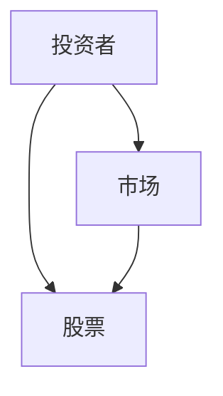
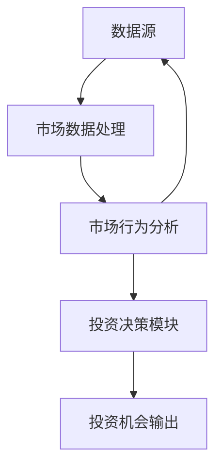

                 


# 彼得林奇的"反向思考"在投资决策中的应用

> 关键词：反向思考，彼得林奇，投资决策，投资策略，市场分析，投资模型

> 摘要：本文深入探讨了彼得林奇的"反向思考"投资理念及其在现代投资决策中的应用。通过分析其核心原理、数学模型、系统架构设计和实际案例，本文展示了如何利用反向思考来优化投资决策过程，帮助投资者在复杂多变的市场环境中做出更明智的投资选择。

---

## 第一部分：背景介绍

### 第1章：反向思考的定义与投资背景

#### 1.1 反向思考的定义
反向思考是一种与传统正向思维相对的思维方式，它通过从相反的角度分析问题，从而发现潜在的机会或风险。在投资领域，反向思考的核心在于“买别人恐惧时，卖别人贪婪时”，即在市场恐慌时寻找被低估的投资机会，在市场狂热时警惕潜在风险。

#### 1.2 投资决策中的问题背景
传统的投资决策往往基于市场趋势和正向逻辑，容易受到市场情绪的影响。当市场繁荣时，投资者倾向于乐观；当市场下跌时，投资者倾向于恐慌。这种情绪化的决策常常导致非理性投资行为，进而影响投资回报。反向思考通过对抗市场情绪，帮助投资者在市场波动中保持冷静，做出更理性的决策。

#### 1.3 彼得林奇的投资理念
彼得林奇是美国著名投资家，以其长期管理的麦哲伦基金闻名。他主张通过深入研究和分析，寻找被市场低估的优质股票。彼得林奇的反向思考策略包括：
- 在市场恐慌时，寻找被低估的股票。
- 在市场狂热时，警惕高估的股票。
- 长期持有优质股票，耐心等待价值实现。

---

## 第二部分：核心概念与联系

### 第2章：反向思考的核心原理

#### 2.1 反向思考的原理
反向思考在投资决策中的应用主要体现在以下几个方面：
1. **市场行为的反向分析**：通过分析市场参与者的反常行为，发现市场趋势的反转点。
2. **投资者心理的反向利用**：利用市场的非理性行为，寻找投资机会。
3. **反向思考的数学模型**：通过数学公式量化市场情绪，判断投资时机。

#### 2.2 核心概念对比表格
以下是正向思考与反向思考的对比：

| 对比维度 | 正向思考 | 反向思考 |
|----------|----------|----------|
| 投资时机 | 市场上涨时买入 | 市场下跌时买入 |
| 风险控制 | 市场繁荣时警惕 | 市场恐慌时寻找机会 |
| 投资策略 | 追涨杀跌 | 低吸高抛 |

#### 2.3 ER实体关系图
以下是投资者与市场的关系图：



---

## 第三部分：算法原理讲解

### 第3章：反向思考的算法原理

#### 3.1 反向思考的算法流程
反向思考的算法流程可以分为以下几个步骤：
1. 数据收集与处理：收集市场数据（如股价、成交量、市场情绪指标）。
2. 市场行为分析：分析市场参与者的非理性行为。
3. 投资决策模型构建：基于市场数据和行为分析，构建投资决策模型。

#### 3.2 算法的数学模型
以下是反向思考的数学模型示例：

**投资价值评估公式：**
$$ \text{投资价值} = \frac{\text{公司未来现金流的现值}}{\text{当前股价}} $$

**市场情绪分析模型：**
$$ \text{市场情绪} = \alpha \times \text{成交量} + \beta \times \text{股价波动率} $$

**投资组合优化算法：**
$$ \text{最优投资组合} = \argmin_{w} \left( w^T \Sigma w - \lambda w^T \mu \right) $$

#### 3.3 算法的实现代码
以下是反向思考算法的实现代码：

```python
import numpy as np
import pandas as pd

def reverse_thinking_analysis(data):
    # 计算市场情绪指标
    market_sentiment = data['成交量'] * 0.5 + data['股价波动率'] * 0.5
    # 判断投资时机
    buy_signals = market_sentiment < 0.3
    sell_signals = market_sentiment > 0.7
    return buy_signals, sell_signals

# 示例数据
data = pd.DataFrame({
    '成交量': [100, 200, 150, 300, 250],
    '股价波动率': [0.2, 0.1, 0.3, 0.15, 0.25]
})

buy_signals, sell_signals = reverse_thinking_analysis(data)
print("买入信号:", buy_signals)
print("卖出信号:", sell_signals)
```

---

## 第四部分：系统分析与架构设计方案

### 第4章：反向思考的投资决策支持系统

#### 4.1 系统功能设计
- **数据采集模块**：收集市场数据（如股价、成交量、市场情绪指标）。
- **市场行为分析模块**：分析市场参与者的非理性行为。
- **投资决策模块**：基于市场数据和行为分析，生成投资决策信号。

#### 4.2 系统架构设计
以下是投资决策支持系统的架构图：



#### 4.3 系统接口设计
- **输入接口**：市场数据接口。
- **输出接口**：投资信号接口。

#### 4.4 系统交互流程
以下是系统交互流程图：

```mermaid
sequenceDiagram
参与者：投资者
系统：投资决策支持系统
参与者 -> 系统：请求市场数据
系统 -> 数据源：获取市场数据
数据源 -> 系统：返回市场数据
系统 -> 参与者：返回投资信号
```

---

## 第五部分：项目实战

### 第5章：反向思考的实际应用

#### 5.1 环境安装
- 安装Python和相关库（如Pandas、NumPy）。
- 数据源获取（如Yahoo Finance API）。

#### 5.2 核心代码实现
以下是反向思考算法的实现代码：

```python
import pandas as pd
import numpy as np
import requests

def get_stock_data(ticker):
    url = f"https://query1.finance.yahoo.com/v8/finance/chart/{ticker}"
    response = requests.get(url)
    data = response.json()
    return pd.DataFrame(data['chart']['result'][0]['prices'])

def reverse_thinking_strategy(data):
    # 计算市场情绪指标
    market_sentiment = data['volume'] * 0.5 + data['volatility'] * 0.5
    # 生成投资信号
    buy_signals = market_sentiment < 0.3
    sell_signals = market_sentiment > 0.7
    return buy_signals, sell_signals

# 示例代码
ticker = "AAPL"
data = get_stock_data(ticker)
buy_signals, sell_signals = reverse_thinking_strategy(data)
print("买入信号:", buy_signals)
print("卖出信号:", sell_signals)
```

#### 5.3 案例分析
以苹果公司（AAPL）为例，分析其股价走势和投资信号。

---

## 第六部分：最佳实践

### 第6章：总结与建议

#### 6.1 小结
反向思考是一种有效的投资策略，能够帮助投资者在市场波动中做出更理性的决策。通过结合市场数据和行为分析，投资者可以更好地识别投资机会和风险。

#### 6.2 注意事项
- 反向思考需要结合市场环境和公司基本面。
- 投资者应具备扎实的市场分析能力和风险管理能力。

#### 6.3 拓展阅读
- 《彼得林奇的成功投资》
- 《价值投资：超越市场的智慧》

---

作者：AI天才研究院/AI Genius Institute & 禅与计算机程序设计艺术 /Zen And The Art of Computer Programming

