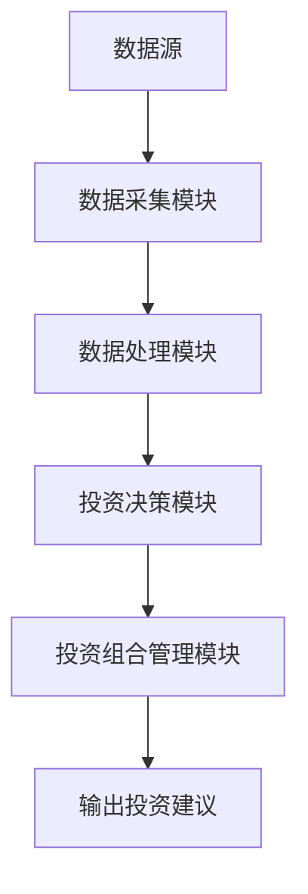

                 


# 彼得林奇的"反向思考"投资方法

> 关键词：彼得林奇、反向思考、投资方法、风险管理、市场分析、价值评估

> 摘要：本文系统地介绍了彼得林奇提出的“反向思考”投资方法，从基本概念到实战应用，详细阐述了该方法的核心思想、策略体系、数学模型和系统架构，结合实际案例分析，帮助投资者更好地理解和应用这一投资方法。

---

# 第一部分：反向思考投资方法的背景与核心概念

## 第1章：反向思考的基本概念

### 1.1 投资的基本概念

#### 1.1.1 什么是投资？
- 投资的本质：资产配置与价值创造。
- 投资的目标：实现财富增值。
- 投资的基本类型：股票、债券、基金等。

#### 1.1.2 反向思考的定义
- 反向思考的核心：在市场恐慌时寻找机会，在市场狂热时保持冷静。
- 反向思考的逻辑：买入被市场低估的资产，卖出被市场高估的资产。

#### 1.1.3 反向思考的关键要素
- 价值评估：确定资产的内在价值。
- 市场情绪：分析市场的非理性波动。
- 风险管理：控制投资组合的波动性。

### 1.2 反向思考的背景与起源

#### 1.2.1 投资市场的基本特性
- 市场的波动性：价格与价值的分离。
- 市场参与者的心理偏差：从众心理、过度自信等。
- 市场周期：牛市、熊市的交替出现。

#### 1.2.2 彼得林奇的背景介绍
- 彼得林奇的职业历程：富达投资的传奇经理人。
- 他的投资哲学：注重基本面分析，寻找被市场忽视的优质企业。
- 他对市场的看法：市场短期是投票器，长期是称重机。

#### 1.2.3 反向思考方法的形成
- 彼得林奇的成功经验：通过逆向思维捕捉市场机会。
- 他的核心理念：买入便宜的股票，卖出昂贵的股票。

### 1.3 反向思考与传统投资方法的对比

#### 1.3.1 传统投资方法的特点
- 以技术分析为主：依赖价格走势和图表形态。
- 以市场趋势为指导：跟随市场主流趋势。
- 优点：操作简单，适合短期交易。
- 缺点：忽视了资产的内在价值，容易受到市场情绪的影响。

#### 1.3.2 反向思考的独特之处
- 以价值为导向：关注资产的内在价值，而非市场价格。
- 逆市场情绪操作：在市场低迷时买入，在市场繁荣时卖出。
- 长期视角：注重长期价值，而非短期波动。

#### 1.3.3 两种方法的优缺点对比
- 传统投资方法的优缺点：
  - 优点：适合短期操作，容易掌握。
  - 缺点：容易受到市场情绪的影响，忽视资产的内在价值。
- 反向思考的优缺点：
  - 优点：能够捕捉市场低估的机会，长期收益稳定。
  - 缺点：需要较高的市场分析能力，操作难度较大。

---

## 第2章：反向思考的核心策略

### 2.1 投资者心理与市场情绪

#### 2.1.1 投资者的常见心理偏差
- 从众心理：盲目跟随市场趋势。
- 过度自信：高估自己的判断能力。
- 损失厌恶：害怕亏损而做出非理性决策。

#### 2.1.2 市场情绪对投资决策的影响
- 市场情绪的波动性：恐慌与贪婪交替出现。
- 市场情绪与价格的关系：价格反映市场情绪，而非内在价值。
- 如何利用市场情绪：在市场恐慌时寻找机会，在市场狂热时保持冷静。

#### 2.1.3 如何利用市场情绪进行反向思考
- 分析市场情绪：通过市场指标（如恐慌指数、投资者情绪指数）判断市场情绪。
- 逆市场情绪操作：在市场低迷时买入，在市场繁荣时卖出。

### 2.2 价值评估与市场价格的差异

#### 2.2.1 价值评估的基本方法
- 市盈率（P/E）：市价与每股收益的比率。
- 市净率（P/B）：市价与每股净资产的比率。
- 股息率：股息与股价的比率。
- 内在价值计算：DCF模型（现金流贴现模型）。

#### 2.2.2 市场价格波动的原因
- 市场情绪的波动：投资者的心理偏差导致价格波动。
- 市场信息的不对称性：信息不透明导致价格波动。
- 市场参与者的博弈：多方力量相互作用导致价格波动。

#### 2.2.3 如何识别市场低估的机会
- 寻找价格低于内在价值的资产。
- 分析资产的基本面：关注公司的财务状况、盈利能力、竞争优势。
- 选择合适的估值指标：根据资产类型选择合适的估值方法。

### 2.3 风险管理与投资组合优化

#### 2.3.1 风险管理的基本原则
- 分散投资：通过多样化降低风险。
- 设置止损：控制单笔投资的损失。
- 定期审视：及时调整投资组合。

#### 2.3.2 投资组合的构建策略
- 资产配置：根据风险偏好分配股票、债券、现金等资产的比例。
- 行业分散：避免过度集中于单一行业或板块。
- 个股选择：选择具有竞争优势、财务健康、估值合理的公司。

#### 2.3.3 如何平衡风险与收益
- 确定风险承受能力：根据自身财务状况和心理承受能力设定风险上限。
- 选择合适的投资策略：根据市场环境和个人能力选择进攻性或防御性的投资策略。
- 定期再平衡：根据市场变化和个人情况调整投资组合。

---

## 第3章：反向思考的数学模型与算法原理

### 3.1 反向思考的数学模型

#### 3.1.1 市场情绪分析模型
- 市场情绪指数：通过新闻、社交媒体、投资者行为等数据计算市场情绪指数。
- 市场情绪与价格的关系：市场情绪高涨时价格可能被高估，市场情绪低落时价格可能被低估。

#### 3.1.2 资产估值模型
- 内在价值计算：使用DCF模型计算股票的内在价值。
- 估值偏离度：将市场价格与内在价值进行对比，判断是否低估或高估。

#### 3.1.3 投资组合优化模型
- 风险收益比：通过夏普比率衡量投资组合的风险调整后收益。
- 资产配置优化：通过现代投资组合理论（MPT）优化资产配置。

### 3.2 反向思考的算法原理

#### 3.2.1 算法概述
- 算法目标：寻找市场价格低于内在价值的资产。
- 算法输入：市场数据（价格、成交量、市场情绪等）、资产基本面数据（财务报表、竞争优势等）。
- 算法输出：投资建议（买入、卖出、持有）。

#### 3.2.2 算法步骤
1. 数据收集：收集目标资产的市场数据和基本面数据。
2. 市场情绪分析：计算市场情绪指数。
3. 资产估值：计算资产的内在价值。
4. 估值偏离度分析：比较市场价格与内在价值，判断是否低估或高估。
5. 投资决策：根据估值偏离度和市场情绪决定是否买入、卖出或持有。

---

## 第4章：反向思考的系统架构与实现

### 4.1 系统架构设计

#### 4.1.1 系统功能模块
- 数据采集模块：收集市场数据和基本面数据。
- 数据处理模块：清洗、转换和分析数据。
- 投资决策模块：根据算法生成投资建议。
- 投资组合管理模块：优化和调整投资组合。

#### 4.1.2 系统架构图


#### 4.1.3 系统接口设计
- 数据接口：与数据源（如股票数据库、新闻网站）对接。
- 用户接口：提供投资建议和投资组合管理的可视化界面。

### 4.2 系统实现细节

#### 4.2.1 数据采集模块
- 数据来源：股票数据库、新闻网站、社交媒体等。
- 数据类型：股票价格、成交量、财务报表、新闻情绪等。

#### 4.2.2 数据处理模块
- 数据清洗：处理缺失值、异常值。
- 数据转换：将数据转换为适合算法分析的形式。
- 数据分析：使用统计方法和机器学习模型分析数据。

#### 4.2.3 投资决策模块
- 算法实现：根据市场价格与内在价值的偏离度生成投资建议。
- 决策规则：结合市场情绪和估值偏离度制定决策策略。

#### 4.2.4 投资组合管理模块
- 资产配置：根据风险收益比优化资产配置。
- 定期调整：根据市场变化和个人情况调整投资组合。

---

## 第5章：反向思考的项目实战

### 5.1 项目背景与目标

#### 5.1.1 项目背景
- 选择一个具体的资产或行业作为案例。
- 分析该资产的历史价格和基本面数据。

#### 5.1.2 项目目标
- 应用反向思考方法对该资产进行估值。
- 根据估值结果生成投资建议。

### 5.2 项目环境与工具

#### 5.2.1 环境配置
- 数据源：选择股票数据库（如Yahoo Finance）。
- 工具：Python编程语言，Pandas、NumPy数据处理库，Matplotlib可视化库。

#### 5.2.2 核心代码实现
```python
import pandas as pd
import numpy as np

# 数据加载
data = pd.read_csv('stock_data.csv')

# 市场情绪计算
def calculate_market_sentiment(data):
    # 示例：计算情绪指标（可根据实际数据调整）
    sentiment = data['Close'].rolling(20).mean().std()
    return sentiment

# 资产估值
def calculate_intrinsic_value(data):
    # 示例：使用DCF模型计算内在价值
    # 假设自由现金流和加权平均资本成本已计算
    fcf = data['FCF'].iloc[-1]
    wacc = data['WACC'].iloc[-1]
    intrinsic_value = fcf / (wacc - growth_rate)
    return intrinsic_value

# 反向思考策略
def reverse_think_strategy(data):
    sentiment = calculate_market_sentiment(data)
    intrinsic_value = calculate_intrinsic_value(data)
    market_price = data['Close'].iloc[-1]
    
    if market_price < intrinsic_value and sentiment < threshold:
        return '买入'
    elif market_price > intrinsic_value * 1.2 and sentiment > threshold:
        return '卖出'
    else:
        return '持有'

# 投资建议
print(reverse_think_strategy(data))
```

#### 5.2.3 代码解读与分析
- 数据加载：从CSV文件中加载股票数据。
- 市场情绪计算：使用移动平均标准差衡量市场波动性。
- 资产估值：简单DCF模型计算内在价值。
- 投资决策：根据市场价格与内在价值的偏离度和市场情绪生成投资建议。

### 5.3 案例分析与结果解读

#### 5.3.1 案例分析
- 选择某只股票作为案例，分析其历史价格和基本面数据。
- 计算市场情绪和内在价值，生成投资建议。

#### 5.3.2 结果解读
- 通过案例分析验证反向思考策略的有效性。
- 总结案例中的经验教训，优化策略模型。

---

## 第6章：反向思考的最佳实践与注意事项

### 6.1 最佳实践

#### 6.1.1 风险管理
- 设置止损点：避免单笔投资的过度亏损。
- 分散投资：避免过度集中于单一资产或行业。

#### 6.1.2 长期投资
- 长期持有：避免频繁交易，减少交易成本。
- 定期审视：根据市场变化和个人情况调整投资组合。

#### 6.1.3 持续学习
- 关注市场动态：及时了解经济环境和市场变化。
- 学习新知识：不断提升自己的投资能力和市场分析能力。

### 6.2 注意事项

#### 6.2.1 市场波动的风险
- 市场波动可能导致投资组合的短期亏损。
- 需要耐心等待市场回归内在价值。

#### 6.2.2 估值模型的局限性
- 估值模型基于假设，实际结果可能与模型预测不同。
- 需要结合实际情况调整模型参数。

#### 6.2.3 信息获取的难度
- 市场信息可能不透明，影响估值的准确性。
- 需要通过多种渠道获取信息，提高估值的准确性。

### 6.3 小结

#### 6.3.1 本文总结
- 反向思考是一种有效的投资方法，能够在市场低估时捕捉机会。
- 需要结合市场情绪和资产估值，制定合理的投资策略。

#### 6.3.2 未来展望
- 随着人工智能和大数据技术的发展，反向思考方法将更加精准和高效。
- 投资者需要不断学习和适应市场的变化，提高自己的投资能力。

---

## 第7章：结论与展望

### 7.1 结论

- 彼得林奇的反向思考方法是一种以价值为导向的投资策略，能够在市场低估时捕捉机会，长期实现财富增值。
- 该方法需要结合市场情绪和资产估值，制定合理的投资策略。
- 通过系统化的分析和实战案例，本文详细阐述了反向思考方法的实现过程和注意事项。

### 7.2 展望

- 随着技术的进步，反向思考方法将更加智能化和数据化。
- 投资者需要不断学习和适应市场的变化，提高自己的投资能力。
- 未来，反向思考方法将与更多新技术结合，为投资者提供更加精准的投资决策支持。

---

## 参考文献

（此处列出相关的书籍、论文、网站等参考资料）

---

作者：AI天才研究院/AI Genius Institute & 禅与计算机程序设计艺术/Zen And The Art of Computer Programming

