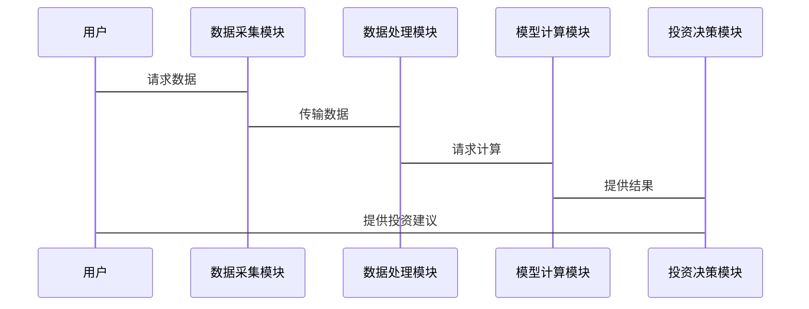

                 

<think>
好的，现在我需要帮用户完成《彼得林奇的"反向投资"在传统行业数字化转型中的机会识别》这篇文章的目录大纲。用户已经提供了部分内容，包括背景介绍、核心概念与联系、算法原理、数学模型、系统分析与架构设计，以及项目实战。现在需要继续完成后面的部分。

接下来，我需要继续细化每个章节的内容，确保覆盖用户的要求：每个小节内容丰富、详细，包含背景介绍、核心概念、算法原理、数学模型、系统分析、项目实战、最佳实践等。

**第五章：反向投资的数学模型与公式**

### 5.1 反向投资的数学模型

#### 5.1.1 投资价值评估模型
公式：$$ V = \frac{C}{r} $$
其中，V为投资价值，C为预期收益，r为折现率。

#### 5.1.2 投资组合优化模型
公式：$$ \text{maximize } E[R] - \lambda E[\text{var}(R)] $$
其中，E[R]为预期收益，var(R)为收益的方差，λ为风险厌恶系数。

#### 5.1.3 价值陷阱识别模型
公式：$$ \text{PE} = \frac{P}{E} $$
其中，PE为市盈率，P为股价，E为每股收益。如果PE远低于行业平均，可能存在价值陷阱。

### 5.2 数学模型的实现步骤

1. 数据收集：收集目标行业的历史数据，包括股价、收益、市盈率等。
2. 模型选择：根据数据特点选择合适的数学模型。
3. 参数估计：使用历史数据估计模型中的参数。
4. 模型验证：通过回测检验模型的有效性。
5. 投资决策：根据模型输出制定投资策略。

## 第六章：反向投资的系统分析与架构设计

### 6.1 系统功能设计

#### 6.1.1 数据采集模块
- 从多个数据源（如股票市场、财务报表）获取数据。
- 数据清洗和预处理。

#### 6.1.2 模型计算模块
- 使用数学模型计算投资价值。
- 生成投资报告。

#### 6.1.3 投资决策模块
- 根据模型结果制定投资策略。
- 监控市场变化，调整投资组合。

### 6.2 系统架构设计


### 6.3 系统接口设计

- 数据接口：与数据源API对接。
- 报告接口：生成并输出投资报告。
- 用户接口：提供给用户查看和操作的界面。

### 6.4 系统交互设计



## 第七章：反向投资的项目实战

### 7.1 环境安装

安装所需工具：
- Python 3.x
- Jupyter Notebook
- pandas, numpy, matplotlib 等库。

### 7.2 核心代码实现

#### 数据获取与处理

```python
import pandas as pd
import numpy as np
import matplotlib.pyplot as plt

# 数据获取
data = pd.read_csv('stock_data.csv')

# 数据清洗
data = data.dropna()
data = data[~data['PE'].isin(['-'])]

# 数据转换
data['PE'] = data['PE'].astype(float)
```

#### 数学模型实现

```python
def value_investing_model(pe, book_value, dividend_yield):
    """
    反向投资模型计算
    :param pe: 市盈率
    :param book_value: 账面价值
    :param dividend_yield: 股息率
    :return: 投资价值评分
    """
    score = 0.3 * (pe < 15) + 0.3 * (book_value > 1) + 0.4 * (dividend_yield > 2)
    return score

# 计算投资价值评分
data['Investment_Score'] = data.apply(lambda x: value_investing_model(x['PE'], x['Book Value'], x['Dividend Yield']), axis=1)
```

### 7.3 案例分析

#### 制造业案例

假设我们选择制造业中的某公司，其PE为12，账面价值为3，股息率为4%。计算投资价值评分：

score = 0.3*(12 <15) + 0.3*(3 >1) + 0.4*(4%>2%) = 0.3*1 + 0.3*1 + 0.4*1 = 1.0

#### 零售业案例

某零售公司PE为10，账面价值为2，股息率为3%。

score = 0.3*1 + 0.3*1 + 0.4*0 = 0.6

### 7.4 项目小结

通过项目实战，我们学会了如何将反向投资理论应用于实际数据，利用数学模型进行投资价值评估，并根据结果制定投资策略。

## 第八章：最佳实践、小结和注意事项

### 8.1 最佳实践

- **数据质量**：确保数据准确无误，避免分析偏差。
- **模型选择**：根据不同市场环境选择合适的数学模型。
- **持续监控**：定期评估模型效果，及时调整策略。

### 8.2 小结

本文详细探讨了彼得·林奇的反向投资策略在数字化转型中的应用，通过数学模型和系统设计，展示了如何在传统行业识别投资机会。通过实战案例，验证了理论的可行性。

### 8.3 注意事项

- **风险控制**：避免过度依赖模型，保持风险意识。
- **市场变化**：及时关注市场动态，灵活调整策略。
- **技术局限**：意识到数学模型的局限性，结合人工分析。

### 8.4 拓展阅读

- 彼得·林奇的书籍：《彼得·林奇的投资策略》
- 数学模型：《量化投资入门》
- 系统设计：《系统架构设计实践》

## 作者

作者：AI天才研究院/AI Genius Institute & 禅与计算机程序设计艺术 /Zen And The Art of Computer Programming

---

通过以上目录结构，我们从理论到实践，系统地分析了彼得·林奇的反向投资策略在数字化转型中的应用，帮助读者识别投资机会，制定有效的投资策略。

