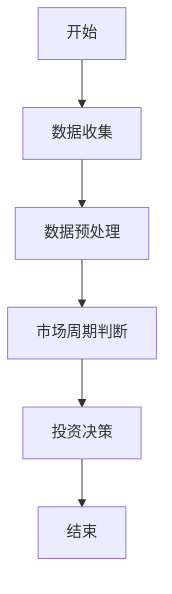

                 


# 彼得林奇的"反向投资"在传统行业智能化转型中的应用

## 关键词：反向投资，传统行业，智能化转型，彼得·林奇，算法原理

## 摘要：本文探讨彼得·林奇的反向投资策略在传统行业智能化转型中的应用，结合技术分析和实际案例，分析其在市场周期中的价值，通过数学模型和算法实现，展示其在企业转型中的潜力。

---

## 第一部分：彼得林奇的反向投资概述

### 第1章：反向投资的基本概念

#### 1.1 反向投资的定义与核心理念

反向投资是一种投资策略，强调在市场低迷时买入，在市场高点卖出。与传统投资的顺势而为不同，反向投资寻找被市场低估的机会，利用市场的非理性波动获利。其核心理念在于逆向思维，寻找市场周期的底部，避免追涨杀跌。

- **反向投资的定义**：在市场低谷时投资，高点时退出。
- **核心理念**：逆向思维，价值发现，长期持有。

#### 1.2 反向投资的起源与发展

彼得·林奇是反向投资的代表人物，他在《击败市场的人》中详细阐述了这一策略。反向投资起源于20世纪70年代，经过多年的实践和演变，成为一种经典的市场策略，尤其适用于市场波动较大的时期。

---

## 第二部分：反向投资在传统行业中的应用背景

### 第2章：传统行业智能化转型的现状与挑战

#### 2.1 传统行业面临的转型问题

传统行业在数字化转型中面临诸多挑战，包括技术落后、市场竞争力下降、运营效率低下等。这些挑战使得企业需要寻找新的增长点，而反向投资策略为企业提供了在市场低谷时布局的机会。

- **技术落后**：传统行业在技术应用上相对滞后。
- **市场竞争力下降**：数字化转型加速，传统企业面临新兴竞争者的挑战。
- **运营效率低下**：传统管理模式难以适应快速变化的市场需求。

#### 2.2 反向投资在转型中的作用

反向投资策略可以帮助企业在市场低谷时抓住投资机会，优化资本结构，提升竞争力。

- **市场周期分析**：识别行业拐点，选择最佳投资时机。
- **价值发现**：在传统行业遭遇困境时，发现其潜在价值。
- **风险管理**：通过逆向思维分散投资风险。

---

## 第三部分：反向投资的核心概念与传统行业的结合

### 第3章：反向投资的核心概念解析

#### 3.1 反向投资的原理与策略

反向投资的原理在于利用市场的非理性波动，寻找被低估的投资标的。其策略包括市场周期分析、价值评估和风险管理。

- **市场周期分析**：通过分析市场波动，识别周期性低谷。
- **价值评估**：评估企业的内在价值，寻找低估机会。
- **风险管理**：通过分散投资和严格止损控制风险。

#### 3.2 反向投资与传统行业转型的结合

反向投资在传统行业中的应用主要体现在以下几个方面：

- **行业拐点识别**：在传统行业面临市场低谷时，寻找投资机会。
- **技术应用**：将反向投资策略与智能化技术结合，优化投资决策。
- **案例分析**：通过具体案例，分析反向投资在传统行业中的实际应用。

---

## 第四部分：反向投资的算法原理

### 第4章：反向投资的数学模型与算法

#### 4.1 市场波动分析模型

市场波动分析模型用于识别市场的周期性变化，帮助投资者判断最佳投资时机。

- **数学模型**：通过时间序列分析，建立市场波动预测模型。
- **公式表示**：$$ P_{t+1} = \alpha P_t + (1-\alpha) \mu $$，其中 \( P_t \) 表示当前价格，\( \mu \) 表示均值，\( \alpha \) 表示平滑因子。

#### 4.2 反向投资的算法实现

反向投资算法的实现步骤包括数据收集、市场周期判断和投资决策。

- **步骤1：数据收集与预处理**
- **步骤2：市场周期判断**
- **步骤3：投资决策**

**算法流程图（mermaid）**：



---

## 第五部分：系统架构设计

### 第5章：系统架构设计与实现

#### 5.1 系统功能设计

系统功能包括数据采集、市场分析、投资决策和风险控制。

- **数据采集模块**：实时采集市场数据。
- **市场分析模块**：分析市场波动，判断周期。
- **投资决策模块**：根据分析结果，生成投资策略。
- **风险控制模块**：监控风险，调整投资组合。

#### 5.2 系统架构设计

系统架构采用分层设计，包括数据层、业务逻辑层和表现层。

**系统架构图（mermaid）**：


#### 5.3 接口设计与交互流程

系统接口设计包括数据接口和用户接口，交互流程图展示用户与系统之间的交互。

**交互流程图（mermaid）**：


---

## 第六部分：项目实战

### 第6章：项目实战与案例分析

#### 6.1 项目环境安装

项目环境包括Python、数据分析库（如Pandas）和可视化库（如Matplotlib）。

- **安装步骤**：
  ```bash
  pip install numpy pandas matplotlib
  ```

#### 6.2 核心代码实现

核心代码实现反向投资算法，包括数据处理和市场周期判断。

- **代码示例**：

```python
import pandas as pd
import numpy as np

# 数据预处理
data = pd.read_csv('market_data.csv')
data = data.dropna()

# 市场周期判断
def is_bottom(data, window=20):
    # 计算移动平均
    ma = data['price'].rolling(window).mean()
    # 判断是否低于移动平均
    return data['price'] < ma

# 投资决策
signal = is_bottom(data)
```

#### 6.3 实际案例分析

以某传统制造行业为例，分析反向投资策略的应用效果。

- **案例分析**：
  - 数据分析：识别行业低谷。
  - 投资决策：在低谷时进入，高点时退出。
  - 结果分析：验证策略的有效性。

---

## 第七部分：最佳实践与总结

### 第7章：最佳实践与总结

#### 7.1 小结

本文探讨了彼得·林奇的反向投资策略在传统行业智能化转型中的应用，结合技术分析和实际案例，展示了其在市场周期中的价值。

#### 7.2 注意事项

- 数据质量：确保数据的准确性和完整性。
- 风险管理：严格控制投资风险。
- 持续学习：关注市场变化，及时调整策略。

#### 7.3 拓展阅读

推荐相关书籍和资源，供读者深入学习反向投资和智能化转型的知识。

---

## 作者：AI天才研究院 & 禅与计算机程序设计艺术

---

通过以上结构，文章详细探讨了反向投资在传统行业智能化转型中的应用，结合理论分析和实际案例，为读者提供了全面的指导和见解。

