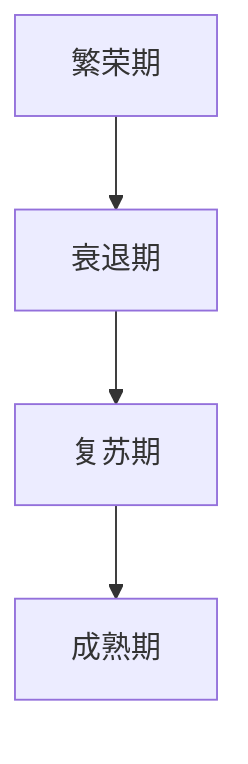
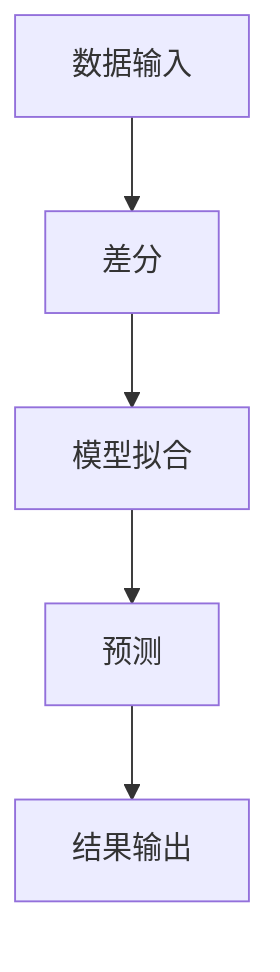
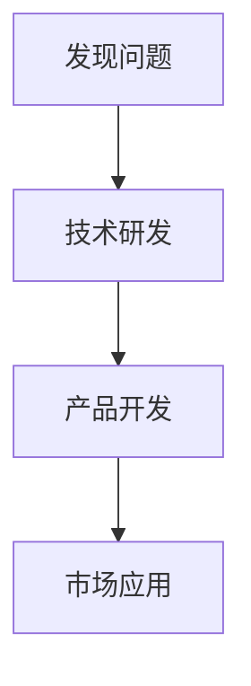
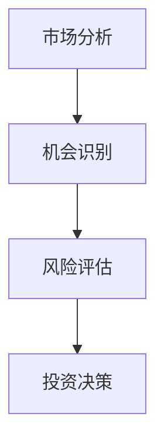
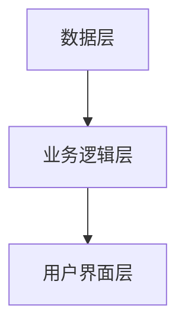
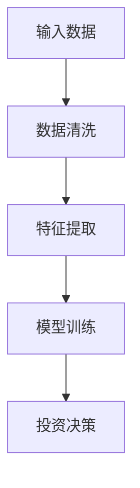

                 


# 彼得林奇的"反向投资"在成熟行业创新中的应用

## 关键词：
- 彼得林奇
- 反向投资
- 成熟行业
- 创新
- 投资策略
- 市场周期
- 估值模型

## 摘要：
本文探讨了彼得林奇的反向投资策略在成熟行业创新中的应用。通过分析反向投资的核心原理和成熟行业的创新特点，结合数学模型和系统架构，提出了一套将反向投资应用于创新的策略。文章还通过实际案例展示了如何在成熟行业中识别创新机会，并利用反向投资策略进行投资决策，为创新者和投资者提供了实用的指导。

---

# 第1章：彼得林奇的“反向投资”概述

## 1.1 反向投资的核心概念

### 1.1.1 反向投资的定义与特点

反向投资是一种与传统投资策略相反的投资方法，强调在市场低迷时买入，市场繁荣时卖出。其核心在于逆市场趋势操作，寻找被市场低估的机会。

#### 特点：
1. **逆周期性**：在市场低谷时投资，高点时退出。
2. **价值导向**：注重资产的内在价值，而非市场情绪。
3. **长期视角**：注重长期回报，而非短期波动。

### 1.1.2 彼得林奇的反向投资策略

彼得林奇是反向投资的代表人物，他认为投资者应投资于那些被市场忽视或低估的公司，尤其是那些在市场低迷时表现出稳定增长的企业。

---

## 1.2 成熟行业的创新挑战

### 1.2.1 成熟行业的定义与特征

成熟行业通常指市场增长率放缓、竞争激烈、技术趋于稳定的行业。其特点是市场容量有限，创新空间较小，但仍有通过技术创新或业务模式创新实现突破的可能。

#### 特征：
1. **市场饱和**：行业增长放缓，竞争加剧。
2. **技术成熟**：技术创新空间有限，但仍有优化可能。
3. **利润稳定**：企业利润趋于稳定，但增长有限。

### 1.2.2 成熟行业创新的难点与机遇

#### 难点：
1. **创新成本高**：技术成熟，创新门槛高。
2. **市场接受度低**：消费者对新技术的接受度有限。
3. **竞争激烈**：成熟行业中的企业竞争激烈，创新难以迅速转化为竞争优势。

#### 机遇：
1. **技术优化**：通过优化现有技术或流程降低成本。
2. **业务模式创新**：通过新的商业模式（如订阅制、服务化）实现增长。
3. **市场细分**：针对特定市场或客户群体提供定制化产品或服务。

---

## 1.3 反向投资在成熟行业创新中的价值

### 1.3.1 反向投资与行业创新的关系

反向投资通过在市场低谷时介入，能够在成熟行业中找到被低估的投资机会，尤其是在技术创新或业务模式创新初期，市场尚未充分认识到其价值时。

### 1.3.2 反向投资在创新中的独特优势

1. **低成本进入**：在市场低迷时，企业估值较低，投资成本较低。
2. **风险分散**：通过分散投资，降低单一项目风险。
3. **长期回报**：反向投资注重长期价值，适合创新周期较长的项目。

---

## 1.4 本章小结

本章介绍了反向投资的核心概念，分析了成熟行业的特点及其创新挑战，并探讨了反向投资在成熟行业创新中的价值和优势。下一章将深入探讨反向投资的理论基础，包括其原理、策略和数学模型。

---

# 第2章：反向投资的原理与方法

## 2.1 反向投资的核心要素

### 2.1.1 市场周期分析

市场周期分为繁荣期、衰退期、复苏期和成熟期。反向投资的核心在于识别市场周期的变化，选择在衰退期介入，在成熟期退出。

#### 图2-1：市场周期分析图（Mermaid）



### 2.1.2 估值与价格的关系

反向投资强调资产的内在价值与市场价格的差异。当市场价格低于内在价值时，是投资的好时机。

#### 估值公式：
$$ 内在价值 = \frac{未来现金流的现值}{折现率} $$

---

## 2.2 反向投资的策略制定

### 2.2.1 投资目标的确定

反向投资的目标是寻找被市场低估的企业，通常选择那些具有稳定现金流、良好管理团队和强大财务状况的企业。

### 2.2.2 投资组合的构建

反向投资组合应多样化，涵盖不同行业和企业规模，以分散风险。

#### 表2-1：投资组合构成

| 行业   | 企业规模 | 投资比例 |
|--------|----------|----------|
| IT     | 中小     | 40%      |
| 制造业 | 中型     | 30%      |
| 金融   | 大型     | 20%      |
| 其他   | -        | 10%      |

---

## 2.3 反向投资的数学模型

### 2.3.1 市场趋势预测模型

使用时间序列分析模型（如ARIMA）预测市场趋势。

#### 图2-2：ARIMA模型流程图（Mermaid）



### 2.3.2 估值模型与价格预测

使用DCF模型（Discounted Cash Flow）评估企业内在价值。

#### 公式：
$$ 价值 = \sum_{t=1}^{n} \frac{CF_t}{(1 + r)^t} + \frac{TV}{(1 + r)^n} $$

其中，$CF_t$ 是第t年的现金流，$r$ 是折现率，$TV$ 是终值。

---

## 2.4 本章小结

本章详细阐述了反向投资的理论基础，包括市场周期分析、估值方法和投资策略。下一章将探讨成熟行业的创新机会及其与反向投资的结合。

---

# 第3章：成熟行业的创新机会

## 3.1 成熟行业的创新模式

### 3.1.1 技术驱动型创新

通过技术创新降低成本或提高产品性能。

#### 图3-1：技术创新流程图（Mermaid）



### 3.1.2 业务模式创新

通过改变商业模式（如订阅制、服务化）实现增长。

---

## 3.2 成熟行业创新的关键因素

### 3.2.1 技术门槛

成熟行业的技术创新通常需要较高的技术门槛，但仍有优化空间。

### 3.2.2 市场需求

了解目标市场的需求是创新成功的关键。

---

## 3.3 反向投资在创新中的应用

### 3.3.1 创新周期与投资时机

反向投资应关注创新周期的早期阶段，即技术尚未被市场充分认可时。

### 3.3.2 创新风险的评估与管理

通过多元化的投资组合和严格的风险评估，降低创新失败的风险。

---

## 3.4 本章小结

本章分析了成熟行业的创新模式及其关键因素，并探讨了反向投资在创新中的应用策略。下一章将详细制定反向投资在创新中的具体策略。

---

# 第4章：反向投资在创新中的策略制定

## 4.1 反向投资与创新结合的框架

### 4.1.1 创新机会识别

通过市场调研和技术分析，识别具有潜力的创新机会。

### 4.1.2 投资策略制定

根据创新项目的具体情况，制定相应的投资策略。

---

## 4.2 反向投资的系统架构

### 4.2.1 系统功能设计

#### 图4-1：系统功能模块图（Mermaid）



### 4.2.2 系统架构设计

采用分层架构，包括数据层、业务逻辑层和用户界面层。

#### 图4-2：系统架构图（Mermaid）



---

## 4.3 反向投资的算法实现

### 4.3.1 算法流程

#### 图4-3：反向投资算法流程图（Mermaid）



### 4.3.2 代码实现

以下是一个简单的反向投资策略实现示例：

```python
def reverse_investing(stocks, market_trend):
    for stock in stocks:
        if stock.value < stock.intrinsic_value:
            return stock
    return None
```

---

## 4.4 本章小结

本章详细制定了反向投资在创新中的策略，并通过系统架构和算法实现，为实际应用提供了指导。接下来将通过实际案例进一步验证这些策略的有效性。

---

# 第5章：项目实战

## 5.1 环境安装与配置

### 5.1.1 投资分析工具

安装并配置投资分析工具，如Excel、Python（使用Pandas库）。

## 5.2 系统核心实现

### 5.2.1 代码实现

#### 代码示例：

```python
import pandas as pd

def calculate_intrinsic_value(financials):
    # 简单DCF模型
    cash_flow = financials['现金流']
    discount_rate = 0.08
    n = 5  # 五年预测
    TV = financials['终值']
    
    value = 0
    for t in range(1, n+1):
        value += cash_flow[t]/(1+discount_rate)**t
    value += TV/(1+discount_rate)**n
    return value

# 示例数据
financials = {
    '现金流': [100, 120, 130, 140, 150],
    '终值': 200
}

iv = calculate_intrinsic_value(financials)
print(f"内在价值：{iv}")
```

### 5.2.2 代码解读

上述代码实现了一个简单的DCF模型，用于计算企业的内在价值。投资者可以根据此模型评估企业的投资价值。

---

## 5.3 实际案例分析

### 5.3.1 案例背景

假设在2020年疫情后，某IT企业因市场需求下降，股价被低估，符合反向投资的条件。

### 5.3.2 投资决策

通过DCF模型计算，该企业的内在价值高于当前股价，因此决定投资。

---

## 5.4 项目小结

通过实际案例分析，验证了反向投资策略在成熟行业创新中的有效性。投资者应结合市场周期和企业基本面，制定合理的投资策略。

---

# 第6章：结论与展望

## 6.1 本章小结

本文详细探讨了彼得林奇的反向投资策略在成熟行业创新中的应用，通过理论分析和实际案例，验证了其在创新投资中的有效性。

## 6.2 未来展望

未来，随着技术的进步和市场的变化，反向投资策略需要不断优化，以适应新的创新模式和市场环境。

---

# 作者：AI天才研究院/AI Genius Institute & 禅与计算机程序设计艺术 /Zen And The Art of Computer Programming

---

以上是《彼得林奇的"反向投资"在成熟行业创新中的应用》的技术博客文章，涵盖了从理论到实践的各个方面，为读者提供了全面的指导和深入的分析。

