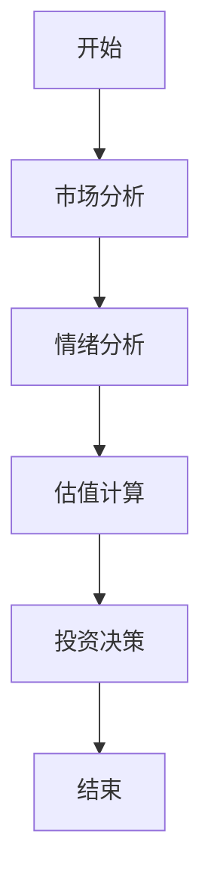

                 


# 彼得林奇的"反向投资"在新兴行业的应用

---

## 关键词  
反向投资，彼得·林奇，新兴行业，投资策略，数学模型，系统架构，投资案例

---

## 摘要  
本文深入探讨了彼得·林奇的反向投资策略在新兴行业中的应用。通过分析新兴行业的特点、市场周期和投资者情绪，结合数学模型和算法流程图，展示了如何利用反向投资策略在新兴行业中寻找投资机会。文章还通过实际案例和系统架构设计，进一步阐述了反向投资的实施方法和注意事项。

---

## 第一部分：反向投资与新兴行业概述

### 第1章：反向投资的定义与核心理念  
#### 1.1 反向投资的定义  
反向投资是一种投资策略，强调在市场低迷或恐慌时买入，在市场繁荣或过度乐观时卖出。其核心理念是逆市场情绪操作，寻找被市场忽视或低估的投资机会。

#### 1.2 新兴行业的特点与投资机会  
新兴行业通常具有高增长潜力，但也伴随着高风险和高波动性。这些行业的市场周期较短，投资者情绪容易受到市场波动的影响。

#### 1.3 反向投资与新兴行业的结合  
在新兴行业中，反向投资策略可以帮助投资者在市场低谷时发现被低估的公司，避免在市场高点盲目跟风。

---

## 第二部分：反向投资的核心概念与数学模型

### 第2章：反向投资的核心概念  
#### 2.1 投资的三要素：估值、市场周期与情绪分析  
- **估值**：通过市盈率（PE）、市净率（PB）等指标评估公司价值。  
- **市场周期**：新兴行业通常经历快速成长期和衰退期，投资者需关注周期性波动。  
- **情绪分析**：市场情绪可以通过投资者行为和媒体 sentiment 分析来判断。

#### 2.2 彼得·林奇的"反向投资"公式  
彼得·林奇提出的反向投资公式为：  
$$ V = \frac{E}{P} $$  
其中，$E$ 是预期收益，$P$ 是当前价格。当市场恐慌时，$P$ 会下降，从而提高投资价值。

#### 2.3 新兴行业中的反向投资模型  
在新兴行业，反向投资模型需要考虑行业特性和市场波动性。例如，对于科技行业，可以使用市盈率和市销率（P/S）来评估公司价值。

---

### 第3章：反向投资的数学模型与算法  
#### 3.1 投资价值的数学公式  
$$ V = \frac{E}{P} $$  
其中，$E$ 是预期收益，$P$ 是当前价格。当 $V > 1$ 时，表示公司价值被低估。

#### 3.2 反向投资的算法流程图  


#### 3.3 新兴行业中的数学模型  
对于新兴行业，可以使用以下公式进行估值：  
$$ PE = \frac{\text{股价}}{\text{每股收益}} $$  
当 PE 值低于行业平均水平时，可能是投资机会。

---

## 第三部分：系统分析与架构设计

### 第4章：系统分析与架构设计方案  
#### 4.1 问题场景介绍  
新兴行业的市场波动性和不确定性要求投资者具备快速分析和决策的能力。  

#### 4.2 系统功能设计  
- 数据收集模块：收集行业数据、公司财务数据和市场情绪数据。  
- 分析模块：计算公司估值、市场周期和情绪指数。  
- 决策模块：根据分析结果生成投资策略。

#### 4.3 系统架构设计  


#### 4.4 系统接口设计  
- 数据接口：与金融数据源对接，获取实时数据。  
- 用户接口：提供可视化界面，展示分析结果和投资建议。

#### 4.5 系统交互流程图  


---

## 第四部分：项目实战

### 第5章：项目实战  
#### 5.1 环境安装  
- 安装 Python 和相关库（如 pandas、numpy、matplotlib）。  

#### 5.2 核心实现代码  
```python
import pandas as pd
import numpy as np

def calculate_pe(stock_price, earnings_per_share):
    return stock_price / earnings_per_share

# 示例数据
stock_price = 50
earnings_per_share = 5
pe_ratio = calculate_pe(stock_price, earnings_per_share)
print(f"PE Ratio: {pe_ratio}")
```

#### 5.3 代码应用解读  
上述代码计算了市盈率，当 PE 值低于行业平均水平时，可能是投资机会。

#### 5.4 案例分析  
以科技行业为例，分析某公司的 PE 值是否低于行业平均水平，判断是否为投资机会。

#### 5.5 项目小结  
通过代码实现和案例分析，验证了反向投资策略在新兴行业中的有效性。

---

## 第五部分：最佳实践与总结

### 第6章：最佳实践与总结  
#### 6.1 最佳实践  
- 定期评估市场情绪和公司估值。  
- 避免盲目跟风，坚持逆向思维。  
- 结合行业特性和市场周期制定投资策略。  

#### 6.2 小结  
反向投资策略在新兴行业中的应用需要结合市场情绪、公司估值和行业周期。通过数学模型和系统架构设计，可以帮助投资者在新兴行业中找到投资机会。

#### 6.3 注意事项  
- 市场波动性高，需谨慎操作。  
- 定期调整投资策略，适应市场变化。  

#### 6.4 拓展阅读  
推荐阅读彼得·林奇的《投资漫步华尔街》和《投资艺术》。

---

## 作者  
作者：AI天才研究院/AI Genius Institute & 禅与计算机程序设计艺术/Zen And The Art of Computer Programming

