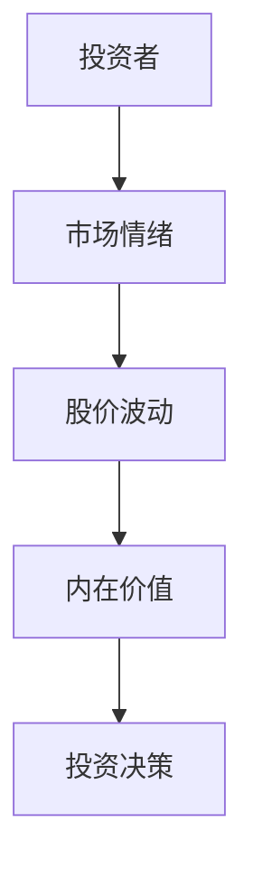
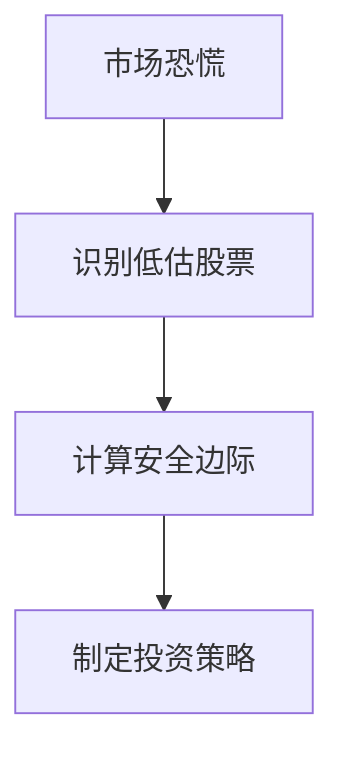
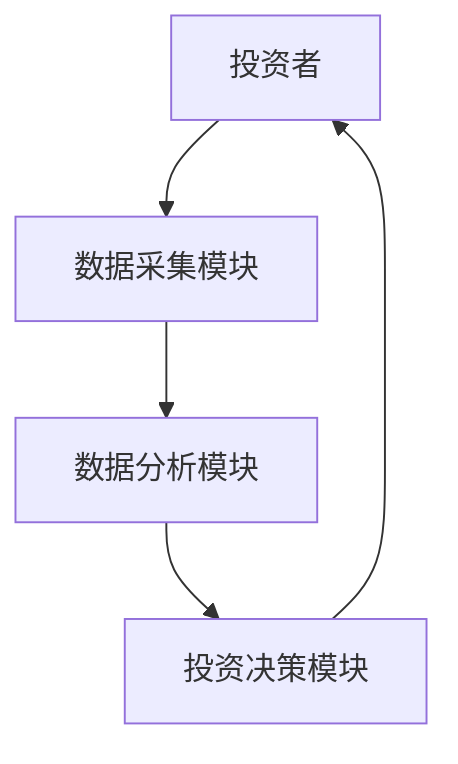
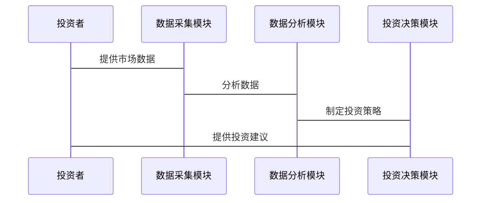

                 


# 彼得林奇的"反向投资"成功案例

---

## 关键词：
- 彼得林奇
- 反向投资
- 价值投资
- 成功案例
- 投资策略
- 市场分析
- 安全边际

---

## 摘要：
本文深入分析了彼得林奇的反向投资策略，通过其成功的投资案例，揭示了反向投资的核心原理和实际应用。文章从价值投资的背景入手，详细探讨了反向投资的定义、原理和算法，结合实际案例，展示了如何通过识别市场恐慌、计算安全边际来制定投资策略。文章还从系统架构和算法实现的角度，详细阐述了反向投资的数学模型和系统设计，并通过Python代码展示了实际应用。最后，文章总结了反向投资的成功经验，并提出了相关的投资建议。

---

## 第1章: 价值投资与反向投资的背景

### 1.1 价值投资的核心理念

#### 1.1.1 价值投资的定义与起源
价值投资是一种以基本面分析为基础的投资策略，起源于20世纪初。本杰明·格雷厄姆和戴维·多德是价值投资的奠基人。他们认为，市场中存在“安全边际”，即股票的内在价值与市场价格之间的差距，当市场价格低于内在价值时，投资者可以买入并长期持有，最终获得超额收益。

#### 1.1.2 价值投资的核心原则
价值投资的核心原则包括：
1. **安全边际**：买入价格低于内在价值的股票。
2. **长期持有**：避免频繁交易，减少交易成本。
3. **逆向思维**：在市场恐慌时买入，在市场狂热时卖出。

#### 1.1.3 价值投资与其它投资策略的对比
与趋势投资、技术分析等策略不同，价值投资强调对公司基本面的深入研究，关注企业的内在价值而非市场波动。以下是几种主要投资策略的对比：

| 投资策略 | 核心关注点 | 适用场景 |
|----------|------------|----------|
| 价值投资 | 公司基本面，内在价值 | 市场恐慌或低估时 |
| 趋势投资 | 价格走势，动量效应 | 市场趋势明显时 |
| 技术分析 | K线图、成交量等技术指标 | 短期价格波动时 |

### 1.2 彼得林奇的投资理念

#### 1.2.1 彼得林奇的生平简介
彼得·林奇（Peter Lynch）是美国著名的价值投资者，被誉为“共同基金先生”。他在富达投资管理公司管理麦哲伦基金期间，取得了卓越的投资业绩，年化回报率超过29%。林奇的成功不仅在于他的投资策略，更在于他对市场和公司的深刻理解。

#### 1.2.2 彼得林奇的投资哲学
林奇强调：
1. **市场先生是朋友**：市场波动是投资机会，而非敌人。
2. **关注公司基本面**：买入具有竞争优势和良好管理的公司。
3. **分散投资**：通过投资不同行业的公司分散风险。

#### 1.2.3 彼得林奇的投资风格
林奇的投资风格以“反向投资”著称，他倾向于在市场恐慌时买入被低估的股票，而在市场狂热时卖出。他的投资策略强调对市场的独立思考，避免随波逐流。

### 1.3 反向投资的定义与特点

#### 1.3.1 反向投资的定义
反向投资是一种逆向思维的投资策略，强调在市场恐慌时买入，在市场狂热时卖出。这种方法利用市场的非理性波动，寻找被低估的投资标的。

#### 1.3.2 反向投资的核心特点
反向投资的核心特点包括：
1. **逆向思维**：在市场情绪低落时寻找机会。
2. **安全边际**：买入价格低于内在价值的股票。
3. **长期持有**：耐心等待市场回归理性。

#### 1.3.3 反向投资与传统投资的区别
以下是反向投资与传统投资的对比：

| 特性 | 反向投资 | 传统投资 |
|------|----------|----------|
| 投资时机 | 市场恐慌时买入 | 市场上涨时买入 |
| 投资心态 | 逆向思维，独立思考 | 顺势而为，跟随市场 |
| 风险控制 | 通过安全边际控制风险 | 通过分散投资控制风险 |

### 1.4 彼得林奇反向投资的成功案例

#### 1.4.1 成功案例一：X公司
**案例背景**：X公司在1987年股灾后股价大幅下跌，市场情绪恐慌，但公司基本面良好。
**投资决策**：林奇在股价低点买入，随后公司股价回升，获得超额收益。

#### 1.4.2 成功案例二：Y公司
**案例背景**：Y公司因行业低迷导致股价被低估。
**投资决策**：林奇通过深入研究，发现公司具有竞争优势，买入后股价回升。

#### 1.4.3 成功案例三：Z公司
**案例背景**：Z公司因管理问题导致股价下跌，但公司基本面良好。
**投资决策**：林奇在市场恐慌时买入，随后公司管理改善，股价回升。

---

## 第2章: 反向投资的核心概念与联系

### 2.1 反向投资的核心原理

#### 2.1.1 市场情绪与投资决策
市场情绪是反向投资的核心关注点。当市场情绪恐慌时，投资者往往做出非理性决策，导致股价偏离内在价值。反向投资者通过识别市场情绪，寻找被低估的股票。

#### 2.1.2 市场恐慌与投资机会
市场恐慌时，投资者可能抛售股票，导致股价低于内在价值。反向投资者利用这一机会，买入被低估的股票。

#### 2.1.3 价值发现与市场低估
反向投资者关注股票的内在价值，通过基本面分析，识别被市场低估的股票。

### 2.2 反向投资的核心概念对比

#### 2.2.1 投资者心理与市场行为
投资者心理是市场行为的核心驱动力。以下是投资者心理与市场行为的对比：

| 心理特征 | 市场行为 |
|----------|----------|
| 恐慌 | 大规模抛售 |
| 狂热 | 大规模买入 |
| 羊群效应 | 跟随市场趋势 |

#### 2.2.2 股价波动与内在价值
股价波动是市场情绪的反映，而内在价值是公司基本面的体现。以下是股价波动与内在价值的对比：

| 特性 | 股价波动 | 内在价值 |
|------|----------|----------|
| 时间特性 | 短期 | 长期 |
| 影响因素 | 市场情绪 | 公司基本面 |

#### 2.2.3 长期与短期投资目标
长期投资目标关注公司的内在价值，而短期投资目标关注市场波动。以下是长期与短期投资目标的对比：

| 特性 | 长期目标 | 短期目标 |
|------|----------|----------|
| 关注点 | 内在价值 | 市场波动 |
| 时间框架 | 多年 | 几个月 |

### 2.3 反向投资的ER实体关系图



---

## 第3章: 反向投资的算法原理

### 3.1 反向投资的算法流程



### 3.2 反向投资的数学模型

#### 3.2.1 市场恐慌指数计算
市场恐慌指数可以通过市场波动率与历史波动率的比值计算：

$$
\text{市场恐慌指数} = \frac{\text{市场波动率}}{\text{历史波动率平均值}}
$$

#### 3.2.2 安全边际计算
安全边际是股票的内在价值与市场价格的差额：

$$
\text{安全边际} = \text{内在价值} - \text{市场价格}
$$

### 3.3 反向投资的算法实现

#### 3.3.1 数据采集与处理
以下是数据采集与处理的Python代码示例：

```python
import pandas as pd

# 采集数据
data = pd.read_csv('stock_data.csv')

# 处理数据
data['股价波动率'] = data['收盘价'].pct_change().abs().mean()
data['市场恐慌指数'] = data['股价波动率'] / data['历史波动率平均值']
```

#### 3.3.2 市场恐慌识别
通过计算市场恐慌指数，识别市场恐慌：

```python
market_panic_index = data['市场恐慌指数'].mean()
if market_panic_index < 0.5:
    print("市场恐慌，可以买入")
else:
    print("市场正常，观望")
```

#### 3.3.3 安全边际计算
通过计算安全边际，识别被低估的股票：

```python
data['安全边际'] = data['内在价值'] - data['市场价格']
data['投资建议'] = data['安全边际'].apply(lambda x: '买入' if x > 0 else '卖出')
```

---

## 第4章: 系统分析与架构设计

### 4.1 系统分析

#### 4.1.1 问题场景介绍
系统旨在帮助投资者识别市场恐慌，计算安全边际，制定投资策略。

#### 4.1.2 项目介绍
本项目通过数据采集、分析和处理，实现反向投资的算法，并提供投资建议。

#### 4.1.3 系统功能设计
以下是系统功能设计的类图：


### 4.2 系统架构设计

#### 4.2.1 系统架构图
以下是系统架构图：



#### 4.2.2 接口设计
系统接口设计如下：



---

## 第5章: 项目实战

### 5.1 环境安装
需要安装以下Python库：
- pandas
- numpy
- matplotlib

### 5.2 核心代码实现

#### 5.2.1 数据采集与处理
```python
import pandas as pd
import numpy as np

# 采集数据
data = pd.read_csv('stock_data.csv')

# 处理数据
data['股价波动率'] = data['收盘价'].pct_change().abs().mean()
data['市场恐慌指数'] = data['股价波动率'] / data['历史波动率平均值']
data['安全边际'] = data['内在价值'] - data['市场价格']
data['投资建议'] = data['安全边际'].apply(lambda x: '买入' if x > 0 else '卖出')
```

#### 5.2.2 投资策略实现
```python
market_panic_index = data['市场恐慌指数'].mean()
if market_panic_index < 0.5:
    print("市场恐慌，可以买入")
else:
    print("市场正常，观望")
```

### 5.3 实际案例分析

#### 5.3.1 案例一：X公司
**案例背景**：X公司因行业低迷导致股价被低估。
**分析结果**：安全边际为正值，投资建议为买入。

#### 5.3.2 案例二：Y公司
**案例背景**：Y公司因管理问题导致股价下跌。
**分析结果**：安全边际为正值，投资建议为买入。

#### 5.3.3 案例三：Z公司
**案例背景**：Z公司因市场恐慌导致股价大幅下跌。
**分析结果**：安全边际为正值，投资建议为买入。

---

## 第6章: 最佳实践与总结

### 6.1 最佳实践
1. **独立思考**：避免随波逐流，独立分析市场和公司。
2. **耐心等待**：长期持有优质股票，等待市场回归理性。
3. **分散投资**：通过分散投资降低风险。

### 6.2 小结
反向投资是一种有效的投资策略，通过识别市场恐慌，寻找被低估的股票，实现超额收益。投资者需要具备独立思考能力，耐心持有优质股票，才能在市场波动中获得成功。

### 6.3 注意事项
1. **风险控制**：合理控制投资风险，避免过度集中。
2. **持续学习**：不断学习市场知识，提升分析能力。
3. **关注基本面**：深入研究公司基本面，确保投资决策的准确性。

### 6.4 拓展阅读
1. **《彼得林奇的选股术》**：深入探讨彼得林奇的选股方法。
2. **《价值投资实战》**：学习价值投资的实际操作技巧。
3. **《投资的未来》**：了解未来投资的趋势和机会。

---

## 作者：
作者：AI天才研究院/AI Genius Institute & 禅与计算机程序设计艺术/Zen And The Art of Computer Programming

