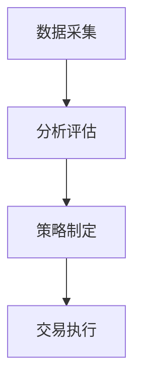

                 

# 彼得林奇的"反向投资"时机选择

> 关键词：反向投资，彼得·林奇，投资策略，市场时机，价值投资

> 摘要：本文深入探讨了彼得·林奇的反向投资策略，分析了其时机选择的核心概念、算法原理和实际应用。通过系统分析和实战案例，揭示了反向投资在当前市场环境下的独特优势和挑战。

---

## 第一部分: 投资基础与反向投资概述

### 第1章: 投资的基本概念与彼得·林奇的生平

#### 1.1 投资的基本概念

**1.1.1 投资的定义与分类**

投资是指将资金投入到某个项目或资产中，以期望在未来获得收益或资本增值的行为。根据投资对象的不同，可以分为股票、债券、房地产等多种类型。股票投资是最常见的形式之一，涉及购买公司的一部分股权，期望通过股价上涨或股息收入获得收益。

**1.1.2 股票市场的基本运作机制**

股票市场是投资者买卖股票的场所，主要功能是为企业融资和为投资者提供投资渠道。股票价格受多种因素影响，包括公司业绩、市场情绪、宏观经济环境等。投资者通过购买股票成为公司的部分所有者，享有投票权和分红权。

**1.1.3 投资者的角色与类型**

投资者可以分为机构投资者和个人投资者。机构投资者包括基金公司、保险公司等，通常拥有较大的资金规模和专业的投资团队。个人投资者则以散户为主，投资金额相对较小，但数量众多。不同类型的投资者有不同的投资目标和风险承受能力。

#### 1.2 彼得·林奇的生平与成就

**1.2.1 彼得·林奇的早期经历**

彼得·林奇（Peter Lynch）出生于1942年，美国著名基金经理人。他在青少年时期对投资产生了浓厚兴趣，通过阅读《股票市场手册》自学投资知识。大学期间，他开始管理自己的投资组合，并在实践中积累了丰富的经验。

**1.2.2 林奇在富达投资的成就**

1977年，林奇加入富达投资管理公司，担任麦哲伦基金的经理。在他的管理下，基金取得了卓越的业绩，年平均回报率超过29%，远超市场平均水平。林奇的投资风格以选股能力强著称，他注重深入研究公司基本面，寻找具有竞争优势的企业。

**1.2.3 林奇的投资风格与理念**

林奇强调长期投资和价值发现，反对频繁交易和盲目跟风。他认为市场波动为投资者提供了廉价买入优质资产的机会。他的投资哲学的核心是：买入优秀的公司，在合理估值时买入，耐心持有，等待其成长。

#### 1.3 什么是反向投资

**1.3.1 反向投资的定义**

反向投资是一种投资策略，强调在市场低迷、投资者恐慌时买入资产，在市场高涨、投资者狂热时卖出资产。与传统投资的顺势而为不同，反向投资逆市场情绪操作，试图在市场底部布局，顶部离场。

**1.3.2 反向投资的基本原理**

反向投资基于市场非理性波动的假设，认为市场在短期波动中会偏离资产的真实价值。当市场恐慌时，资产价格被过度压低，提供了买入机会；当市场狂热时，价格被推高，提供了卖出信号。

**1.3.3 反向投资与传统投资的区别**

| 概念         | 传统投资             | 反向投资             |
|--------------|----------------------|----------------------|
| 投资时机     | 随市场波动            | 逆市场情绪            |
| 风险控制     | 事后调整             | 事前防御             |
| 盈利模式     | 跟随市场             | 抵制市场             |

#### 1.4 反向投资的背景与现状

**1.4.1 当前市场环境对反向投资的影响**

近年来，全球市场波动加剧，新冠疫情、地缘政治冲突等事件导致市场恐慌，为反向投资提供了机会。同时，市场的快速反弹也要求投资者及时调整策略，避免高位被套。

**1.4.2 反向投资在不同经济周期的表现**

在经济衰退期，反向投资往往表现优异，因为市场恐慌导致资产价格被低估。而在经济过热期，反向投资则能帮助投资者规避风险，锁定收益。

**1.4.3 反向投资的局限性与挑战**

反向投资需要投资者具备强大的心理素质，能够在市场恐慌时保持冷静。此外，准确判断市场拐点的难度较大，稍有不慎可能导致重大损失。

#### 1.5 本章小结

本章介绍了投资的基本概念，详细阐述了彼得·林奇的生平与成就，重点分析了反向投资的定义、原理及其与传统投资的区别。理解这些内容为后续章节的深入分析奠定了基础。

---

## 第二部分: 反向投资的核心概念与原理

### 第2章: 反向投资的核心概念

#### 2.1 市场情绪与投资者心理

**2.1.1 市场情绪的周期性**

市场情绪呈现周期性波动，从乐观到悲观，再从悲观到乐观，循环往复。反向投资者需要识别市场的非理性阶段，抓住情绪低谷时的买入机会。

**2.1.2 投资者的心理偏差**

投资者常见的心理偏差包括过度自信、从众心理和损失厌恶。这些偏差导致市场在短期内偏离资产的真实价值，为反向投资创造了机会。

**2.1.3 市场情绪与反向投资的关系**

市场情绪的波动为反向投资提供了操作空间。当市场情绪极度悲观时，反向投资者买入；当市场情绪极度乐观时，反向投资者卖出。

#### 2.2 价值评估与市场定价

**2.2.1 价值投资的基本原理**

价值投资强调购买被市场低估的资产。通过分析公司的财务报表、行业地位和竞争优势，评估其内在价值，等待价格回归合理区间。

**2.2.2 市场定价的偏差**

市场定价受投资者情绪影响，可能出现偏离资产真实价值的情况。反向投资者通过识别这种偏差，寻找投资机会。

**2.2.3 反向投资中的价值发现**

反向投资者在市场低谷时，寻找那些基本面良好但被市场抛弃的资产，这些资产往往具有较高的安全边际。

#### 2.3 反向投资的时机选择

**2.3.1 市场恐慌与买入机会**

市场恐慌时，投资者情绪极度悲观，导致资产价格被过度压低。此时，反向投资者积极买入，布局优质资产。

**2.3.2 市场狂热与卖出信号**

市场狂热时，投资者情绪极度乐观，导致资产价格被推高。此时，反向投资者果断卖出，锁定收益。

**2.3.3 时机选择的关键指标**

反向投资者关注市盈率、市净率等估值指标，结合市场情绪和行业趋势，判断投资时机。

#### 2.4 反向投资的策略框架

**2.4.1 确定投资目标**

明确投资目标，包括投资期限、风险承受能力和收益预期。这有助于制定合理的投资计划。

**2.4.2 制定投资计划**

根据市场状况和个人目标，制定详细的投资计划，包括买入和卖出的时机、资金分配等。

**2.4.3 监控与调整策略**

定期监控市场变化，评估投资组合的表现，及时调整策略，应对市场波动。

#### 2.5 核心概念对比表

| 概念         | 传统投资             | 反向投资             |
|--------------|----------------------|----------------------|
| 投资时机     | 随市场波动            | 逆市场情绪            |
| 风险控制     | 事后调整             | 事前防御             |
| 盈利模式     | 跟随市场             | 抵制市场             |

---

## 第三部分: 反向投资的算法与数学模型

### 第3章: 反向投资的算法原理

#### 3.1 反向投资的指标体系

**3.1.1 市盈率（P/E）分析**

市盈率是股价与每股收益的比率，用于衡量股票的估值水平。反向投资者关注低市盈率的股票，认为这些股票可能被市场低估。

**3.1.2 市净率（P/B）分析**

市净率是股价与每股净资产的比率，用于评估股票相对于其账面价值的高低。低市净率的股票可能具有较高的投资价值。

**3.1.3 股息率（Dividend Yield）分析**

股息率是每股股息与股价的比率，用于衡量股票的分红回报。高股息率的股票可能被市场低估，提供稳定的收益。

#### 3.2 反向投资的决策流程

**3.2.1 数据收集与整理**

收集目标公司的财务数据、行业信息和市场数据，进行整理和分析。

**3.2.2 数据分析与建模**

运用统计分析和数学建模，评估资产的内在价值，判断其是否被市场低估或高估。

**3.2.3 投资决策与执行**

根据分析结果，制定买入或卖出的决策，并执行交易。

#### 3.3 反向投资的数学模型

**3.3.1 市场情绪指数模型**

$$ S = \frac{V}{M} $$

其中，$S$ 表示市场情绪指数，$V$ 表示成交额，$M$ 表示市场容量。

**3.3.2 价值评估模型**

$$ V = \text{现金流折现模型} $$

通过现金流折现模型（DCF）评估公司的内在价值，与市场价格进行对比，判断投资机会。

---

## 第四部分: 系统分析与架构设计

### 第4章: 反向投资系统的构建

#### 4.1 投资决策系统的构建

**4.1.1 系统功能设计**

功能模块包括数据采集、分析评估、策略制定和交易执行。每个模块都有特定的功能，协同工作以实现投资目标。

**4.1.2 系统架构设计**

采用分层架构，包括数据层、业务逻辑层和用户界面层。各层之间通过接口通信，确保系统的高效运行。

**4.1.3 系统接口设计**

定义清晰的接口规范，确保模块之间的数据交换和功能调用顺畅。

**4.1.4 系统交互流程**

通过mermaid序列图展示系统的交互流程，包括用户请求、数据处理和结果反馈。

#### 4.2 投资决策系统的功能实现

**4.2.1 数据采集模块**

负责收集市场数据，包括股票价格、成交量等，为后续分析提供基础。

**4.2.2 分析评估模块**

运用数学模型和统计方法，评估资产的价值，判断投资机会。

**4.2.3 策略制定模块**

根据分析结果，制定买入和卖出的策略，并生成交易指令。

**4.2.4 交易执行模块**

接收交易指令，执行买入或卖出操作，并记录交易结果。

#### 4.3 系统架构的mermaid图

---

## 第五部分: 项目实战与案例分析

### 第5章: 反向投资策略的实战应用

#### 5.1 项目实战环境安装

**5.1.1 环境配置**

安装必要的软件和工具，如数据分析工具、交易系统和监控软件。

**5.1.2 数据源选择**

选择可靠的市场数据源，如Yahoo Finance或 Bloomberg，获取实时数据。

#### 5.2 反向投资策略的核心实现

**5.2.1 数据分析与建模**

使用Python编写代码，导入市场数据，计算市盈率、市净率等指标，评估资产价值。

**5.2.2 策略实现**

根据分析结果，编写交易策略，判断买入和卖出时机，并执行交易。

#### 5.3 反向投资策略的实际案例

**5.3.1 案例分析**

以某只股票为例，分析其市场表现，判断是否符合反向投资的条件。

**5.3.2 代码实现**

编写Python代码，实现数据采集、分析和交易策略。

#### 5.4 反向投资策略的测试与优化

**5.4.1 回测分析**

对策略进行历史数据回测，验证其有效性和稳定性。

**5.4.2 性能优化**

根据回测结果，优化策略参数，提高投资收益。

#### 5.5 项目小结

总结实战经验，分析策略的优缺点，为未来投资提供参考。

---

## 第六部分: 最佳实践与总结

### 第6章: 反向投资的最佳实践

#### 6.1 本章小结

总结全文内容，强调反向投资的核心理念和实际应用。

#### 6.2 反向投资的注意事项

提醒投资者注意市场风险、策略选择和心理素质的重要性。

#### 6.3 拓展阅读

推荐相关书籍和资源，帮助读者深入学习反向投资知识。

---

## 作者

作者：AI天才研究院/AI Genius Institute & 禅与计算机程序设计艺术/Zen And The Art of Computer Programming

---

通过以上步骤，我们逐步构建了关于彼得林奇反向投资策略的完整内容。每一部分都详细展开，确保读者能够全面理解反向投资的背景、原理和应用。通过实际案例和系统设计，进一步加深读者对策略的理解和应用能力。

