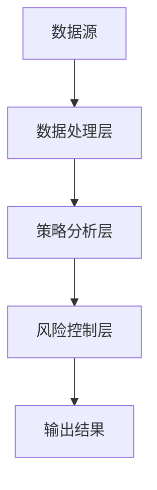

                 


# 彼得林奇的"反周期"投资在不同地域市场的应用

## 关键词：反周期投资，彼得·林奇，投资策略，地域市场，经济周期，系统架构，数学模型

## 摘要：  
本文深入探讨了彼得·林奇的"反周期"投资理念及其在全球不同地域市场的应用。文章首先介绍了反周期投资的核心概念和原理，然后分析了不同经济周期下各主要市场的投资策略，结合系统架构设计和数学模型，详细阐述了反周期投资的实现方法。通过实际案例分析和系统优化，本文为投资者提供了在不同地域市场中应用反周期投资策略的实践指南。

---

# 第一部分: 彼得·林奇的"反周期"投资概述

## 第1章: 反周期投资的核心概念

### 1.1 什么是反周期投资
#### 1.1.1 投资周期的基本定义  
投资周期是指经济和市场波动中，从繁荣到衰退再到复苏的循环过程。反周期投资是指在经济周期的不同阶段，采取与周期性波动相反的投资策略，以实现超额收益。  

#### 1.1.2 反周期投资的定义与特点  
反周期投资的核心在于“逆向思维”，即在市场低迷时积极投资，在市场繁荣时保持谨慎。其特点包括：  
- **逆向性**：在市场低谷时寻找被低估的资产，在市场高点时规避风险。  
- **周期性**：根据经济周期的变化动态调整投资策略。  
- **防御性**：注重防御性行业的投资，如公用事业、医疗保健等。  

#### 1.1.3 反周期投资的边界与外延  
反周期投资的边界在于其对经济周期的依赖，外延则包括对不同类型市场的适应性分析，如发达国家市场与新兴市场的差异。  

### 1.2 彼得·林奇的投资理念  
#### 1.2.1 彼得·林奇的生平简介  
彼得·林奇是美国著名投资经理人，以其在富达麦哲伦基金的卓越表现闻名。他的投资理念强调长期稳健的投资策略和对行业趋势的敏锐洞察。  

#### 1.2.2 林奇的反周期投资策略  
林奇在其职业生涯中，通过分析经济周期和市场趋势，提出了反周期投资的理念。他主张在市场低迷时投资优质公司，而在市场繁荣时保持适度谨慎。  

#### 1.2.3 林奇投资理念的核心要素  
- 价值投资：寻找被市场低估的公司。  
- 行业分析：关注周期性行业的波动。  
- 风险控制：通过分散投资降低风险。  

---

## 第2章: 反周期投资与传统投资的对比

### 2.1 传统投资策略的特点  
#### 2.1.1 短期投资与长期投资的差异  
短期投资注重市场波动，长期投资注重资产配置。反周期投资则在两者之间寻找平衡。  

#### 2.1.2 股票投资与债券投资的对比  
股票投资风险高、收益高，债券投资风险低、收益稳定。反周期投资在不同周期下会选择不同的资产类别。  

#### 2.1.3 风险投资与稳健投资的区别  
风险投资追求高收益，但风险较大；稳健投资注重本金安全和稳定收益。反周期投资在周期性波动中寻找平衡点。  

### 2.2 反周期投资的独特性  
#### 2.2.1 投资时机的选择  
反周期投资强调在市场低谷时投资，在市场高点时规避风险。  

#### 2.2.2 行业选择的差异  
反周期投资注重防御性行业和周期性行业的交替配置。  

#### 2.2.3 投资策略的灵活性  
反周期投资根据经济周期的变化动态调整策略，具有较强的适应性。  

---

## 第3章: 反周期投资的核心原理

### 3.1 投资周期的波动性分析  
#### 3.1.1 经济周期对投资的影响  
经济周期的波动直接影响市场的表现，反周期投资通过分析周期波动来优化投资策略。  

#### 3.1.2 市场情绪与投资决策的关系  
市场情绪的波动是反周期投资的重要参考指标，投资者需要在市场恐慌时寻找机会。  

#### 3.1.3 周期性行业的特点  
周期性行业如制造业、房地产等行业在经济周期波动中表现明显，反周期投资需要灵活调整行业配置。  

### 3.2 反周期投资的数学模型  
#### 3.2.1 经济周期的数学表示  
$$ 经济周期 = \sum_{i=1}^{n} (GDP_i - GDP_{i-1}) $$  

#### 3.2.2 投资收益的周期性模型  
$$ 投资收益 = \alpha \cdot 经济周期 + \beta \cdot 市场情绪 + \epsilon $$  

#### 3.2.3 林奇投资策略的数学公式  
$$ 投资组合收益 = \sum_{i=1}^{m} w_i \cdot r_i $$  
其中，$w_i$ 为资产权重，$r_i$ 为资产收益。  

---

## 第4章: 反周期投资的系统架构

### 4.1 系统设计目标  
#### 4.1.1 实时数据采集与处理  
系统需要实时采集市场数据，包括经济指标、市场情绪等。  

#### 4.1.2 投资策略的动态调整  
根据经济周期的变化，动态调整投资策略。  

#### 4.1.3 风险控制与收益最大化  
通过系统化的方法实现风险控制和收益最大化。  

### 4.2 系统功能模块  
#### 4.2.1 数据采集模块  
负责采集市场数据，包括经济指标、行业数据等。  

#### 4.2.2 策略分析模块  
分析数据并生成投资策略。  

#### 4.2.3 风险评估模块  
评估投资组合的风险并进行优化。  

### 4.3 系统架构图  


---

## 第5章: 反周期投资的算法实现

### 5.1 算法原理  
#### 5.1.1 经济周期的识别算法  
通过时间序列分析识别经济周期。  

#### 5.1.2 投资时机的选择算法  
基于经济周期和市场情绪选择投资时机。  

#### 5.1.3 行业选择的优化算法  
根据经济周期选择最优行业配置。  

### 5.2 算法实现代码  
```python
def economic_cycle_detection(data):
    # 经济周期检测算法
    pass

def investment_timing_strategy(data):
    # 投资时机选择算法
    pass

def industry_optimization(data):
    # 行业优化算法
    pass
```

---

## 第六章: 不同地域市场的反周期投资策略

### 6.1 区域市场分析  
#### 6.1.1 美国市场的特点  
美国市场周期性明显，反周期投资需要关注科技和消费行业。  

#### 6.1.2 欧洲市场的特点  
欧洲市场受经济政策影响较大，反周期投资需要关注防御性行业。  

#### 6.1.3 亚洲市场的特点  
亚洲市场波动性大，反周期投资需要关注新兴行业。  

### 6.2 反周期投资在不同市场的策略  
#### 6.2.1 美国市场的投资策略  
在经济衰退时投资防御性行业，在复苏时投资周期性行业。  

#### 6.2.2 欧洲市场的投资策略  
在经济低迷时投资公用事业，在复苏时投资制造业。  

#### 6.2.3 亚洲市场的投资策略  
在经济低谷时投资科技行业，在高峰期投资消费行业。  

---

## 第七章: 系统优化与案例分析

### 7.1 系统优化  
#### 7.1.1 数据源优化  
选择高质量的数据源，确保数据准确性。  

#### 7.1.2 算法优化  
通过机器学习优化经济周期检测算法。  

#### 7.1.3 系统性能优化  
提升系统的数据处理和分析效率。  

### 7.2 案例分析  
#### 7.2.1 美国市场的案例  
分析2008年金融危机后的投资策略。  

#### 7.2.2 欧洲市场的案例  
分析欧债危机后的投资策略。  

#### 7.2.3 亚洲市场的案例  
分析新冠疫情后的投资策略。  

---

## 第八章: 投资组合优化与风险管理

### 8.1 投资组合优化  
#### 8.1.1 资产配置优化  
根据经济周期调整资产配置。  

#### 8.1.2 行业配置优化  
根据市场环境优化行业配置。  

### 8.2 风险管理  
#### 8.2.1 风险控制策略  
通过分散投资和对冲交易降低风险。  

#### 8.2.2 风险评估与预警  
定期评估投资组合风险并发出预警信号。  

---

## 第九章: 结论与展望

### 9.1 研究结论  
反周期投资在不同地域市场的应用具有广泛的应用前景。  

### 9.2 未来展望  
随着技术的进步，反周期投资将更加智能化和系统化。  

---

## 作者：AI天才研究院/AI Genius Institute & 禅与计算机程序设计艺术 /Zen And The Art of Computer Programming

