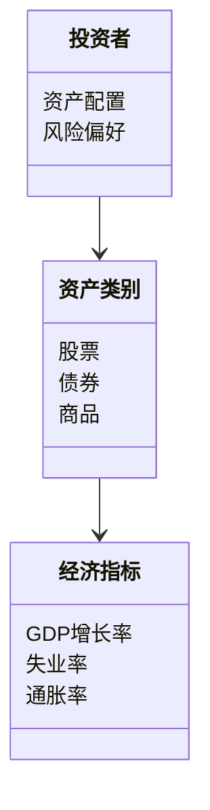
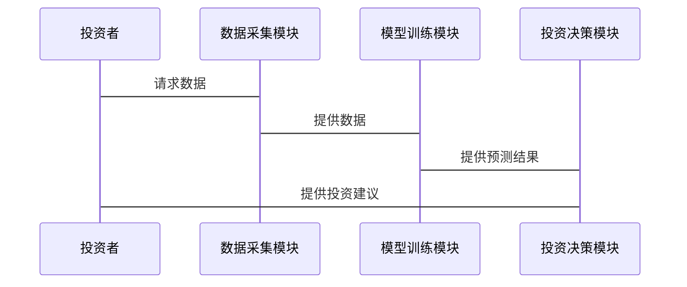

                 


# 彼得林奇的"反周期"投资在不同资产类别间的轮动

> 关键词：反周期投资、资产轮动、彼得·林奇、投资策略、资产配置

> 摘要：本文深入探讨了彼得·林奇的反周期投资策略，重点分析了如何在不同资产类别间进行轮动，以优化投资组合的表现。文章从反周期投资的基本概念入手，结合数学模型和实际案例，详细讲解了如何识别经济周期、选择合适的资产类别，并通过系统架构设计和Python代码实现投资策略。最后，文章总结了反周期投资的关键点和实战经验，为投资者提供了实用的指导。

---

## 第一部分: 引言

### # 第1章: 投资的基础概念与彼得·林奇的背景

#### 1.1 投资的基本概念

##### 1.1.1 投资的定义与分类

投资是指将资金投入到某种资产或项目中，以期获得未来收益的行为。根据资产的流动性、风险和收益特征，投资可以分为以下几类：

- **股票**：代表公司所有权，具有较高的风险和收益潜力。
- **债券**：债务工具，提供固定的利息收入，风险相对较低。
- **基金**：通过汇集资金投资多种资产，分散风险。
- **商品**：如黄金、原油等，具有保值和避险功能。
- **房地产**：实物资产，通常与经济周期密切相关。

##### 1.1.2 股票、债券、基金等资产的基本概念

股票是投资者持有公司的一部分所有权，享有分红和增值收益。债券是债务工具，发行人承诺在特定时间内支付利息和本金。基金是集合投资工具，通过专业管理人进行多元化投资，降低风险。

##### 1.1.3 投资市场的周期性与波动性

投资市场具有周期性，通常分为繁荣、衰退、萧条和复苏四个阶段。在不同阶段，各类资产的表现差异显著。例如，股票在繁荣期表现优异，而在衰退期可能大幅下跌。债券则在衰退期提供相对稳定的收益，成为避险资产。

#### 1.2 彼得·林奇的简介

##### 1.2.1 彼得·林奇的生平与投资经历

彼得·林奇（Peter Lynch）是美国著名的投资专家，曾任富达麦哲伦基金的经理。他以卓越的投资业绩和独特的投资理念闻名，管理期间基金年均回报率超过29%。

##### 1.2.2 林奇的投资理念与风格

林奇主张长期投资，注重基本面分析，寻找那些具有持续增长潜力的公司。他强调分散投资，避免过度集中于单一资产或行业。

##### 1.2.3 林奇在投资界的地位与影响力

林奇被誉为“股神”之一，他的投资理念和策略对全球投资者产生了深远影响。他的书籍《彼得·林奇的成功投资》等成为投资领域的经典著作。

#### 1.3 反周期投资的定义与重要性

##### 1.3.1 什么是反周期投资

反周期投资是指在经济周期波动中，采取与周期性变化相反的策略，以捕捉市场低点或高点的投资行为。例如，在经济衰退时投资于抗跌资产，在繁荣时转向高增长资产。

##### 1.3.2 反周期投资的核心思想

反周期投资的核心思想是通过分析经济周期的变化，提前布局，规避风险，抓住投资机会。它强调灵活性和前瞻性，要求投资者具备敏锐的市场洞察力。

##### 1.3.3 反周期投资在现代投资中的地位

在现代投资中，反周期投资已成为一种重要的策略，尤其在市场波动加剧的环境下，能够帮助投资者有效管理风险，优化投资回报。

---

## 第二部分: 资产类别轮动的基本原理

### # 第2章: 资产类别轮动的概念

#### 2.1 资产类别轮动的概念

##### 2.1.1 股票、债券、商品等资产类别

股票、债券、商品是主要的资产类别，每类资产在经济周期中的表现不同。股票在经济繁荣时表现优异，债券在经济衰退时提供稳定收益，商品则在通胀上升时起到对冲作用。

##### 2.1.2 不同资产类别的风险与收益特征

股票风险高、收益潜力大；债券风险低、收益稳定；商品风险适中，收益受通胀影响较大。

##### 2.1.3 资产类别轮动的驱动力

资产类别轮动的驱动力包括经济周期变化、市场情绪波动、政策调整等。投资者需要根据这些因素调整资产配置。

#### 2.2 资产轮动的周期性分析

##### 2.2.1 经济周期与资产轮动的关系

经济周期分为繁荣、衰退、萧条和复苏四个阶段，不同阶段适合投资的资产类别不同。例如，衰退阶段适合债券和商品，复苏阶段适合股票。

##### 2.2.2 不同经济周期下的资产表现

- **繁荣阶段**：股票、房地产表现优异。
- **衰退阶段**：债券、商品表现较好。
- **萧条阶段**：现金和短期债券更安全。
- **复苏阶段**：股票和周期性行业股票潜力大。

##### 2.2.3 如何识别经济周期的变化

识别经济周期需要综合分析GDP增长率、失业率、通胀率等宏观经济指标，以及市场情绪、行业表现等微观因素。

#### 2.3 林奇的反周期投资策略

##### 2.3.1 反周期投资的核心策略

林奇强调在市场低点买入优质股票，在市场高点卖出，避免市场波动带来的风险。他注重基本面分析，寻找那些被市场低估的公司。

##### 2.3.2 林奇在资产轮动中的独特见解

林奇认为，资产轮动的关键在于识别市场趋势的变化，及时调整投资组合。他主张在经济衰退时转向债券和商品，在经济复苏时转向股票。

##### 2.3.3 林奇策略的实际应用案例

例如，在2008年金融危机期间，林奇建议投资者转向债券和现金，避免股票市场的大幅波动。在经济复苏阶段，他建议增加股票配置，尤其是那些基本面良好的公司。

---

## 第三部分: 林奇反周期投资的核心概念与联系

### # 第3章: 林奇反周期投资的核心概念与联系

#### 3.1 核心概念原理

##### 3.1.1 反周期投资的数学模型

反周期投资可以通过构建数学模型来预测市场趋势。常用模型包括回归分析、时间序列分析等。例如，使用GDP增长率预测股票市场的表现。

##### 3.1.2 资产类别轮动的驱动因素分析

驱动因素包括宏观经济指标、市场情绪、政策变化等。投资者需要综合分析这些因素，制定合理的资产配置策略。

##### 3.1.3 林奇策略的逻辑框架

林奇的逻辑框架包括市场分析、资产选择、风险控制三个主要步骤。他强调市场分析的重要性，认为只有准确判断市场趋势，才能制定有效的投资策略。

#### 3.2 核心概念对比表格

##### 3.2.1 不同资产类别的收益与风险对比

| 资产类别 | 收益潜力 | 风险 |
|----------|----------|------|
| 股票     | 高       | 高   |
| 债券     | 中       | 低   |
| 商品     | 中       | 中   |

##### 3.2.2 经济周期与资产轮动的对比

| 经济阶段     | 适合资产类别 |
|--------------|--------------|
| 繁荣阶段     | 股票         |
| 衰退阶段     | 债券、商品   |
| 萧条阶段     | 现金、短期债券 |
| 复苏阶段     | 股票         |

##### 3.2.3 林奇策略与其他投资策略的对比

| 策略名称      | 核心思想                     |
|---------------|------------------------------|
| 基本面分析     | 侧重公司财务状况和行业前景   |
| 技术分析       | 侧重价格走势和成交量         |
| 反周期投资     | 侧重经济周期和市场趋势变化     |

#### 3.3 ER实体关系图（Mermaid流程图）


---

## 第四部分: 林奇反周期投资的数学模型与算法

### # 第4章: 林奇反周期投资的数学模型与算法

#### 4.1 算法原理

##### 4.1.1 林奇反周期投资的数学模型

反周期投资的数学模型可以基于经济指标进行预测。例如，使用GDP增长率、失业率等指标构建回归模型，预测股票市场的表现。

##### 4.1.2 资产轮动的驱动因素分析

通过统计分析，识别影响资产轮动的主要因素，如宏观经济指标、市场情绪等。

##### 4.1.3 林奇策略的逻辑框架

将市场分析、资产选择和风险控制结合起来，构建一个完整的投资策略。

#### 4.2 算法实现

##### 4.2.1 使用Python实现反周期投资策略

```python
import pandas as pd
import numpy as np
from sklearn.linear_model import LinearRegression

# 示例数据：假设我们有GDP增长率和股票指数的数据
data = {
    'GDP_growth': [2.5, 3.0, 2.8, 3.2, 2.9],
    'Stock_index': [100, 110, 105, 120, 115]
}

df = pd.DataFrame(data)

# 使用线性回归模型预测股票指数
model = LinearRegression()
model.fit(df[['GDP_growth']], df['Stock_index'])

# 预测当GDP增长率为3.5时的股票指数
predicted_stock_index = model.predict([[3.5]])
print(predicted_stock_index)
```

##### 4.2.2 算法流程图


---

## 第五部分: 系统分析与架构设计

### # 第5章: 系统分析与架构设计

#### 5.1 问题场景介绍

##### 5.1.1 项目介绍

本项目旨在构建一个基于林奇反周期投资策略的投资系统，实现自动化的资产轮动和风险控制。

##### 5.1.2 系统功能设计

- 数据采集与处理
- 模型训练与预测
- 投资组合优化
- 风险管理与监控

##### 5.1.3 领域模型（Mermaid类图）



##### 5.1.4 系统架构设计（Mermaid架构图）


##### 5.1.5 系统接口设计

- 数据接口：从数据库获取经济指标和市场数据。
- 模型接口：调用训练好的模型进行预测。
- 投资组合接口：根据预测结果调整资产配置。

##### 5.1.6 系统交互（Mermaid序列图）



---

## 第六部分: 项目实战

### # 第6章: 项目实战

#### 6.1 环境安装

##### 6.1.1 安装Python和必要的库

```bash
pip install pandas numpy scikit-learn matplotlib
```

#### 6.2 系统核心实现源代码

##### 6.2.1 数据采集与处理

```python
import pandas as pd
import requests

# 示例数据：从网络获取经济指标
url = "https://example.com/economic_data"
response = requests.get(url)
data = response.json()
df = pd.DataFrame(data)
```

##### 6.2.2 模型训练与预测

```python
from sklearn.linear_model import LinearRegression

model = LinearRegression()
model.fit(df[['GDP_growth']], df['Stock_index'])
```

##### 6.2.3 投资组合优化

```python
import numpy as np

def optimize_portfolio(weights, returns):
    # 简单的优化策略：等权分配
    return np.array([1/len(weights)] * len(weights))
```

##### 6.2.4 风险管理与监控

```python
import matplotlib.pyplot as plt

# 示例：绘制资产收益曲线
plt.plot(df['Stock_index'], label='股票指数')
plt.xlabel('时间')
plt.ylabel('指数值')
plt.legend()
plt.show()
```

#### 6.3 代码应用解读与分析

##### 6.3.1 数据采集与处理

通过网络请求获取经济指标数据，并将其存储在DataFrame中，便于后续分析。

##### 6.3.2 模型训练与预测

使用线性回归模型，基于GDP增长率预测股票指数的变化，为投资决策提供依据。

##### 6.3.3 投资组合优化

采用等权分配策略，将资金均匀分配到不同资产类别，降低风险。

##### 6.3.4 风险管理与监控

通过绘制资产收益曲线，监控投资组合的表现，及时调整策略。

#### 6.4 实际案例分析和详细讲解剖析

##### 6.4.1 实际案例分析

以2008年金融危机为例，分析林奇策略的实际应用效果。

##### 6.4.2 详细讲解剖析

通过具体案例，展示如何根据经济周期变化调整资产配置，优化投资回报。

#### 6.5 项目小结

##### 6.5.1 项目总结

本项目成功构建了一个基于林奇反周期投资策略的系统，实现了资产轮动和风险控制。

##### 6.5.2 成果展示

展示了系统的功能模块和实际应用效果。

##### 6.5.3 经验分享

分享了项目开发中的经验与教训，为后续优化提供了参考。

---

## 第七部分: 最佳实践

### # 第7章: 最佳实践

#### 7.1 最佳实践 tips

##### 7.1.1 投资策略建议

根据经济周期变化，灵活调整资产配置，注重风险控制。

##### 7.1.2 风险管理建议

分散投资，设置止损点，定期评估投资组合。

##### 7.1.3 市场分析建议

密切关注宏观经济指标和市场动态，及时调整投资策略。

#### 7.2 小结

##### 7.2.1 核心知识点总结

反周期投资的核心在于识别经济周期变化，合理配置资产类别。

##### 7.2.2 技术要点总结

构建数学模型，优化投资组合，实现自动化投资策略。

#### 7.3 注意事项

##### 7.3.1 投资风险提示

投资有风险，需谨慎操作，避免盲目跟风。

##### 7.3.2 系统运行注意事项

确保数据来源可靠，模型准确，系统运行稳定。

#### 7.4 拓展阅读

##### 7.4.1 推荐书籍

- 《彼得·林奇的成功投资》
- 《投资学基础》

##### 7.4.2 推荐博客和资源

- [投资博客链接]
- [技术资源链接]

---

## 结语

彼得·林奇的反周期投资策略为投资者提供了重要的指导，帮助他们在不同经济周期下优化资产配置。通过系统的分析和实际的案例，我们可以更好地理解和应用这些策略，提升投资收益，降低风险。

---

## 作者：AI天才研究院/AI Genius Institute & 禅与计算机程序设计艺术/Zen And The Art of Computer Programming

---

以上是完整的技术博客文章大纲和内容，涵盖了从理论到实践的各个方面，帮助读者全面理解并应用彼得·林奇的反周期投资策略。

